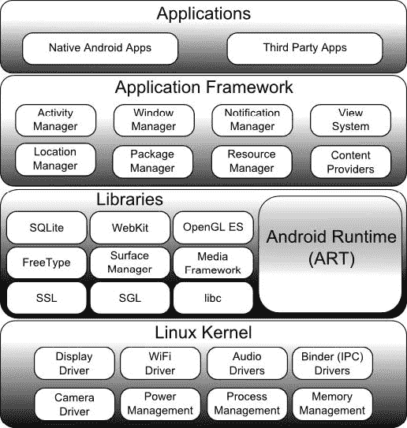

9.安卓架构概述

到目前为止，本书已经采取了一些步骤来建立一个适合使用 Android Studio 开发 Android 应用程序的环境。通过创建安卓工作室应用程序项目，应用程序开发过程也迈出了第一步。

然而，在深入研究安卓应用程序开发的实际问题之前，了解安卓软件开发工具包和安卓开发的一些更抽象的概念是很重要的。现在对这些概念有一个清晰的理解将为进一步积累知识提供一个坚实的基础。

本章从概述安卓架构开始，并在本书接下来的几章中继续，目标是提供安卓开发基础的详细概述。

9.1 安卓软件堆栈

安卓以软件栈的形式构建，包括应用程序、操作系统、运行时环境、中间件、服务和库。这种体系结构也许可以最好地在视觉上表现出来，如图 9-1 所示。堆栈的每一层以及每一层中相应的元素都紧密集成，并经过精心调整，为移动设备提供最佳的应用程序开发和执行环境。本章的剩余部分将从底层的 Linux 内核开始，遍历安卓堆栈的不同层。

图 9-1

9.2Linux 内核

Linux 内核位于安卓软件堆栈的底部，在设备硬件和安卓软件堆栈的上层之间提供了一个抽象层次。内核基于 Linux 版本，除了为设备显示、Wi-Fi 和音频等硬件提供网络堆栈和设备驱动外，还提供抢占式多任务处理、内存、进程和电源管理等底层核心系统服务。

最初的 Linux 内核是由 Linus Torvalds 在 1991 年开发的，并与理查德·斯托尔曼在自由软件基金会开发的一套工具、实用程序和编译器相结合，创建了一个完整的操作系统，称为 GNU/Linux 。各种各样的 Linux 发行版都是从这些基础衍生而来的，比如 Ubuntu 和红帽企业版 Linux。

然而，需要注意的是，安卓只使用 Linux 内核。也就是说，值得注意的是，Linux 内核最初是以桌面和服务器的形式开发用于传统计算机的。事实上，Linux 现在最广泛地部署在任务关键型企业服务器环境中。我们发现这款软件是安卓软件堆栈的核心，这证明了当今移动设备的强大以及 Linux 内核的效率和性能。

9.3 安卓运行时–ART

当安卓应用在安卓工作室中构建时，它被编译成中间字节码格式(称为 DEX 格式)。当应用程序随后被加载到设备上时，安卓运行时(ART)使用一个称为提前(AOT)编译的过程来将字节码翻译成设备处理器所需的本机指令。这种格式被称为可执行和可链接格式。

每次随后启动应用程序时，都会运行 ELF 可执行版本，从而提高应用程序性能和电池寿命。

这与旧的安卓实现中使用的即时编译方法形成了对比，在旧的安卓实现中，每次启动应用程序时，字节码都会在虚拟机中进行翻译。

9.4 安卓库

除了一套标准的 Java 开发库(为字符串处理、网络和文件操作等通用任务提供支持)之外，安卓开发环境还包括安卓库。这些是一组特定于安卓开发的基于 Java 的库。除了那些有助于用户界面构建、图形绘制和数据库访问的库之外，这一类别中的库的例子还包括应用程序框架库。

安卓开发者可以使用的一些关键的安卓核心库总结如下:

android . app–提供对应用模型的访问，是所有 Android 应用的基石。

Android . content–方便应用程序和应用程序组件之间的内容访问、发布和消息传递。

Android . database–用于访问内容提供商发布的数据，包括 SQLite 数据库管理类。

Android . graphics–一个低级别的 2D 图形绘制 API，包括颜色、点、滤镜、矩形和画布。

Android . hardware–提供一个 API，提供对加速计和光传感器等硬件的访问。

安卓. OpenGL–OpenGL ES 3D 图形渲染应用编程接口的 Java 接口。

Android . OS–为应用程序提供对标准操作系统服务的访问，包括消息、系统服务和进程间通信。

安卓媒体–提供支持音频和视频回放的课程。

•android.net-一组提供网络堆栈访问的 API。包括 android.net.wifi，可以访问设备的无线堆栈。

android . print–包括一组类，可以将内容从 Android 应用程序中发送到已配置的打印机。

android . provider–一组便利类，提供对标准 Android 内容提供商数据库的访问，如日历和联系人应用程序维护的数据库。

Android . text–用于在设备显示器上呈现和操作文本。

Android . util–一组实用程序类，用于执行字符串和数字转换、XML 处理以及日期和时间操作等任务。

Android . view–应用程序用户界面的基本构建模块。

android.widget -丰富的预建用户界面组件集合，如按钮、标签、列表视图、布局管理器、单选按钮等。

Android . WebKit–一组旨在将网页浏览功能内置到应用程序中的类。

在安卓运行时中已经介绍了基于 Java 的库，现在是时候将我们的注意力转向安卓软件堆栈的这一层中包含的基于 C/C++的库了。

9.4.1 C/C++库

上一节中概述的安卓运行时核心库是基于 Java 的，为编写安卓应用程序的开发人员提供了主要的 API。但是，需要注意的是，核心库并不执行大量的实际工作，事实上，它们本质上是围绕一组基于 C/C++的库的 Java“包装器”。例如，当调用 android.opengl 库在设备显示器上绘制 3D 图形时，该库实际上最终调用 OpenGL ES C++库，该库反过来与底层 Linux 内核一起执行绘制任务。

包含 C/C++库以实现广泛多样的功能，包括 2D 和三维图形绘制、安全套接字层(SSL) 通信、SQLite 数据库管理、音频和视频回放、位图和矢量字体渲染、显示子系统和图形层管理以及标准 C 系统库(libc) 的实现。

实际上，典型的安卓应用程序开发人员将只通过基于 Java 的安卓核心库 API 来访问这些库。如果需要直接访问这些库，这可以使用安卓原生开发工具包 (NDK)来实现，其目的是使用 Java 原生接口 (JNI)从 Java 代码中调用非 Java 或柯特林编程语言(如 C 和 C++)的原生方法。

9.5 应用框架

应用程序框架是一组服务，它们共同构成了运行和管理安卓应用程序的环境。该框架实现了安卓应用程序由可重用、可互换和可替换的组件构成的概念。这一概念更进了一步，因为应用程序还能够发布其功能以及任何相应的数据，以便它们可以被其他应用程序发现和重用。

安卓框架包括以下关键服务:

活动管理器–控制应用程序生命周期和活动堆栈的所有方面。

内容提供商–允许应用程序发布数据并与其他应用程序共享数据。

资源管理器–提供对非代码嵌入资源的访问，如字符串、颜色设置和用户界面布局。

通知管理器–允许应用程序向用户显示警报和通知。

视图系统–用于创建应用程序用户界面的一组可扩展视图。

包管理器–应用程序可以通过该系统找到设备上当前安装的其他应用程序的信息。

电话管理器–向应用程序提供设备上可用的电话服务信息，如状态和用户信息。

位置管理器–提供对位置服务的访问，允许应用程序接收关于位置变化的更新。

9.6 应用

位于安卓软件堆栈顶部的是应用程序。这些应用程序包括特定安卓实现提供的本地应用程序(例如网络浏览器和电子邮件应用程序)和用户在购买设备后安装的第三方应用程序。

9.7 总结

一个好的安卓开发知识基础，需要对安卓的整体架构有所了解。安卓以软件栈架构的形式实现，由 Linux 内核、运行时环境和相应的库、应用框架和一组应用组成。应用程序主要是用 Java 或 Kotlin 编写的，并在 Android 工作室构建环境中编译成字节码格式。当应用程序随后安装在设备上时，这个字节码被安卓运行时(ART)编译成中央处理器使用的本机格式。安卓架构的关键目标是性能和效率，包括应用程序执行和应用程序设计中重用的实现。