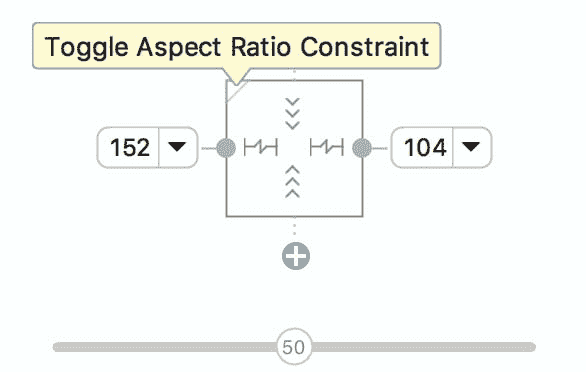
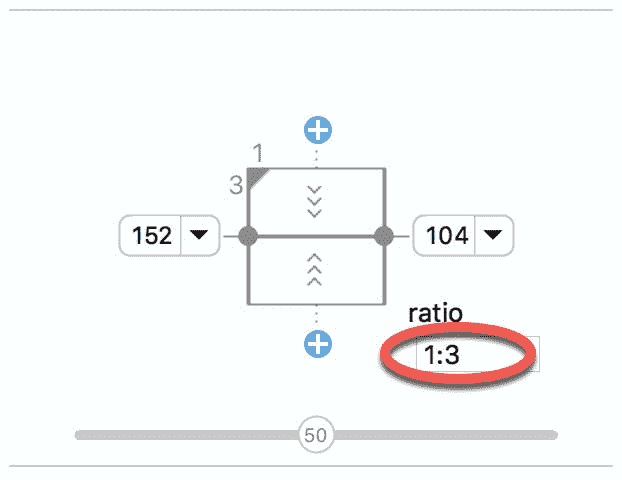

# 二十、在 AndroidStudio 使用约束布局链和比率

前几章已经介绍了 ConstraintLayout 类的主要特性，并概述了 Android Studio 布局编辑器中基于 ConstraintLayout 的用户界面设计的最佳实践。虽然在标题为[“安卓约束布局指南”](18.html#_idTextAnchor390)的章节中概述了约束布局链和比率的概念，但我们尚未讨论如何在布局编辑器中利用这些功能。因此，本章的重点是提供在使用 ConstraintLayout 类时如何创建和管理链和比率的实用步骤。

20.1 创建链

链可以通过在活动的 XML 布局资源文件中添加几行或者通过使用布局编辑器的一些特定于链的功能来实现。

考虑一个由三个按钮小部件组成的布局，这些小部件被约束成位于约束布局父控件的左上、中上和右上，如图 20-1 : 所示


图 20-1

为了表示这样的布局，XML 资源布局文件可能包含按钮小部件的以下条目:

```java
<Button
    android:id="@+id/button1"
    android:layout_width="wrap_content"
    android:layout_height="wrap_content"
    android:layout_marginStart="8dp"
    android:layout_marginTop="16dp"
    android:text="Button"
    app:layout_constraintHorizontal_bias="0.5"
    app:layout_constraintStart_toStartOf="parent"
    app:layout_constraintTop_toTopOf="parent" />

<Button
    android:id="@+id/button2"
    android:layout_width="wrap_content"
    android:layout_height="wrap_content"
    android:layout_marginEnd="8dp"
    android:layout_marginStart="8dp"
    android:layout_marginTop="16dp"
    android:text="Button"
    app:layout_constraintHorizontal_bias="0.5"
    app:layout_constraintEnd_toStartOf="@+id/button3"
    app:layout_constraintStart_toEndOf="@+id/button1"
    app:layout_constraintTop_toTopOf="parent" />

<Button
    android:id="@+id/button3"
    android:layout_width="wrap_content"
    android:layout_height="wrap_content"
    android:layout_marginEnd="8dp"
    android:layout_marginTop="16dp"
    android:text="Button"
    app:layout_constraintHorizontal_bias="0.5"
    app:layout_constraintEnd_toEndOf="parent"
    app:layout_constraintTop_toTopOf="parent" />
```

按照目前的配置，没有双向约束来将这些小部件组合成一个链。为了解决这个问题，需要从按钮 1 的右侧到按钮 2 的左侧，以及从按钮 3 的左侧到按钮 2 的右侧添加额外的约束，如下所示:

```java
<Button
    android:id="@+id/button1"
    android:layout_width="wrap_content"
    android:layout_height="wrap_content"
    android:layout_marginStart="8dp"
    android:layout_marginTop="16dp"
    android:text="Button"
    app:layout_constraintHorizontal_bias="0.5"
    app:layout_constraintStart_toStartOf="parent"
    app:layout_constraintTop_toTopOf="parent"
    app:layout_constraintEnd_toStartOf="@+id/button2" />

<Button
    android:id="@+id/button2"
    android:layout_width="wrap_content"
    android:layout_height="wrap_content"
    android:layout_marginEnd="8dp"
    android:layout_marginStart="8dp"
    android:layout_marginTop="16dp"
    android:text="Button"
    app:layout_constraintHorizontal_bias="0.5"
    app:layout_constraintEnd_toStartOf="@+id/button3"
    app:layout_constraintStart_toEndOf="@+id/button1"
    app:layout_constraintTop_toTopOf="parent" />

<Button
    android:id="@+id/button3"
    android:layout_width="wrap_content"
    android:layout_height="wrap_content"
    android:layout_marginEnd="8dp"
    android:layout_marginTop="16dp"
    android:text="Button"
    app:layout_constraintHorizontal_bias="0.5"
    app:layout_constraintEnd_toEndOf="parent"
    app:layout_constraintTop_toTopOf="parent"
    app:layout_constraintStart_toEndOf="@+id/button2" />
```

通过这些更改，小部件现在配置了双向水平约束。这基本上构成了一个约束布局链，该链在布局编辑器中通过链连接进行可视化表示，如下图[20-2](#_idTextAnchor493)所示。请注意，在此配置中，链默认为展开链样式。


图 20-2

也可以通过右键单击其中一个视图并选择链->创建水平链或链->创建垂直链菜单选项来创建链。

20.2 改变链条样式

如果没有配置链样式，约束布局将默认为展开链样式。可以通过右键单击链中的任何小部件并选择循环链模式菜单选项来更改链样式。每次单击菜单选项时，样式将按照展开、内部展开和打包的顺序切换到另一个设置。

或者，可以在“属性”工具窗口中指定样式，展开布局约束属性，并根据链的方向更改水平链样式或垂直链样式属性:


图 20-3

20.3 展开内链样式

[图 20-4](#_idTextAnchor497) 使用上述技巧说明了将链样式更改为链内扩散样式的效果:


图 20-4

20.4 打包链样式

使用相同的技巧，将链样式属性更改为 packed 会导致布局更改，如图 20-5 : 所示


图 20-5

20.5 带偏置的包装链样式

打包链的定位可能会受到施加偏置值的影响。偏差可以是 0.0 到 1.0 之间的任何值，0.5 代表父对象的中心。通过选择链头小部件并为属性面板中的布局 _ 约束水平 _ 偏置或布局 _ 约束垂直 _ 偏置属性赋值来控制偏置。[图 20-6](#_idTextAnchor503) 显示了水平偏差设置为 0 的包装链。2:


图 20-6

20.6 加权链

要探索的链的最后一个区域包括对单个小部件进行加权，以控制链中的每个小部件在可用空间内占据多少空间。加权链只能使用扩展链样式实现，链中响应权重属性的任何小部件必须具有为匹配约束模式配置的相应尺寸属性(垂直链的高度和水平链的宽度)。小部件维的匹配约束模式可以通过选择小部件、显示属性面板并将维更改为 match_constraint(相当于 0dp)来配置。例如，在[图 20-7](#_idTextAnchor506) 中，按钮的 layout_width 约束已被设置为 match_constraint (0dp)，以指示小部件的宽度将基于主要约束设置 ngs 来确定:


图 20-7

假设已选择展开链样式，并且所有三个按钮都已配置为宽度尺寸设置为与约束匹配，链中的小部件将相等地展开以填充可用空间:


图 20-8

相对于链中的其他小部件，每个小部件占用的空间量可以通过向小部件添加权重属性来控制。[图 20-9](#_idTextAnchor508) 显示了在按钮 1 上将 layout _ constraintHorizontal _ weight 属性设置为 4，在按钮 2 和按钮 3 上都设置为 2 的效果:


图 20-9

由于这些权重值，按钮 1 占据了一半的空间(4/8)，而按钮 2 和按钮 3 各占据了四分之一(2/8)的空间。

20.7 使用比率

约束布局比例允许小部件的一个维度相对于小部件的另一个维度(也称为纵横比)进行调整。例如，可以将纵横比设置应用于 ImageView，以确保其宽度始终是高度的两倍。

通过将受约束的尺寸设置为匹配约束模式，并将该小部件上的 layout _ constraintDimensionRatio 属性配置为所需的比例，可以配置尺寸比例约束。该比率值可以指定为浮点值或宽高比设置。例如，下面的 XML 摘录在 ImageView 小部件上配置了 2:1 的比例:

```java
<ImageView
        android:layout_width="0dp"
        android:layout_height="100dp"
        android:id="@+id/imageView"
        app:layout_constraintDimensionRatio="2:1" /> 
```

上面的示例演示了当只有一个维度设置为匹配约束时如何配置比率。当两个尺寸都设置为匹配约束模式时，也可以应用比率。这包括指定以 H 或 W 开头的比率，以指示哪个尺寸相对于另一个尺寸受到约束。

例如，考虑下面一个 ImageView 对象的 XML 摘录:

```java
<ImageView
    android:layout_width="0dp"
    android:layout_height="0dp"
    android:id="@+id/imageView"
    app:layout_constraintBottom_toBottomOf="parent"
    app:layout_constraintRight_toRightOf="parent"
    app:layout_constraintLeft_toLeftOf="parent"
    app:layout_constraintTop_toTopOf="parent"
    app:layout_constraintDimensionRatio="W,1:3" />
```

在上面的示例中，高度将根据应用于它的约束来定义。在这种情况下，约束已被配置为附加到父视图的顶部和底部，实质上是拉伸小部件以填充父视图的整个高度。另一方面，宽度尺寸被限制为 ImageView 高度尺寸的三分之一。因此，无论布局出现在什么大小的屏幕或方向上，ImageView 都将始终与父视图高度相同，宽度为该高度的三分之一。

同样的结果也可以在不需要手动编辑 XML 资源文件的情况下实现。每当小部件尺寸设置为匹配约束模式时，比率控制切换会出现在属性面板的检查器区域。[例如，图 20-10](#_idTextAnchor511) 显示了分别设置为匹配约束模式和 100dp 的按钮小部件的布局宽度和高度属性，并突出显示了小部件尺寸预览视图中的比例控制切换:



图 20-10

默认情况下，比率大小控制处于关闭状态。单击控件启用比率约束，并显示一个可以更改比率的附加字段:



图 20-11

20.8 总结

链和比率都是 ConstraintLayout 类的强大功能，旨在为在安卓应用中设计灵活和响应迅速的用户界面布局提供额外的选项。正如本章所概述的，AndroidStudio 布局编辑器已经得到了增强，以便在用户界面设计过程中更容易使用这些功能。