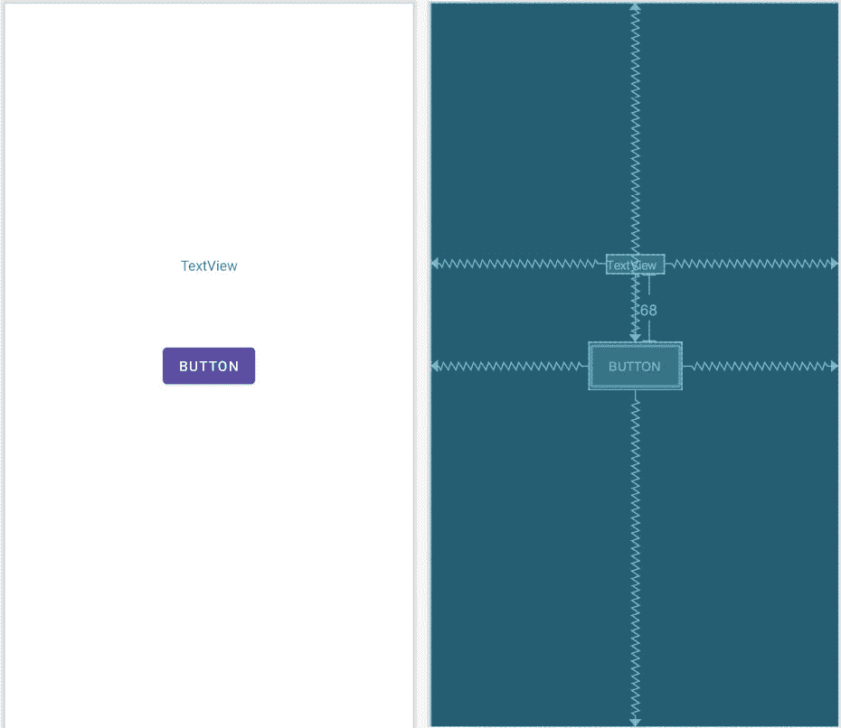

# 二十二、 AndroidStudio手工 XML 布局设计

虽然使用AndroidStudio布局编辑器工具设计布局大大提高了工作效率，但仍然可以通过手动编辑底层的 XML 来创建 XML 布局。本章将介绍安卓 XML 布局文件格式的基础知识。

22.1 手动创建 XML 布局

XML 布局文件的结构实际上非常简单，并且遵循视图树的分层方法。理想情况下，XML 资源文件的第一行应该包含以下标准声明:

```java
<?xml version="1.0" encoding="utf-8"?>
```

这个声明之后应该是布局的根元素，通常是一个容器视图，比如布局管理器。这由开始和结束标记以及需要在视图上设置的任何属性来表示。例如，下面的 XML 将一个 ConstraintLayout 视图声明为根元素，分配 ID activity_main 并设置 match_parent 属性，使其填充设备显示的所有可用空间:

```java
<?xml version="1.0" encoding="utf-8"?>
<androidx.constraintlayout.widget.ConstraintLayout 
    xmlns:android="http://schemas.android.com/apk/res/android"
    xmlns:app="http://schemas.android.com/apk/res-auto"
    xmlns:tools="http://schemas.android.com/tools"
    android:layout_width="match_parent"
    android:layout_height="match_parent"
    android:paddingLeft="16dp"
    android:paddingRight="16dp"
    android:paddingTop="16dp"
    android:paddingBottom="16dp"
    tools:context=".MainActivity">
</androidx.constraintlayout.widget.ConstraintLayout>
```

请注意，在上面的示例中，布局元素还在 16dp(密度无关像素)的每一侧配置了填充。安卓布局中的任何间距规格都必须使用以下测量单位之一来指定:

英寸–英寸。

毫米–毫米。

点–点(1/72 英寸)。

DP–密度无关像素。基于设备显示器相对于 160dpi 显示器基线的物理密度的抽象测量单位。

sp–独立于比例的像素。类似于 dp，但根据用户的字体偏好进行缩放。

px–实际屏幕像素。不建议使用，因为不同的显示器每英寸的像素不同。优先使用 dp 而不是本装置。

任何需要添加到约束布局父级的子级都必须嵌套在开始和结束标记中。在以下示例中，一个按钮小部件被添加为约束布局的子部件:

```java
<?xml version="1.0" encoding="utf-8"?>
<androidx.constraintlayout.widget.ConstraintLayout 
    xmlns:android="http://schemas.android.com/apk/res/android"
    xmlns:app="http://schemas.android.com/apk/res-auto"
    xmlns:tools="http://schemas.android.com/tools"
    android:id="@+id/activity_main"
    android:layout_width="match_parent"
    android:layout_height="match_parent"
    android:paddingLeft="16dp"
    android:paddingRight="16dp"
    android:paddingTop="16dp"
    android:paddingBottom="16dp"
    tools:context=".MainActivity">

    <Button
        android:text="@string/button_string"
        android:layout_width="wrap_content"
        android:layout_height="wrap_content"
        android:id="@+id/button" />

</androidx.constraintlayout.widget.ConstraintLayout>
```

当前实现的按钮没有约束连接。因此，在运行时，按钮将出现在屏幕的左上角(尽管通过分配给父布局的填充缩进了 16dp)。但是，如果将相反的约束添加到按钮的侧面，它将在布局中居中显示:

```java
<Button
    android:text="@string/button_string"
    android:layout_width="wrap_content"
    android:layout_height="wrap_content"
    android:id="@+id/button"
    app:layout_constraintBottom_toBottomOf="parent"
    app:layout_constraintEnd_toEndOf="parent"
    app:layout_constraintStart_toStartOf="parent"
    app:layout_constraintTop_toTopOf="parent" />
```

请注意，每个约束都附加到名为 activity_main 的元素，在本例中，该元素是父约束布局实例。

要向布局中添加第二个小部件，只需将其嵌入到 ConstraintLayout 元素的主体中。例如，以下修改将文本视图小部件添加到布局中:

```java
<?xml version="1.0" encoding="utf-8"?>
<androidx.constraintlayout.widget.ConstraintLayout 
    xmlns:android="http://schemas.android.com/apk/res/android"
    xmlns:app="http://schemas.android.com/apk/res-auto"
    xmlns:tools="http://schemas.android.com/tools"
    android:id="@+id/activity_main"
    android:layout_width="match_parent"
    android:layout_height="match_parent"
    android:paddingLeft="16dp"
    android:paddingTop="16dp"
    android:paddingRight="16dp"
    android:paddingBottom="16dp"
    tools:context=".MainActivity">

    <Button
        android:text="@string/button_string"
        android:layout_width="wrap_content"
        android:layout_height="wrap_content"
        android:id="@+id/button"
        app:layout_constraintBottom_toBottomOf="parent"
        app:layout_constraintEnd_toEndOf="parent"
        app:layout_constraintStart_toStartOf="parent"
        app:layout_constraintTop_toTopOf="parent" />

    <TextView
        android:text="@string/text_string"
        android:layout_width="wrap_content"
        android:layout_height="wrap_content"
        android:id="@+id/textView" />

</androidx.constraintlayout.widget.ConstraintLayout>
```

同样，新添加的文本视图缺少约束会导致它在运行时出现在布局的左上角。以下修改添加了连接到父布局的相反约束，以水平居中小部件，以及将文本视图底部连接到按钮顶部的约束:

```java
<TextView
    android:text="@string/text_string"
    android:layout_width="wrap_content"
    android:layout_height="wrap_content"
    android:id="@+id/textView"
    app:layout_constraintBottom_toTopOf="@+id/button"
    app:layout_constraintEnd_toEndOf="parent"
    app:layout_constraintHorizontal_bias="0.498"
    app:layout_constraintStart_toStartOf="parent" />
```

另外，请注意，按钮视图和文本视图声明了许多属性。这两个视图都被分配了标识，并被配置为显示分别由名为 button_string 和 text_string 的字符串资源表示的文本字符串。此外，wrap_content 高度和宽度属性已经在两个对象上声明，因此它们的大小可以容纳内容(在本例中是字符串资源值引用的文本)。

在设计模式下，从布局编辑器的预览面板中查看，上述布局将呈现为[图 22-1](#_idTextAnchor542) :



图 22-1

22.2 手动 XML 与可视化布局设计

何时手动编写 XML，而不是在设计模式下使用布局编辑器工具，这是个人偏好的问题。然而，使用设计模式也有好处。

首先，设计模式通常会更快，因为它避免了输入 XML 行的必要性。此外，设计模式避免了学习安卓软件开发工具包视图类的各种属性值的复杂性。大多数属性可以通过参考属性面板来定位，而不是不断参考安卓文档来找到正确的关键字和值。

抛开设计模式的所有优势不谈，重要的是要记住，用户界面设计的两种方法绝不是相互排斥的。作为一名应用开发人员，很可能最终会在设计模式下创建用户界面，同时通过直接编辑生成的 XML 资源来执行设计的微调和布局调整。毕竟，界面设计的两个视图在AndroidStudio环境中并排显示，使得在 XML 和视觉布局上无缝工作变得容易。

22.3 总结

AndroidStudio布局编辑器工具为设计用户界面提供了一种直观的方法。使用一个拖放范例结合一组属性编辑器，该工具为应用开发人员提供了可观的生产力优势。

用户界面设计也可以通过手动编写 XML 布局资源文件来实现，其格式结构良好且易于理解。

布局编辑器工具生成 XML 资源文件的事实意味着这两种界面设计方法可以结合起来，为用户界面开发提供一种“两全其美”的方法。