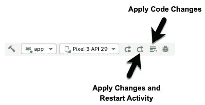

# 二十五、AndroidStudio 中应用更改的使用指南

现在已经介绍了使用 AndroidStudio 开发安卓的一些基本概念，现在是引入 AndroidStudio 应用更改功能的好时机。所有有经验的开发人员都知道，等待应用编译和运行的每一秒钟都是编写和完善代码的更好时间。

25.1 引入应用变更

在 AndroidStudio 的早期版本中，每次对项目的更改需要测试时，AndroidStudio 都会重新编译代码，将其转换为 Dex 格式，生成 APK 包文件，并将其安装在设备或仿真器上。完成这些步骤后，应用将最终启动并准备测试。即使在快速开发系统中，这也是一个需要花费大量时间来完成的过程。对于大型应用来说，完成此过程需要一分钟或更长时间，这并不罕见。

相反，当应用已经在设备或模拟器会话上运行时，应用更改允许项目中的许多代码和资源更改几乎立即反映在应用中。

举个例子，考虑一个在 AndroidStudio 开发的应用，它已经在一个设备或模拟器上启动了。如果对资源设置或方法中的代码进行了更改，“应用更改”会将更新的代码和资源推送到正在运行的应用，并动态地“交换”更改。然后，更改会反映在正在运行的应用中，而无需构建、部署和重新启动整个应用。在许多情况下，这允许在不应用更改的情况下，在很短的时间内测试更改。

25.2 理解应用变更选项

AndroidStudio 以运行应用、应用更改和重启活动以及应用代码更改的形式，提供了三种将更改应用到运行中的应用的选项。这些选项可以总结如下:

运行应用-停止当前运行的应用并重新启动。如果自项目上次启动以来没有进行任何更改，此选项将简单地重新启动应用。另一方面，如果对项目进行了更改，AndroidStudio 将在启动应用之前将其重新构建并重新安装到设备或模拟器上。

应用代码更改-当对项目所做的唯一更改涉及对现有方法主体的修改或添加了新的类或方法时，可以使用该选项。选中后，更改将应用于正在运行的应用，而无需重新启动应用或当前正在运行的活动。但是，当对任何项目资源(如布局文件)进行更改时，不能使用此模式。其他限制包括移除方法、更改方法签名、重命名类和其他结构代码更改。当对项目清单进行了更改时，也不可能使用此选项。

应用更改并重新启动活动-选择该模式后，将动态应用项目中的任何代码或资源更改，并重新启动活动，而无需重新安装或重新启动应用。与“应用代码更改”选项不同，这可以在对项目的代码和资源进行更改时使用，尽管涉及某些结构代码更改和清单修改的相同限制也适用。

25.3 使用应用更改

当一个项目已经加载到 Android Studio 中，但还没有在设备或模拟器上运行时，可以像往常一样使用运行(在[图 25-1](#_idTextAnchor582) 中标记为 A)或位于工具栏 ar 中的调试(B)按钮来启动该项目:


图 25-1

应用启动并运行后，运行按钮上的图标会发生变化，表示应用正在运行，应用更改和重启活动以及应用代码更改按钮将被启用，如下图[图 25-2](#_idTextAnchor583) 所示:



图 25-2

如果在选择“应用更改”按钮之一时无法应用更改，AndroidStudio 将显示一条消息，指出失败并给出解释。[例如，图 25-3](#_idTextAnchor584) 显示了对资源文件进行更改后，当选择应用代码更改选项时，AndroidStudio 显示的消息:


图 25-3

在这种情况下，解决方案是使用“应用更改并重新启动活动”选项(为此提供了一个链接)。同样，当尝试应用涉及添加或删除方法的更改时，将出现以下消息:


图 25-4

在这种情况下，唯一的选择是单击运行应用按钮来重新安装并重新启动应用。作为在这些情况下手动选择正确选项的替代方案，AndroidStudio 可以配置为自动返回执行运行应用操作。

25.4 配置应用更改回退设置

应用更改回退设置位于 AndroidStudio 首选项窗口中，通过选择文件->设置菜单选项(AndroidStudio->苹果操作系统上的首选项)来显示该窗口。在首选项对话框中，选择左侧面板中的构建、执行、部署条目，然后选择部署，如图 25-5 所示:


图 25-5

启用所需选项后，单击应用，然后单击确定按钮提交更改并关闭对话框。启用这些默认值后，AndroidStudio 将在必要时自动重新安装并重新启动应用。

25.5T1 应用更改教程

启动 AndroidStudio，从欢迎屏幕中选择创建新项目快速启动选项，并在生成的新项目对话框中选择基本活动模板，然后单击下一步按钮。

在“名称”字段中输入 ApplyChanges，并将 com . ebookwidge . ApplyChanges 指定为包名。在单击完成按钮之前，将最低 API 级别设置更改为 API 26:安卓 8.0(奥利奥)，并将语言菜单更改为 Java。

25.6 使用应用代码更改

首先点击运行按钮，选择合适的仿真器或物理设备作为运行目标。单击运行按钮后，跟踪示例应用出现在设备或模拟器上的时间。

运行后，单击操作按钮(显示信封图标的按钮位于屏幕右下角)。请注意，出现一个 Snackbar 实例，显示文本“用自己的动作替换”，如图 25-6 所示:


图 25-6

应用运行后，应用更改按钮应该已启用，表明某些项目更改可以应用，而不必重新安装和重新启动应用。要查看此操作，请编辑 MainActivity.java 文件，找到 onCreate 方法并修改操作代码，以便在选择操作按钮时显示不同的消息:

```java
FloatingActionButton fab = findViewById(R.id.fab);
fab.setOnClickListener(new View.OnClickListener() {
    @Override
    public void onClick(View view) {
        Snackbar.make(view, "Apply Changes is Amazing!", 
                            Snackbar.LENGTH_LONG)
                .setAction("Action", null).show();
    }
});
```

实施代码更改后，单击应用代码更改按钮，注意几秒钟内会出现一条消息，指示应用已更新。点击操作按钮，注意新消息现在显示在 Snackbar 中。

25.7 使用应用更改和重启活动

任何资源更改都需要使用“应用更改并重新启动活动”选项。在 AndroidStudio 中，选择应用-> res ->布局->片段 _first.xml 布局文件。在设计模式下使用布局编辑器工具，选择默认的文本视图组件，并将属性工具窗口中的文本属性更改为“你好安卓”。

在点击“应用代码更改”按钮之前，确保上文[“配置应用更改回退设置”](#_idTextAnchor585)中概述的回退选项已关闭。请注意，请求失败是因为此更改涉及项目资源。单击应用更改并重新启动活动按钮，验证活动是否重新启动并在文本视图小部件上显示新文本。

25.8 使用运行应用

如前所述，删除方法需要完全重新安装并重新启动正在运行的应用。为此，请编辑 MainActivity.java 文件，并在 onCreate 方法之后添加一个新方法，如下所示:

```java
public void demoMethod() {
}
```

使用“应用代码更改”按钮，确认更改已应用，无需重新安装应用。

接下来，删除新方法，并验证单击两个应用更改按钮中的任何一个都会导致请求失败。在这种更改后，运行应用的唯一方法是单击运行应用按钮。

25.9 总结

应用更改是 AndroidStudio 的一项功能，旨在显著加快开发应用时执行的代码、构建和运行周期。应用更改功能能够将更新推送到正在运行的应用，在许多情况下，无需重新安装甚至重启应用。根据应用于项目的修改的性质，应用更改提供了许多不同级别的支持。