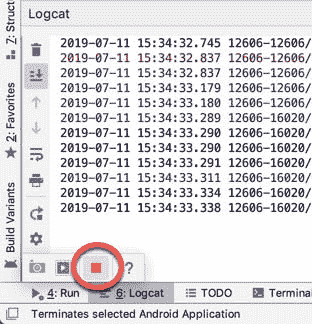

37.安卓 视图模型保存状态教程

应用状态的保存和恢复就是在应用被放入后台后，在外观和行为上给用户呈现连续性。用户开始期望能够从一个应用切换到另一个应用，并在返回到原始应用时，发现它处于切换发生前的确切状态。

如标题为[“了解安卓应用和活动生命周期”](12.html#_idTextAnchor259)的章节所述，当用户将应用放入后台时，在资源受限的情况下，该应用有资格被操作系统终止。当用户试图将终止的应用返回前台时，安卓只是在一个新的过程中重新启动该应用。由于这一切对用户来说都是不可见的，因此应用有责任将自己恢复到最初将应用放在后台时的状态，而不是以其“初始启动”状态呈现。在基于视图模型的应用中，大部分这种行为可以通过视图模型 保存状态模块来实现。

37.1 了解视图模型状态保存

如前几章所述，视图模型给应用开发带来了许多好处，包括在设备旋转等配置变化的情况下恢复用户界面状态。要看到这一点，请运行视图模型演示应用(或者，如果您尚未创建项目，请从随书附带的示例代码下载中将视图模型演示 _ 实时数据项目加载到AndroidStudio中)。

运行后，输入美元值并将其转换为欧元。显示美元和欧元值后，旋转设备或模拟器，注意一旦应用对方向变化做出响应，这两个值仍然可见。

不幸的是，这种行为并没有延伸到后台应用进程的终止。在应用仍在运行的情况下，点击设备主页按钮，将 ViewModelDemo 应用放入后台，然后通过打开 Android Studio 中的 Logcat 工具窗口，点击[图 37-1](#_idTextAnchor768) 中突出显示的终止按钮来终止它(不要点击 Android Studio 工具栏中的停止按钮):



图 37-1

一旦应用被终止，返回设备或模拟器，并从启动器中选择应用(不要简单地从AndroidStudio中重新运行应用)。一旦这款应用出现，它就会像刚刚推出一样，失去之前的美元和欧元价值。然而，从用户的角度来看，该应用只是从后台恢复，应该仍然包含原始数据。在这种情况下，该应用未能提供用户从安卓应用中期待的连续性。

37.2 实现视图模型状态保存

通过引入视图模型保存状态库，基本视图模型状态保存成为可能。这个库本质上扩展了 ViewModel 类，包括支持通过后台进程的终止和随后的重新启动来维护状态。

保存状态的关键是savedstathandle 类，用于保存和恢复视图模型实例的状态。一个 SavedStateHandle 对象包含一个键值映射，允许通过引用相应的键来保存和恢复数据值。

为了支持保存状态，需要声明一种不同的视图模型子类，在这种情况下，它包含一个可以接收保存状态句柄实例的构造函数。一旦声明，这种类型的视图模型实例可以通过在创建时包含一个savedstateviewmodeldfactory 对象来创建。考虑从标准视图模型声明中摘录的以下代码:

```java
package com.ebookfrenzy.viewmodeldemo.ui.main;

import androidx.lifecycle.ViewModel;
import androidx.lifecycle.MutableLiveData;

public class MainViewModel extends ViewModel {
.
.
}
```

创建此类实例的代码可能如下所示:

```java
private MainViewModel mViewModel;

mViewModel = new ViewModelProvider(this).get(MainViewModel.class);
```

另一方面，设计用于支持保存状态的视图模型子类需要声明如下:

```java
package com.ebookfrenzy.viewmodeldemo.ui.main;

import android.util.Log;

import androidx.lifecycle.ViewModel;
import androidx.lifecycle.MutableLiveData;
import androidx.lifecycle.SavedStateHandle;

public class MainViewModel extends ViewModel {

    private SavedStateHandle savedStateHandle;

    public MainViewModel(SavedStateHandle savedStateHandle) {
        this.savedStateHandle = savedStateHandle;
    }
.
.
}
```

当创建上述视图模型的实例时，视图模型提供者类初始化器必须传递一个保存状态视图模型工厂实例，如下所示:

```java
SavedStateViewModelFactory factory =
       new SavedStateViewModelFactory(getActivity().getApplication(),this);

mViewModel = new ViewModelProvider(this).get(MainViewModel.class);
```

37.3 保存和恢复状态

通过将对象或值传递到 SavedStateHandle 实例的 set()方法，可以从视图模型中保存该对象或值，提供在执行检索时引用该对象或值的关键字字符串:

```java
private static final String NAME_KEY = "Customer Name";

savedStateHandle.set(NAME_KEY, customerName;
```

当与 LiveData 对象一起使用时，可以使用 SavedStateHandle 实例的 getLiveData()方法恢复以前保存的值，再次引用相应的键，如下所示:

```java
MutableLiveData<String> restoredName = savedStateHandle.getLiveData(NAME_KEY);
```

要恢复正常(非实时数据)对象，只需使用 SavedStateHandle get()方法:

```java
String restoredName = savedStateHandle.get(NAME_KEY);
```

其他有用的保存日期处理方法包括:

包含(字符串键)-返回一个布尔值，指示保存的状态是否包含指定键的值。

移除(字符串键)-从保存状态中移除值和键。返回已移除的值。

keys() -返回保存状态中包含的所有键的字符串集。

37.4 向视图模型演示项目添加保存的状态支持

涵盖了视图模型保存状态的基础知识后，视图模型演示应用可以扩展到包括这种支持。首先，将在[“一个 Android Jetpack LiveData 教程”](34.html#_idTextAnchor731)中创建的 ViewModelDemo _ LiveData 项目加载到 Android Studio 中(该项目的副本也可在示例代码下载中获得)，打开 build.gradle(模块:ViewModelDemo.app)文件，并添加保存的状态库依赖项(如有更新的库版本可用，将一如既往地进行检查):

```java
.
.
dependencies {
.
.    
    implementation "androidx.savedstate:savedstate:1.0.0"
    implementation "androidx.lifecycle:lifecycle-viewmodel-savedstate:2.2.0"
.
.
}
```

接下来，修改 MainViewModel.java 文件，使构造函数接受并存储一个 SavedStateHandle 实例。同样导入 androidx . life cycle . savedstathandle，声明一个键字符串常量并修改结果 LiveData 变量，以便现在可以从构造函数中的保存状态获得该值:

```java
package com.ebookfrenzy.viewmodeldemo.ui.main;

import android.util.Log;

import androidx.lifecycle.ViewModel;
import androidx.lifecycle.MutableLiveData;
import androidx.lifecycle.SavedStateHandle;

public class MainViewModel extends ViewModel {

    private static final String RESULT_KEY = "Euro Value";
    private static final Float usd_to_eu_rate = 0.74F;
    private String dollarText = "";
    private SavedStateHandle savedStateHandle;
    private MutableLiveData<Float> result = new MutableLiveData<>();

    public MainViewModel(SavedStateHandle savedStateHandle) {
        this.savedStateHandle = savedStateHandle;
        result = savedStateHandle.getLiveData(RESULT_KEY);
    }
.
.
}
```

保留在 MainViewModel.java 文件中，修改 setAmount()方法以包含每次计算新的欧元金额时保存结果值的代码:

```java
public void setAmount(String value) {
    this.dollarText = value;
    result.setValue(Float.valueOf(dollarText)*usd_to_eu_rate);
    Float convertedValue = Float.valueOf(dollarText)*usd_to_eu_rate;
    result.setValue(convertedValue);
    savedStateHandle.set(RESULT_KEY, convertedValue);
}
```

完成对视图模型的更改后，打开 MainFragment.java 文件并进行以下更改，以便在视图模型创建过程中包括一个保存状态工厂实例:

```java
.
.
import androidx.lifecycle.SavedStateViewModelFactory;
.
.
   @Override
    public void onActivityCreated(@Nullable Bundle savedInstanceState) {
        super.onActivityCreated(savedInstanceState);

        SavedStateViewModelFactory factory = 
          new SavedStateViewModelFactory(
                        getActivity().getApplication(),this);

        mViewModel = new ViewModelProvider(this).get(MainViewModel.class);
.
.
}
```

完成更改后，构建并运行应用，并执行货币转换。屏幕用户界面同时填充了美元和欧元值，将应用放入后台，从 Logcat 工具窗口终止它，然后从设备或模拟器屏幕重新启动它。重新启动后，在文本视图和编辑文本组件中仍然可以看到以前的货币金额，确认状态已成功保存和恢复。

37.5 总结

一个设计良好的应用应该总是在后台向用户呈现相同的状态，无论包含该应用的进程是否在此期间被操作系统终止。当使用视图模型时，这可以通过利用视图模型保存状态模块来实现。这包括修改视图模型构造函数，以接受 SavedStateHandle 实例，该实例又可以通过一系列方法调用来保存和恢复数据值。创建视图模型实例时，必须将它传递给 SavedStateViewModelFactory 实例。一旦实施了这些步骤，应用将在后台终止期间自动保存和恢复状态。