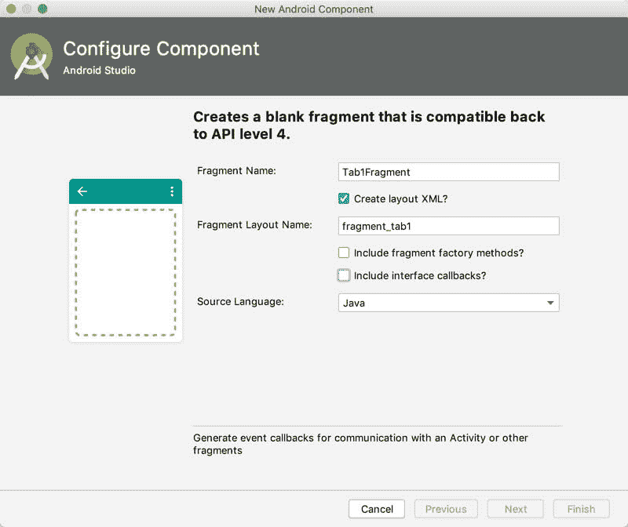
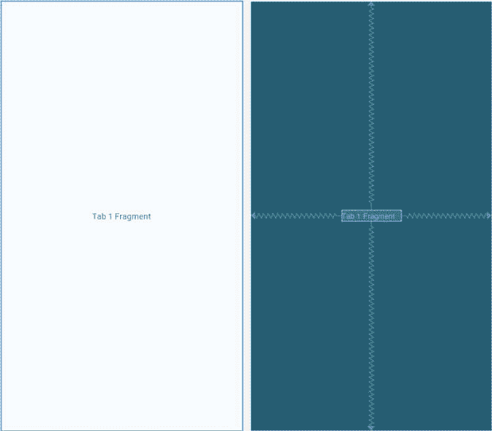
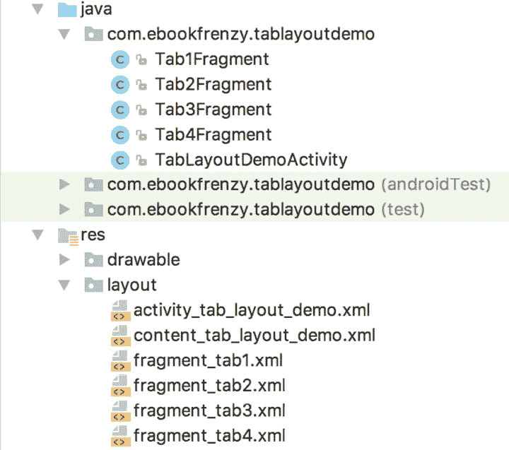
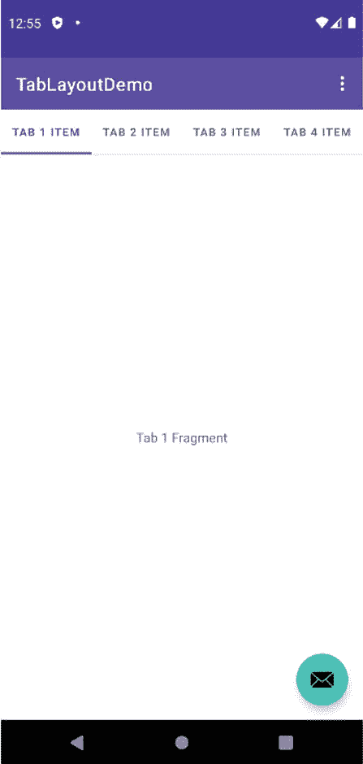
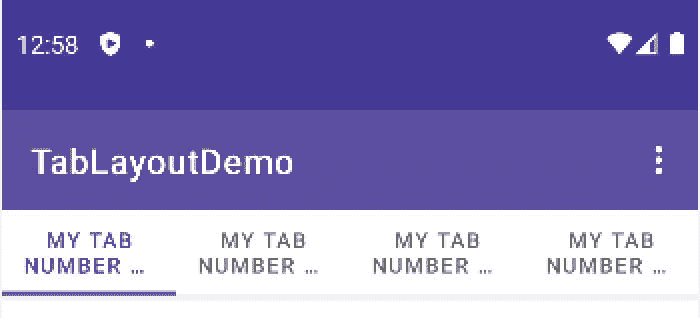
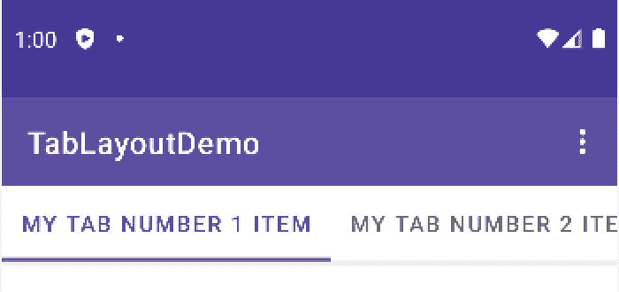
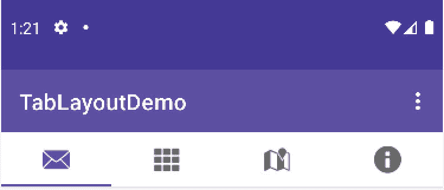

47.使用表格布局组件创建选项卡式界面

上一章概述了安卓系统中材质设计的概念，并介绍了设计支持库以浮动动作按钮和 Snackbar 形式提供的两个组件。本章将演示如何使用另一个设计库组件，TabLayout ，它可以与 ViewPager 类相结合，在 Android 活动中创建基于选项卡的界面。

47.1 可视寻呼机简介

虽然不是设计支持库的一部分，但是当与 TabLayout 组件结合使用来实现选项卡式用户界面时，ViewPager 是一个有用的伴随类。可视寻呼机的主要作用是允许用户浏览不同的信息页面，其中每个页面通常由一个布局片段表示。与视图寻呼机相关联的片段由片段寻呼机适配器类的实例管理。

分配给可视寻呼机的寻呼机适配器至少必须实现两种方法。第一个名为 getCount()，必须返回可供用户显示的页面片段总数。第二个方法，getItem()，被传递了一个页码，并且必须返回准备呈现给用户的相应片段对象。

47.2 表格输出组件概述

如前所述，TabLayout 是作为材料设计的一部分引入的组件之一，包含在设计支持库中。TabLayout 的目的是向用户呈现一行选项卡，可以选择这些选项卡向用户显示不同的页面。标签可以是固定的或可滚动的，由此用户可以向左或向右滑动以查看比当前适合显示器的标签更多的标签。选项卡上显示的信息可以是基于文本的、图像或文本和图像的组合。[例如，图 47-1](#_idTextAnchor956) 显示了由四个显示图像的选项卡组成的应用的选项卡栏:


图 47-1

[另一方面，图 47-2](#_idTextAnchor958) 显示了一个由四个选项卡组成的表格布局配置，这些选项卡以可滚动的配置显示文本:


图 47-2

本章的剩余部分将通过创建一个示例项目来演示如何使用 TabLayout 组件以及一个 ViewPager 和四个片段。

47.3 创建桌面项目T2

从欢迎屏幕中选择创建新项目快速启动选项，并在生成的新项目对话框中选择基本活动模板，然后单击下一步按钮。

在“名称”字段中输入 TabLayoutDemo，并将 com . ebookwidge . TablayoutTemo 指定为包名。在单击完成按钮之前，将最低应用编程接口级别设置更改为应用编程接口 26:安卓 8.0(奥利奥)，并将语言菜单更改为 Java。

创建项目后，将 content_main.xml 文件加载到布局编辑器工具中，选择 NavHostFragment 对象，然后将其删除。

47.4 创建第一个片段

选择后，表格布局上的每个选项卡将显示不同的片段。通过右键单击项目工具窗口中的 app-> Java-> com . ebookwidue . tablayeoutemo 条目，并选择新建->片段->片段(空白)选项，创建第一个片段。在生成的对话框中，在片段名称:字段中输入 Tab1Fragment，在片段布局名称:字段中输入 fragment_tab1。单击“完成”按钮创建新片段:



图 47-3

编辑 Tab1Fragment.java 文件，如果AndroidStudio没有自动添加，添加一个 OnFragmentInteractionListener 接口声明，如下所示:

```java
.
.
import android.net.Uri;
.
.
    public interface OnFragmentInteractionListener {
        // TODO: Update argument type and name
        void onFragmentInteraction(Uri uri);
    }
.
.
Load the newly created fragment_tab1.xml file (located under app -> res -> layout) into the Layout Editor tool, right-click on the FrameLayout entry in the Component Tree panel and select the Convert FrameLayout to ConstraintLayout menu option. In the resulting dialog, verify that all conversion options are selected before clicking on OK. Change the ID of the layout to constraintLayout.
```

布局转换为约束布局后，从布局中删除文本视图。从调色板中，找到文本视图小部件并拖放它，使其位于布局的中心。编辑对象上的文本属性，使其读作“Tab 1 片段”，并将字符串提取到名为 tab_1_fragment 的资源中，此时布局应与[匹配图 47-4](#_idTextAnchor962) :



图 47-4

47.5 复制片段

到目前为止，该项目包含四个必需片段中的一个。与其使用前面的步骤创建剩余的三个片段，不如复制第一个片段更快。每个片段由一个布局 XML 文件和一个 Java 类文件组成，每个文件都需要复制。

右键单击项目工具窗口中的 fragment_tab1.xml 文件，并从结果菜单中选择复制选项。右键单击布局条目，这次选择粘贴选项。在生成的对话框中，在单击“确定”按钮之前，命名新布局文件 fragment_tab2.xml。按照将字符串提取到名为 tab_2_fragment 的资源的常规步骤，编辑新的 fragment_tab2.xml 文件并将文本视图上的文本更改为“Tab 2 Fragment”。

要复制 Tab1Fragment 类文件，请右键单击 app-> Java-> com . ebookwidue . tabayoutemo 下列出的类，然后选择 Copy。右键单击 com . ebookwidge . tablayeoutemo 条目，然后选择粘贴。在复制类对话框中，在新名称:字段中输入 Tab2Fragment，然后单击确定。编辑新的 Tab2Fragment.java 文件，并更改类名和 onCreateView()方法来扩展 fragment_tab2 布局文件:

```java
@Override
public View onCreateView(LayoutInflater inflater, ViewGroup container,
                         Bundle savedInstanceState) {
    // Inflate the layout for this fragment
    return inflater.inflate(R.layout.fragment_tab2, container, false);
}
```

再执行两次以上的复制步骤，为剩下的两个片段创建片段布局和类文件。完成这些步骤后，项目结构应符合[图 47-5](#_idTextAnchor965) :



图 47-5

47.6 添加表格输出和视图页面

随着片段创建过程的完成，下一步是将 TabLayout 和 ViewPager 添加到主活动布局文件中。编辑 activity_main.xml 文件并添加这些元素，如下面的 xml 列表所示。请注意，TabLayout 组件被嵌入到 AppBarLayout 元素中，而 ViewPager 被放在 AppBarLayout 之后:

```java
<?xml version="1.0" encoding="utf-8"?>
<androidx.coordinatorlayout.widget.CoordinatorLayout xmlns:android="http://schemas.android.com/apk/res/android"
    xmlns:app="http://schemas.android.com/apk/res-auto"
    xmlns:tools="http://schemas.android.com/tools"
    android:layout_width="match_parent"
    android:layout_height="match_parent"
    tools:context=".MainActivity">

    <com.google.android.material.appbar.AppBarLayout
        android:layout_width="match_parent"
        android:layout_height="wrap_content"
        android:theme="@style/AppTheme.AppBarOverlay">

        <androidx.appcompat.widget.Toolbar
            android:id="@+id/toolbar"
            android:layout_width="match_parent"
            android:layout_height="?attr/actionBarSize"
            android:background="?attr/colorPrimary"
            app:popupTheme="@style/AppTheme.PopupOverlay" />

        <com.google.android.material.tabs.TabLayout
            android:id="@+id/tab_layout"
            android:layout_width="match_parent"
            android:layout_height="wrap_content"
            app:tabMode="fixed"
            app:tabGravity="fill"/>

    </com.google.android.material.appbar.AppBarLayout>

    <androidx.viewpager.widget.ViewPager
        android:id="@+id/pager"
        android:layout_width="match_parent"
        android:layout_height="match_parent"
        app:layout_behavior="@string/appbar_scrolling_view_behavior" />

    <include layout="@layout/content_main" />

    <com.google.android.material.floatingactionbutton.FloatingActionButton
        android:id="@+id/fab"
        android:layout_width="wrap_content"
        android:layout_height="wrap_content"
        android:layout_gravity="bottom|end"
        android:layout_margin="@dimen/fab_margin"
        app:srcCompat="@android:drawable/ic_dialog_email" />

</androidx.coordinatorlayout.widget.CoordinatorLayout> 
```

47.7 创建寻呼机适配器

这个例子将使用视图分页方法来处理分配给表格布局标签的片段。随着 viewprager添加到布局资源文件中，需要向项目中添加一个新的子类 FragmentPagerAdapter，以管理当用户选择选项卡项目时将显示的片段。

通过右键单击“项目”工具窗口中的条目并选择“新建-> Java 类”菜单选项，向项目中添加一个新类。在新建类对话框中，在名称:字段中输入 TabPagerAdapter，然后单击确定。

编辑 TabPagerAdapter.java 文件，使其如下所示:

```java
package com.ebookfrenzy.tablayoutdemo;

import androidx.fragment.app.Fragment;
import androidx.fragment.app.FragmentManager;
import androidx.fragment.app.FragmentPagerAdapter;

public class TabPagerAdapter extends FragmentPagerAdapter {

    int tabCount;

    public TabPagerAdapter(FragmentManager fm, int numberOfTabs) {
        super(fm, FragmentPagerAdapter.BEHAVIOR_RESUME_ONLY_CURRENT_FRAGMENT);
        this.tabCount = numberOfTabs;
    }

    @Override
    public Fragment getItem(int position) {

        switch (position) {
            case 0:
                return new Tab1Fragment();
            case 1:
                return new Tab2Fragment();
            case 2:
                return new Tab3Fragment();
            case 3:
                return new Tab4Fragment();
            default:
                return null;
        }
    }

    @Override
    public int getCount() {
        return tabCount;
    }
}
```

该类被声明为扩展了 FragmentPagerAdapter 类，并实现了一个构造函数，允许在创建实例时将所需的页数传递给该类。当需要特定页面时，将调用 getItem()方法。switch 语句用于标识被请求的页码，并返回相应的片段实例。最后，getCount()方法只返回创建对象实例时传递的计数值。

47.8 执行初始化任务

剩下的任务包括初始化 TabLayout、ViewPager 和 TabPagerAdapter 实例，并将主活动类声明为实现四个选项卡片段中每一个的片段交互侦听器。编辑 MainActivity.java 文件，使其如下所示:

```java
package com.ebookfrenzy.tablayoutdemo;

import android.os.Bundle;

import com.google.android.material.floatingactionbutton.FloatingActionButton;
import com.google.android.material.snackbar.Snackbar;

import androidx.appcompat.app.AppCompatActivity;
import androidx.appcompat.widget.Toolbar;

import android.view.View;
import android.view.Menu;
import android.view.MenuItem;

import android.net.Uri; 
import com.google.android.material.tabs.TabLayout;
import androidx.viewpager.widget.ViewPager;
import androidx.viewpager.widget.PagerAdapter;
.
.
public class MainActivity extends AppCompatActivity implements 
	 Tab1Fragment.OnFragmentInteractionListener, 
        Tab2Fragment.OnFragmentInteractionListener, 
        Tab3Fragment.OnFragmentInteractionListener, 
        Tab4Fragment.OnFragmentInteractionListener {

    @Override
    protected void onCreate(Bundle savedInstanceState) {
        super.onCreate(savedInstanceState);
        setContentView(R.layout.activity_tab_layout_demo);
        Toolbar toolbar = findViewById(R.id.toolbar);
        setSupportActionBar(toolbar);

        FloatingActionButton fab = findViewById(R.id.fab);

        fab.setOnClickListener(new View.OnClickListener() {
            @Override
            public void onClick(View view) {
                Snackbar.make(view, "Replace with your own action", 
                                   Snackbar.LENGTH_LONG)
                        .setAction("Action", null).show();
            }
        });
        configureTabLayout();
    }

    private void configureTabLayout() {
                TabLayout tabLayout = findViewById(R.id.tab_layout);

        tabLayout.addTab(tabLayout.newTab().setText("Tab 1 Item"));
        tabLayout.addTab(tabLayout.newTab().setText("Tab 2 Item"));
        tabLayout.addTab(tabLayout.newTab().setText("Tab 3 Item"));
        tabLayout.addTab(tabLayout.newTab().setText("Tab 4 Item"));

        final ViewPager viewPager = findViewById(R.id.pager);
        final PagerAdapter adapter = new TabPagerAdapter
                (getSupportFragmentManager(), 
                            tabLayout.getTabCount());
        viewPager.setAdapter(adapter);

        viewPager.addOnPageChangeListener(new 
              TabLayout.TabLayoutOnPageChangeListener(tabLayout));
        tabLayout.addOnTabSelectedListener(new 
              TabLayout.OnTabSelectedListener() {
            @Override
            public void onTabSelected(TabLayout.Tab tab) {
                viewPager.setCurrentItem(tab.getPosition());
            }

            @Override
            public void onTabUnselected(TabLayout.Tab tab) {

            }

            @Override
            public void onTabReselected(TabLayout.Tab tab) {

            }

        });
    }

   @Override
   public void onFragmentInteraction(Uri uri) {
   }
.
.
}
```

代码首先获取对添加到 activity_main.xml 文件中的 tabliyaut对象的引用，并创建四个选项卡，为每个选项卡分配要显示的文本:

```java
tabLayout.addTab(tabLayout.newTab().setText("Tab 1 Item"));
tabLayout.addTab(tabLayout.newTab().setText("Tab 2 Item"));
tabLayout.addTab(tabLayout.newTab().setText("Tab 3 Item"));
tabLayout.addTab(tabLayout.newTab().setText("Tab 4 Item"));
```

然后获取对布局文件中视图页面实例的引用，并创建一个选项卡页面适配器类的实例。请注意，创建 TabPagerAdapter 实例的代码会传递分配给 TabLayout 组件的选项卡数量。然后，将选项卡页面适配器实例分配为视图页面的适配器，并将选项卡布局组件添加到页面更改侦听器中:

```java
final ViewPager viewPager = findViewById(R.id.pager);
final PagerAdapter adapter = new TabPagerAdapter
                (getSupportFragmentManager(), 
                     tabLayout.getTabCount());
viewPager.setAdapter(adapter);

viewPager.addOnPageChangeListener(new 
       TabLayout.TabLayoutOnPageChangeListener(tabLayout));
```

最后，在 TabLayout 实例上配置了 onTabSelected listener，并实现了 ontobselected()方法，根据当前选择的标签号在 ViewPager 上设置当前页面。为了完整起见，其他侦听器方法被添加为存根:

```java
tabLayout.setOnTabSelectedListener(new 
                     TabLayout.OnTabSelectedListener() 
{
       @Override
       public void onTabSelected(TabLayout.Tab tab) {
                  viewPager.setCurrentItem(tab.getPosition());
       }

       @Override
       public void onTabUnselected(TabLayout.Tab tab) {

       }

       @Override
       public void onTabReselected(TabLayout.Tab tab) {

       } 
});
```

47.9 测试应用

在设备或模拟器上编译和运行应用，并确保选择一个选项卡会导致相应的片段出现在屏幕的内容区域:



图 47-6

47.10 定制表格布局

本示例项目中的 tabliayout是使用固定模式配置的。这种模式适用于数量有限的短标题标签。使用固定模式时，更多的标签或更长的标题会很快成为问题，如图 47-7 所示:



图 47-7

为了使选项卡适合可用的显示宽度，TabLayout 使用了多行文本。即便如此，第二行明显被截断，无法看到完整的标题。这个问题的最佳解决方案是将 tabliayout切换到可滚动模式。在这种模式下，标题以完整的单行格式出现，允许用户水平滑动滚动可用项目，如图 47-8 所示:



图 47-8

要将 TabLayout 切换到可滚动模式，只需将 activity_main.xml 布局资源文件中的 app:tabMode 属性从“固定”更改为“可滚动”:

```java
<android.support.design.widget.TabLayout
    android:id="@+id/tab_layout"
    android:layout_width="match_parent"
    android:layout_height="wrap_content"
    app:tabMode="scrollable"
    app:tabGravity="fill"/>
</android.support.design.widget.AppBarLayout>
```

当处于固定模式时，表格布局可以被配置为控制如何显示标签项目以占据屏幕上的可用空间。这是通过 app:tabGravity 属性控制的，其结果在横向平板电脑等更宽的显示器上更明显。例如，当设置为“填充”时，项目将均匀分布在表格的宽度上，如图 [图 47-9](#_idTextAnchor974) :


图 47-9

将属性值更改为“中心”将导致项目相对于标签栏的中心定位:


图 47-10

在进入本章的最后一步之前，请将 activity_main.xml 文件中的 tabMode 和 tabGravity 属性分别恢复为“固定”和“填充”。

47.11 显示图标标签项目

本教程的最后一步是用图标替换基于文本的选项卡。通过修改 MainActivity.java 文件中的 onCreate()方法，为选项卡项分配一些内置的可绘制图标，可以实现这一点:

```java
private void configureTabLayout() {

    TabLayout tabLayout = findViewById(R.id.tab_layout);

    tabLayout.addTab(tabLayout.newTab().setIcon(
                     android.R.drawable.ic_dialog_email));
    tabLayout.addTab(tabLayout.newTab().setIcon(
                     android.R.drawable.ic_dialog_dialer));
    tabLayout.addTab(tabLayout.newTab().setIcon(
                     android.R.drawable.ic_dialog_map));
    tabLayout.addTab(tabLayout.newTab().setIcon(
                     android.R.drawable.ic_dialog_info));

    final ViewPager viewPager = findViewById(R.id.pager);
.
.
```

代码现在不是使用选项卡项的 setText()方法，而是调用 setIcon()方法并传递一个可绘制的图标引用。编译运行时，标签栏现在应该出现，如图[图 47-11](#_idTextAnchor977) 所示。请注意，如果使用即时运行，需要使用 Ctrl-Shift-R 来触发热交换，以使对“T2”的更改生效:



图 47-11

47.12 总结

TabLayout 是作为 Android 材料设计实现的一部分引入的组件之一。TabLayout 组件的目的是呈现一系列选项卡项，当选择这些选项卡项时，会向用户显示不同的内容。选项卡项目可以显示文本、图像或两者的组合。当与 ViewPager 类和片段结合时，可以相对容易地创建选项卡布局，每个选项卡项目选择显示不同的片段。