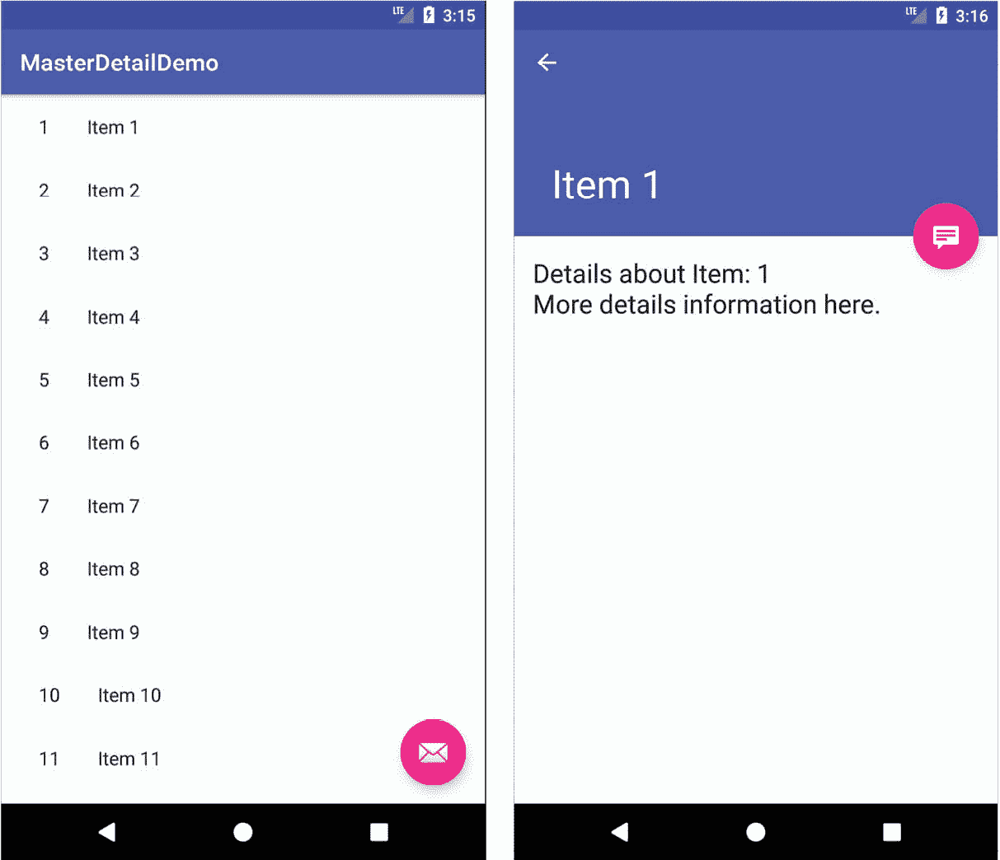
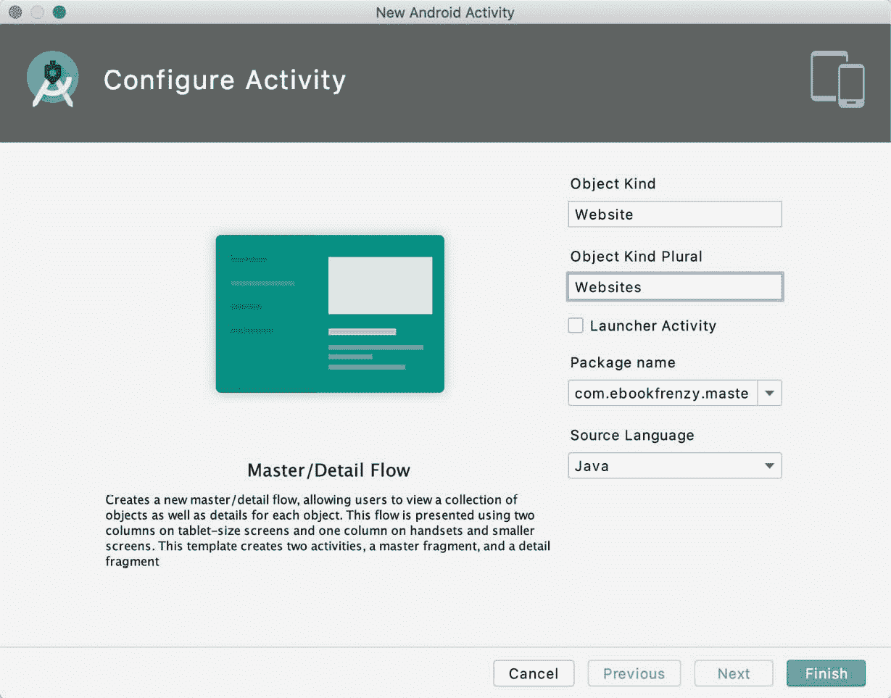
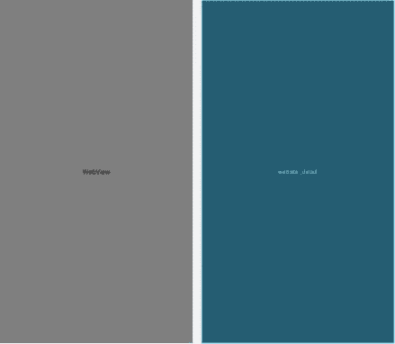

# 五十二、AndroidStudio MasterDetailFlow教程

本章将解释主/细节用户界面设计的概念，然后详细探讨AndroidStudio中包含的构成主/细节流模板的元素。然后将创建一个示例应用，演示修改模板以满足应用开发人员的特定需求所涉及的步骤。

52.1 MasterDetailFlow

MasterDetailFlow是一种界面设计概念，通过它向用户显示项目列表(称为主列表)。当从列表中选择一个项目时，与该项目相关的附加信息随后在细节窗格中呈现给用户。例如，一个电子邮件应用可能包含一个接收消息的主列表，该列表包含发送者的地址和消息的主题。从主列表中选择邮件后，电子邮件的正文将出现在详细信息窗格中。

在平板电脑大小的安卓设备上，主列表显示在屏幕左侧的一个狭窄的垂直面板中。显示器的其余部分以称为双窗格模式的方式用于细节窗格。[例如，图 52-1](#_idTextAnchor1034) 显示了主/细节，列出主项目的两个窗格排列以及显示在细节窗格中的项目一的内容:


图 52-1

在较小的手机大小的安卓设备上，主列表占据了整个屏幕，细节窗格出现在从主列表中进行选择时出现的单独屏幕上。在这种模式下，详细屏幕包括一个返回主列表的操作栏条目。[图 52-2](#_idTextAnchor1035) 举例说明了 4 英寸电话屏幕上同一项目列表的主屏幕和详细屏幕:



图 52-2

52.2 创建MasterDetailFlow活动

在本章的下一节中，将详细介绍构成主/详细流程模板的不同元素。这最好通过使用主/详细流程模板创建项目来实现，以便在处理信息时使用。该项目随后将被用作本章末尾教程的基础。

尽管项目创建向导包括选择主/详细流程模板的选项，但在创建项目后，通过添加活动，可以更灵活地配置模板。

从欢迎屏幕中选择“创建新项目”快速启动选项，并在生成的新项目对话框中选择“不添加活动”模板，然后单击“下一步”按钮。

在“名称”字段中输入 MasterDetailFlow，并将 com . ebookwidue . MasterDetailFlow 指定为包名。在单击完成按钮之前，将最低API级别设置更改为API 26:安卓 8.0(奥利奥)，并将语言菜单更改为 Java。

创建项目后，右键单击项目工具窗口中的应用-> Java-> com . ebookwidue . Master detailflow 条目，并选择新建->活动->主/细节流菜单选项。

新的安卓活动屏幕([图 52-3](#_idTextAnchor1037) )提供了配置将在主/细节活动中显示的对象的机会。在本章后面的教程中，主列表将包含许多网站名称，当选择这些名称时，会将所选网站加载到详细信息窗格中的 web 视图中。考虑到这些要求，将对象种类字段设置为“网站”，对象种类复数设置为“网站”。



图 52-3

在单击“完成”按钮之前，请确保启用“启动器活动”选项并将“源语言”菜单设置为“Java”。

52.3 MasterDetailFlow模板的剖析

一旦使用主/细节流模板创建了新项目，就会自动创建许多 Java 和 XML 布局资源文件。了解这些不同的文件非常重要，这样才能使模板适应特定的需求。在AndroidStudio项目工具窗口中查看项目将显示以下文件，其中<item>被创建项目时指定的对象种类名称替换(在 MasterDetailFlow 示例项目中这是“网站”):</item>

activity _<item>_ list . XML–主列表的顶层布局文件，该文件由 <item>ListActivity 类加载。这个布局包含一个工具栏，一个浮动动作按钮，并且包含 <item>_list.xml 文件。</item></item></item>

<item>ListActivity.java–负责显示和管理主列表(在 activity_ <item>_list.xml 文件中声明)以及显示和响应列表中项目选择的活动类。</item></item>

<item>_ list . XML–用于以单窗格模式显示项目主列表的布局文件，其中主列表和详细窗格出现在不同的屏幕上。该文件包含一个配置为使用 LinearLayoutManager 的 RecyclerView 对象。RecyclerView 元素声明主列表中的每个项目都将使用在 <item>_list_content.xml 文件中声明的布局来显示。</item></item>

<item>_ list . XML(w900 DP)–在平板电脑上横向使用的双窗格模式下主列表的布局文件(其中主列表和详细窗格并排显示)。该文件包含一个水平线性布局父级，其中驻留了一个显示主列表的回收视图，以及一个包含详细信息窗格内容的框架布局。与此文件的单窗格变体一样，RecyclerView 元素声明列表中的每个项目都将使用包含在 <item>_list_content.xml 文件中的布局来显示。</item></item>

<item>_ list _ content . XML–该文件包含用于主列表中每个项目的布局。默认情况下，这由嵌入在水平线性布局中的两个文本视图对象组成，但可以根据特定的应用需求进行更改。</item>

activity _<item>_ detail . XML–在单窗格模式下运行时，用于详细信息窗格的顶级布局文件。此布局包含一个应用栏、折叠工具栏、滚动视图和一个浮动操作按钮。在运行时，这个布局文件由 <item>DetailActivity 类加载和显示。</item></item>

<item>DetailActivity.java–该类显示 activity_ <item>_detail.xml 文件中定义的布局。该类还初始化并显示包含在 <item>_detail.xml 和<item>DetailFragment.java 文件中定义的详细内容的片段。</item></item></item></item>

<item>_ detail . XML–伴随 <item>DetailFragment 类的布局文件，包含详细信息窗格内容区域的布局。默认情况下，它包含一个文本视图对象，但可能会根据您的特定应用需求进行更改。在单窗格模式下，这个片段被加载到 activity_ <item>_detail.xml 文件定义的布局中。在双窗格模式下，该布局被加载到 <item>_list.xml (w900dp)文件的 FrameLayout 区域，以便它出现在主列表旁边。</item></item></item></item>

<item>DetailFragment.java–片段类文件，负责显示 <item>_detail.xml 布局，并用要在细节窗格中显示的内容填充它。该片段被初始化并显示在<item>DetailActivity.java 文件中，以提供显示在单窗格模式的 activity_ <item>_detail.xml 布局和双窗格模式的 <item>_list.xml (w900dp)布局中的内容。</item></item></item></item></item>

•DummyContent.java–一个旨在为模板提供样本数据的类文件。这个类可以修改以满足应用的需要，也可以完全替换。默认情况下，该类提供的内容仅由许多字符串项组成。

52.4 修改主/详细流程模板

虽然主/详细流程模板的结构起初可能看起来令人困惑，但随着本章剩余部分对默认模板的修改，概念将变得更加清晰。显而易见，对于许多主/细节实现需求，模板提供的许多功能可以保持不变。

在本章的其余部分，将修改 MasterDetailFlow 项目，以便主列表显示网站名称列表，而详细信息窗格被更改为包含一个 WebView 对象，而不是当前的 TextView。当用户选择一个网站时，相应的网页将随后加载并显示在详细信息窗格中。

52.5 更改内容模型

当前示例的内容由 DummyContent 类文件定义。因此，首先选择 DummyContent.java 文件(位于应用的项目工具窗口中-> Java-> com . ebookwidue . masterdetailflow->虚拟文件夹)并查看代码。文件的底部是一个名为 DummyItem 的类的声明，该类目前能够存储两个 String 对象，表示一个内容字符串和一个 ID。另一方面，更新后的项目需要每个项目对象包含一个标识字符串、一个网站名称字符串和一个网站对应网址字符串。要添加这些功能，请修改 DummyItem 类，使其如下所示:

```java
public static class DummyItem {
       public String id;
       public String website_name;
       public String website_url;

       public DummyItem(String id, String website_name, 
             String website_url) 
       {
              this.id = id;
              this.website_name = website_name;
              this.website_url = website_url;
       }

       @Override
       public String toString() {
              return website_name;
       }
}
```

请注意，封装 DummyContent 类当前包含一个 for 循环，该循环通过多次调用名为 createDummyItem()和 makeDetails()的方法来添加 25 个项。大部分代码将不再需要，应该从类中删除，如下所示:

```java
public static Map<String, DummyItem> ITEM_MAP = new HashMap<String, DummyItem>();

private static final int COUNT = 25;

static {
    // Add some sample items.
    for (int i = 1; i <= COUNT; i++) {
        addItem(createDummyItem(i));
    }
}

private static void addItem(DummyItem item) {
    ITEMS.add(item);
    ITEM_MAP.put(item.id, item);
}

private static DummyItem createDummyItem(int position) {
    return new DummyItem(String.valueOf(position), "Item " + position, makeDetails(position));
}

private static String makeDetails(int position) {
    StringBuilder builder = new StringBuilder();
    builder.append("Details about Item: ").append(position);
    for (int i = 0; i < position; i++) {
        builder.append("\nMore details information here.");
    }
    return builder.toString();
}
```

需要修改此代码，以便用所需的网站数据初始化数据模型:

```java
public static final Map<String, DummyItem> ITEM_MAP = 
          new HashMap<String, DummyItem>();

static {
       // Add 3 sample items.
        addItem(new DummyItem("1", "eBookFrenzy",
                "https://www.ebookfrenzy.com"));
        addItem(new DummyItem("2", "Amazon",
                "https://www.amazon.com"));
        addItem(new DummyItem("3", "New York Times",
                "https://www.nytimes.com"));
}
```

代码现在利用修改后的 DummyItem 类来存储每个项目的标识、网站名称和网址。

52.6 更改详细信息窗格

当从主列表中选择一个项目时，向用户显示的详细信息当前通过包含在网站 _detail.xml 文件中的布局显示。默认情况下，它包含文本视图形式的单个视图。由于文本视图类不能显示网页，因此在本教程中需要将其更改为网络视图对象。为此，在项目工具窗口中导航到应用-> res ->布局->网站 _detail.xml 文件，双击该文件将其加载到布局编辑器工具中。切换到代码模式，从文件中删除当前的 XML 内容。用以下 XML 替换此内容:

```java
<?xml version="1.0" encoding="utf-8"?>
<WebView xmlns:android="http://schemas.android.com/apk/res/android"
    xmlns:tools="http://schemas.android.com/tools"
    android:layout_width="match_parent"
    android:layout_height="match_parent"
    android:id="@+id/website_detail"
    tools:context= ".WebsiteDetailFragment">
</WebView>
```

切换到设计模式，验证布局是否与[图 52-4](#_idTextAnchor1043) 所示一致:



图 52-4

52.7 修改网站详细信息片段类

此时，用户界面详细信息窗格已经被修改，但是相应的 Java 类仍然被设计为使用文本视图对象而不是网络视图。双击项目工具窗口中的 WebsiteDetailFragment.java 文件，加载该类的源代码。

为了加载对应于当前选定项目的网页网址，只需要更改几行代码。一旦进行了此更改，代码应如下所示:

```java
package com.ebookfrenzy.masterdetailflow;
.
.
import android.webkit.WebViewClient;
import android.webkit.WebView;
import android.webkit.WebResourceRequest;
.
.
public class WebSiteDetailFragment extends Fragment {
.
.
.
    public void onCreate(Bundle savedInstanceState) {
        super.onCreate(savedInstanceState);

        if (getArguments().containsKey(ARG_ITEM_ID)) {
            // Load the dummy content specified by the fragment
            // arguments. In a real-world scenario, use a Loader
            // to load content from a content provider.
            mItem = DummyContent.ITEM_MAP.get(getArguments().getString(ARG_ITEM_ID));

            Activity activity = this.getActivity();
            CollapsingToolbarLayout appBarLayout =
                      activity.findViewById(R.id.toolbar_layout);
            if (appBarLayout != null) {
                appBarLayout.setTitle(mItem.website_name);
            }
        }
    }

    @Override
    public View onCreateView(LayoutInflater inflater, 
              ViewGroup container, Bundle savedInstanceState) {
        View rootView = inflater.inflate(
             R.layout.fragment_website_detail, container, false);

        // Show the dummy content as text in a TextView.
        if (mItem != null) {
            WebView webView = rootView.findViewById(R.id.website_detail);
            webView.setWebViewClient(new WebViewClient(){
                @Override
                public boolean shouldOverrideUrlLoading(
                    WebView view, WebResourceRequest request) {
                    return super.shouldOverrideUrlLoading(
                                 view, request);
                }
            });
            webView.loadUrl(mItem.website_url);
        }

        return rootView;
    }
}
```

上述更改修改了 onCreate()方法，以在应用栏上显示网站名称:

```java
appBarLayout.setTitle(mItem.website_name);
```

然后修改 onCreateView()方法，找到 ID 为网站详细信息的视图(以前是文本视图，但现在是网络视图)，并从所选项目中提取网站的网址。创建了 WebViewClient 类的一个实例，并为其分配了 shouldOverrideUrlLoading()回调方法。实现这个方法是为了强制系统使用 WebView 实例来加载页面，而不是 Chrome 浏览器。最后，在 webView 实例上启用了 JavaScript 支持，并加载了网页。

52.8 修改网站列表活动类

还需要对 WebsiteListActivity.java 文件进行小的更改，以确保网站名称出现在主列表中。编辑此文件，找到 onBindViewHolder()方法，并修改 setText()方法调用以引用网站名称，如下所示:

```java
public void onBindViewHolder(final ViewHolder holder, int position) {
    holder.mItem = mValues.get(position);
    holder.mIdView.setText(mValues.get(position).id);
    holder.mContentView.setText(mValues.get(position).website_name);
.
.
}
```

52.9 添加清单权限

最后一步是通过清单文件向应用添加 internet 权限。这将使 WebView 对象能够访问互联网并下载网页。导航到项目工具窗口(app-> manifest)中的 AndroidManifest.xml 文件，并将其加载到编辑器中。加载后，向文件添加适当的权限行:

```java
<?xml version="1.0" encoding="utf-8"?>
<manifest xmlns:android="http://schemas.android.com/apk/res/android"
    package="com.ebookfrenzy.masterdetailflow" >

    <uses-permission android:name="android.permission.INTERNET" />

    <application
        android:allowBackup="true"
        android:icon="@mipmap/ic_launcher"
        android:label="@string/app_name"
        android:theme="@style/AppTheme" >
.
.
```

52.10 运行应用

在适当配置的模拟器或附加的安卓设备上编译和运行应用。根据显示屏的大小，应用会以小屏幕或双窗格模式出现。无论如何，主列表应该以内容模型中定义的三个网站的名称作为开头。选择一个项目会导致相应的网站出现在详细信息窗格中，如图 52-5 中的双窗格模式所示:


图 52-5

52.11 总结

主/详细用户界面由项目的主列表组成，当选择该列表时，将在详细窗格中显示关于该选择的附加信息。主/细节流是AndroidStudio提供的一个模板，允许快速且相对容易地创建主/细节安排。正如本章所展示的，通过对默认模板文件的微小修改，可以用最少的编码和设计工作实现大量基于主/细节的功能。