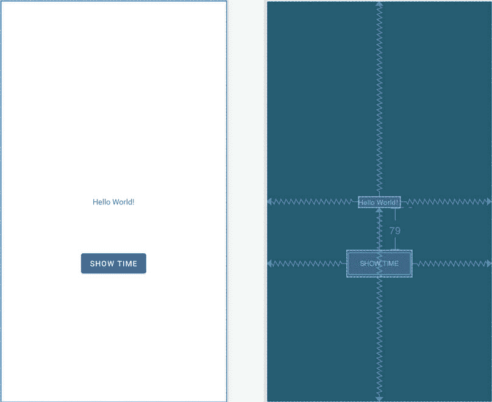

60\. 安卓本地绑定服务——一个成功的例子

正如前面几章中详细描述的那样，与启动服务不同，绑定服务提供了一种机制来实现安卓服务和一个或多个客户端组件之间的通信。本章的目标是在开始本地绑定服务的示例实现之前，在[“安卓启动和绑定服务概述”](58.html#_idTextAnchor1122)中提供的绑定服务概述的基础上进行构建。

60.1 了解绑定服务 s

与已启动的服务一样，提供绑定服务是为了允许应用在后台执行任务。然而，与启动的服务不同，多个客户端组件可以绑定到一个绑定的服务，并且一旦绑定，就使用各种不同的机制与该服务交互。

绑定服务被创建为安卓服务类的子类，并且必须至少实现 onBind()方法。客户端组件通过调用 bindService()方法绑定到服务。对绑定服务的第一个绑定请求将导致对该服务的 onBind()方法的调用(后续绑定请求不会触发 onBind()调用)。希望绑定到服务的客户端还必须实现包含 onServiceConnected() 和 onServiceDisconnected()方法的 ServiceConnection 子类，一旦客户端-服务器连接建立或断开，将分别调用这两个方法。在 onServiceConnected()方法的情况下，将向其传递一个 IBinder 对象，该对象包含客户端与服务交互所需的信息。

60.2 绑定服务交互选项

有两种推荐的机制来实现客户端组件和绑定服务之间的交互。如果绑定的服务对于与客户端组件相同的应用是本地的和私有的(换句话说，它在相同的进程中运行，并且对其他应用中的组件不可用)，建议的方法是创建 Binder 类的子类，并扩展它以提供服务接口。然后，这个 Binder 对象的一个实例由 onBind()方法返回，随后由客户端组件用来直接访问服务中保存的方法和数据。

在绑定服务不在应用本地的情况下(换句话说，它运行在与客户端组件不同的进程中)，最好使用 Messenger/Handler 实现来实现交互。

在本章的剩余部分，将创建一个示例，目的是演示创建、启动本地私有绑定服务并与之交互所涉及的步骤。

60.3 AndroidStudio本地绑定服务示例

本章剩余部分中创建的示例应用将由一个活动和一个绑定服务组成。绑定服务的目的是从系统获取当前时间，并将该信息返回给活动，在活动中将向用户显示该信息。绑定的服务对于与活动相同的应用来说是本地的和私有的。

从欢迎屏幕中选择创建新项目快速启动选项，并在生成的新项目对话框中选择空活动模板，然后单击下一步按钮。

在“名称”字段中输入 LocalBound，并将 com . ebookwidge . local bound 指定为包名。在单击完成按钮之前，将最低应用编程接口级别设置更改为应用编程接口 26:安卓 8.0(奥利奥)，并将语言菜单更改为 Java。

创建项目后，下一步是添加一个新类作为绑定服务。

60.4 向项目添加绑定服务

要向项目中添加一个新类，在项目工具窗口中右键单击包名(位于 app-> Java-> com . ebookwidue . local bound 下)，然后选择新建->服务->服务菜单选项。将边界服务指定为类名，并确保在单击“完成”创建该类之前选择了“导出”和“启用”选项。AndroidStudio会将 BoundService.java 文件加载到编辑器中，其内容如下:

```java
package com.ebookfrenzy.localbound;

import android.app.Service;
import android.content.Intent;
import android.os.IBinder;

public class BoundService extends Service {
    public BoundService() {
    }

    @Override
    public IBinder onBind(Intent intent) {
        // TODO: Return the communication channel to the service.
        throw new UnsupportedOperationException("Not yet implemented");
    }
}
```

60.5 实施活页夹

如前所述，本地绑定服务可以通过向客户端传递适当配置的 Binder 对象来与绑定客户端进行通信。这是通过在绑定的服务类中创建一个 Binder 子类，并通过添加一个或多个客户端可以调用的新方法来扩展它来实现的。在大多数情况下，这仅仅涉及实现一个方法，该方法返回对绑定服务实例的引用。有了对这个实例的引用，客户端就可以访问数据并直接调用绑定服务中的方法。

因此，在本例中，需要对上一节中创建的模板边界服务类进行一些更改。首先，需要声明一个 Binder 子类。该类将包含一个名为 getService()的方法，该方法将简单地返回对当前服务对象实例的引用(由 This 关键字表示)。牢记这些要求，编辑 BoundService.java 文件并按如下方式进行修改:

```java
package com.ebookfrenzy.localbound;

import android.app.Service;
import android.content.Intent;
import android.os.IBinder;
import android.os.Binder;

public class BoundService extends Service {

    private final IBinder myBinder = new MyLocalBinder();

    public BoundService() {
    }

    @Override
    public IBinder onBind(Intent intent) {
        // TODO: Return the communication channel to the service.
        throw new UnsupportedOperationException("Not yet implemented");
    }

    public class MyLocalBinder extends Binder {
        BoundService getService() {
            return BoundService.this;
        }
    }
}
```

对课程进行了更改后，值得花点时间回顾一下这里执行的步骤。首先，声明了 Binder 的一个新子类(名为 MyLocalBinder)。这个类包含一个方法，唯一的目的是返回对 BoundService 类的当前实例的引用。MyLocalBinder 类的一个新实例被创建并分配给 myBinder IBinder 引用(因为 Binder 是 IBinder 的子类，所以在这个分配中没有类型不匹配)。

接下来，需要修改 onBind()方法，以返回对 myBinder 对象的引用，并实现一个新的公共方法，以在绑定到服务的任何客户端调用时返回当前时间:

```java
package com.ebookfrenzy.localbound;

import java.text.SimpleDateFormat;
import java.util.Date;
import java.util.Locale;

import android.app.Service;
import android.content.Intent;
import android.os.IBinder;
import android.os.Binder;

public class BoundService extends Service {

    private final IBinder myBinder = new MyLocalBinder();

    public BoundService() {
    }

    @Override
    public IBinder onBind(Intent intent) {
        return myBinder;
    }

    public String getCurrentTime() {
        SimpleDateFormat dateformat =
                new SimpleDateFormat("HH:mm:ss MM/dd/yyyy",
                        Locale.US);
        return (dateformat.format(new Date()));
    }

    public class MyLocalBinder extends Binder {
        BoundService getService() {
            return BoundService.this;
        }
    }
}
```

此时，绑定的服务已经完成，可以添加到项目清单文件中。在项目工具窗口中找到并双击本地绑定项目的 AndroidManifest.xml 文件，并在加载到清单编辑器中后，验证 Android Studio 已经为服务添加了一个 <service>条目，如下所示:</service>

```java
<?xml version="1.0" encoding="utf-8"?>
<manifest xmlns:android="http://schemas.android.com/apk/res/android"
    package="com.ebookfrenzy.localbound.localbound" >

    <application
        android:allowBackup="true"
        android:icon="@mipmap/ic_launcher"
        android:label="@string/app_name"
        android:theme="@style/AppTheme" >
        <service
            android:name=".BoundService"
            android:enabled="true"
            android:exported="true" >
        </service>
        <activity
            android:name=".MainActivity" >
            <intent-filter>
                <action android:name="android.intent.action.MAIN" />

                <category android:name="android.intent.category.LAUNCHER" />
            </intent-filter>
        </activity> 
     </application>

</manifest>
```

下一阶段是在活动中实现绑定到服务的必要代码，并调用 getCurrentTime()方法。

60.6 将客户绑定到服务

在本教程中，客户端是正在运行的应用的 MainActivity 实例。如前所述，为了成功绑定到服务并接收服务的 onBind()方法返回的 IBinder 对象，需要创建一个 ServiceConnection 子类并实现 onServiceConnected() 和 onServiceDisconnected() 回调方法。编辑 MainActivity.java 文件并进行如下修改:

```java
package com.ebookfrenzy.localbound;

import androidx.appcompat.app.AppCompatActivity;
import android.os.Bundle;
import android.os.IBinder;
import android.content.Context;
import android.content.Intent;
import android.content.ComponentName;
import android.content.ServiceConnection;
import com.ebookfrenzy.localbound.BoundService.MyLocalBinder;

public class MainActivity extends AppCompatActivity {

    BoundService myService;
    boolean isBound = false;

    @Override
    protected void onCreate(Bundle savedInstanceState) {
        super.onCreate(savedInstanceState);
        setContentView(R.layout.activity_main);
    }

    private ServiceConnection myConnection = new ServiceConnection()
    {
        @Override
        public void onServiceConnected(ComponentName className,
                                       IBinder service) {
            MyLocalBinder binder = (MyLocalBinder) service;
            myService = binder.getService();
            isBound = true;
        }

        @Override
        public void onServiceDisconnected(ComponentName name) {
            isBound = false;
        }
    };
}
```

当客户端成功绑定到服务时，将调用 onServiceConnected()方法。该方法作为参数传递给服务的 onBind()方法返回的 IBinder 对象。这个参数被转换为 MyLocalBinder 类型的对象，然后调用 Binder 对象的 getService()方法来获取对服务实例的引用，服务实例又被分配给 myService。布尔标志用于指示连接已成功建立。

onServiceDisconnected()方法在连接结束时调用，只是将布尔标志设置为 false。

建立连接后，下一步是修改活动以绑定到服务。这包括创建一个意图和对 bindService()方法的调用，可以在活动的 onCreate()方法中执行:

```java
@Override
public void onCreate(Bundle savedInstanceState) {
    super.onCreate(savedInstanceState);
    setContentView(R.layout.activity_main);
    Intent intent = new Intent(this, BoundService.class);       
    bindService(intent, myConnection, Context.BIND_AUTO_CREATE);
}
```

60.7 完成示例

剩下的就是实现一个调用 getCurrentTime()方法并向用户显示结果的机制。按照现在的惯例，AndroidStudio将为只包含一个文本视图的活动创建一个模板 activity_main.xml 文件。将此文件加载到布局编辑器工具中，并使用设计模式选择文本视图组件，并将标识更改为我的文本视图。在文本视图下添加一个按钮视图，并将按钮上的文本更改为“显示时间”，将文本提取到名为 show_time 的字符串资源中。完成这些变更后，布局应类似于[图 60-1](#_idTextAnchor1156) 所示。如果缺少任何约束，单击布局编辑器工具栏中的“推断约束”按钮。



图 60-1

通过选择按钮并配置 onClick 属性来调用名为 showTime 的方法，完成用户界面设计。

最后，编辑 MainActivity.java 文件中的代码以实现 showTime()方法。此方法只需调用服务的 getCurrentTime()方法(由于 onServiceConnected()方法，现在可以通过 myService 引用从活动中获得该方法)，并将结果字符串分配给 TextView:

```java
package com.ebookfrenzy.localbound;

import androidx.appcompat.app.AppCompatActivity;
import android.os.Bundle;
import android.os.IBinder;
import android.content.Context;
import android.content.Intent;
import android.content.ComponentName;
import android.content.ServiceConnection;
import android.view.View;
import android.widget.TextView;
import com.ebookfrenzy.localbound.BoundService.MyLocalBinder;

public class MainActivity extends AppCompatActivity {

    BoundService myService;
    boolean isBound = false;

    public void showTime(View view)
    {
        String currentTime = myService.getCurrentTime();
        TextView myTextView = findViewById(R.id.myTextView);
        myTextView.setText(currentTime);
    }
.
.
}
```

60.8 测试应用

代码更改完成后，执行应用的测试运行。一旦可见，轻触按钮，注意文本视图会改变以显示当前日期和时间。该示例已成功启动并绑定到一个服务，然后调用该服务的一个方法来执行任务，并将结果返回给活动。

60.9 总结

当绑定的服务是应用的本地和私有服务时，该应用中的组件可以与服务交互，而不需要借助进程间通信(IPC)。一般来说，服务的 onBind()方法返回一个包含对正在运行的服务实例的引用的 IBinder 对象。客户端组件实现了一个 ServiceConnection 子类，该子类包含在服务连接和断开时调用的回调方法。前一个方法被传递给 onBind()方法返回的 IBinder 对象，该方法允许调用服务中的公共方法。

已经介绍了本地绑定服务的实现，下一章将重点介绍如何使用 IPC 与远程绑定服务进行交互。