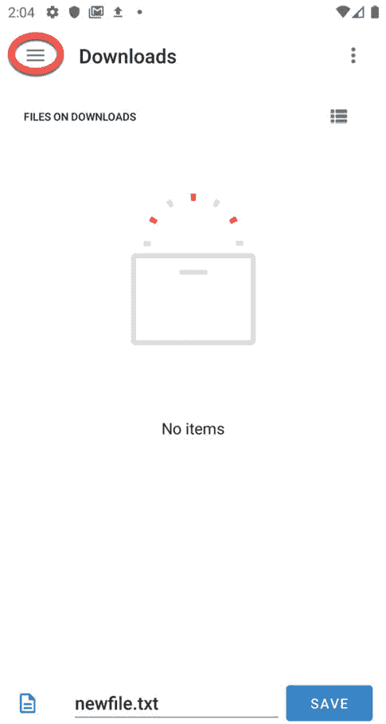
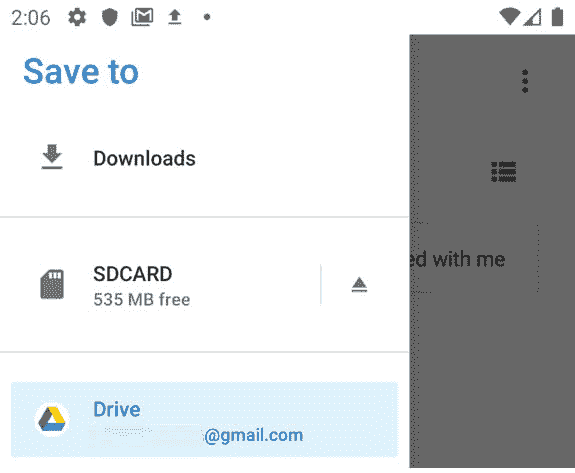
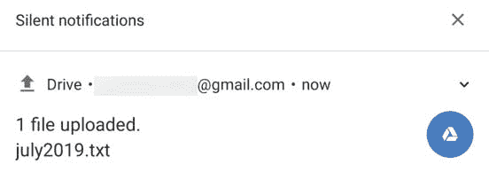

70\. 安卓存储访问框架示例

如前所述，存储访问框架大大简化了将基于云的存储访问集成到安卓应用中的过程。由一个选择器用户界面和一组新的意图组成，现在可以相对容易地将对存储在谷歌驱动和盒子等文档提供商上的文件的访问内置到安卓应用中。利用前一章中介绍的安卓存储访问框架的基础知识，本章将创建一个使用存储访问框架来存储和管理文件的示例应用。

70.1 关于存储访问框架示例

本章中创建的安卓应用将采用初级文本编辑器的形式，旨在远程创建文本文件并将其存储到基于云的存储服务中。实际上，该示例将与任何与存储访问框架兼容的基于云的文档存储提供商一起工作，尽管出于本示例的目的，假设使用谷歌驱动。

在功能方面，该应用将向用户呈现一个多行文本视图，其中可以输入和编辑文本，以及一组允许创建、打开和保存基于存储的文本文件的按钮。

70.2 创建存储访问框架示例

从欢迎屏幕中选择创建新项目快速启动选项，并在生成的新项目对话框中选择空活动模板，然后单击下一步按钮。

在“名称”字段中输入 StorageDemo，并将 com . ebookwidue . StorageDemo 指定为包名称。在单击完成按钮之前，将最低应用编程接口级别设置更改为应用编程接口 26:安卓 8.0(奥利奥)，并将语言菜单更改为 Java。

70.3 设计用户界面

用户界面需要由三个按钮视图和一个编辑文本视图组成。在项目工具窗口中，导航到位于 app -> res -> layout 中的 activity_main.xml 布局文件，并双击该文件将其加载到布局编辑器工具中。使用设计模式下的工具，选择并删除你好世界！TextView 对象。

在布局的左上角拖动并放置一个按钮小部件，以便在将小部件放置到位之前，左侧和顶部的虚线边距都出现。放置第二个按钮，使中间和上边距出现。然后应该放置第三个按钮小部件，以便出现顶部和右侧的边距准则。

将三个按钮上的文本属性分别更改为“新建”、“打开”和“保存”。接下来，放置一个纯文本小部件，使其水平居中，并位于中心按钮下方，以便用户界面布局与图 70-1 中所示的相匹配。使用布局编辑器工具栏中的“推断约束”按钮添加任何缺少的约束。

在布局中选择纯文本小部件，删除当前文本属性设置，使字段最初为空，并将标识设置为文件文本，记住将所有字符串属性提取为资源值:


图 70-1

使用属性工具窗口，配置按钮小部件上的 onClick 属性，分别调用名为 newFile、openFile 和 saveFile 的方法。

70.4 声明请求代码

在存储访问框架中处理文件涉及根据要执行的特定操作触发各种意图。这必然会导致框架显示存储选择器用户界面，以便用户可以指定存储位置(例如谷歌驱动器上的目录和文件名)。当意图的工作完成时，应用将通过调用名为 onActivityResult()的方法得到通知。

由于单个活动的所有意图都会导致对同一个 onActivityResult()方法的调用，因此需要一种机制来识别是哪个意图触发了调用。这可以通过在启动时将请求代码传递给意图来实现。该代码随后由意图传递给 onActivityResult()方法，使该方法能够识别用户请求了哪个动作。在实现 onClick 处理程序来创建、保存和打开文件之前，第一步是为这三个动作声明一些请求代码。

找到 MainActivity.java 文件并将其加载到编辑器中，并为应用要执行的三个操作声明常量值。另外，添加一些代码来获取对 EditText 对象的引用，该对象将在后面的方法中引用:

```java
package com.ebookfrenzy.storagedemo;

import androidx.appcompat.app.AppCompatActivity;
import android.os.Bundle;
import android.widget.EditText;

public class MainActivity extends AppCompatActivity {

    private EditText textView;

    private static final int CREATE_REQUEST_CODE = 40;
    private static final int OPEN_REQUEST_CODE = 41;
    private static final int SAVE_REQUEST_CODE = 42;

    @Override
    protected void onCreate(Bundle savedInstanceState) {
        super.onCreate(savedInstanceState);
        setContentView(R.layout.activity_storage_demo);

        textView = findViewById(R.id.fileText);
    }
}
```

70.5 创建新的存储文件

当选择新建按钮时，应用将需要触发一个 ACTION_CREATE_DOCUMENT 意图，该意图被配置为创建一个纯文本 MIME 类型的文件。设计用户界面时，“新建”按钮被配置为调用名为 newFile()的方法。正是在这种方法中，需要启动适当的意图。

保留在 MainActivity.java 文件中，按如下方式实现此方法:

```java
package com.ebookfrenzy.storagedemo;

import android.app.Activity;
import androidx.appcompat.app.AppCompatActivity;
import android.os.Bundle;
import android.widget.EditText;
import android.content.Intent;
import android.view.View;
import android.net.Uri;

public class MainActivity extends AppCompatActivity {

    private static EditText textView;

    private static final int CREATE_REQUEST_CODE = 40;
    private static final int OPEN_REQUEST_CODE = 41;
    private static final int SAVE_REQUEST_CODE = 42;
.
.
.
    public void newFile(View view)
    {
        Intent intent = new Intent(Intent.ACTION_CREATE_DOCUMENT);

        intent.addCategory(Intent.CATEGORY_OPENABLE);
        intent.setType("text/plain");
        intent.putExtra(Intent.EXTRA_TITLE, "newfile.txt");

        startActivityForResult(intent, CREATE_REQUEST_CODE);
    }
.
.
}
```

这段代码创建了一个新的动作 _ 创建 _ 意图意图对象。然后配置该意图，以便只返回可以用文件描述符打开的文件(通过意图)。类别 _ 可开启类别设置)。

接下来，代码指定要打开的文件是纯文本 MIME 类型，并提供占位符文件名(用户可以在选择器界面中更改)。最后，通过先前声明的 CREATE_REQUEST_CODE 开始意图。

当这个方法被执行并且意图已经完成了分配的任务时，将调用应用的 onActivityResult()方法，并传递新创建的文档的 Uri 和意图启动时使用的请求代码。现在是开始实施这种方法的理想机会。

70.6 活动结果()方法

onActivityResult()方法将由应用生命周期中调用的所有意图共享。在每种情况下，都会向该方法传递一个请求代码、一个结果代码和一组包含存储文件 Uri 的结果数据。需要实现该方法，以便检查意图操作是否成功，识别执行的操作类型，并从结果数据中提取文件 Uri。在教程的这一点上，该方法只需要在所选的文档提供程序上创建一个新文件，因此修改 MainActivity.java 文件以添加该方法，如下所示:

```java
public void onActivityResult(int requestCode, int resultCode,
         Intent resultData) {

       super.onActivityResult(requestCode, resultCode, resultData);

       if (resultCode == Activity.RESULT_OK)
       {
              if (requestCode == CREATE_REQUEST_CODE)
              {       
                      if (resultData != null) {
                                 textView.setText("");
                      }
              }

       }
}
```

这个方法中的代码非常简单。检查活动的结果，如果成功，将请求代码与 CREATE_REQUEST_CODE 值进行比较，以验证用户正在创建新文件。在这种情况下，编辑文本视图将清除任何先前的文本，以表示新文件的创建。

编译并运行应用，然后选择“新建”按钮。存储访问框架应随后显示下载用户界面，如图 70-3 所示:



图 70-2

选择上面突出显示的菜单按钮，选择“驱动器”选项，然后选择“我的驱动器”，并导航到您的谷歌驱动器存储中保存文件的合适位置。在选择器界面底部的文本字段中，将名称从“newfile.txt”更改为合适的名称(但保留。txt 扩展名)，然后选择保存选项。



图 70-3

一旦创建了新文件，应用将返回到主活动，通知面板中将显示一条通知，内容为“上传了 1 个文件”。



图 70-4

此时，应该可以在浏览器窗口中登录到您的 Google Drive 帐户，并在请求的位置找到新创建的文件。如果文件丢失，请确保运行应用的安卓设备有活动的互联网连接。在设备上访问谷歌驱动程序也可以通过运行谷歌驱动程序应用来验证，该应用默认安装在许多安卓设备上，可从谷歌游戏商店下载。

70.7 保存到存储文件

现在，应用能够创建新的基于存储的文件，下一步是添加将用户输入的任何文本保存到文件中的功能。用户界面被配置为当用户选择保存按钮时调用保存文件()方法。该方法将负责启动一个新的类型为 ACTION_OPEN_DOCUMENT 的意图，这将导致选择器用户界面出现，以便用户可以选择文本要存储到的文件。由于我们只处理纯文本文件，因此需要配置意图，将用户的选择选项限制为与文本/纯 MIME 类型匹配的现有文件。确定了要由 saveFile()方法执行的操作后，现在可以将其添加到 MainActivity.java 类文件中，如下所示:

```java
public void saveFile(View view)
{
       Intent intent = new Intent(Intent.ACTION_OPEN_DOCUMENT);
       intent.addCategory(Intent.CATEGORY_OPENABLE);
       intent.setType("text/plain");

       startActivityForResult(intent, SAVE_REQUEST_CODE);
}
```

由于 SAVE_REQUEST_CODE 被传递给了意图，现在必须扩展 onActivityResult()方法来处理保存操作:

```java
.
.
       public void onActivityResult(int requestCode, int resultCode,
               Intent resultData) {

              super.onActivityResult(requestCode, resultCode, resultData);
              Uri currentUri = null;

              if (resultCode == Activity.RESULT_OK)
              {                     
                     if (requestCode == CREATE_REQUEST_CODE)
                     {
                             if (resultData != null) {
                                        textView.setText("");
                             }
                     } else if (requestCode == SAVE_REQUEST_CODE) {

                            if (resultData != null) {
                                   currentUri = 
                                          resultData.getData();
                                   writeFileContent(currentUri);
                            }
                     }
              }
       }
}
```

该方法现在检查保存请求代码，提取用户在存储选择器中选择的文件的 Uri，并调用名为 writeFileContent()的方法，传递要写入文本的文件的 Uri。保留在 MainActivity.java 文件中，现在实现此方法，使其如下所示:

```java
package com.ebookfrenzy.storagedemo;

import java.io.FileOutputStream;
import java.io.IOException;

import android.app.Activity;
import androidx.appcompat.app.AppCompatActivity;
import android.os.Bundle;
import android.widget.EditText;
import android.content.Intent;
import android.view.View;
import android.net.Uri;
import android.os.ParcelFileDescriptor;

public class MainActivity extends AppCompatActivity {
.
.
       private void writeFileContent(Uri uri)
       {
              try{              
                     ParcelFileDescriptor pfd = 
                            this.getContentResolver().
                              openFileDescriptor(uri, "w");

                     FileOutputStream fileOutputStream =
                         new FileOutputStream(
                            pfd.getFileDescriptor());

                     String textContent = 
                            textView.getText().toString();

                     fileOutputStream.write(textContent.getBytes());

                     fileOutputStream.close();
                     pfd.close();
              } catch (IOException e) {
                     e.printStackTrace();
              }
       }
.
.
}
```

该方法首先从用户选择的文件的 Uri 中获取并打开文件描述符。由于代码需要写入文件，描述符以写模式(“w”)打开。然后，文件描述符被用作创建输出流的基础，该输出流将使应用能够写入文件。

用户输入的文本从编辑文本对象中提取，并在文件描述符和流关闭之前写入输出流。还添加了代码来处理文件写入过程中遇到的任何 IO 异常。

添加新方法后，编译并运行应用，在文本视图中输入一些文本并选择保存按钮。从选择器界面，从谷歌驱动器存储中找到先前创建的文件，将文本保存到该文件中。在浏览器窗口中返回到您的 Google Drive 帐户，并选择文本文件来显示内容。该文件现在应该包含在安卓设备上的 StorageDemo 应用中输入的文本。

70.8 打开和读取存储文件

编写完创建和保存文本文件的代码后，最后的任务是添加一些功能，以便从存储中打开和读取文件。这将涉及编写 openFile() onClick 事件处理程序方法并实现它，以便它启动一个 ACTION_OPEN_DOCUMENT 意图:

```java
public void openFile(View view)
{
       Intent intent = new Intent(Intent.ACTION_OPEN_DOCUMENT);
       intent.addCategory(Intent.CATEGORY_OPENABLE);
       intent.setType("text/plain");
       startActivityForResult(intent, OPEN_REQUEST_CODE);
}
```

在这段代码中，意图被配置为将选择过滤到可由应用打开的文件。当活动开始时，它被传递打开请求代码常量，现在需要在 onActivityResult()方法中处理该常量:

```java
public void onActivityResult(int requestCode, int resultCode,
       Intent resultData) {

       super.onActivityResult(requestCode, resultCode, resultData);

       Uri currentUri;

       if (resultCode == Activity.RESULT_OK)
       {

              if (requestCode == CREATE_REQUEST_CODE)
              {
                      if (resultData != null) {
                                 textView.setText("");
                      }
              } else if (requestCode == SAVE_REQUEST_CODE) {

                     if (resultData != null) {
                            currentUri = resultData.getData();
                            writeFileContent(currentUri);
                     }
              } else if (requestCode == OPEN_REQUEST_CODE) {

                     if (resultData != null) {
                                  currentUri = resultData.getData();

                             try {
                                String content = 
                                               readFileContent(currentUri);
                                       textView.setText(content);
                             } catch (IOException e) {
                                        // Handle error here
                                  }
                     }
              }
       }
}
```

上面添加的处理打开请求的新代码从选择器用户界面获取用户选择的文件的 Uri，并将其传递给一个名为 readFileContent()的方法，该方法预计将以 String 对象的形式返回所选文件的内容。然后，生成的字符串被分配给编辑文本视图的 text 属性。显然，下一个任务是实现 readFileContent()方法:

```java
package com.ebookfrenzy.storagedemo;

import java.io.FileOutputStream;
import java.io.IOException;
import java.io.BufferedReader;
import java.io.InputStream;
import java.io.InputStreamReader;

import android.app.Activity;
import android.support.v7.app.AppCompatActivity;
import android.os.Bundle;
import android.widget.EditText;
import android.content.Intent;
import android.view.View;
import android.net.Uri;
import android.os.ParcelFileDescriptor;

public class MainActivity extends AppCompatActivity {
.
.
       private String readFileContent(Uri uri) throws IOException {

              InputStream inputStream = 
                           getContentResolver().openInputStream(uri);
              BufferedReader reader = 
                     new BufferedReader(new InputStreamReader(
                                 inputStream));
              StringBuilder stringBuilder = new StringBuilder();
              String currentline;
              while ((currentline = reader.readLine()) != null) {
                  stringBuilder.append(currentline).append("\n");
              }
              inputStream.close();
              return stringBuilder.toString();
       }
.
.
}
```

该方法首先提取所选文本文件的文件描述符，并打开它进行读取。然后，与该 Uri 相关联的输入流被打开，并被用作 buffere reader实例的输入源。然后文件中的每一行都被读取并存储在 StringBuilder 对象中。读取所有行后，输入流和文件描述符都将关闭，文件内容将作为字符串对象返回。

70.9 测试存储访问应用

随着编码阶段的完成，应用现在可以进行全面测试了。首先，在配置了您的谷歌帐户身份的安卓设备或自动增值设备上启动应用，并选择“新建”按钮。在生成的存储选取器界面中，选择一个谷歌驱动器位置并命名文本文件 storagedemo.txt，然后选择位于文件名字段右侧的保存选项。

当控制返回到您的应用寻找文件上传通知，然后在选择“保存”按钮之前输入一些文本到文本区域。从选取器中选择先前创建的 storagedemo.txt 文件，将内容保存到文件中。返回应用后，删除文本并选择“打开”按钮，再次选择 storagedemo.txt 文件。当控件返回到应用时，文本视图应该已经填充了文本文件的内容。

需要注意的是，如果安卓设备缺少活跃的互联网连接，存储访问框架将在本地缓存存储文件。但是，一旦重新建立连接，任何缓存的数据都将与远程存储服务同步。因此，作为应用的最后一个测试，在浏览器窗口中登录到您的 Google Drive 帐户，导航到 storagedemo.txt 文件并单击它来查看内容，这些内容应该包含应用保存的文本。

70.10 总结

本章通过创建一个示例AndroidStudio应用，该应用采用非常初级的文本编辑器的形式，旨在使用基于云的存储来使用安卓存储访问框架创建、保存和打开文件。