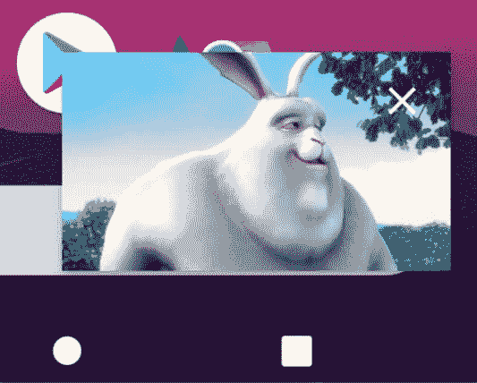
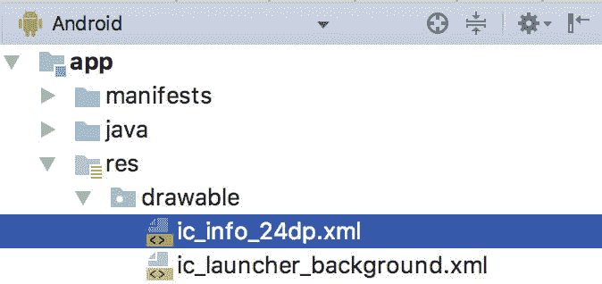
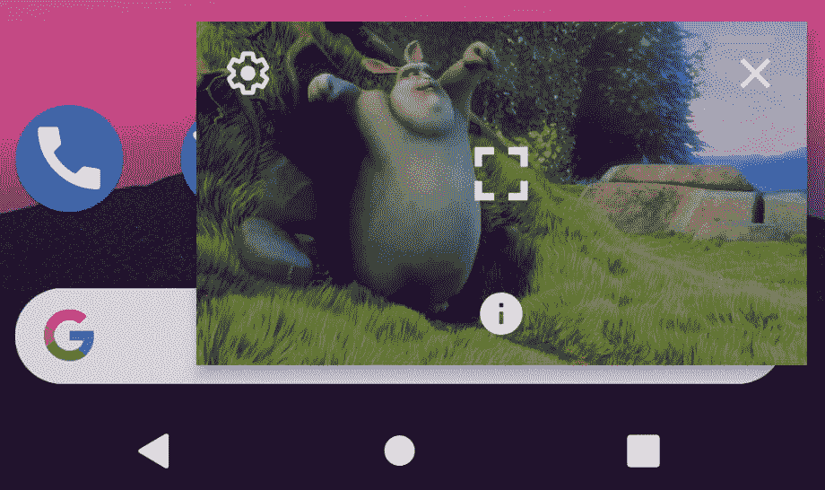
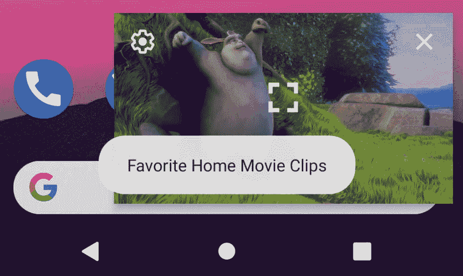

73.一个安卓画中画教程

继前几章之后，本章将采用现有的视频播放器项目，并对其进行增强，以添加画中画支持，包括检测 PiP 模式变化和添加旨在显示当前运行视频信息的 PiP 操作。

73.1 向清单添加画中画支持

向安卓应用程序项目添加 PiP 支持的第一步是在项目清单文件中启用它。打开清单-> AndroidManifest.xml 文件，并修改活动元素以启用 PiP 支持:

```java
.
.
<activity android:name=".MainActivity"
 android:supportsPictureInPicture="true"
 android:configChanges="screenSize|smallestScreenSize|screenLayout|orientation">
    <intent-filter>
        <action android:name="android.intent.action.MAIN" />
        <category android:name="android.intent.category.LAUNCHER" />
    </intent-filter>
</activity>
.
.
```

73.2 添加画中画按钮

按照目前的设计，视频播放器活动的布局仅由一个视频视图实例组成。为了切换到 PiP 模式，现在将在布局中添加一个按钮。将 activity_main.xml 文件加载到布局编辑器中，并将一个 Button 对象从调色板拖到布局上，使其定位如图[图 73-1](#_idTextAnchor1366) 所示:


图 73-1

更改按钮上的文本，使其显示为“进入画中画模式”，并将字符串提取到名为“输入画中画模式”的资源中。在进入下一步之前，请将按钮的标识更改为 pipButton，并将按钮配置为调用名为企业模式的方法。

73.3 进入画中画模式

现在需要将企业模式 onClick 回调方法添加到 MainActivity.java 类文件中。找到此文件，在代码编辑器中打开它，并按如下方式添加此方法:

```java
.
.
import android.view.View;
import android.app.PictureInPictureParams;
import android.util.Rational;
import android.widget.Button;
.
.
public void enterPipMode(View view) {

    Button pipButton = findViewById(R.id.pipButton);

    Rational rational = new Rational(videoView.getWidth(),
            videoView.getHeight());

    PictureInPictureParams params =
            new PictureInPictureParams.Builder()
                    .setAspectRatio(rational)
                    .build();

    pipButton.setVisibility(View.INVISIBLE);
    videoView.setMediaController(null);
    enterPictureInPictureMode(params);
}
```

该方法首先获取对 Button 视图的引用，然后创建一个包含 VideoView 的宽度和高度的 Rational 对象。然后使用 PictureInPictureParams Builder 创建一组画中画参数，通过 Rational 对象作为视频回放的纵横比。由于按钮不需要在视频处于 PiP 模式时可见，因此它是不可见的。视频播放控件也隐藏在视野之外，因此在 PiP 模式下，视频视图将不受阻碍。

在运行 Android 版本 8 或更高版本的设备或模拟器上编译并运行该应用程序，并等待视频播放开始，然后单击 PiP 模式按钮。视频播放应最小化并出现在 PiP 窗口中，如图[图 73-2](#_idTextAnchor1368) :


图 73-2

虽然视频现在在 PiP 窗口播放，但大部分视图都被标准的安卓操作栏遮住了。要删除此内容，需要更改活动的应用程序主题样式。在 Android Studio 中，找到并编辑 app -> res -> values -> themes.xml 文件，并修改 AppTheme 元素以使用 NoActionBar 主题:

```java
<resources xmlns:tools="http://schemas.android.com/tools">
    <!-- Base application theme. -->
    <style name="Theme.VideoPlayer" parent="Theme.MaterialComponents.DayNight.NoActionBar">
        <!-- Primary brand color. -->
        <item name="colorPrimary">@color/purple_500</item>
        <item name="colorPrimaryVariant">@color/purple_700</item>
.
.
```

对 themes.xml (night)资源文件重复此步骤。编译并运行应用程序，将视频播放置于 PiP 模式，并注意操作栏不再出现在窗口中:



图 73-3

在 PiP 窗口中点按，使其大小增加，然后在窗口中心出现的全屏模式标记内点按。尽管活动返回到全屏模式，但请注意按钮和媒体播放控制仍处于隐藏状态。

显然，需要向项目中添加一些代码来检测活动中 PiP 模式何时发生变化。

73.4 检测画中画模式变化

如前一章所述，通过在受影响的活动中重写 onPictureInPictureModeChanged()方法来检测 PiP 模式更改。在这种情况下，需要编写该方法，以便它可以检测活动是进入还是退出 PiP 模式，并采取适当的措施来重新激活 PiP 按钮和回放控件。保留在 MainActivity.java 文件中，现在添加此方法:

```java
@Override
public void onPictureInPictureModeChanged(boolean isInPictureInPictureMode) {
    super.onPictureInPictureModeChanged(isInPictureInPictureMode);

    Button pipButton = findViewById(R.id.pipButton);

    if (isInPictureInPictureMode) {

    } else {
        pipButton.setVisibility(View.VISIBLE);
        videoView.setMediaController(mediaController);
    }
}
```

当调用该方法时，它会被传递一个布尔值，该值指示活动现在是否处于 PiP 模式。上述方法中的代码只是检查该值，以决定是否显示 PiP 按钮并重新激活播放控件。

73.5 添加广播接收器

项目的最后一步是向 PiP 窗口添加一个动作。此操作的目的是显示包含当前正在播放的视频名称的吐司消息。这将需要 PiP 窗口和活动之间的一些通信。实现这一点的最简单的方法之一是在活动中实现一个广播接收器，并使用一个待定的意图从 PiP 窗口向活动广播一条消息。这些步骤需要在每次活动进入 PiP 模式时执行，因此需要将代码添加到 onPictureInPictureModeChanged()方法中。现在找到这个方法，并从添加一些代码来创建意图过滤器和初始化广播接收器开始:

```java
.
.
import android.content.BroadcastReceiver;
import android.content.Context;
import android.content.Intent;
import android.content.IntentFilter;
import android.widget.Toast;
.
.
public class MainActivity extends AppCompatActivity {

    private BroadcastReceiver receiver;
    private VideoView videoView;
    private MediaController mediaController;
    String TAG = "VideoPlayer";
.
.
@Override
    public void onPictureInPictureModeChanged(
                     boolean isInPictureInPictureMode) {
        super.onPictureInPictureModeChanged(isInPictureInPictureMode);

        Button pipButton = findViewById(R.id.pipButton);

        if (isInPictureInPictureMode) {
            IntentFilter filter = new IntentFilter();
            filter.addAction(
              "com.ebookfrenzy.videoplayer.VIDEO_INFO");

            receiver = new BroadcastReceiver() {
                @Override
                public void onReceive(Context context, 
                                          Intent intent) {
                    Toast.makeText(context, 
                     "Favorite Home Movie Clips", 
                            Toast.LENGTH_LONG).show();
                }
            };

            registerReceiver(receiver, filter);

        } else {
            pipButton.setVisibility(View.VISIBLE);
            videoView.setMediaController(mediaController);

            if (receiver != null) {
                unregisterReceiver(receiver);
            }
        }
    }
.
.
}
```

73.6 添加画中画动作

实现广播接收器后，下一步是创建一个 RemoteAction 对象，该对象配置有一个图像来表示 PiP 窗口中的操作。在本例中，将使用名为 ic_info_24dp.xml 的图像图标文件。该文件可以在源代码下载归档文件的 project_icons 文件夹中找到，该文件夹可从以下网址获得:

[https://www . ebookwidge . com/retail/androidstudio 41/index . PHP](https://www.ebookfrenzy.com/retail/androidstudio41/index.php)

找到此图标文件，并将其复制并粘贴到项目工具窗口中的应用程序->资源->可绘制文件夹中:



图 73-4

下一步是创建一个发送给广播接收器的意图。然后，这个意图需要被包装在一个 PendingIntent 对象中，允许稍后当用户点击 PiP 窗口中的操作按钮时触发该意图。

编辑 MainActivity.java 文件，添加创建意图和挂起内容对象的方法，如下所示:

```java
.
.
import android.app.PendingIntent;
.
.
public class MainActivity extends AppCompatActivity {

       private static final int REQUEST_CODE = 101;
.
.
.
       private void createPipAction() {
          Intent actionIntent = 
              new Intent("com.ebookfrenzy.videoplayer.VIDEO_INFO");

          final PendingIntent pendingIntent = 
              PendingIntent.getBroadcast(MainActivity.this,
                REQUEST_CODE, actionIntent, 0);
    }
.
.
}
```

既然已经创建了意图对象和包含它的挂起事件实例，那么需要创建一个远程操作对象，该对象包含出现在 PiP 窗口中的图标和挂起事件对象。保留在 createPipAction()方法中，添加如下代码:

```java
.
.
import android.app.RemoteAction;
import android.graphics.drawable.Icon;

import java.util.ArrayList;
.
.
private void createPipAction() {

    final ArrayList<RemoteAction> actions = new ArrayList<>();

    Intent actionIntent = 
              new Intent("com.ebookfrenzy.videoplayer.VIDEO_INFO");

    final PendingIntent pendingIntent = PendingIntent.getBroadcast(
         MainActivity.this,
            REQUEST_CODE, actionIntent, 0);

    final Icon icon = 
              Icon.createWithResource(MainActivity.this, 
                     R.drawable.ic_info_24dp);
    RemoteAction remoteAction = new RemoteAction(icon, "Info", 
              "Video Info", pendingIntent);

    actions.add(remoteAction);
}
```

现在，需要创建一个包含操作的 PictureInPictureParams 对象，并应用参数，以便操作出现在 PiP 窗口中:

```java
private void createPipAction() {

    final ArrayList<RemoteAction> actions = new ArrayList<>();

    Intent actionIntent = 
              new Intent("com.ebookfrenzy.videoplayer.VIDEO_INFO");

    final PendingIntent pendingIntent = 
       PendingIntent.getBroadcast(MainActivity.this,
            REQUEST_CODE, actionIntent, 0);

    final Icon icon = 
              Icon.createWithResource(MainActivity.this, 
                     R.drawable.ic_info_24dp);
    RemoteAction remoteAction = new RemoteAction(icon, "Info", 
              "Video Info", pendingIntent);

    actions.add(remoteAction);

    PictureInPictureParams params =
                new PictureInPictureParams.Builder()
                        .setActions(actions)
                        .build();

    setPictureInPictureParams(params);
}
```

测试动作之前的最后一项任务是在活动进入 PiP 模式时调用 createPipAction()方法:

```java
@Override
public void onPictureInPictureModeChanged(boolean isInPictureInPictureMode) {
    super.onPictureInPictureModeChanged(isInPictureInPictureMode);
.
.
        registerReceiver(receiver, filter);
        createPipAction();
    } else {
        pipButton.setVisibility(View.VISIBLE);
        videoView.setMediaController(mediaController);
.
.
}
```

73.7 测试画中画动作

再次构建并运行应用程序，并将活动置于 PiP 模式。点击画中画窗口，出现新的动作按钮，如图[图 73-5](#_idTextAnchor1373) :



图 73-5

单击操作按钮，等待显示视频名称的“吐司”消息出现:



图 73-6

73.8 总结

本章演示了在安卓工作室应用程序项目中添加画中画支持，包括启用和进入 PiP 模式以及 PiP 操作的实现。这包括使用广播接收器和待定意图来实现 PiP 窗口和活动之间的通信。