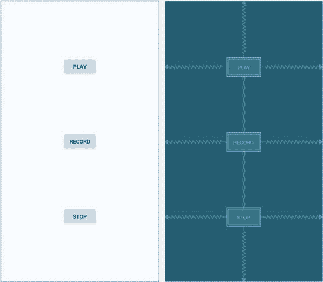

75.使用 MediaPlayer 和 MediaRecorder 录制安卓音频并播放

本章将概述 MediaRecorder 课程，并解释如何使用该课程录制音频或视频的基本知识。还将介绍如何使用 MediaPlayer 类播放音频。学完基础知识后，将创建一个示例应用程序来演示这些技术。除了音频和视频处理，本章还将涉及将文件保存到 SD 卡的主题。

75.1 播放音频

在音频播放方面，安卓的大部分实现都支持 AAC LC/LTP、HE-AACv1 (AAC+)、HE-AACv2(增强 AAC+)、AMR-NB、AMR-WB、MP3、MIDI、Ogg Vorbis、PCM/WAVE 等格式。

音频播放可以使用媒体播放器或音频轨道类来执行。AudioTrack 是一个更高级的选项，它使用流式音频缓冲区，并对音频提供更好的控制。另一方面，MediaPlayer 类为实现音频播放提供了更容易的编程接口，将满足大多数音频需求的需要。

MediaPlayer 类与一系列方法相关联，应用程序可以调用这些方法来执行某些任务。该类的一些关键方法的子集如下:

create()–调用创建类的新实例，传递要播放的音频的 Uri。

设置数据源()–设置播放音频的来源。

准备()–指示播放器准备开始播放。

start()–开始播放。

暂停()–暂停播放。回放可以通过调用 resume()方法来恢复。

stop()–停止播放。

setVolume()–接受两个浮点参数，指定左右声道的播放音量。

resume()–恢复之前暂停的播放会话。

重置()–重置媒体播放器实例的状态。本质上将实例设置回未初始化状态。重置播放器至少需要再次设置数据源并调用 prepare()方法。

release()–当不再需要播放器实例时调用。这种方法确保玩家持有的任何资源都被释放。

在典型的实现中，应用程序将实例化 MediaPlayer 类的一个实例，设置要播放的音频源，然后调用 prepare()后跟 start()。例如:

```java
MediaPlayer mediaPlayer = new MediaPlayer();

mediaPlayer.setDataSource("https://www.yourcompany.com/myaudio.mp3");
mediaPlayer.prepare();
mediaPlayer.start();
```

75.2 使用媒体录制器类录制音频和视频

与音频回放一样，可以使用多种不同的技术进行录制。一种选择是使用 MediaRecorder 类，与 MediaPlayer 类一样，它提供了许多用于录制音频的方法:

设置音频源()–指定要录制的音频源(通常是 MediaRecorder。音频源。设备麦克风的麦克风)。

set video source()–指定要录制的视频的来源(例如 MediaRecorder。视频来源。

setOutputFormat()–指定录制的音频或视频要存储的格式(例如 MediaRecorder)。ADTS)。

设置音频编码器()–指定用于录制音频的音频编码器(例如 MediaRecorder)。音频编码器。

setOutputFile()–配置要存储录制的音频或视频的文件路径。

准备()–准备 MediaRecorder 实例开始录制。

start() -开始录制过程。

stop()–停止录制过程。一旦记录器被停止，它将需要完全重新配置和准备，然后再重新启动。

重置()–重置记录仪。在重新启动之前，需要完全重新配置和准备实例。

release()–应该在不再需要记录器实例时调用。此方法确保释放实例持有的所有资源。

使用此类的典型实现将设置源、输出和编码格式以及输出文件。然后将调用 prepare()和 start()方法。当录制结束时，将调用 stop()方法，然后调用 reset()方法。当应用程序不再需要记录器实例时，建议调用 release()方法:

```java
MediaRecorder mediaRecorder = new MediaRecorder();

mediaRecorder.setAudioSource(MediaRecorder.AudioSource.MIC);
mediaRecorder.setOutputFormat(MediaRecorder.OutputFormat.AAC_ADTS);
mediaRecorder.setAudioEncoder(MediaRecorder.AudioEncoder.AAC);
mediaRecorder.setOutputFile(audioFilePath);

mediaRecorder.prepare();
mediaRecorder.start();
.
.
mediaRecorder.stop();
mediaRecorder.reset();
mediaRecorder.release();
```

为了录制音频，应用程序的清单文件必须包含 Android . permission . record _ AUDIO权限:

```java
<uses-permission android:name="android.permission.RECORD_AUDIO" />
```

正如标题为[“在 Android 中提出运行时权限请求”](74.html#_idTextAnchor1375)的章节中所概述的，对麦克风的访问属于危险权限的范畴。因此，为了支持安卓 6，还必须在应用程序启动时提出特定的麦克风访问请求，其步骤将在本章稍后介绍。

75.3 关于示例项目

本章的剩余部分将通过创建一个示例应用程序来演示如何使用 MediaPlayer 和 MediaRecorder 类在安卓设备上实现音频的录制和回放。

在开发利用特定硬件功能的应用程序时，麦克风就是一个很好的例子，在尝试在应用程序代码中访问该功能之前，检查其可用性非常重要。因此，本章中创建的应用程序还将包括检测设备上麦克风存在的代码。

一旦完成，这个应用程序将提供一个非常简单的界面，允许用户录制和回放音频。录制的音频需要存储在设备的音频文件中。既然如此，本教程也将简要探讨使用 SD 卡存储的机制。

75.4 创建音频应用项目

从欢迎屏幕中选择创建新项目快速启动选项，并在生成的新项目对话框中选择空活动模板，然后单击下一步按钮。

在“名称”字段中输入 audioapp，并将 com .ebook 狂潮. AudioApp 指定为软件包名称。在单击完成按钮之前，将最低应用编程接口级别设置更改为应用编程接口 26:安卓 8.0(奥利奥)，并将语言菜单更改为 Java。

75.5 设计用户界面

创建新项目后，从项目工具窗口中选择 activity_main.xml 文件，并在设计模式下使用布局编辑器工具，选择“Hello World！”文本视图并将其从布局中删除。

将三个按钮视图拖放到布局上。按钮的位置对于这个例子来说并不是最重要的，尽管图 75-1 显示了一个使用 T2 光学链的建议布局。

配置按钮以显示读取播放、录制和停止的字符串资源，并分别给它们播放按钮、录制按钮和停止按钮的视图标识。

选择“播放”按钮，并在“属性”面板中配置 onClick 属性，以便在用户选择时调用名为 playAudio 的方法。重复这些步骤，配置其余按钮分别调用名为 recordAudio 和 stopAudio 的方法。



图 75-1

75.6 检查麦克风的可用性

试图在没有麦克风的设备上录制音频会导致安卓系统抛出异常。因此，在进行这种尝试之前，代码检查麦克风的存在是至关重要的。有许多方法可以做到这一点，包括检查设备的物理存在。一种更简单的方法，也是一种更可能在不同安卓设备上工作的方法，是询问安卓系统是否安装了特定功能的软件包。这包括创建一个 Android PackageManager 类的实例，然后调用对象的 hasSystemFeature()方法。PackageManager。在这种情况下，特征 _ 麦克风是感兴趣的特征。

出于本例的目的，我们将创建一个名为 HasMixel()的方法，可以调用该方法来检查麦克风的存在。在项目工具窗口中，找到并双击 MainActivity.java 文件，并对其进行修改以添加此方法:

```java
package com.ebookfrenzy.audioapp;

import androidx.appcompat.app.AppCompatActivity;

import android.content.pm.PackageManager;
import android.os.Bundle;

public class MainActivity extends AppCompatActivity {

    @Override
    protected void onCreate(Bundle savedInstanceState) {
        super.onCreate(savedInstanceState);
        setContentView(R.layout.activity_audio_app);
    }

    protected boolean hasMicrophone() {
        PackageManager pmanager = this.getPackageManager();
        return pmanager.hasSystemFeature(
                PackageManager.FEATURE_MICROPHONE);
    }
}
```

75.7 执行活动初始化

下一步是修改活动以执行许多初始化任务。保留在 MainActivity.java 文件中，修改代码如下:

```java
package com.ebookfrenzy.audioapp;

import java.io.IOException;
.
.
import android.media.MediaRecorder;
import android.os.Environment;
import android.widget.Button;
import android.view.View;
import android.media.MediaPlayer; 

public class MainActivity extends AppCompatActivity {

    private static MediaRecorder mediaRecorder;
    private static MediaPlayer mediaPlayer;

    private static String audioFilePath;
    private Button stopButton;
    private Button playButton;
    private Button recordButton;

    private boolean isRecording = false;

   @Override
    protected void onCreate(Bundle savedInstanceState) {
        super.onCreate(savedInstanceState);
        setContentView(R.layout.activity_audio_app);
        audioSetup();
    }

    private void audioSetup()
    {
        recordButton = findViewById(R.id.recordButton);
        playButton = findViewById(R.id.playButton);
        stopButton = findViewById(R.id.stopButton);

        if (!hasMicrophone())
        {
            stopButton.setEnabled(false);
            playButton.setEnabled(false);
            recordButton.setEnabled(false);
        } else {
            playButton.setEnabled(false);
            stopButton.setEnabled(false);
        }

        audioFilePath = 
                 this.getExternalFilesDir(Environment.DIRECTORY_MUSIC).           
                                       getAbsolutePath() + "/myaudio.3gp";
    }
.
.
}
```

添加的代码从获取对用户界面中三个按钮视图的引用开始。接下来，调用之前实现的 hasMixel()方法来确定设备是否包含麦克风。如果没有，则禁用所有按钮，否则仅禁用停止和播放按钮。

下一行代码需要更多的解释:

```java
audioFilePath = this.getExternalFilesDir(Environment.DIRECTORY_MUSIC).getAbsolutePath() + "/myaudio.3gp";
```

此代码的目的是识别设备上的外部存储器(即使它在许多安卓设备上位于设备内部，也称为外部存储器)的位置，并使用该位置创建一个名为 myaudio.3gp 的文件路径，音频记录将存储在该文件中。getExternalFilesDir()方法将所需的存储类型作为参数(在这种情况下，我们请求音乐目录的路径，尽管播客、有声读物、电影、图片等也有选项)。

使用外部存储时，请务必注意，应用程序的此类活动需要在应用程序清单文件中请求权限。例如:

```java
<uses-permission android:name="android.permission.WRITE_EXTERNAL_STORAGE" />
```

75.8 实施录音音频()方法

当用户触摸录制按钮时，将调用 recordAudio()方法。此方法需要启用和禁用适当的按钮，并使用有关音频源、输出格式和编码以及音频要存储到的文件位置的信息来配置 MediaRecorder 实例。最后，需要调用 MediaRecorder 对象的 prepare()和 start()方法。综合起来，这些要求导致了 MainActivity.java 文件中的以下方法实现:

```java
public void recordAudio (View view)
{
   isRecording = true;
   stopButton.setEnabled(true);
   playButton.setEnabled(false);
   recordButton.setEnabled(false);

   try {
     mediaRecorder = new MediaRecorder();
     mediaRecorder.setAudioSource(MediaRecorder.AudioSource.MIC);
     mediaRecorder.setOutputFormat(
          MediaRecorder.OutputFormat.THREE_GPP);
     mediaRecorder.setOutputFile(audioFilePath);
     mediaRecorder.setAudioEncoder(MediaRecorder.AudioEncoder.AMR_NB);
     mediaRecorder.prepare();
   } catch (Exception e) {
          e.printStackTrace();
   }
   mediaRecorder.start();
}
```

75.9 实施停止音频()方法

stopAudio()方法负责启用“播放”按钮，禁用“停止”按钮，然后停止并重置 MediaRecorder 实例。实现这一点的代码如下表所示，应该添加到 MainActivity.java 文件中:

```java
public void stopAudio (View view)
{

       stopButton.setEnabled(false);
       playButton.setEnabled(true);

       if (isRecording)
       {       
              recordButton.setEnabled(false);
              mediaRecorder.stop();
              mediaRecorder.release();
              mediaRecorder = null;
              isRecording = false;
       } else {
              mediaPlayer.release();
               mediaPlayer = null;
              recordButton.setEnabled(true);
       }
}
```

75.10 实现播放音频()方法

playAudio()方法将简单地创建一个新的 MediaPlayer 实例，将位于 SD 卡上的音频文件指定为数据源，然后准备并开始播放:

```java
public void playAudio (View view) throws IOException
{
       playButton.setEnabled(false);
       recordButton.setEnabled(false);
       stopButton.setEnabled(true);

       mediaPlayer = new MediaPlayer();
       mediaPlayer.setDataSource(audioFilePath);
       mediaPlayer.prepare();
       mediaPlayer.start();
}
```

75.11 配置和请求权限

在测试应用程序之前，必须在应用程序的清单文件中请求适当的权限。具体来说，该应用程序将需要录制音频和访问外部存储(SD 卡)的许可。在项目工具窗口中，找到并双击 AndroidManifest.xml 文件，将其加载到编辑器中，并修改 xml 以添加两个权限标签:

```java
<?xml version="1.0" encoding="utf-8"?>
<manifest xmlns:android="http://schemas.android.com/apk/res/android"
    package="com.ebookfrenzy.audioapp" >

    <uses-permission android:name=
                 "android.permission.WRITE_EXTERNAL_STORAGE" />
    <uses-permission android:name="android.permission.RECORD_AUDIO" />

    <application
.
.
```

上述步骤将足以确保当应用程序安装在运行安卓 6.0 之前版本的设备上时，用户能够启用这些权限。在安卓系统中，麦克风和外部存储访问都被归类为危险权限，因为它们可能会危及用户的隐私。因此，为了让示例应用在 Android 6 或更高版本的设备上运行，需要添加代码，以便在应用运行时专门请求这两个权限。

编辑 MainActivity.java 文件，并从添加一些额外的导入指令和常量开始，作为所请求权限的请求识别码:

```java
.
.
import androidx.core.app.ActivityCompat;
import androidx.core.content.ContextCompat;
import android.widget.Toast;
import android.Manifest;
.
.
public class MainActivity extends AppCompatActivity {

    private static final int RECORD_REQUEST_CODE = 101;
    private static final int STORAGE_REQUEST_CODE = 102;
.
.
```

接下来，需要向类中添加一个方法，其目的是将请求的权限和相应的请求识别码作为参数。保留 MainActivity.java 类文件，按如下方式实现此方法:

```java
protected void requestPermission(String permissionType, int requestCode) {
    int permission = ContextCompat.checkSelfPermission(this,
                permissionType);

    if (permission != PackageManager.PERMISSION_GRANTED) {
        ActivityCompat.requestPermissions(this,
                new String[]{permissionType}, requestCode
        );
    }
}
```

使用本书[“在 Android 中提出运行时权限请求”](74.html#_idTextAnchor1375)一章中概述的步骤，上述方法在提出请求之前验证指定的权限尚未被授予，通过识别码作为参数。

处理完请求后，将在活动上调用 onRequestPermissionsResult()方法，传递请求的识别码和结果。因此，下一步是在 MainActivity.java 文件中实现此方法，如下所示:

```java
@Override
public void onRequestPermissionsResult(int requestCode,
                        String permissions[], int[] grantResults) {
    switch (requestCode) {
        case RECORD_REQUEST_CODE: {

            if (grantResults.length == 0
                 || grantResults[0] != 
                     PackageManager.PERMISSION_GRANTED) {

                recordButton.setEnabled(false);

                Toast.makeText(this, 
                     "Record permission required", 
                            Toast.LENGTH_LONG).show();
            } else {
                requestPermission(
                     Manifest.permission.WRITE_EXTERNAL_STORAGE,
                        STORAGE_REQUEST_CODE);
            }
            return;
        }
        case STORAGE_REQUEST_CODE: {

            if (grantResults.length == 0
                    || grantResults[0] != 
                     PackageManager.PERMISSION_GRANTED) {
                recordButton.setEnabled(false);
                Toast.makeText(this, 
                     "External Storage permission required", 
                     Toast.LENGTH_LONG).show();
            }
        }
    }
}
```

上述代码在检查相应的许可是否被授予之前，检查请求标识符代码以识别哪个许可请求已经返回。如果用户授予访问麦克风的权限，则代码继续请求访问外部存储器。如果任一权限被拒绝，将向用户显示一条消息，指示应用程序将无法运行。在这两种情况下，记录按钮也被禁用。

测试应用程序之前剩下的就是在应用程序启动时调用新添加的 requestPermission()方法来访问麦克风。保留在 MainActivity.java 文件中，按如下方式修改音频设置()方法:

```java
private void audioSetup(){
    recordButton = findViewById(R.id.recordButton);
    playButton = findViewById(R.id.playButton);
    stopButton = findViewById(R.id.stopButton);

    if (!hasMicrophone())
    {
        stopButton.setEnabled(false);
        playButton.setEnabled(false);
        recordButton.setEnabled(false);
    } else {
        playButton.setEnabled(false);
        stopButton.setEnabled(false);
    }

    audioFilePath =
            Environment.getExternalStorageDirectory()
              .getAbsolutePath()
                    + "/myaudio.3gp";

    requestPermission(Manifest.permission.RECORD_AUDIO,
            RECORD_REQUEST_CODE);
}
```

75.12 测试应用

在包含麦克风的安卓设备上编译并运行该应用程序，允许请求的权限并触摸录制按钮。录制后，触摸停止，然后触摸播放，此时录制的音频将通过设备扬声器播放。如果在安卓 6.0 或更高版本上运行，请注意，该应用程序在首次启动时会请求使用外部存储和录制音频的许可。

75.13 总结

安卓软件开发工具包提供了许多实现音频录制和回放的机制。本章以媒体播放器和媒体记录器类的形式介绍了其中的两个。在介绍了使用这些技术的理论之后，本章通过创建一个示例应用程序来记录和回放音频。在安卓系统中使用音频的过程中，本章还研究了在尝试录制音频之前确保运行应用程序的设备有麦克风的步骤。还涵盖了 SD 卡形式的外部存储的使用。