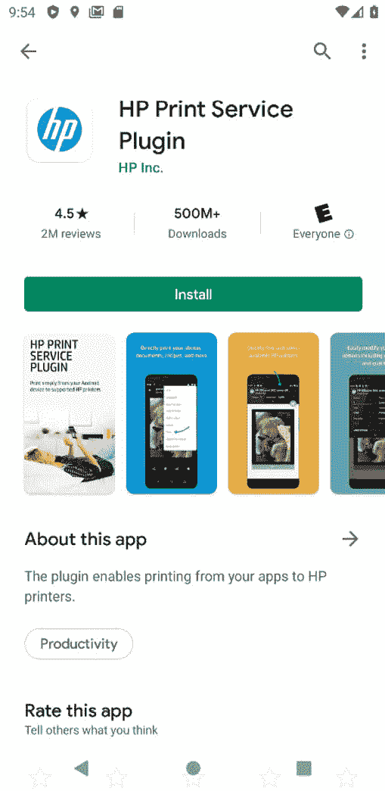
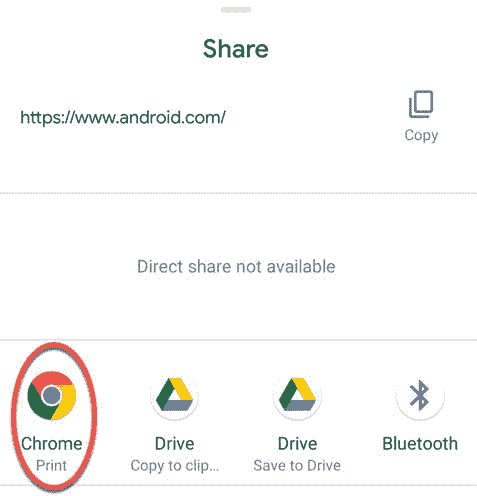
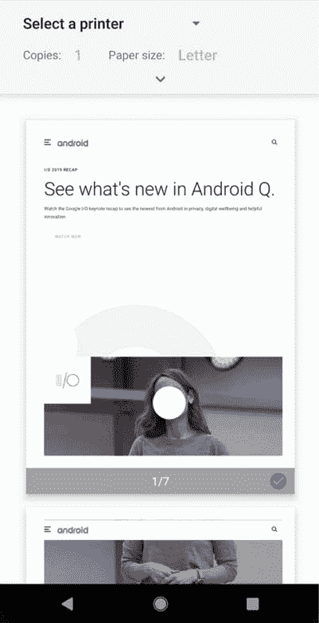
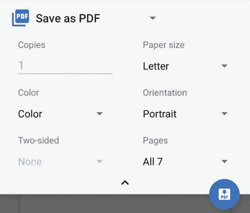

77\. 用安卓打印框架打印

随着安卓 4.4 KitKat 版本的推出，从安卓应用中打印内容成为可能。虽然后续章节将更详细地探讨为您自己的应用添加打印支持的选项，但本章将重点介绍 Android 中现在可用的各种打印选项以及启用这些选项所涉及的步骤。在介绍了这些初始主题之后，本章将概述安卓开发人员在将打印支持构建到应用中时可以使用的各种打印功能。

77.1 安卓打印架构

安卓系统的打印是由 Printing 框架提供的。基本来说，这个框架由一个打印管理器和多个打印服务插件组成。打印管理器负责处理来自设备上应用的打印请求，并与设备上安装的打印服务插件进行交互，从而确保打印请求得到满足。默认情况下，许多安卓设备安装了打印服务插件，可以使用谷歌云打印和谷歌驱动服务进行打印。其他打印机类型的打印服务插件，如果尚未安装，也可以从谷歌游戏商店获得。打印服务插件目前可用于惠普、爱普生、三星和佳能打印机，其他打印机制造商的插件很可能在未来发布，尽管谷歌云打印服务插件也可用于从安卓设备打印到几乎任何打印机类型和型号。在本书中，我们将使用惠普打印服务插件作为参考示例。

77.2 打印服务插件

打印服务插件的目的是使应用能够通过局域网或蓝牙打印到安卓设备可见的兼容打印机上。

安卓设备上打印服务插件的存在可以通过加载谷歌播放应用并搜索“打印服务插件”来验证。一旦插件在播放列表中列出，如果插件还没有安装，可以通过选择安装按钮来安装。[例如，图 77-1](#_idTextAnchor1439) 显示了谷歌 Play 内的惠普打印服务插件。

打印服务插件将自动检测安卓设备当前连接的网络上的兼容打印机，并在从应用打印时将其列为选项。



图 77-1

77.3 谷歌云打印

谷歌云打印是谷歌提供的一项服务，通过互联网连接，您可以从任何地方通过网络将内容打印到自己的打印机上。谷歌云打印以云就绪和经典打印机的形式支持多种设备和打印机型号。云就绪打印机内置技术，支持通过网络打印。提供云就绪打印机的制造商包括 Brother、佳能、戴尔、爱普生、惠普、柯达和三星。要确定您的打印机是否已云就绪并受谷歌云打印支持，请查看以下网址的打印机列表:

[https://www.google.com/cloudprint/learn/printers.html](https://www.google.com/cloudprint/learn/printers.html)

对于经典的非云就绪打印机，谷歌云打印通过在经典打印机连接的计算机系统上安装软件(直接或通过家庭或办公室网络)来支持云打印。

要设置谷歌云打印，请访问以下网页，并使用登录安卓设备时使用的相同谷歌帐户标识登录:

[https://www.google.com/cloudprint/learn/index.html](https://www.google.com/cloudprint/learn/index.html)

一旦打印机被添加到您的谷歌云打印帐户，当您在设备上的安卓应用中打印时，它们将被列为打印机目标选项。

77.4 打印到谷歌驱动

除了支持物理打印机，还可以将打印输出保存到您的谷歌驱动帐户。从设备打印时，选择打印面板中的保存到谷歌驱动器选项。然后，要打印的内容将被转换为 PDF 文件，并保存到与设备上当前活动的谷歌帐户标识相关联的基于谷歌驱动云的存储中。

77.5 另存为 PDF

安卓提供的最终打印选项允许打印的内容在本地保存为安卓设备上的 PDF 文件。选择后，该选项将请求 PDF 文件的名称和设备上保存文档的位置。

在测试自己的安卓应用的打印功能时，另存为 PDF 和谷歌驱动选项在节省纸张方面都非常宝贵。

77.6 从安卓设备打印

谷歌建议能够打印内容的应用将打印选项放在溢出菜单中(这个主题在名为[“在安卓系统上创建和管理溢出菜单”](42.html#_idTextAnchor830)的章节中有详细介绍)。许多与安卓捆绑在一起的应用现在都包含“打印...”菜单选项。[例如，图 77-2](#_idTextAnchor1445) 显示了通过选择 Chrome 浏览器应用的溢出菜单中的“共享...”选项访问的打印选项:



图 77-2

从应用中选择打印选项后，将出现标准的安卓打印屏幕，显示要打印的内容预览，如图[图 77-3](#_idTextAnchor1447) : 所示



图 77-3

点击屏幕顶部的面板将显示全部打印选项:



图 77-4

安卓打印面板提供常用的打印选项，如纸张大小、颜色、方向和份数。点击当前打印机或 PDF 输出选项，可以访问其他打印目的地选项。

77.7 在安卓应用中构建打印支持的选项

打印框架提供了许多选项，将打印支持纳入安卓应用。这些选项可以分类如下:

77.7.1 图像打印

顾名思义，该选项允许将图像打印纳入安卓应用。向应用添加此功能时，第一步是创建 PrintHelper 类的新实例:

```java
PrintHelper imagePrinter = new PrintHelper(context);
```

接下来，可以通过调用 PrintHelper 实例的 setScaleMode()方法来指定打印图像的缩放模式。选项如下:

缩放 _ 模式 _ 适合–图像将被缩放以适合纸张大小，而不会进行任何裁剪或改变纵横比。这通常会导致一维出现空白。

SCALE _ MODE _ FILL–图像将被缩放以填充纸张尺寸，并在必要时进行裁剪，以避免打印输出中出现空白。

在没有比例模式设置的情况下，系统将默认为比例模式填充。例如，下面的代码在先前声明的 PrintHelper 实例上设置缩放以适应模式:

```java
imagePrinter.setScaleMode(PrintHelper.SCALE_MODE_FIT);
```

类似地，颜色模式也可以被配置为指示打印输出是彩色的还是黑白的。这是通过将下列选项之一传递给 PrintHelper 实例的 setColorMode()方法来实现的:

颜色 _ 模式 _ 颜色–表示图像将以彩色打印。

颜色 _ 模式 _ 单色–表示图像将以黑白打印。

打印框架将默认为彩色打印，除非单色选项指定如下:

```java
imagePrinter.setColorMode(PrintHelper.COLOR_MODE_MONOCHROME);
```

完成打印操作所需的只是一个要打印的图像和对 PrintHelper 实例的 printBitmap()方法的调用，传递一个表示要分配给打印作业的名称的字符串和一个对图像的引用(以位图对象或对图像的 Uri 引用的形式):

```java
Bitmap bitmap = BitmapFactory.decodeResource(getResources(),
            R.drawable.oceanscene);
imagePrinter.printBitmap("My Test Print Job", bitmap);
```

一旦打印作业开始，打印框架将显示打印对话框，并处理与用户的后续交互以及在用户选择的打印目的地打印图像。

77.7.2 创建和打印 HTML 内容

安卓打印框架还提供了一种从应用中打印基于 HTML 的内容的简单方法。这些内容可以是网站上托管的网页的网址引用的 HTML 内容，也可以是在应用中动态创建的 HTML 内容。

为了支持 HTML 打印，WebView 类已经被扩展，以包含对最低编码要求的打印支持。

当动态创建 HTML 内容时(与加载和打印现有网页相反)，该过程涉及创建一个网络视图对象，并将其与网络视图客户端实例相关联。然后，网络视图客户端被配置为在完成将 HTML 加载到网络视图时开始打印作业。配置好网络视图客户端后，将 HTML 加载到网络视图中，此时将触发打印过程。

例如，考虑以下代码:

```java
public void printContent()
{
       WebView webView = new WebView(this);
       webView.setWebViewClient(new WebViewClient() {

            public boolean shouldOverrideUrlLoading(WebView view, 
                      String url) 
            {
                   return false;
            }

            @Override
                public void onPageFinished(WebView view, String url) {
                       createWebPrintJob(view);
                       myWebView = null;
                   }
           });

           String htmlDocument = 
                "<html><body><h1>Android Print Test</h1><p>" 
               + "This is some sample content.</p></body></html>";

           webView.loadDataWithBaseURL(null, htmlDocument, 
                     "text/HTML", "UTF-8", null);

           myWebView = webView;
}
```

此方法中的代码首先声明一个名为 myWebView 的变量，该变量将存储对在方法中创建的 WebView 实例的引用。在 printContent()方法中，创建了一个 WebView 类的实例，然后将一个 WebViewClient 实例分配给该实例。

分配给 web 视图对象的 web viewClient 被配置为指示 HTML 内容的加载将由 WebView 实例处理(通过从 shouldOverrideUrlLoading()方法返回 false)。更重要的是，声明并实现了一个 onPageFinished()处理程序方法来调用名为 createWebPrintJob()的方法。当所有的 HTML 内容都加载到 web 视图中时，将自动调用 onPageFinished()回调方法。这确保了在内容准备好之前不会开始打印作业，从而确保所有内容都被打印。

接下来，创建一个包含一些 HTML 作为内容的字符串。然后将其加载到 web 视图中。一旦加载了 HTML，onPageFinished()方法就会触发。最后，该方法存储对 web 视图对象的引用。如果没有这一重要步骤，Java 运行时系统将会认为应用不再需要 web 视图对象，并将丢弃它以释放内存(在 Java 术语中这一概念被称为垃圾收集)，从而导致打印作业在完成之前终止，这是一个很大的风险。

这个例子中剩下的就是如下实现 createWebPrintJob()方法:

```java
private void createWebPrintJob(WebView webView) {

       PrintManager printManager = (PrintManager) this
                   .getSystemService(Context.PRINT_SERVICE);

       PrintDocumentAdapter printAdapter = 
                    webView.createPrintDocumentAdapter("MyDocument");
       String jobName = getString(R.string.app_name) + " Document";

       PrintJob printJob = printManager.print(jobName, printAdapter,
                   new PrintAttributes.Builder().build());
}
```

这个方法只是获取对 PrintManager 服务的引用，并指示 web 视图实例创建一个打印适配器。创建一个新的字符串来存储打印作业的名称(在本例中是基于应用的名称和单词“Document”)。

最后，通过调用打印管理器的 print()方法启动打印作业，传递作业名称、打印适配器和一组默认打印属性。如果需要，可以自定义打印属性，以指定分辨率(每英寸点数)、边距和颜色选项。

77.7.3 打印网页

打印网页所涉及的步骤与上面概述的步骤类似，不同的是，网页视图被传递要打印的网页的 URL，而不是动态创建的 HTML，例如:

```java
myWebView.loadUrl("https://developer.android.com/google/index.html");
```

还需要注意的是，只有当网页一加载就自动打印时，网络视图客户端配置才是必需的。如果用户在页面加载后选择菜单选项来启动打印，则应用代码中只需要包含上面概述的 createWebPrintJob()方法中的代码。下一章名为[“一个安卓 HTML 和网页内容打印示例”](78.html#_idTextAnchor1454)，将演示这样一个场景。

77.7.4 打印自定义文档

虽然打印框架引入的 HTML 和 web 打印功能提供了从安卓应用中打印内容的简单途径，但很明显，这些选项对于更高级的打印要求来说过于简单。对于更复杂的打印任务，打印框架还提供自定义文档打印支持。这允许将文本和图形形式的内容绘制到画布上，然后打印出来。

与相对容易实现的 HTML 和图像打印不同，定制文档打印是一个更复杂的多阶段过程，这将在本书的[“安卓定制文档打印指南”](79.html#_idTextAnchor1472)一章中概述。这些步骤可以总结如下:

连接到安卓打印管理器

从打印文档适配器类创建自定义打印适配器子类

创建一个 pdf 文档实例来表示文档页面

获取对 PdfDocument 实例页面的引用，每个页面都与一个 Canvas 实例相关联

在页面画布上绘制内容

通知打印框架文档可以打印了

上述步骤中概述的定制打印适配器需要实现安卓系统调用的多种方法，以在打印过程中执行特定任务。其中最重要的是 onLayout()方法，该方法负责根据用户更改的设置(如纸张大小或页面方向)重新安排文档布局，以及 onWrite()方法，该方法负责呈现要打印的页面。本主题将在标题为[“安卓定制文档打印指南”](79.html#_idTextAnchor1472)的章节中详细介绍。

77.8 总结

安卓软件开发工具包包括从运行的应用中打印内容的能力。打印输出可以定向到适当配置的打印机，本地 PDF 文件或通过谷歌驱动云。从安卓应用开发人员的角度来看，这些功能可以通过使用打印框架在应用中使用。到目前为止，最容易实现的打印选项是那些以图像和 HTML 形式包含内容的选项。然而，可以使用框架的定制文档打印特性来实现更高级的打印。