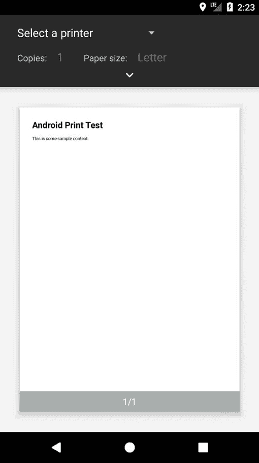
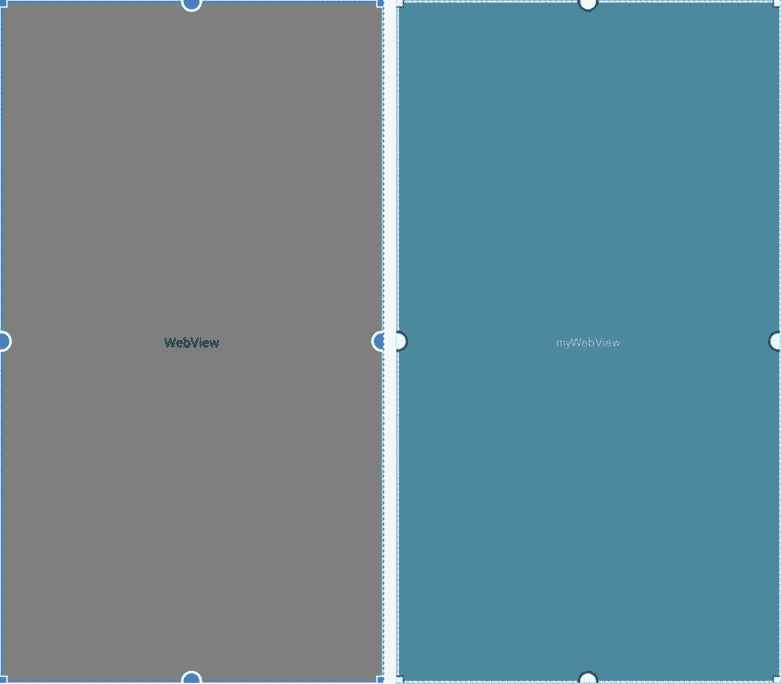

# 七十八、安卓 HTML 和网页内容打印示例

如前一章[“使用安卓打印框架打印”](77.html#_idTextAnchor1435)所述，安卓打印框架可用于打印网页和动态创建的 HTML 内容。虽然这两种打印方法有很多相似之处，但也有一些细微的差异需要考虑。本章将通过创建两个示例应用来阐明这两个打印选项。

78.1 创建 HTML 打印示例应用

从欢迎屏幕中选择创建新项目快速启动选项，并在生成的新项目对话框中选择空活动模板，然后单击下一步按钮。

在“名称”字段中输入 HTMLPrint，并将 com . ebookwidge . HTMl print 指定为包名。在单击完成按钮之前，将最低 API 级别设置更改为 API 26:安卓 8.0(奥利奥)，并将语言菜单更改为 Java。

78.2 打印动态 HTML 内容

本教程的第一阶段是向项目中添加代码，以创建一些 HTML 内容，并以打印作业的形式将其发送到 Printing 框架。

首先找到 MainActivity.java 文件(位于 app-> Java-> com . ebookwidge . html print 下的项目工具窗口中)，并将其加载到编辑面板中。加载后，修改代码，使其如下列表所示:

```java
package com.ebookfrenzy.htmlprint;

import androidx.appcompat.app.AppCompatActivity;
import android.os.Bundle;
import android.webkit.WebView;
import android.webkit.WebViewClient;
import android.webkit.WebResourceRequest;
import android.print.PrintAttributes;
import android.print.PrintDocumentAdapter;
import android.print.PrintManager;
import android.content.Context;

public class MainActivity extends AppCompatActivity {

   private WebView myWebView;

   @Override
    protected void onCreate(Bundle savedInstanceState) {
        super.onCreate(savedInstanceState);
        setContentView(R.layout.activity_htmlprint);

        printWebView();
    }

    private void printWebView() {

        WebView webView = new WebView(this);
        webView.setWebViewClient(new WebViewClient() { 
            public boolean shouldOverrideUrlLoading(WebView view,
                                  WebResourceRequest request)
            {
                return false;
            }

            @Override
            public void onPageFinished(WebView view, String url)
            {
                createWebPrintJob(view);
                myWebView = null;
            }
        }); 
        String htmlDocument =
           "<html><body><h1>Android Print Test</h1><p>"
             + "This is some sample content.</p></body></html>";

        webView.loadDataWithBaseURL(null, htmlDocument,
                "text/HTML", "UTF-8", null);
        myWebView = webView;
    }
}
```

代码更改从声明一个名为“我的网络视图”的变量开始，该变量将存储对用于打印操作的网络视图实例的引用。在 onCreate()方法中，创建了一个网络视图类的实例，然后将一个网络视图客户端实例分配给该实例。

分配给网络视图对象的网络视图客户端被配置为指示由网络视图实例处理 HTML 内容的加载(通过从 shouldOverrideUrlLoading()方法返回 false)。更重要的是，声明并实现了一个 onPageFinished()处理程序方法来调用名为 createWebPrintJob()的方法。当所有的 HTML 内容都加载到 web 视图中时，将自动调用 onPageFinished()方法。如前一章所述，当打印动态创建的 HTML 内容时，这一步是必要的，以确保打印作业在内容完全加载到网络视图之前不会启动。

接下来，创建一个包含一些 HTML 的字符串对象作为内容，并随后加载到 web 视图中。一旦加载了 HTML，就会触发 onPageFinished()回调方法。最后，该方法将对 web 视图对象的引用存储在先前声明的 myWebView 变量中。如果没有这一重要步骤，Java 运行时系统将会认为应用不再需要 web 视图对象，并会将其丢弃以释放内存，从而导致打印作业在完成之前终止，这是一个很大的风险。

此示例中剩下的就是实现 createWebPrintJob()方法，该方法当前被配置为由 onPageFinished()回调方法调用。因此，在 MainActivity.java 文件中，实现此方法，使其如下所示:

```java
private void createWebPrintJob(WebView webView) {

       PrintManager printManager = (PrintManager) this
                .getSystemService(Context.PRINT_SERVICE);
```

```java
       PrintDocumentAdapter printAdapter = 
                webView.createPrintDocumentAdapter("MyDocument");

       String jobName = getString(R.string.app_name) + " Print Test";

       printManager.print(jobName, printAdapter,
                 new PrintAttributes.Builder().build());
}
```

该方法获取对 PrintManager 服务的引用，并指示 web 视图实例创建一个打印适配器。创建一个新的字符串来存储打印作业的名称(在这种情况下基于应用的名称和单词“打印测试”)。

最后，通过调用打印管理器的 print()方法启动打印作业，传递作业名称、打印适配器和一组默认打印属性。

在运行 Android 5.0 或更高版本的设备或模拟器上编译并运行应用。一旦启动，标准安卓打印页面应该会出现，如图[图 78-1](#_idTextAnchor1459) 所示。



图 78-1

打印到物理打印机(如果您配置了物理打印机)，保存到谷歌驱动器，或者选择保存到 PDF 文件的选项。打印作业启动后，检查您选择的目标上生成的输出。请注意，当使用“保存到 PDF”选项时，系统会要求输入 PDF 文件的名称和位置。下载文件夹是一个很好的选择，可以通过选择设备上其他应用图标中的下载图标(在安卓 8 上重命名为文件)来查看其内容。

78.3 创建网页打印示例

本章中要创建的第二个示例应用将为用户提供一个“溢出”菜单选项，以打印当前在 WebView 实例中显示的网页。

从欢迎屏幕中选择创建新项目快速启动选项，并在生成的新项目对话框中选择基本活动模板，然后单击下一步按钮。

在名称字段中输入网络打印，并指定 com . ebookwidue . web print 作为包名。在单击完成按钮之前，将最低 API 级别设置更改为 API 26:安卓 8.0(奥利奥)，并将语言菜单更改为 Java。

78.4 移除浮动动作按钮

选择基本活动模板提供了上下文菜单和浮动操作按钮。由于应用不需要浮动操作按钮，因此可以在继续之前将其移除。将 activity_main.xml 布局文件加载到布局编辑器中，选择浮动操作按钮，然后点击键盘上的 Delete 键从布局中移除对象。编辑 MainActivity.java 文件，并从 onCreate 方法中删除浮动操作按钮代码，如下所示:

```java
@Override
protected void onCreate(Bundle savedInstanceState) {
    super.onCreate(savedInstanceState);
    setContentView(R.layout.activity_web_print);
    Toolbar toolbar = findViewById(R.id.toolbar);
    setSupportActionBar(toolbar);

    FloatingActionButton fab = 
        findViewById(R.id.fab);
    fab.setOnClickListener(new View.OnClickListener() {
        @Override
        public void onClick(View view) {
            Snackbar.make(view, "Replace with your own action", 
                      Snackbar.LENGTH_LONG)
                        .setAction("Action", null).show();
        }
    });
}
```

78.5 移除导航功能

如[“AndroidStudio 布局编辑器工具指南”](78.html)所述，基本活动模板包含多个片段和按钮，用于从一个片段导航到另一个片段。就本教程而言，这些功能是不必要的，如果不删除，将在以后引起问题。在继续学习教程之前，请按如下方式修改项目:

1.在项目工具窗口中，导航并双击 app-> RES-> navigation-> nav _ graph . XML 文件，将其加载到导航编辑器中。

2.在编辑器中，选择“组件树”面板中的第二个片段条目，并点击键盘上的删除键将其从图表中删除。

3.找到并删除 SecondFragment.java(app-> Java->第二片段)和片段 _ 秒. xml (app -> res ->布局->片段 _ 秒. xml)文件。

4.最后一个任务是从 FirstFragment 类中移除一些代码，这样当单击按钮时，按钮视图就不再导航到现在不存在的第二个片段。找到 FirstFragment.java 文件，双击它将其加载到编辑器中，并从 onViewCreated()方法中删除代码，使其如下所示:

```java
public void onViewCreated(@NonNull View view, Bundle savedInstanceState) {
    super.onViewCreated(view, savedInstanceState);

    view.findViewById(R.id.button_first).setOnClickListener(new View.OnClickListener() {
        @Override
        public void onClick(View view) {
            NavHostFragment.findNavController(FirstFragment.this)
                    .navigate(R.id.action_FirstFragment_to_SecondFragment);
        }
    });
}
```

78.6 设计用户界面布局

如果尚未加载，请将 fragment_first.xml 布局资源文件加载到布局编辑器工具中，并在设计模式下选择和删除文本视图和按钮对象。从组件面板的小部件部分，将一个网络视图对象拖放到设备屏幕布局的中心。单击推断约束工具栏按钮，并使用属性工具窗口，更改 WebView 的 layout_width 和 layout_height 属性以匹配约束，使其填充整个布局画布，如图 78-2 : 所示



图 78-2

选择新添加的网络视图实例，并将视图的标识更改为我的网络视图。

在继续本教程的下一步之前，需要向项目添加额外的权限，以使网络视图对象能够访问互联网并下载网页进行打印。通过在“项目”工具窗口中找到 AndroidManifest.xml 文件并双击它将其加载到编辑面板中来添加此权限。加载后，编辑 XML 内容以添加适当的权限行，如下列表所示:

```java
<?xml version="1.0" encoding="utf-8"?>
<manifest xmlns:android="http://schemas.android.com/apk/res/android"
    package="com.ebookfrenzy.webprint" >

    <uses-permission android:name="android.permission.INTERNET" />

    <application
        android:allowBackup="true"
.
.
</manifest>
```

78.7 将网页载入网络视图

在打印网页之前，需要将其加载到 WebView 实例中。出于本教程的目的，这将通过调用网络视图实例的 loadUrl()方法来执行，该方法将放在名为 configureWebView()的方法中，并从 MainActivity 类的 onStart()方法中调用。因此，请编辑 MainActivity.java 文件，并对其进行如下修改:

```java
package com.ebookfrenzy.webprint;

import android.os.Bundle;

import androidx.appcompat.app.AppCompatActivity;
import androidx.appcompat.widget.Toolbar;

import android.view.Menu;
import android.view.MenuItem;
import android.webkit.WebView;
import android.webkit.WebViewClient;
import android.webkit.WebResourceRequest;

public class MainActivity extends AppCompatActivity {

    private WebView myWebView;
.
.
   @Override
    protected void onStart() {
        super.onStart();
        configureWebView();
    }

    private void configureWebView() {

        myWebView = findViewById(R.id.myWebView);
        myWebView.setWebViewClient(new WebViewClient(){
            @Override
            public boolean shouldOverrideUrlLoading(
                    WebView view, WebResourceRequest request) {
                return super.shouldOverrideUrlLoading(
                        view, request);
            }
        });
        myWebView.loadUrl(
                "https://developer.android.com/google/index.html"); 
    }
.
.
}
```

78.8 添加打印菜单选项

打印网页的选项现在将被添加到溢出菜单中，使用的技术在标题为[“在 Android 上创建和管理溢出菜单”](42.html#_idTextAnchor830)的章节中进行了概述。第一个需求是用来标记菜单选项的字符串资源。在项目工具窗口中，找到应用->RES->values->strings . XML 文件，双击该文件将其加载到编辑器中，并对其进行修改以添加新的字符串资源:

```java
<resources>
    <string name="app_name">WebPrint</string>
    <string name="action_settings">Settings</string>
    <string name="print_string">Print</string>
.
.
</resources>
```

接下来，将 app -> res -> menu -> menu_main.xml 文件加载到菜单编辑器中，切换到代码模式，并将设置菜单选项替换为打印选项:

```java
<menu xmlns:android="http://schemas.android.com/apk/res/android"
    xmlns:tools="http://schemas.android.com/tools"
    tools:context="com.ebookfrenzy.webprint.MainActivity" >
    <item android:id="@+id/action_settings"
        android:title="@string/action_settings"
        android:orderInCategory="100"
        app:showAsAction="never" />

    <item
        android:id="@+id/action_print"
        android:orderInCategory="100"
        app:showAsAction="never"         
        android:title="@string/print_string"/>
</menu>
```

就配置菜单选项而言，剩下的就是修改 MainActivity.java 文件中的 onOptionsItemSelected()处理程序方法:

```java
@Override
public boolean onOptionsItemSelected(MenuItem item) {
    int id = item.getItemId();
    if (id == R.id.action_print) {
        createWebPrintJob(myWebView);
        return true;
    }
    return super.onOptionsItemSelected(item);
}
```

实现了 onOptionsItemSelected()方法后，当从溢出菜单中选择打印菜单选项时，该活动将调用名为 createWebPrintJob()的方法。此方法的实现与以前的 HTMLPrint 项目中使用的方法相同，现在可以添加到 MainActivity.java 文件中，如下所示:

```java
package com.ebookfrenzy.webprint;
.
.
.
import android.print.PrintAttributes;
import android.print.PrintDocumentAdapter;
import android.print.PrintManager;
import android.content.Context;

public class MainActivity extends AppCompatActivity {

    private WebView myWebView;
.
.
    private void createWebPrintJob(WebView webView) {

        PrintManager printManager = (PrintManager) this
                .getSystemService(Context.PRINT_SERVICE);

        PrintDocumentAdapter printAdapter =
                webView.createPrintDocumentAdapter("MyDocument");

        String jobName = getString(R.string.app_name) +
                " Print Test";

        printManager.print(jobName, printAdapter,
                new PrintAttributes.Builder().build());
    }
.
.
}
```

代码更改完成后，在运行 Android 5.0 或更高版本的物理 Android 设备或仿真器上运行应用。一旦成功启动，网页视图应该是可见的，并且加载了指定的网页。页面加载后，从溢出菜单中选择打印选项([图 78-3](#_idTextAnchor1470) )并使用生成的打印面板将网页打印到合适的目的地。


图 78-3

78.9 总结

安卓打印框架包括对网络视图类的扩展，使得在安卓应用中打印基于超文本标记语言的内容成为可能。这些内容可以是运行时在应用中动态创建的 HTML 形式，也可以是加载到网络视图实例中的预先存在的网页。在动态创建 HTML 的情况下，使用 WebViewClient 实例来确保在 HTML 完全加载到 WebView 中之前不会开始打印是很重要的。