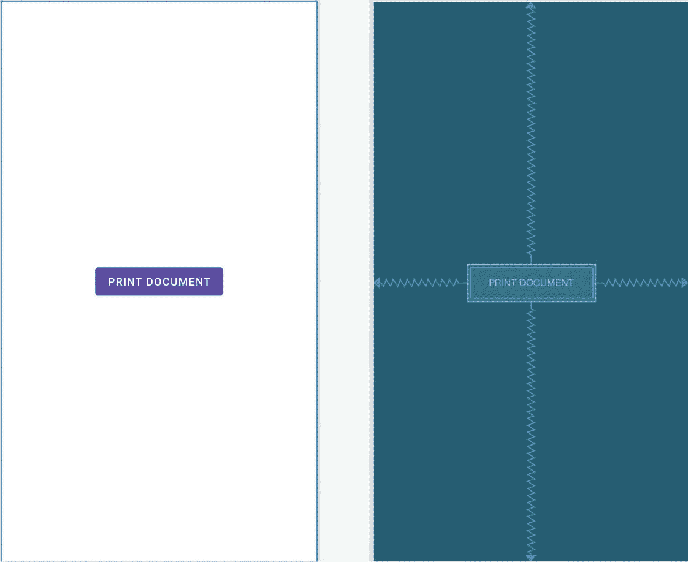
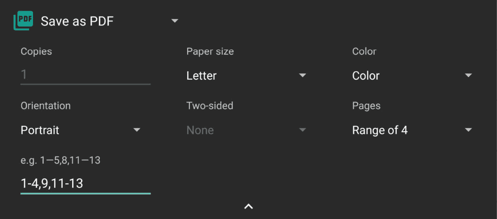
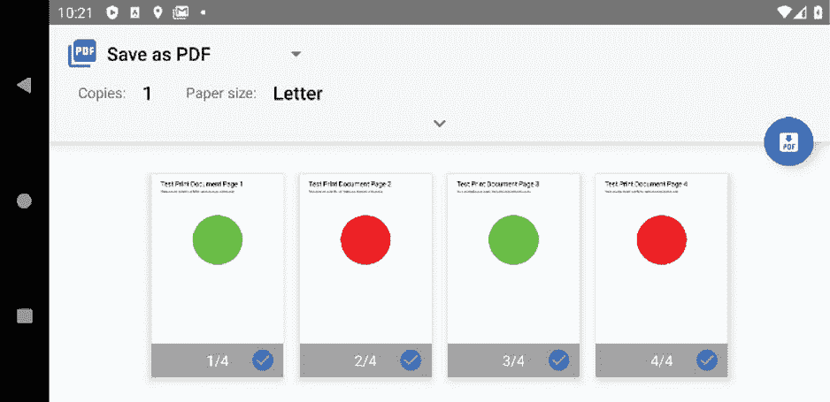

79\. 安卓定制文档打印指南

正如我们在前面几章中看到的，安卓打印框架使得在应用中构建打印支持变得相对容易，只要内容是图像或 HTML 标记的形式。通过使用打印框架的自定义文档打印功能，可以满足更高级的打印要求。

79.1 安卓定制文档打印概述

简单地说，自定义文档打印使用画布来表示要打印的文档页面。应用以形状、颜色、文本和图像的形式绘制要打印到这些画布上的内容。实际上，画布由安卓画布类的实例来表示，从而提供了对丰富的绘图选项选择的访问。一旦所有页面都已绘制完毕，文档就会打印出来。

虽然这听起来很简单，但要做到这一点，实际上需要执行许多步骤，可以总结如下:

实现从打印文档适配器类中细分的自定义打印适配器

获取打印管理器服务的参考

创建一个 PdfDocument 类的实例，用于存储文档页面

以 PdF 文档的形式向 PdF 文档添加页面。页面实例

获取与文档页面相关联的画布对象的引用

在画布上绘制内容

将 PDF 文档写入打印框架提供的目标输出流

通知打印框架文档可以打印了

在本章中，将提供这些步骤的概述，随后是一个详细的教程，旨在演示在安卓应用中自定义文档打印的实现。

79.1.1 定制打印适配器

打印适配器的作用是为打印框架提供要打印的内容，并确保根据用户选择的首选项(考虑纸张大小和页面方向等因素)正确格式化。

当打印 HTML 和图像时，大部分工作是由打印适配器执行的，这些适配器是作为安卓打印框架的一部分提供的，并为这些特定的打印任务而设计。例如，在打印网页时，当调用 WebView 类实例的 createPrintDocumentAdapter()方法时，会为我们创建一个打印适配器。

但是，在自定义文档打印的情况下，应用开发人员有责任设计打印适配器并实现代码来绘制和格式化内容，为打印做准备。

自定义打印适配器是通过对打印文档适配器类进行子类化并覆盖该类中的一组回调方法来创建的，打印框架将在打印过程的各个阶段调用这些回调方法。这些回调方法可以总结如下:

onStart()–当打印过程开始时调用此方法，提供此方法是为了让应用代码有机会执行任何必要的任务，为创建打印作业做准备。在 PrintDocumentAdapter 子类中实现此方法是可选的。

onLayout()–此回调方法在调用 onStart()方法后调用，然后在用户每次更改打印设置(如更改方向、纸张大小或颜色设置)时再次调用。这种方法应该在必要时调整内容和布局以适应这些变化。完成这些更改后，该方法必须返回要打印的页数。必须在 PrintDocumentAdapter 子类中实现 onLayout()方法。

onWrite()–此方法在每次调用 onLayout()后调用，负责在要打印的页面的画布上呈现内容。在其他参数中，这个方法被传递了一个文件描述符，一旦渲染完成，生成的 PDF 文档必须被写入该文件描述符。然后调用 onWriteFinished()回调方法，传递包含要打印的页面范围信息的参数。必须在 PrintDocumentAdapter 子类中实现 onWrite()方法。

onFinish()–一种可选方法，如果实现，当打印过程完成时，打印框架将调用该方法一次，从而为应用提供执行任何必要的清理操作的机会。

79.2 准备定制文件打印项目

从欢迎屏幕中选择创建新项目快速启动选项，并在生成的新项目对话框中选择空活动模板，然后单击下一步按钮。

在“名称”字段中输入 CustomPrint，并将 com . ebookwidge . custom print 指定为包名。在单击完成按钮之前，将最低应用编程接口级别设置更改为应用编程接口 26:安卓 8.0(奥利奥)，并将语言菜单更改为 Java。

将 activity_main.xml 布局文件加载到布局编辑器工具中，在设计模式下，选择并删除“Hello World！”TextView 对象。从组件面板的表单小部件部分拖放一个按钮视图，并将其放置在布局视图的中心。选择按钮视图后，将文本属性更改为“打印文档”，并将字符串提取到新资源。完成后，用户界面布局应符合[图 79-1](#_idTextAnchor1478) 所示:



图 79-1

当在应用中选择该按钮时，需要调用一个方法来启动文档打印过程。保持在属性工具窗口中，设置 onClick 属性以调用名为 printDocument 的方法。

79.3 创建自定义打印适配器

从安卓应用中打印定制文档的大部分工作都涉及到定制打印适配器的实现。此示例将需要一个实现了 onLayout()和 onWrite()回调方法的打印适配器。在 MainActivity.java 文件中，为这个新类添加模板，使其如下所示:

```java
package com.ebookfrenzy.customprint;
.
.
import android.os.CancellationSignal;
import android.os.ParcelFileDescriptor;
import android.print.PageRange;
import android.print.PrintAttributes;
import android.print.PrintDocumentAdapter;
import android.content.Context;

public class MainActivity extends AppCompatActivity {

    public static class MyPrintDocumentAdapter extends PrintDocumentAdapter
    {
        Context context;

        MyPrintDocumentAdapter(Context context)
        {
            this.context = context;
        }

        @Override
        public void onLayout(PrintAttributes oldAttributes,
                             PrintAttributes newAttributes,
                             CancellationSignal cancellationSignal,
                             LayoutResultCallback callback,
                             Bundle metadata) {
        }

        @Override
        public void onWrite(final PageRange[] pageRanges,
                            final ParcelFileDescriptor destination,
                            final CancellationSignal
                                    cancellationSignal,
                            final WriteResultCallback callback) {
        }
    }
.
.
}
```

由于新类目前的状态，它包含一个构造函数方法，当创建该类的新实例时将调用该方法。构造函数将调用活动的上下文作为参数，然后将其存储起来，以便以后在两个回调方法中引用。

建立了类的概要后，下一步是开始实现两个回调方法，从 onLayout()开始。

79.4 实现 onLayout()回调方法

保留在 MainActivity.java 文件中，首先添加 onLayout()方法中的代码所需的一些导入指令:

```java
package com.ebookfrenzy.customprint;
.
.
import android.print.PrintDocumentInfo;
import android.print.pdf.PrintedPdfDocument;
import android.graphics.pdf.PdfDocument;

public class MainActivity extends AppCompatActivity {
.
.
}
```

接下来，修改 MyPrintDocumentAdapter 类，以声明要在 onLayout()方法中使用的变量:

```java
public static class MyPrintDocumentAdapter extends PrintDocumentAdapter
{
       Context context;
       int pageHeight;
       int pageWidth;
       PdfDocument myPdfDocument; 
       int totalpages = 4;
.
.
}
```

请注意，在本例中，将打印一份四页的文档。在更复杂的情况下，应用很可能需要根据与用户的纸张大小和页面方向选择相关的内容的数量和布局来动态计算要打印的页数。

声明变量后，实现 onLayout()方法，如下面的代码清单所示:

```java
@Override
public void onLayout(PrintAttributes oldAttributes,
                    PrintAttributes newAttributes,
                    CancellationSignal cancellationSignal,
                    LayoutResultCallback callback,
                    Bundle metadata) {

       myPdfDocument = new PrintedPdfDocument(context, newAttributes);

       pageHeight = 
             newAttributes.getMediaSize().getHeightMils()/1000 * 72;
       pageWidth = 
             newAttributes.getMediaSize().getWidthMils()/1000 * 72;

       if (cancellationSignal.isCanceled() ) {
              callback.onLayoutCancelled();
              return;
       }

       if (totalpages > 0) {
          PrintDocumentInfo.Builder builder = new PrintDocumentInfo
                .Builder("print_output.pdf").setContentType(
                     PrintDocumentInfo.CONTENT_TYPE_DOCUMENT)
                .setPageCount(totalpages);

          PrintDocumentInfo info = builder.build();
          callback.onLayoutFinished(info, true);
       } else {
          callback.onLayoutFailed("Page count is zero.");
       }
}
```

显然，这种方法正在执行相当多的任务，每项任务都需要一些详细的解释。

首先，以 PDF document 类实例的形式创建一个新的 PDF 文档。当打印框架调用 onLayout()方法时，传递给该方法的参数之一是 PrintAttributes 类型的对象，该对象包含用户为打印输出选择的纸张大小、分辨率和颜色设置的详细信息。在创建 PDF 文档时，将使用这些设置以及我们的构造函数方法先前为我们存储的活动的上下文:

```java
myPdfDocument = new PrintedPdfDocument(context, newAttributes);
```

然后，该方法使用打印属性对象提取文档页面的高度和宽度值。这些尺寸以千分之一英寸的形式存储在物体中。由于本例中稍后将使用这些值的方法以 1/72 英寸为单位工作，因此这些数字在存储之前会进行转换:

```java
pageHeight = newAttributes.getMediaSize().getHeightMils()/1000 * 72;
pageWidth = newAttributes.getMediaSize().getWidthMils()/1000 * 72;
```

虽然这个例子没有使用用户的颜色选择，但是这个属性可以通过调用 PrintAttributes 对象的 getColorMode()方法获得，该方法将返回一个 COLOR_MODE_COLOR 或 COLOR _ MODE _ 单色的值。

当调用 onLayout()方法时，它会被传递一个 LayoutResultCallback 类型的对象。该对象为方法提供了一种通过一组方法将状态信息传递回打印框架的方法。例如，当用户取消打印过程时，将调用 onLayout()方法。进程已被取消的事实通过 CancellationSignal 参数中的设置来指示。如果检测到取消，onLayout()方法必须调用 LayoutResultCallback 对象的 onLayoutCancelled()方法，以通知 Print 框架已收到取消请求，并且布局任务已被取消:

```java
if (cancellationSignal.isCanceled() ) {
       callback.onLayoutCancelled();
       return;
}
```

布局工作完成后，方法需要调用 LayoutResultCallback 对象的 onLayoutFinished()方法，传递两个参数。第一个参数采用 PrintDocumentInfo 对象的形式，该对象包含关于要打印的文档的信息。这些信息包括用于 PDF 文档的名称、内容类型(在本例中是文档而不是图像)和页数。第二个参数是一个布尔值，指示自上次调用 onLayout()方法以来布局是否已更改:

```java
if (totalpages > 0) {
       PrintDocumentInfo.Builder builder = new PrintDocumentInfo
              .Builder("print_output.pdf") 
              .setContentType(
                  PrintDocumentInfo.CONTENT_TYPE_DOCUMENT)
              .setPageCount(totalpages);  

       PrintDocumentInfo info = builder.build();

       callback.onLayoutFinished(info, true);
} else {                                     
       callback.onLayoutFailed("Page count is zero.");
}
```

在页数为零的情况下，代码通过调用 LayoutResultCallback 对象的 onLayoutFailed()方法向打印框架报告此故障。

对 onLayoutFinished()方法的调用通知打印框架布局工作已经完成，从而触发对 onWrite()方法的调用。

79.5 实现 onWrite()回调方法

onWrite()回调方法负责呈现文档的页面，然后通知 Printing 框架文档已准备好打印。完成后，onWrite()方法的内容如下:

```java
package com.ebookfrenzy.customprint;

import java.io.FileOutputStream;
import java.io.IOException;
.
.
import android.graphics.pdf.PdfDocument.PageInfo;
.
.
@Override
public void onWrite(final PageRange[] pageRanges,
                   final ParcelFileDescriptor destination,
                   final CancellationSignal cancellationSignal,
                   final WriteResultCallback callback) {

       for (int i = 0; i < totalpages; i++) {
              if (pageInRange(pageRanges, i))
                 {
                   PageInfo newPage = new PageInfo.Builder(pageWidth, 
                         pageHeight, i).create();

                   PdfDocument.Page page = 
                          myPdfDocument.startPage(newPage);

                   if (cancellationSignal.isCanceled()) {
                       callback.onWriteCancelled();
                       myPdfDocument.close();
                       myPdfDocument = null;
                       return;
                   }
                   drawPage(page, i);
                   myPdfDocument.finishPage(page);  
              }
       }

       try {
              myPdfDocument.writeTo(new FileOutputStream(
                          destination.getFileDescriptor()));
       } catch (IOException e) {
              callback.onWriteFailed(e.toString());
              return;
       } finally {
              myPdfDocument.close();
              myPdfDocument = null;
       }

       callback.onWriteFinished(pageRanges);
}
```

onWrite()方法首先遍历文档中的每一页。然而，重要的是要考虑到用户可能没有要求打印组成文档的所有页面。实际上，打印框架用户界面面板提供了指定打印特定页面或页面范围的选项。[例如，图 79-2](#_idTextAnchor1483) 显示了配置为打印 a d 文档的第 1-4 页、第 8 和第 9 页以及第 11-13 页的打印面板。



图 79-2

将页面写入 PDF 文档时，onWrite()方法必须采取措施确保只打印用户指定的页面。为了实现这一点，打印框架传递一个 PageRange 对象数组作为参数，该数组指示要打印的页面范围。在上面的 onWrite()实现中，为每个页面调用一个名为 pagesInRange()的方法，以验证页面是否在指定的范围内。pagesInRange()方法的代码将在本章后面实现。

```java
for (int i = 0; i < totalpages; i++) {
       if (pageInRange(pageRanges, i))
       {
```

对于任何指定范围内的每一页，一个新的 pdf 文档。页面对象被创建。创建新页面时，先前由 onLayout()方法存储的高度和宽度值将作为参数传递，以便页面大小与用户选择的打印选项相匹配:

```java
PageInfo newPage = new PageInfo.Builder(pageWidth, pageHeight, i).create();

PdfDocument.Page page = myPdfDocument.startPage(newPage);
```

与 onLayout()方法一样，onWrite()方法需要响应取消请求。在这种情况下，代码在关闭和取消引用 myPdfDocument 变量之前，通知打印框架取消操作已经执行:

```java
if (cancellationSignal.isCanceled()) {
       callback.onWriteCancelled();
       myPdfDocument.close();
       myPdfDocument = null;
       return;
}
```

只要打印过程没有被取消，该方法就会调用一个方法来绘制当前页面上的内容，然后再调用 myPdfDocument 对象上的 finishedPage()方法。

```java
drawPage(page, i);
myPdfDocument.finishPage(page); 
```

drawPage()方法负责将内容绘制到页面上，一旦 onWrite()方法完成，将会实现该方法。

当所需的页数添加到 PDF 文档后，文档将使用文件描述符写入目标流，文件描述符作为 onWrite()方法的参数传递。如果由于任何原因写操作失败，该方法通过调用 WriteResultCallback 对象的 onWriteFailed()方法(也作为参数传递给 onWrite()方法)来通知框架。

```java
try {
       myPdfDocument.writeTo(new FileOutputStream(
              destination.getFileDescriptor()));
} catch (IOException e) {
              callback.onWriteFailed(e.toString());
              return;
} finally {
              myPdfDocument.close();
              myPdfDocument = null;
}
```

最后，调用 WriteResultsCallback 对象的 onWriteFinish()方法，通知打印框架文档准备好打印了。

79.6 检查页面是否在范围内

如前所述，当调用 onWrite()方法时，会传递一个 PageRange 对象数组，该数组指示文档中要打印的页面范围。PageRange 类用于存储页面范围的开始页和结束页，这些页面又可以通过类的 getStart()和 getEnd()方法访问。

在前一节中实现 onWrite()方法时，调用了一个名为 pageInRange()的方法，该方法将 PageRange 对象数组和页码作为参数。pageInRange()方法的作用是确定指定的页码是否在指定的范围内，并且可以在 MainActivity.java 类中的 MyPrintDocumentAdapter 类中实现，如下所示:

```java
public class MyPrintDocumentAdapter extends PrintDocumentAdapter {
.
.
       private boolean pageInRange(PageRange[] pageRanges, int page)
       {
              for (PageRange pageRange : pageRanges) {
                if ((page >= pageRange.getStart()) &&
                        (page <= pageRange.getEnd()))
                    return true;
            }
            return false;
       }
.
.
}
```

79.7 在页面画布上绘制内容

我们现在已经到了需要编写一些代码来在页面上绘制内容，以便可以打印的地步。绘制的内容完全是特定于应用的，并且仅受使用安卓画布类可以实现的内容的限制。然而，为了这个例子的目的，一些简单的文本和图形将被绘制在画布上。

onWrite()方法被设计为调用一个名为 drawPage()的方法，该方法将 PdfDocument 作为参数。表示当前页面的 Page 对象和表示页码的整数。在 MainActivity.java 文件中，该方法现在应该如下实现:

```java
package com.ebookfrenzy.customprint;
.
.
import android.graphics.Canvas;
import android.graphics.Color;
import android.graphics.Paint;

public class MainActivity extends AppCompatActivity {
.
.
       public static class MyPrintDocumentAdapter extends 
                                   PrintDocumentAdapter
       {
.
.
              private void drawPage(PdfDocument.Page page, 
                              int pagenumber) {
                  Canvas canvas = page.getCanvas();

                  pagenumber++; // Make sure page numbers start at 1

                  int titleBaseLine = 72;
                  int leftMargin = 54;

                  Paint paint = new Paint();
                  paint.setColor(Color.BLACK);
                  paint.setTextSize(40);
                  canvas.drawText(
                     "Test Print Document Page " + pagenumber,
                                                   leftMargin,
                                                   titleBaseLine, 
                                                   paint);

                  paint.setTextSize(14);
                  canvas.drawText("This is some test content to verify that custom document printing works", leftMargin, titleBaseLine + 35, paint);

                  if (pagenumber % 2 == 0)
                                paint.setColor(Color.RED);
                  else
                         paint.setColor(Color.GREEN);

                  PageInfo pageInfo = page.getInfo();

                  canvas.drawCircle(pageInfo.getPageWidth()/2f,
                                     pageInfo.getPageHeight()/2f, 
                                     150, 
                                     paint); 
              }
.
.
}
```

代码中的页码从 0 开始。由于文档传统上从第 1 页开始，该方法从增加存储的页码开始。然后获取对与页面相关联的 Canvas 对象的引用，并声明一些边距和基线值:

```java
Canvas canvas = page.getCanvas();

pagenumber++;

int titleBaseLine = 72;
int leftMargin = 54;
```

接下来，代码创建要用于绘图的 Paint 和 Color 对象，设置文本大小并绘制页面标题文本，包括当前页码:

```java
Paint paint = new Paint();

paint.setColor(Color.BLACK);
paint.setTextSize(40);

canvas.drawText("Test Print Document Page " + pagenumber,
                                              leftMargin,
                                              titleBaseLine, 
                                              paint);
```

然后减小文本大小，并在标题下绘制一些正文:

```java
paint.setTextSize(14); 
canvas.drawText("This is some test content to verify that custom document printing works", leftMargin, titleBaseLine + 35, paint);
```

这个方法执行的最后一个任务是画一个圆(偶数页是红色，奇数页是绿色)。在确定页面是奇数还是偶数之后，该方法在使用该信息将圆定位在页面中心之前获得页面的高度和宽度:

```java
if (pagenumber % 2 == 0)
       paint.setColor(Color.RED);
else
       paint.setColor(Color.GREEN);

PageInfo pageInfo = page.getInfo();

canvas.drawCircle(pageInfo.getPageWidth()/2,
                  pageInfo.getPageHeight()/2, 
                  150, paint);
```

在画布上绘制后，该方法将控制权返回给 onWrite()方法。

随着 drawPage()方法的完成，MyPrintDocumentAdapter 类现在已经完成。

79.8 开始打印作业

当用户触摸“打印文档”按钮时，将调用 printDocument() onClick 事件处理程序方法。因此，在测试开始之前，剩下的就是将这个方法添加到 MainActivity.java 文件中，特别注意确保它被放在 MyPrintDocumentAdapter 类之外:

```java
package com.ebookfrenzy.customprint;
.
.
import android.print.PrintManager;
import android.view.View;

public class MainActivity extends AppCompatActivity {

       public void printDocument(View view)
       {
           PrintManager printManager = (PrintManager) this
                   .getSystemService(Context.PRINT_SERVICE);

           String jobName = this.getString(R.string.app_name) + 
                        " Document";

           printManager.print(jobName, new 
                    MyPrintDocumentAdapter(this),
                    null);
       }
.
.
}
```

在创建新的字符串对象作为打印任务的作业名称之前，此方法获取对设备上运行的打印管理器服务的引用。最后，调用打印管理器的 print()方法来启动打印作业，传递作业名称和自定义打印文档适配器类的实例。

79.9 测试应用

在运行安卓 4.4 或更高版本的安卓设备或模拟器上编译并运行应用。加载应用后，触摸“打印文档”按钮启动打印作业，并为输出选择合适的目标(保存为 PDF 选项是避免浪费纸张和打印机墨水的有用选项)。

检查打印输出，应包括 4 页，包括文本和图形。[例如，图 79-3](#_idTextAnchor1489) 显示了作为 PDF 文件查看的文档的四页，准备保存在设备上。

尝试其他打印配置选项，例如在打印面板中更改纸张大小、方向和页面设置。每一次设置的改变都应该反映在打印输出中，表明自定义打印文档适配器功能正常。



图 79-3

79.10 总结

虽然实现起来比安卓打印框架的 HTML 和图像打印选项更复杂，但定制文档打印在从安卓应用打印复杂内容方面提供了相当大的灵活性。实现自定义文档打印的大部分工作涉及创建自定义打印适配器类，这样它不仅可以在文档页面上绘制内容，还可以在用户对打印设置(如页面大小和要打印的页面范围)进行更改时做出正确响应。