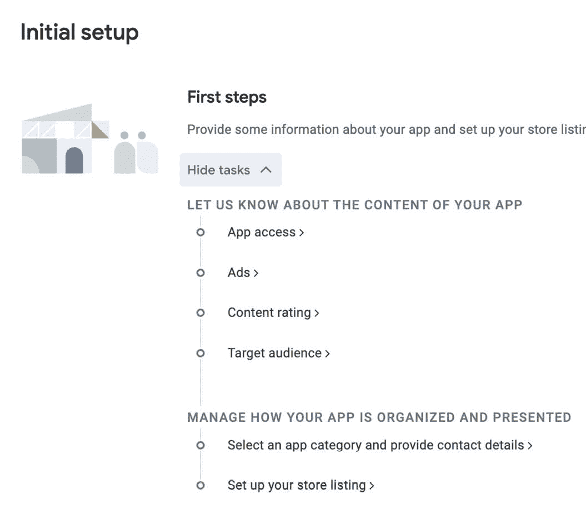
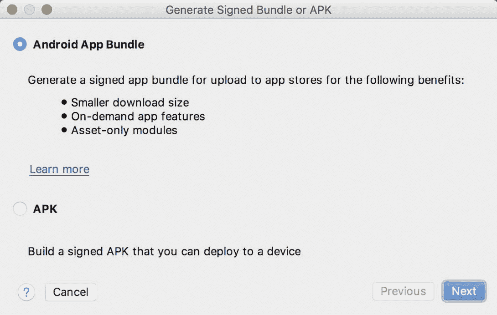
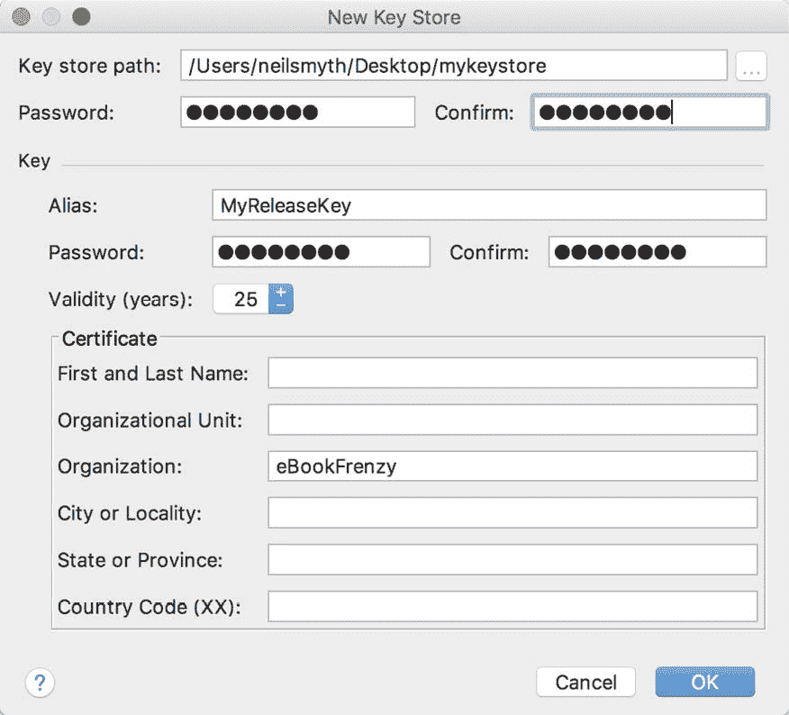
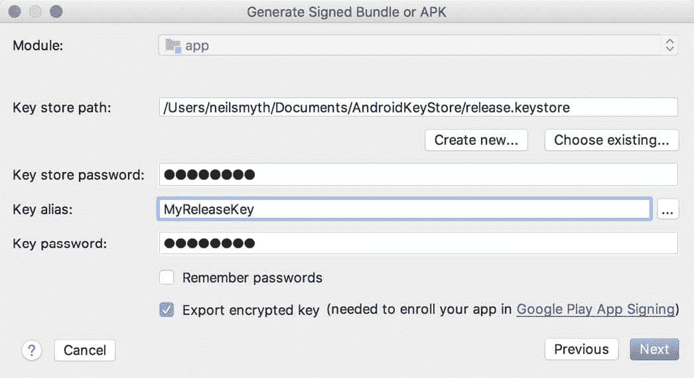
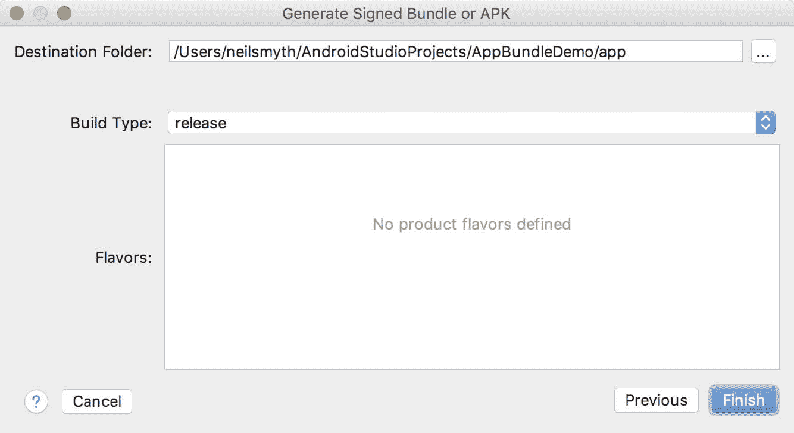
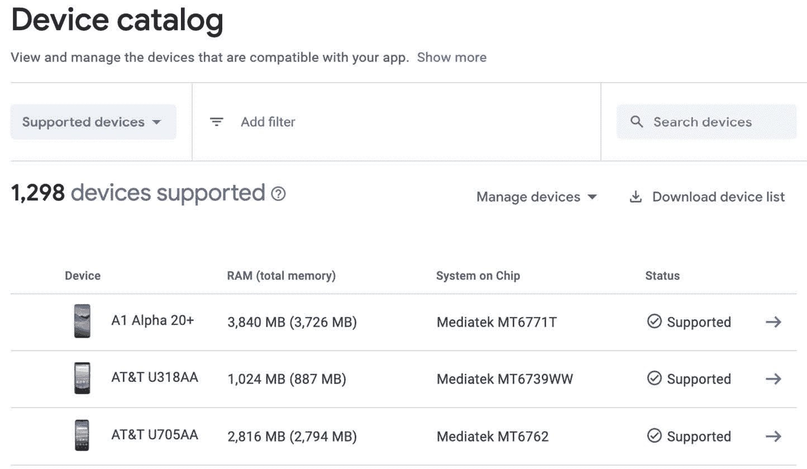
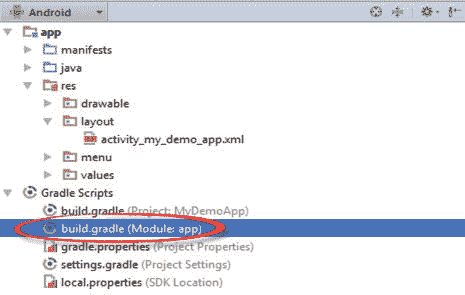

# 八十四、创建、测试和上传安卓应用包

一旦安卓应用的开发工作完成，并且已经在各种安卓设备上进行了测试，下一步就是准备应用以提交给谷歌游戏。但是，在提交之前，应用必须打包发布，并使用私钥进行签名。本章将介绍获取私钥、为项目准备安卓应用捆绑包并将其上传到谷歌 Play 所涉及的步骤。

84.1 释放准备流程

直到本书的这一点，我们一直在以适合测试和调试的模式构建应用项目。另一方面，构建一个通过谷歌游戏向客户发布的应用包需要采取一些额外的步骤。第一个要求是应用在发布模式下编译，而不是调试模式。其次，应用必须用私钥签名，私钥唯一地标识您是应用的开发人员。最后，应用必须打包到安卓应用捆绑包中。

虽然这些任务都可以在 AndroidStudio 环境之外执行，但是使用 AndroidStudio 构建机制可以更容易地执行这些过程，如本章剩余部分所述。然而，首先，多了解一点安卓应用捆绑包很重要。

84.2 安卓应用捆绑包

当用户从谷歌 Play 安装应用时，该应用会以 APK 文件的形式下载。该文件包含在用户设备上安装和运行应用所需的所有内容。在引入 AndroidStudio 3.2 之前，开发者会使用 AndroidStudio 生成一个或多个 APK 文件，并将它们上传到谷歌游戏。为了支持多种设备类型、屏幕大小和区域设置，这将需要创建和上传为每个目标设备和区域设置定制的多个 APK 文件，或者生成包含单个包中所有不同配置资源和平台二进制文件的大型通用 APK。

创建多个 APK 文件涉及大量工作，每次需要更新应用时都必须重复这些工作，给应用发布过程带来了相当大的时间开销。

通用 APK 选项虽然对开发人员来说负担较小，但却造成了一个完全意想不到的问题。通过分析应用安装指标，谷歌发现安装 APK 文件越大(导致下载时间越长，设备上的存储使用越多)，应用收到的转换就越少。转换率的计算方式是在谷歌 Play 上查看应用后，完成该应用安装的用户的百分比。事实上，谷歌估计，APK 文件大小每增加 6MB，应用的转化率就会下降 1%。

安卓应用捆绑包解决了这两个问题，它为开发者提供了一种从 AndroidStudio 内部创建单个包的方法，并让谷歌 Play 为每个受支持的配置自动生成定制的 APK 文件(这一概念被称为动态交付)。

安卓应用捆绑包本质上是一个 ZIP 文件，包含为设备和地区构建 APK 文件所需的所有文件，应用项目中已经提供了对这些文件的支持。例如，该项目可能包括不同屏幕尺寸的资源和图像。当用户安装该应用时，谷歌 Play 会收到关于用户设备的信息，包括显示器、处理器架构和地区。使用这些信息，适当的预先生成的 APK 文件被传输到用户的设备上。

动态交付的另一个好处是能够将应用分成多个模块，称为动态功能模块，其中每个模块包含应用中特定功能领域的代码和资源。每个动态功能模块都包含在独立于基本模块的 APK 文件中，并且仅当用户需要该功能时才下载到设备。动态交付和应用捆绑包还允许创建即时动态功能模块，这些模块可以在设备上即时运行，而无需安装整个应用。这些主题将从标题为[“安卓动态功能模块概述”](85.html#_idTextAnchor1606)的章节开始进行更详细的介绍。

虽然仍然可以从 AndroidStudio 生成 APK 文件，但应用捆绑包现在是上传应用到谷歌游戏的推荐方式。

84.3 注册谷歌游戏开发者控制台账户

应用提交过程的第一步是创建一个谷歌游戏开发者控制台帐户。为此，导航至[https://play.google.com/apps/publish/signup/](https://play.google.com/apps/publish/signup/)并按照说明完成注册过程。请注意，注册需要一次性支付 25 美元的费用。一旦应用上市，谷歌将保留与该应用相关的所有收入的 30%。

创建帐户后，下一步是收集有关应用的信息。为了将您的申请推向市场，需要以下信息:

标题–应用的标题。

简短描述-最多 80 个单词描述应用。

完整描述–最多 4000 字描述应用。

截图–最多 8 张应用运行的截图(至少需要两张)。谷歌建议提交运行在 7 英寸或 10 英寸平板电脑上的应用截图。

语言–应用的语言(默认为美国英语)。

推广文本–当您的应用出现在 Google Play 环境的特殊推广功能中时将使用的文本。

应用类型–您的应用是被视为游戏还是应用。

类别–最能描述您的应用的类别(例如，金融、健康和健身、教育、体育等)。).

地点–您希望应用可供购买的地理位置。

联系方式–用户联系您以获得与应用相关的支持的方式。选项包括网络、电子邮件和电话。

定价和分销–关于应用价格及其营销和销售地理位置的信息。

收集了上述信息后，点击谷歌游戏控制台中的创建应用按钮开始创建过程。

84.4 在控制台中配置应用

首次点击创建应用按钮时，将出现应用详情和声明屏幕，如下图[图 84-1](#_idTextAnchor1579) :


图 84-1

应用条目完全配置后，单击创建应用按钮(上图中突出显示)添加应用并显示仪表板屏幕。在控制面板中，找到初始设置部分，并展开配置应用商店列表的步骤列表:



图 84-2

浏览链接列表，并为您的应用提供所需的信息，确保在每一步都保存更改。

84.5 启用 Google Play 应用签名

直到最近，谷歌游戏上传都是用 AndroidStudio 的发布应用签名密钥签名的，然后上传到谷歌游戏控制台。虽然此选项仍然可用，但推荐的上传文件方式是现在使用一个称为谷歌游戏应用签名的过程。对于新创建的应用，这包括选择谷歌游戏应用签名，然后生成一个上传密钥，用于在 AndroidStudio 内签名应用捆绑文件。当 AndroidStudio 生成的应用包文件上传后，谷歌 Play 控制台会移除上传密钥，然后使用安全存储在谷歌 Play 服务器中的应用签名密钥对文件进行签名。对于现有的应用，需要一些额外的步骤来启用谷歌游戏签名，并将在本章末尾介绍。

在 Google Play 控制台中，从“所有应用”屏幕中选择新添加的应用条目(通过位于左侧导航面板顶部的选项访问)，展开设置部分(在[图 84-3](#_idTextAnchor1582) 中标记为 A)，并选择应用签名选项(B)。


图 84-3

点击创建发布按钮，选择谷歌游戏应用签名。控制台现在已经准备好为测试创建应用的第一个版本。然而，在这样做之前，下一步是从 AndroidStudio 内部生成上传密钥。这是作为生成签名应用包过程的一部分来执行的。让当前的谷歌游戏控制台屏幕加载到浏览器中，因为我们将在本章稍后返回到这一点。

84.6 创建密钥库文件

要创建密钥库文件，选择 Android Studio Build ->生成签名包/ APK…菜单选项，显示生成签名包或 APK 向导对话框，如图[图 84-4](#_idTextAnchor1587) :



图 84-4

在单击“下一步”按钮之前，请验证是否选择了安卓应用捆绑包选项。

如果您有一个现有的发行密钥库文件，请单击下一个屏幕上的“选择现有的...”按钮，导航到并选择该文件。如果您尚未创建密钥库文件，请单击新建…按钮显示新建密钥库对话框([图 84-5](#_idTextAnchor1588) )。单击密钥存储路径字段右侧的按钮，导航到文件系统中合适的位置，输入密钥库文件的名称(例如，release.keystore.jks)，然后单击确定按钮。

“新建密钥存储”对话框分为两个部分。顶部与密钥库文件相关。在本节中，在“密码”和“确认”字段中输入用于保护密钥库文件的强密码。对话框的下半部分与将存储在密钥存储文件中的上传密钥相关。


图 84-5

在“新建密钥存储”对话框的“证书”部分，输入以下详细信息:

引用密钥的别名。这可以是任何字符序列，尽管系统只使用前 8 个字符。

保护密钥的适当强密码。

密钥有效的年数(谷歌建议持续时间超过 25 年)。

此外，必须为至少一个剩余字段提供信息(例如，您的名字和姓氏，或组织名称)。



图 84-6

输入信息后，单击“确定”按钮继续创建包。

84.7 创建安卓应用捆绑包

下一步是指示 AndroidStudio 在发布模式下构建应用 app bundle 文件，然后用新创建的私钥进行签名。此时，“生成签名捆绑包”或“APK”对话框仍应显示，其中的密钥库路径、密码和密钥别名字段填充了以下信息:



图 84-7

确保“导出加密密钥”选项已启用，并且假设其他设置正确，单击“下一步”按钮进入 app bundle 生成屏幕([图 84-8](#_idTextAnchor1590) )。在此屏幕中，查看“目标文件夹:设置”以验证生成应用包文件的位置是否可接受。如果首选其他位置，请单击文本字段右侧的按钮，并导航到所需的文件系统位置。



图 84-8

单击“完成”按钮，等待 Gradle 系统构建应用捆绑包。构建完成后，将出现一个对话框，提供在资源管理器窗口中打开包含 app bundle 文件的文件夹，或将文件加载到 APK 分析器中的选项:


图 84-9

此时，应用已准备好提交给谷歌游戏。单击定位链接打开文件系统浏览器窗口。该文件应命名为 bundle.aab，并位于项目文件夹的 app/release 子目录中，除非指定了其他位置。

作为此过程的一部分生成的私钥应该在签署和发布未来的应用时使用，因此应该保存在安全的地方并进行安全备份。

84.8 生成测试 APK 文件

此阶段的一个可选步骤是从应用捆绑包生成 APK 文件，并在设备或模拟器会话上安装和运行它们。谷歌提供了一个名为 bundletool 的命令行工具，专门为此目的而设计，可以从以下网址下载:

[https://github.com/google/bundletool/releases](https://github.com/google/bundletool/releases)

在编写本文时，bundletool 是以. jar 文件的形式提供的，可以从命令行执行，如下所示(注意，自本书出版以来，版本号可能已经更改):

```java
java -jar bundletool-all-0.9.0.jar
```

运行上述命令将列出工具中所有可用的选项。要从应用捆绑包生成 APK 文件，需要使用 build-apks 选项。要生成可以安装到设备或模拟器上的 APK 文件，这些文件还需要签名。要实现这一点，包括指定本章前面创建的密钥库文件路径的- ks 选项，以及指定生成密钥时提供的别名的- ks-key-alias 选项。

最后，必须使用- output 标志来指定将在其中生成 APK 文件的文件(称为 APK 集)的路径。该文件必须不存在，并且要求扩展名为. apks。将这些要求结合在一起会产生以下命令行(考虑到操作系统路径结构的差异):

```java
java -jar bundletool-all-0.9.0.jar build-apks --bundle=/tmp/MyApps/app/release/bundle.aab --output=/tmp/MyApks.apks --ks=/MyKeys/release.keystore.jks --ks-key-alias=MyReleaseKey
```

执行此命令时，将出现一个提示，要求在将 APK 文件生成到指定的 APK 集文件之前输入密钥库密码。APK 集文件只是一个 ZIP 文件，包含从应用包生成的所有 APK 文件。

要将适当的 APK 文件安装到连接的设备或模拟器上，请使用类似以下命令:

```java
java -jar bundletool-all-0.9.0.jar install-apks --apks=/tmp/MyApks.apks
```

该命令将指示工具为连接的设备识别适当的 APK 文件并安装它们，以便启动和测试应用。

也可以从连接设备的 APK 集中提取 APK 文件，而无需安装它们。该过程的第一步是获得连接设备的规格，如下所示:

```java
java -jar bundletool-all-0.9.0.jar get-device-spec --output=/tmp/device.json
```

上面的命令将生成一个类似如下的 JSON 文件:

```java
{
  "supportedAbis": ["x86"],
  "supportedLocales": ["en-US"],
  "screenDensity": 420,
  "sdkVersion": 27
}
```

接下来，该规范文件用于从 APK 集中提取匹配的 APK 文件:

```java
java -jar bundletool-all-0.9.0.jar extract-apks --apks=/tmp/MyApks.apks --output-dir=/tmp/nexus5_apks --device-spec=/tmp/device.json
```

执行时，通过- output-dir 标志指定的目录将包含指定设备配置的正确 APK 文件。

将安卓应用推向市场的下一步是将其提交给谷歌游戏开发者控制台，以便进行测试。

84.9 上传应用包到谷歌 Play 开发者控制台

返回谷歌游戏控制台，选择位于导航面板测试部分的内部测试选项(在[图 84-10](#_idTextAnchor1593) 中标记为 A)，然后点击创建新版本按钮(B):


图 84-10

在生成的屏幕上，单击继续按钮(下面标记为 A)确认使用 Google Play 应用签名，然后将 Android Studio 生成的捆绑文件拖放到上传拖放点(B)上:


图 84-11

上传完成后，向下滚动屏幕，输入发行名称和可选发行说明。发布名称可以是帮助您识别发布所需的任何信息，并且对用户不可见。

在应用包文件上传后，谷歌 Play 将生成所有必要的 APK 文件，以备测试。生成 APK 文件后，向下滚动到屏幕底部并单击保存按钮。保存设置后，单击查看发布按钮。

84.10 探索应用捆绑包

在查看屏幕上，点击上传包右侧的箭头，如图 84-12 所示:


图 84-12

在结果面板中，单击“浏览捆绑包”链接以加载应用捆绑包浏览器。这提供了与应用捆绑包支持的 API 级别、屏幕布局和平台相关的摘要信息:


图 84-13

单击转到设备目录链接将显示 APK 文件支持的设备:



图 84-14

此时，该应用已准备好进行测试，但在控制台内设置好一些测试人员之前，无法推出。

84.11 管理测试人员

如果该应用仍处于内部、Alpha 或 Beta 测试阶段，可通过从 Google Play 控制台中选择该应用，单击导航面板中的内部测试，并选择测试人员选项卡来指定授权测试人员列表，如图[图 84-15](#_idTextAnchor1597) :


图 84-15

要添加测试人员，请单击创建电子邮件列表按钮，命名列表并为测试用户指定电子邮件地址，可以手动指定，也可以通过上传 CSV 文件指定。

“加入网络”网址现在可以从屏幕上复制并提供给测试用户，以便他们接受测试邀请并下载应用。

84.12 推出应用进行测试

现在已经创建了一个内部版本，并添加了一个测试人员列表，该应用已经准备好进行测试。保持在内部测试屏幕中，选择“版本”选项卡，然后单击最近创建的版本的“编辑”按钮:


图 84-16

在审查屏幕上，滚动到底部，然后单击“开始”卷展栏上的“内部测试”按钮。在发布过程中短暂延迟后，该应用将准备好由指定用户下载和测试。

84.13 上传新的应用包版本

为您的应用上传的第一个应用包文件的版本代码总是为 1。如果尝试上载另一个具有相同版本代码的捆绑文件，控制台将拒绝该文件，并显示以下错误:

```java
You need to use a different version code for your APK because you already have one with version code 1.
```

要解决这个问题，需要增加包文件中嵌入的版本代码。这在项目的模块级 build.gradle 文件中执行，在[图 84-17](#_idTextAnchor1601) 中高亮显示:



图 84-17

默认情况下，该文件通常如下所示:

```java
plugins {
    id 'com.android.application'
}'

android {
    compileSdkVersion 29
    buildToolsVersion "30.0.0"
    defaultConfig {
        applicationId "com.example.myapplication"
        minSdkVersion 26
        targetSdkVersion 29
        versionCode 1
        versionName "1.0"
.
.
} 
```

要更改版本代码，只需更改版本代码旁边声明的数字。要更改向应用用户显示的版本号，请更改版本名字符串。例如:

```java
versionCode 2
versionName "2.0"
```

完成这些更改后，重建 APK 文件并再次执行上传。

84.14 分析应用包文件

Android Studio 提供了分析 app bundle 文件内容的能力。要分析捆绑文件，请选择 AndroidStudio 构建- >分析 APK…菜单选项，导航并选择要查看的捆绑文件。一旦加载到工具中，将显示关于包的原始和下载大小的信息，以及包的文件结构列表，如[图 84-18](#_idTextAnchor1603) 所示:


图 84-18

选择 classes.dex 文件将在下面的面板中显示该文件的类结构。在这个面板中，单个类的细节可以深入到类中方法的层次:


图 84-19

同样，在文件列表中选择一个资源或图像文件将在下面的面板中显示文件内容。通过单击“与以前的 APK 文件比较”按钮并选择第二个包文件，可以查看两个包文件之间的大小差异。

84.15 总结

一旦应用项目完成，或者准备好进行用户测试，它就可以上传到谷歌游戏控制台，并发布用于生产、内部、alpha 或 beta 测试。在上传应用之前，必须在控制台中创建一个应用条目，其中包括关于该应用的信息以及将在 Play Store 中使用的截图。然后生成一个发布安卓应用捆绑文件，并使用 AndroidStudio 中的上传密钥进行签名。上传捆绑文件后，谷歌 Play 会移除上传密钥，并用安全存储的应用签名密钥替换它，应用就可以发布了。

捆绑文件的内容可以通过将其加载到 AndroidStudio APK 分析器工具中来随时查看。