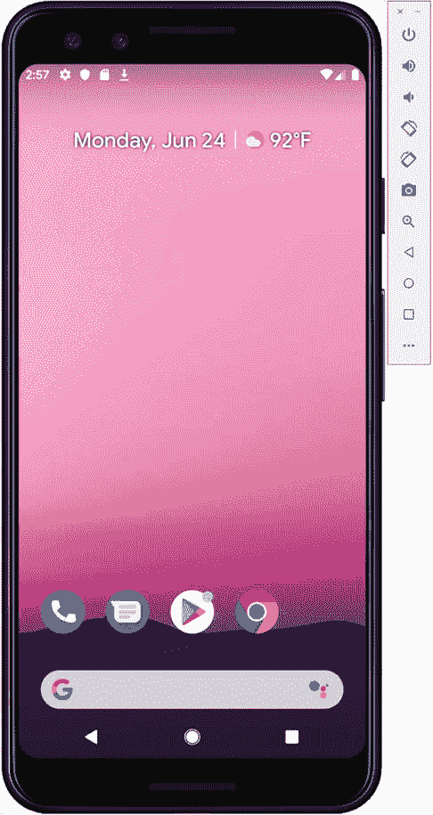
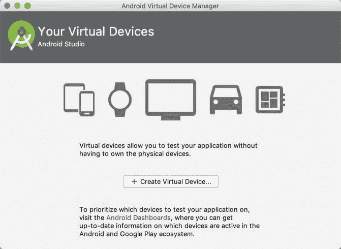
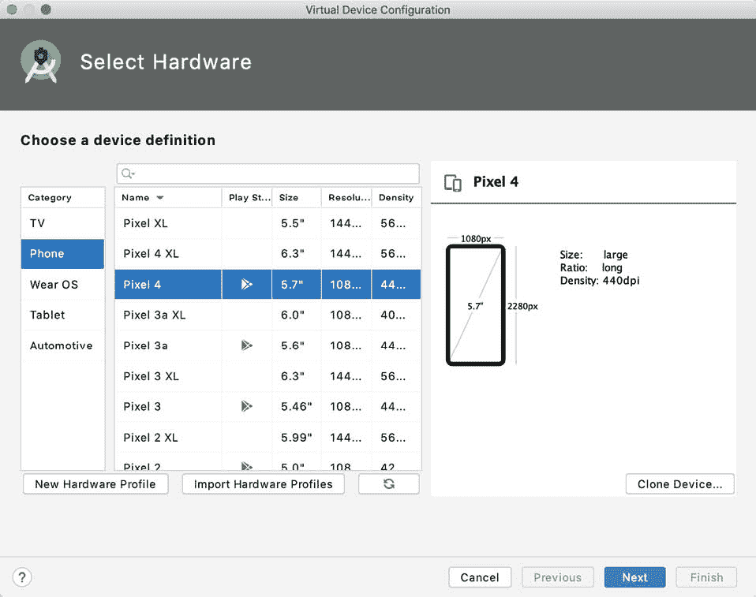
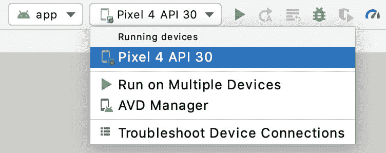
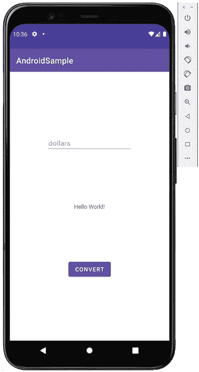
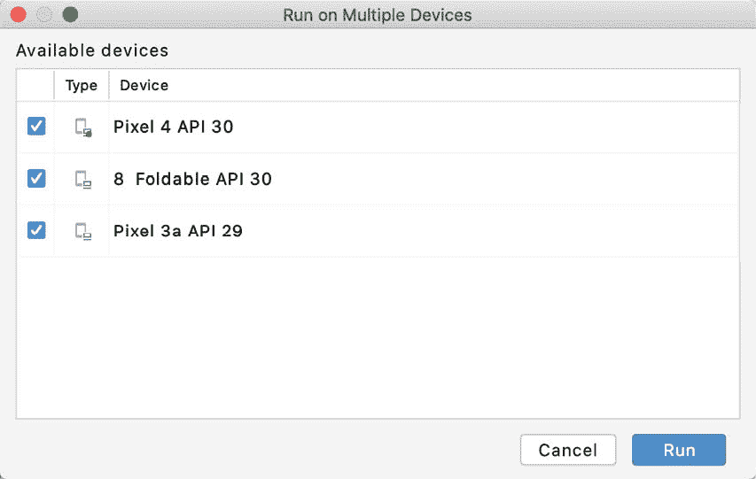
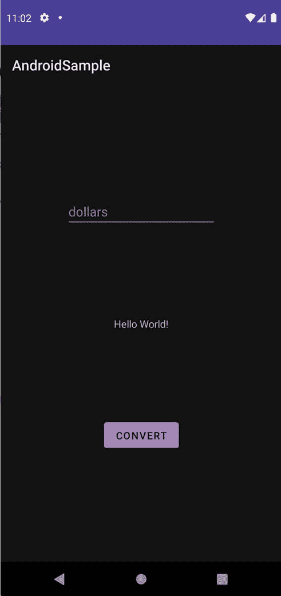
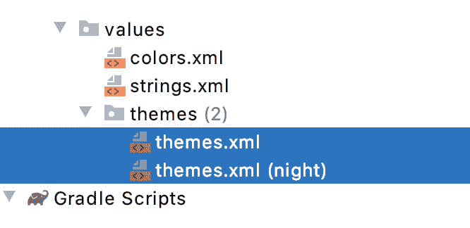
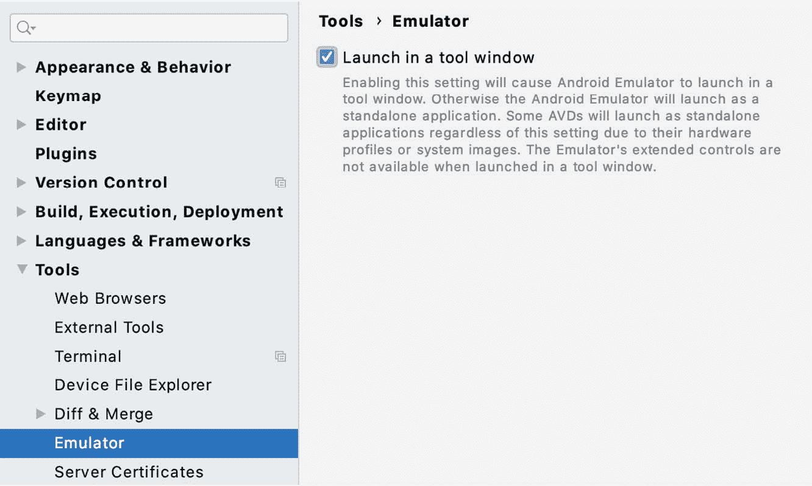
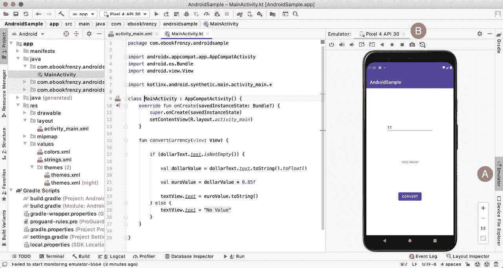

4\. 在AndroidStudio创建安卓虚拟设备(AVD)

在AndroidStudio开发安卓应用的过程中，需要多次编译和运行一个应用。安卓应用可以通过在物理设备或安卓虚拟设备模拟器环境中安装和运行来测试。在使用 AVD 之前，必须首先创建和配置它，以匹配特定设备型号的规格。因此，本章的目标是通过使用 Pixel 4 手机作为参考示例来创建这样一个虚拟设备。

4.1 关于安卓虚拟设备

avd 本质上是模拟器，允许测试 Android 应用，而无需将应用安装在基于 Android 的物理设备上。AVD 可以被配置成模拟各种硬件特征，包括诸如屏幕尺寸、存储器容量以及诸如照相机、全球定位系统导航支持或加速度计等特征的存在或不存在的选项。作为标准AndroidStudio安装的一部分，安装了许多仿真器模板，允许为一系列不同的设备配置自动增值设备。通过指定处理器类型、内存容量以及屏幕大小和像素密度等属性，可以创建自定义配置来匹配任何物理安卓设备。

AVD 会话可以作为单独的窗口出现，也可以嵌入AndroidStudio窗口。[例如，图 4-1](#_idTextAnchor073) 显示了一个配置为模拟 Google Pixel 3 模型的 AVD 会话。

使用安卓虚拟设备管理器创建和管理新的自动增值设备，该管理器可以在命令行模式下使用，也可以使用更加用户友好的图形用户界面。



图 4-1

4.2 创建新的 AVD

为了在没有物理设备的情况下测试应用的行为，有必要为特定的安卓设备配置创建一个 AVD。

要创建一个新的 AVD ，第一步是启动 AVD 管理器。这可以在AndroidStudio环境中通过从主窗口中选择工具- > AVD 管理器菜单选项来实现。

一旦启动，如果没有创建现有的 AVD 实例，该工具将如图 4-2 所示:



图 4-2

要添加额外的 AVD，首先点击创建虚拟设备按钮，以调用虚拟设备配置对话框:



图 4-3

在对话框中，执行以下步骤来创建兼容 Pixel 4 的模拟器:

1.从“类别”面板中，选择“手机”选项以显示可用的安卓手机 AVD 模板列表。

2.选择像素 4 设备选项，然后单击下一步。

3.在系统映像屏幕上，为 x86 ABI 选择最新版本的安卓系统。请注意，如果系统映像尚未安装，将在版本名称旁边提供下载链接。选择系统映像之前，请单击此链接下载并安装它。如果您需要的映像未列出，请单击 x86 映像和其他映像选项卡查看替代列表。

4.单击“下一步”继续，并在名称字段中输入描述性名称(例如，Pixel 4 API 30)，或者简单地接受默认名称。

5.单击“完成”创建动静脉畸形。

6.创建自动增值设备后，自动增值设备管理器现在可能会关闭。如果将来需要对自动增值设备进行修改，只需重新打开自动增值设备管理器，从列表中选择自动增值设备，然后单击自动增值设备管理器中设备行的操作列中的铅笔图标。

4.3 启动仿真器

要执行新创建的 AVD 模拟器的测试运行，只需从 AVD 管理器中选择模拟器，然后单击启动按钮(操作列中的三角形)。模拟器将出现在新窗口中，并开始启动过程。仿真器启动所需的时间取决于 AVD 和运行它的系统的配置。

虽然模拟器可能默认以纵向显示，但这个和其他默认选项可以更改。在 AVD 管理器中，选择新的 Pixel 4 条目，然后单击设备行的“操作”列中的铅笔图标。在配置屏幕中，找到启动方向部分并更改方向设置。退出并重新启动模拟器会话，以查看此更改是否生效。模拟器的更多细节将在下一章中介绍([“使用和配置AndroidStudio AVD 模拟器”](05.html#_idTextAnchor102))。

为了节省本章下一节的时间，请在继续之前让模拟器保持运行。

4.4 在 AVD 中运行应用

配置了 AVD 仿真器后，前一章中创建的示例 AndroidSample 应用现在可以编译和运行了。将 AndroidSample 项目加载到 Android Studio 后，确保新创建的 Pixel 4 AVD 显示在设备菜单中(在下面的[图 4-4](#_idTextAnchor080) 中标记为 A)，然后单击绿色三角形代表的运行按钮(B)，选择运行- >运行“app”菜单选项或使用 Ctrl-R 键盘快捷键剪切:


图 4-4

设备菜单(A)可用于选择不同的 AVD 实例或物理设备作为运行目标，也可用于在多个设备上运行应用。该菜单还提供了对自动电压调节器管理器和设备连接故障排除选项的访问:



图 4-5

一旦应用安装并运行，第一个片段的用户界面将出现在模拟器中(片段是安卓项目的可重用部分，通常由用户界面布局和一些代码组成，这一主题将在后面题为[“安卓片段简介”](37.html#_idTextAnchor800)的章节中介绍):



图 4-6

如果活动没有自动启动，请检查启动图标是否出现在模拟器的应用中。如果有，只需点击它启动应用。运行过程开始后，运行工具窗口将变为可用。安装和启动应用包时，“运行工具”窗口将显示诊断信息。[图 4-7](#_idTextAnchor083) 显示了成功启动应用后的运行工具窗口输出:


图 4-7

如果在启动过程中遇到问题，运行工具窗口将提供有助于找出问题原因的信息。

假设应用加载到模拟器中并按预期运行，我们已经安全地验证了安卓开发环境的安装和配置是正确的。

4.5 在多个设备上运行

上面[图 4-5](#_idTextAnchor081) 中显示的运行菜单包括一个在多个仿真器和设备上并行运行应用的选项。选择该选项后，将显示如图 4-8[所示的对话框，提供系统上配置的自动增值设备和任何连接的物理设备的列表。在单击“运行”按钮之前，启用要作为目标的仿真器或设备旁边的复选框:](#_idTextAnchor085)



图 4-8

点击运行按钮后，AndroidStudio将在选定的模拟器和设备上启动该应用。

4.6 停止正在运行的应用

要停止正在运行的应用，只需点击位于主工具栏中的停止按钮，如图[图 4-9](#_idTextAnchor087) :


图 4-9

也可以使用运行工具窗口终止应用。首先，使用应用运行时可用的窗口栏按钮显示运行工具窗口。运行工具窗口出现后，点击[图 4-10](#_idTextAnchor089) 下图中突出显示的停止按钮:


图 4-10

4.7 支持黑暗主题

安卓 10 引入了人们期待已久的黑暗主题，默认情况下，AndroidStudio应用项目不支持该主题。要在 AVD 模拟器中测试黑暗主题，请在模拟器中运行的安卓实例中打开设置应用。有许多不同的方法可以访问设置应用。最快的方法是显示主屏幕，然后单击并从屏幕底部向上拖动(就在搜索栏下方)。这将显示设备上安装的所有应用，其中一个是设置应用。

在设置应用中，选择显示类别，启用深色主题选项，如图[图 4-11](#_idTextAnchor092) 所示，使屏幕背景变黑:


图 4-11

启用深色主题后，运行 AndroidSample 应用，注意按钮上显示的深色主题包括黑色背景和紫色背景颜色，如图 4-12 所示:



图 4-12

明暗模式使用的主题在主题中声明。xml 文件位于 app -> res -> values ->主题下的项目工具窗口中，如图 4-13 所示:



图 4-13

themes.xml 文件包含日间模式的主题，而 themes.xml(夜间)文件包含当设备处于黑暗模式时应用采用的主题，内容如下:

```kt
<resources xmlns:tools="http://schemas.android.com/tools">
    <!-- Base application theme. -->
    <style name="Theme.AndroidSample" parent="Theme.MaterialComponents.DayNight.DarkActionBar">
        <!-- Primary brand color. -->
        <item name="colorPrimary">@color/purple_200</item>
        <item name="colorPrimaryDark">@color/purple_700</item>
        <item name="colorOnPrimary">@color/black</item>
        <!-- Secondary brand color. -->
        <item name="colorSecondary">@color/teal_200</item>
        <item name="colorSecondaryVariant">@color/teal_200</item>
        <item name="colorOnSecondary">@color/black</item>
        <!-- Status bar color. -->
        <item name="android:statusBarColor" tools:targetApi="l">?attr/colorPrimaryVariant</item>
        <!-- Customize your theme here. -->
    </style>
</resources>
```

使用编辑器檐槽中的颜色方块来使用颜色选择器，尝试颜色变化(例如，尝试颜色主资源的不同颜色)。进行更改后，再次运行应用以查看更改。

体验完主题后，在模拟器中打开“设置”应用，关闭黑暗模式并返回到“安卓样本”应用。这款应用应该会自动切换回灯光模式。

4.8 在工具窗口中运行模拟器

到目前为止，在本章中，我们只使用模拟器作为独立的窗口。模拟器也可以作为嵌入AndroidStudio主窗口的工具窗口运行。要嵌入模拟器，请选择文件->设置...菜单选项(AndroidStudio->首选项...在 macOS 上)，导航到首选项对话框左侧导航面板中的工具->仿真器，并启用在工具窗口中启动选项:



图 4-14

启用该选项后，单击“应用”按钮，然后单击“确定”提交更改，然后退出独立的模拟器会话。

再次运行示例应用，此时模拟器将出现在AndroidStudio窗口内，如图[图 4-15](#_idTextAnchor096) :



图 4-15

要隐藏和显示模拟器工具窗口，请单击模拟器工具窗口按钮(上面标记为 A)。单击选项卡(B)旁边的“x”关闭按钮退出模拟器。模拟器工具窗口可以容纳多个模拟器会话，每个会话由一个选项卡表示。[例如，图 4-16](#_idTextAnchor097) 显示了具有两个模拟器会话的工具窗口:


图 4-16

要在会话之间切换，只需单击相应的选项卡。

4.9 AVD 命令行创建

如前所述，除了图形用户界面之外，还可以直接从命令行创建一个新的 AVD。这是通过结合一些命令行选项使用 avdmanager 工具来实现的。一旦启动，该工具将在创建新的动静脉畸形之前提示附加信息。

avdmanager 工具需要访问 Java 运行时环境(JRE)才能运行。如果在尝试运行 avdmanager 时，出现一条错误消息，指示找不到“java”命令，则可以将运行该命令的命令提示符或终端窗口配置为使用与 Android Studio 捆绑的 OpenJDK 环境。首先确定 OpenJDK JRE 的位置，如下所示:

1.启动AndroidStudio，打开本书前面创建的安卓样本项目。

2.选择文件->项目结构...菜单选项。

3.复制“项目结构”对话框的“JDK 位置”字段中包含的路径。这代表了与AndroidStudio捆绑的 JRE 的位置。

在 Windows 上，在运行 avdmanager 的命令提示窗口中执行以下命令(其中<path to="" jre="">被从上面的“项目结构”对话框中复制的路径替换):</path>

```kt
set JAVA_HOME=<path to jre>
```

在 macOS 或 Linux 上，执行以下命令:

```kt
export JAVA_HOME="<path to jre>"
```

如果您希望经常使用 avdmanager 工具，请遵循标题为[“设置 Android Studio 开发环境”](02.html#_idTextAnchor005)一章中概述的操作系统环境变量步骤，在系统范围内配置 JAVA_HOME。

假设系统已被配置为使 Android SDK 工具目录包含在 PATH 环境变量中，则可以通过在终端或命令窗口中发出以下命令来获得新 AVD 的可用目标列表:

```kt
avdmanager list targets
```

上述命令的结果输出将包含系统上可用的安卓软件开发工具包版本列表。例如:

```kt
Available Android targets:
----------
id: 1 or "android-29"
     Name: Android API 29
     Type: Platform
     API level: 29
     Revision: 1
----------
id: 2 or "android-26"
     Name: Android API 26
     Type: Platform
     API level: 26
     Revision: 1
```

avdmanager 工具还允许从命令行创建新的 AVD 实例。例如，要使用 x86 ABI 的安卓API级别 29 设备的目标标识创建一个名为 myAVD 的新 AVD，可以使用以下命令:

```kt
avdmanager create avd -n myAVD -k "system-images;android-29;google_apis_playstore;x86"
```

安卓工具将根据基本安卓 8 设备所需的规格创建新的 AVD，如果需要，还提供了创建自定义配置以匹配特定设备规格的选项。一旦从命令行创建了新的 AVD，它可能不会显示在安卓设备管理器工具中，直到单击刷新按钮。

除了创建新的反车辆地雷之外，还可以从命令行执行许多其他任务。例如，可以使用列表 avd 命令行参数获得当前可用 avd 的列表:

```kt
avdmanager list avd

Available Android Virtual Devices:
    Name: Pixel_XL_API_28_No_Play
  Device: pixel_xl (Google)
    Path: /Users/neilsmyth/.android/avd/Pixel_XL_API_28_No_Play.avd
  Target: Google APIs (Google Inc.)
          Based on: Android API 28 Tag/ABI: google_apis/x86
    Skin: pixel_xl_silver
  Sdcard: 512M
```

同样，要删除现有的自动增值设备，只需使用删除选项，如下所示:

```kt
avdmanager delete avd –n <avd name>
```

4.10 安卓虚拟设备配置文件

默认情况下，与 AVD 相关联的文件存储在。用户主目录的 android/avd 子目录，其结构如下(其中<avd name="">替换为分配给 avd 的名称):</avd>

```kt
<avd name>.avd/config.ini
<avd name>.avd/userdata.img
<avd name>.ini
```

config.ini 文件包含设备配置设置，例如在 AVD 创建过程中指定的显示尺寸和内存。这些设置可以直接在配置文件中更改，并将在下一次调用时被 AVD 采用。

<avd name="">。ini 文件包含对目标 Android SDK 的引用和 AVD 文件的路径。请注意，对 config.ini 文件中 image.sysdir 值的更改也需要反映在该文件的目标值中。</avd>

4.11 移动和重命名安卓虚拟设备

AVD 文件的当前名称或位置可以使用 avdmanager 工具的 move avd 参数从命令行更改。例如，要将名为 Nexus9 的 AVD 重命名为 Nexus9B，可以执行以下命令:

```kt
avdmanager move avd -n Nexus9 -r Nexus9B
```

要在物理上重新定位与 AVD 相关联的文件，应使用以下命令语法:

```kt
avdmanager move avd -n <avd name> -p <path to new location>
```

例如，要将 AVD 从其当前文件系统位置移动到/tmp/Nexus9Test:

```kt
avdmanager move avd -n Nexus9 -p /tmp/Nexus9Test
```

请注意，在执行移动 AVD 的命令之前，目标目录不得已经存在。

4.12 总结

典型的应用开发过程遵循在测试环境中编码、编译和运行的循环。安卓应用可以在物理安卓设备上测试，也可以使用安卓虚拟设备模拟器测试。AVD 是使用 Android AVD 管理器工具创建和管理的，该工具可以用作命令行工具，也可以使用图形用户界面。当创建一个 AVD 来模拟一个特定的 Android 设备模型时，重要的是虚拟设备要配置一个与物理设备相匹配的硬件规格。

AVD 模拟器会话可以显示为独立窗口，也可以嵌入主AndroidStudio用户界面。