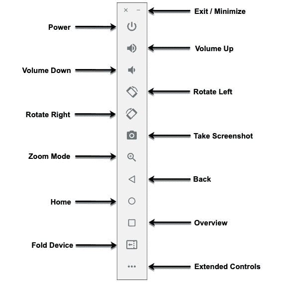
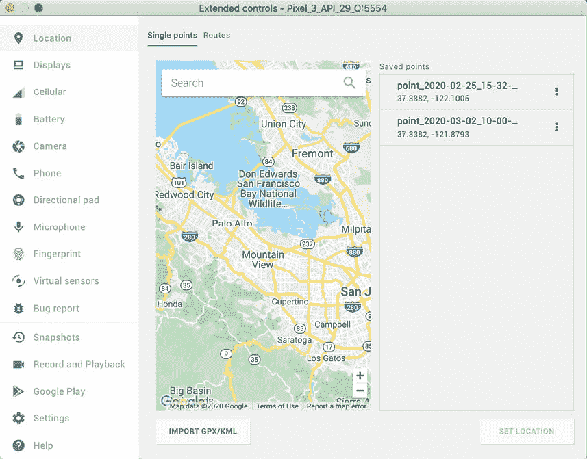
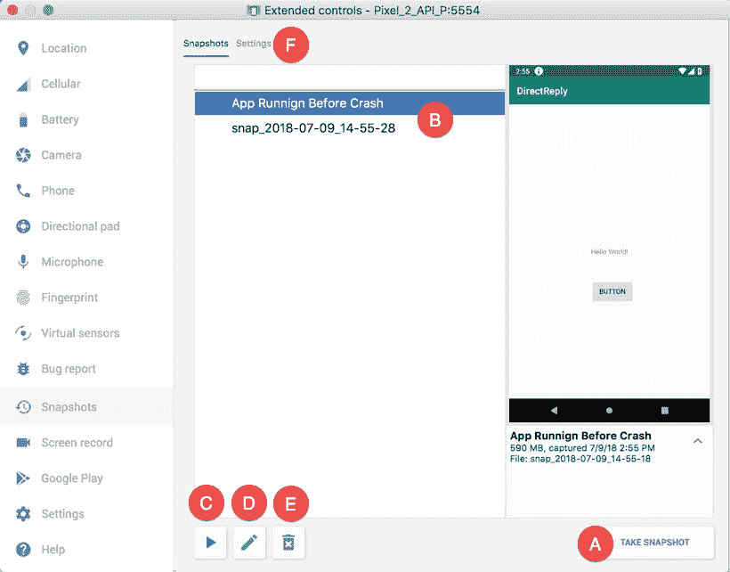
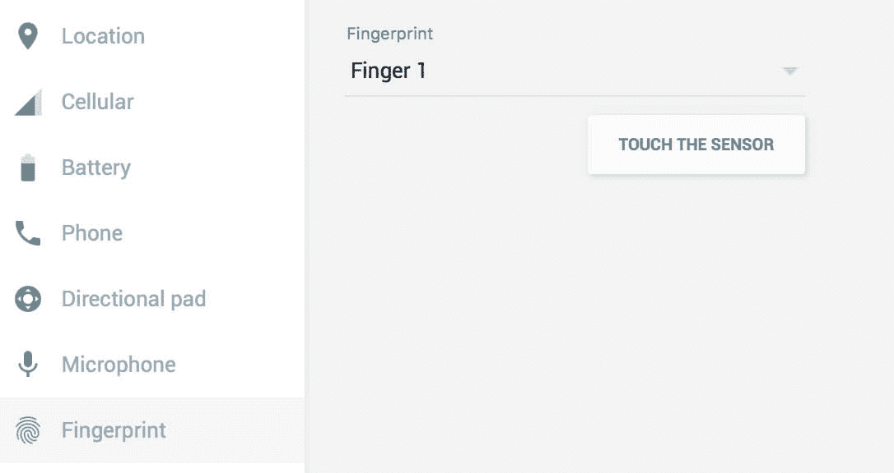
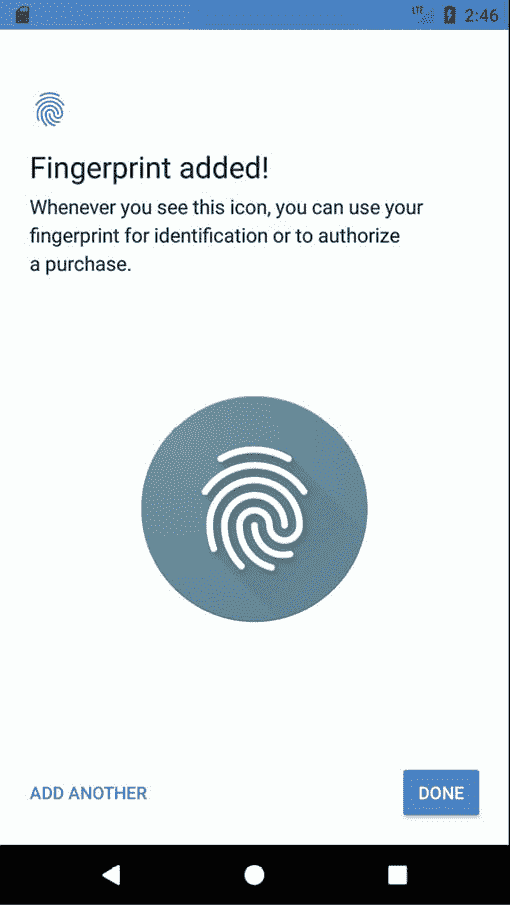

5\. 使用和配置安卓工作室 AVD 模拟器

在下一章探讨在物理安卓设备上进行测试之前，本章将花一些时间来概述安卓工作室 AVD 仿真器，并重点介绍许多可用于在独立模式和工具窗口模式下定制环境的配置功能。

5.1 仿真器环境

在独立模式下启动时，仿真器在加载过程中会显示初始启动屏幕。加载后，主仿真器窗口出现，包含所选设备类型的表示(在[图 5-1](#_idTextAnchor105) 的情况下，这是一个像素 4 设备):

图 5-1

工具栏位于窗口的右边，可以快速访问模拟器控件和配置选项。

5.2 仿真器 工具栏选项

仿真器工具栏([图 5-2](#_idTextAnchor107) )提供了一系列与仿真器环境的外观和行为相关的选项。

图 5-2

工具栏中的每个按钮都与一个键盘快捷键相关联，可以通过将鼠标指针悬停在按钮上并等待工具提示出现，或者通过扩展控制面板的帮助选项来识别该快捷键。

尽管工具栏中包含的许多选项是不言自明的，但为了完整起见，每个选项都将包括在内:

退出/最小化–工具栏中最上面的“x”按钮在被选中时退出模拟器会话，而“-”选项最小化整个窗口。

电源–电源按钮模拟物理安卓设备上的硬件电源按钮。点击并释放此按钮将锁定设备并关闭屏幕。点击并按住此按钮将启动设备“关机”请求序列。

音量增大/减小–两个按钮，用于控制模拟器环境中播放的音量。

向左/向右旋转–在纵向和横向之间旋转仿真设备。

截图–截图设备屏幕上当前显示的内容。捕获的图像存储在扩展控制面板的设置屏幕中指定的位置，如本章下文所述。

缩放模式–该按钮可切换缩放模式，其细节将在本章后面介绍。

后退–模拟选择标准安卓“后退”按钮。与下面概述的主页和概览按钮一样，通过选择模拟器屏幕上的实际按钮可以获得相同的结果。

主页–模拟选择标准安卓“主页”按钮。

概述–模拟选择标准安卓“概述”按钮，该按钮显示设备上当前运行的应用程序。

折叠设备–模拟可折叠设备的折叠和展开。仅当模拟器运行可折叠设备系统映像时，此选项才可用。

扩展控制–显示扩展控制面板，允许配置选项，如模拟位置和电话活动、电池电量、蜂窝网络类型和指纹识别。

5.3 在变焦模式下工作

模拟器工具栏中的缩放按钮可以切换缩放模式。当缩放模式激活时，工具栏按钮被按下，鼠标指针在设备屏幕上悬停时显示为放大镜。单击鼠标左键将导致显示器相对于屏幕上的选定点放大，重复单击将增加缩放级别。相反，单击鼠标右键会降低缩放级别。关闭缩放按钮会将显示恢复为默认大小。

在缩放模式下单击并拖动将定义一个矩形区域，当释放鼠标按钮时，视图将缩放到该区域。

在缩放模式下，可以使用模拟器窗口中的水平和垂直滚动条来平移屏幕的可视区域。

5.4 调整仿真器窗口的大小

通过单击并拖动窗口的任何角落或侧面，可以随时更改仿真器窗口的大小(以及设备的相应表示)。

5.5 扩展控制选项

扩展控件工具栏按钮显示如图 5-3 所示的面板。默认情况下，将显示位置设置。从左侧面板选择不同的类别将显示相应的控制组:

图 5-3

5.5.1 位置

位置控制允许模拟的位置信息以十进制或十六进制坐标的形式发送到仿真器。位置信息可以采取单个位置的形式，或者代表设备移动的一系列点的形式，后者通过全球定位系统交换(GPX)或钥匙孔标记语言(KML)格式的文件提供。或者，集成的谷歌地图面板可用于可视地选择单点或旅行路线。

5.5.2 显示

除了模拟器屏幕中显示的主显示外，“显示”选项还允许在同一安卓实例中添加运行的其他显示。这对于测试双屏设备(如微软 Surface Duo)的应用程序非常有用。这些附加屏幕可以配置为任何所需的大小，并显示在与主屏幕相同的模拟器窗口中。

5.5.3 细胞

正在模拟的蜂窝连接类型可以在蜂窝设置屏幕中更改。除了漫游和拒绝访问等一系列语音和数据场景外，还提供了模拟不同网络类型(CSM、EDGE、HSDPA 等)的选项。

5.5.4 电池

在扩展控制屏幕的这个面板上，可以模拟各种电池状态和充电条件，包括电池充电水平、电池健康状况以及交流充电器当前是否连接。

5.5.5 摄像机

当相机处于活动状态时，模拟器会模拟三维场景。这采用了虚拟建筑内部的形式，在录制视频时或在模拟器中拍摄照片之前，您可以在使用鼠标指针和键盘键的同时按住 Option 键(Windows 上的 Alt 键)进行导航。此扩展配置选项允许上传不同的图像以在虚拟环境中显示。

5.5.6 电话

手机扩展控件在模拟器中提供了两种非常简单但有用的模拟。第一个选项允许模拟来自指定电话号码的来电。这在测试应用程序处理这类高级中断的方式时特别有用。

第二个选项允许在模拟器会话中模拟文本消息的接收。与现实世界一样，这些消息出现在消息应用程序中，并在模拟器中触发标准通知。

5.5.7 方向垫

方向板(D-Pad)是一组额外的控件，要么内置在安卓设备中，要么连接到外部(如游戏控制器)，提供方向控制(左、右、上、下)。方向板设置允许在模拟器中模拟数字板交互。

5.5.8 麦克风

麦克风设置允许启用麦克风，并模拟虚拟耳机和麦克风连接。还提供了一个按钮来启动模拟器上的语音助手。

5.5.9 指纹

许多安卓设备现在都配备了内置的指纹检测硬件。AVD 仿真器使测试指纹认证成为可能，而不需要在包含指纹传感器的物理设备上测试应用程序。本章稍后将详细介绍如何在模拟器中配置指纹测试。

5.5.10 虚拟传感器

虚拟传感器选项允许模拟加速度计和磁力计，以通过偏航、俯仰和滚转设置来模拟设备的物理运动效果，例如旋转、移动和倾斜。

5.5.11 快照

快照包含要保存和快速恢复的当前运行的 AVD 会话的状态，这使得模拟器很容易恢复到精确状态。本章稍后将详细介绍快照。

5.5.12 记录和回放

允许模拟器屏幕和音频以 WebM 或动画 GIF 格式录制和保存。

5.5.13 谷歌游戏

如果模拟器运行的是安装了谷歌游戏服务的安卓版本，此选项会显示当前的谷歌游戏版本，并提供将模拟器更新到最新版本的选项。

5.5.14 设置

设置面板提供了一小组配置选项。使用此面板为工具栏和扩展控件面板选择较暗的主题，指定要保存屏幕截图的文件系统位置，配置 OpenGL 支持级别，并将模拟器窗口配置为显示在桌面上的其他窗口之上。

5.5.15 帮助

“帮助”屏幕包含三个子面板，其中包含键盘快捷键列表、访问仿真器在线文档的链接、文件错误和发送反馈以及仿真器版本信息。

5.6 使用快照

当模拟器第一次启动时，它会执行冷启动，就像物理安卓设备通电时一样。随着操作系统的加载和所有后台进程的启动，这个冷启动过程可能需要一些时间才能完成。为了避免每次仿真器启动时都必须经历这个过程，系统被配置为每次退出时自动保存仿真器当前状态的快照(称为快速启动快照)。下次启动模拟器时，快速启动快照将加载到内存中，执行将从之前停止的地方恢复，从而允许模拟器在冷启动完成所需时间的一小部分内重新启动。

扩展控制面板的快照屏幕可用于在模拟器执行期间的任何时间点存储附加快照。这将保存整个模拟器的确切状态，从而允许模拟器恢复到拍摄快照的确切时间点。从屏幕内，可以使用拍摄快照按钮(在[图 5-4](#_idTextAnchor130) 中标记为 A)拍摄快照。要恢复现有快照，请从列表(B)中选择它，然后单击屏幕底部的运行按钮(C)。还提供了编辑(D)快照名称和描述以及删除(E)当前选定快照的选项:

图 5-4

设置选项(F)提供了配置快速启动快照自动保存(默认情况下，每次模拟器退出时模拟器都会询问是否保存快速启动快照)和重新加载最新快照的选项。要强制模拟器会话执行冷启动，而不是使用以前的快速启动快照，请打开 AVD 管理器(“工具”->“AVD 管理器”)，单击模拟器“操作”列中的向下箭头，并选择“立即冷启动”菜单选项。

图 5-5

5.7 配置指纹仿真

该模拟器允许配置多达 10 个模拟指纹，并用于测试安卓应用程序中的指纹认证。要配置模拟指纹，首先启动模拟器，打开设置应用程序并选择安全和位置选项。

在安全设置屏幕中，选择使用指纹选项。在生成的信息屏幕上，单击下一步按钮进入指纹设置屏幕。在启用指纹安全之前，必须配置备用屏幕解锁方法(如个人识别码)。单击“指纹+个人识别码”按钮，当出现提示时，选择在设备启动时不需要个人识别码。输入并确认合适的个人识别码，并通过接受默认通知选项完成个人识别码输入过程。

继续浏览其余屏幕，直到设置应用程序请求传感器上的指纹。此时显示扩展控件对话框，在左侧面板中选择指纹类别，并确保在主设置面板中选择了手指 1:

图 5-6

单击触摸传感器按钮，模拟手指 1 触摸指纹传感器。模拟器将报告指纹添加成功:

图 5-7

要添加更多指纹，请单击添加另一个按钮，并从扩展控制面板菜单中选择另一个手指，然后再次单击触摸传感器按钮。在名为[“安卓生物认证教程”](89.html#_idTextAnchor1659)的章节中详细介绍了将指纹认证构建到安卓应用中的主题。

5.8 工具窗口模式下的仿真器

如前一章([“在 Android Studio 中创建 Android 虚拟设备(AVD)”](04.html#_idTextAnchor068))所述，Android Studio 可以配置为以嵌入式工具窗口的形式启动模拟器，这样就不会出现在单独的窗口中。在此模式下运行时，工具栏中提供了独立模式下可用控件的一小部分，如图 5-8[所示:](#_idTextAnchor133)

图 5-8

从左到右，这些按钮执行以下任务(其详细信息与独立模式的任务相匹配):

电源

音量增大

降低音量

向左旋转

向右旋转

背部

家

概述

快照

5.9 总结

安卓工作室 4.2 包含一个安卓虚拟设备模拟器环境，旨在更容易地测试应用程序，而不需要在物理安卓设备上运行。本章简要介绍了模拟器，并强调了可用于配置和定制环境以模拟不同测试条件的关键功能。