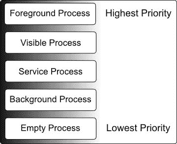
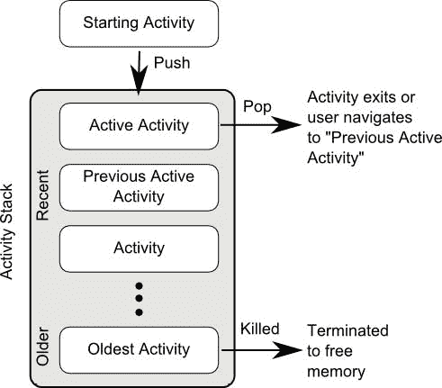

# 十九、了解安卓应用和活动生命周期

在前面的章节中，我们已经了解到安卓应用在进程中运行，它们由活动、服务和广播接收器形式的多个组件组成。本章的目标是通过查看安卓运行时系统中应用和活动的生命周期来扩展这些知识。

不管与过去的桌面系统相比，今天的移动设备拥有多少内存和计算能力，重要的是要记住，根据现代基于台式机和笔记本电脑的系统的标准，这些设备仍然被认为是“资源受限的”，尤其是在内存方面。因此，安卓系统的一个关键责任是确保这些有限的资源得到有效管理，并且操作系统和运行在其上的应用始终响应用户。为了实现这一点，安卓被赋予了对应用运行过程以及组成这些应用的各个组件的生命周期和状态的完全控制。

因此，开发安卓应用的一个重要因素是了解安卓的应用和活动生命周期管理模型，以及应用在执行期间对可能强加给它的状态变化做出反应的方式。

19.1 安卓应用和资源管理

操作系统将每个运行的安卓应用视为一个独立的进程。如果系统识别出设备上的资源正在达到容量，它将采取步骤终止进程以释放内存。

在决定终止哪个进程以释放内存时，系统会同时考虑所有当前正在运行的进程的优先级和状态，并结合这些因素来创建一个被谷歌称为重要性层次的层次结构。然后，进程从最低优先级开始终止，并在层次结构中向上运行，直到为系统运行释放了足够的资源。

19.2 安卓进程状态

进程承载应用，应用由组件组成。在安卓系统中，进程的当前状态由它所托管的应用中排名最高的活动组件来定义。如[图 19-1](#_idTextAnchor400) 所示，在任何给定时间，一个过程可以处于以下五种状态之一:

图 19-1

19.2.1 前台流程

这些进程被赋予最高的优先级。在任何时候，都不可能有一个或两个以上的前台进程处于活动状态，这些进程通常是最后被系统终止的。流程必须满足以下一个或多个标准，才有资格获得前台状态:

主持用户当前正在与之互动的活动。

托管与用户交互的活动相关的服务。

托管一项服务，该服务通过调用 startForeground()，表示终止将会中断用户体验。

托管执行 onCreate()、 onResume()、或 onStart()回调的服务。

主持当前正在执行 onReceive()方法的广播接收器。

19.2.2 可见过程

包含对用户可见但不是用户与之交互的活动的过程被分类为“可见过程”。当流程中的一个活动对用户可见，但另一个活动(如部分屏幕或对话框)在前台时，通常会出现这种情况。如果流程承载的服务本身绑定到可见或前台活动，则该流程也有资格获得可见状态。

19.2.3 服务流程

包含已经启动并正在执行的服务的进程。

19.2.4 后台流程

包含一个或多个用户当前不可见的活动，并且不托管符合服务流程状态的服务的流程。属于这一类别的进程在需要为更高优先级的进程释放额外内存时，终止的风险很高。安卓维护一个后台进程的动态列表，按照时间顺序终止进程，这样最近最少出现在前台的进程会先被杀死。

19.2.5 清空流程

空进程不再包含任何活动的应用，而是保存在内存中，准备作为新启动的应用的主机。这有点类似于在乘客到来之前保持车门打开，发动机在公交车上运转。显然，这样的进程被认为是最低优先级的，并且最先被杀死以释放资源。

19.3 进程间依赖关系

确定最高优先级流程的情况比上一节中概述的要稍微复杂一些，原因很简单，流程往往是相互依赖的。这样，当确定进程的优先级时，安卓系统还将考虑该进程是否以某种方式服务于另一个更高优先级的进程(例如，充当前台进程的内容提供商的服务进程)。作为一个基本规则，安卓文档声明一个进程的排名永远不能低于它当前服务的另一个进程。

19.4 活动生命周期

正如我们之前所确定的，安卓进程的状态很大程度上是由组成它所托管的应用的活动和组件的状态决定的。因此，重要的是要理解，在应用的执行生命周期中，这些活动也会通过不同的状态进行转换。活动的当前状态在某种程度上是由它在活动堆栈中的位置决定的。

19.5 活动堆栈

对于在安卓设备上运行的每个应用，运行时系统维护一个活动堆栈。当应用启动时，要启动的第一个应用活动被放在堆栈上。当第二个活动开始时，它被放在堆栈的顶部，并且前一个活动被下推。堆栈顶部的活动称为活动(或运行)活动。当活动活动退出时，运行时会将其弹出堆栈，堆栈中位于其正下方的活动将成为当前活动活动。例如，堆栈顶部的活动可能会退出，因为它负责的任务已经完成。或者，用户可能已经在屏幕上选择了“返回”按钮以返回到先前的活动，导致当前活动被运行时系统弹出堆栈并因此被破坏。安卓活动堆栈的可视化表示如图 19-2 所示。

如图所示，新活动在启动时会被推到堆栈的顶部。当前活动活动位于堆栈的顶部，直到它被新活动推下堆栈，或者在退出堆栈或用户导航到前一个活动时弹出堆栈。如果资源变得受限，运行时将终止活动，从堆栈底部的活动开始。

活动堆栈在编程术语中被称为后进先出(LIFO)堆栈，即最后一个被推入堆栈的项目是第一个被弹出的项目。

图 19-2

19.6 活动状态

活动在应用中执行的过程中可以处于多种不同状态之一:

活动/运行–活动位于活动堆栈的顶部，是设备屏幕上可见的前台任务，有焦点，当前正在与用户交互。在资源短缺的情况下，这是最不可能终止的活动。

暂停–用户可以看到该活动，但当前没有焦点(通常是因为该活动被当前活动的活动部分遮挡)。暂停的活动保存在内存中，保持与窗口管理器的连接，保留所有状态信息，并且当移动到活动堆栈的顶部时，可以快速恢复到活动状态。

停止-用户当前看不到该活动(换句话说，它在设备显示屏上被其他活动完全遮挡)。与暂停的活动一样，它保留所有状态和成员信息，但在内存不足的情况下，终止的风险更高。

已取消–为了释放内存，运行时系统已经终止了该活动，并且该活动不再出现在活动堆栈上。如果应用需要，这些活动必须重新启动。

19.7 配置变更

到目前为止，在本章中，我们已经研究了安卓活动状态变化的两个原因，即活动在前台和后台之间的移动，以及运行时系统为了释放内存而终止活动。事实上，还有第三种情况，在这种情况下，活动的状态可能会发生巨大变化，这涉及到设备配置的变化。

默认情况下，任何影响活动外观的配置更改(如在纵向和横向之间旋转设备方向，或更改系统字体设置)都会导致活动被破坏和重新创建。这背后的原因是，这些更改会影响用户界面布局等资源，简单地销毁和重新创建受影响的活动是活动响应配置更改的最快方式。但是，可以配置一个活动，以便系统不会响应特定的配置更改而重新启动它。

19.8 处理状态变化

如果没有别的，从这一章应该很清楚，一个应用，根据定义，其中包含的组件将在其生命周期内通过许多状态转换。特别重要的是，这些状态变化(直到并包括完全终止)是由安卓运行时根据用户的操作和设备上资源的可用性强加给应用的。

然而，在实践中，这些状态变化并不是完全在没有通知的情况下强加的，在大多数情况下，运行时系统会通知应用这些变化，并给予相应的反应机会。这通常包括保存或恢复内部数据结构和用户界面状态，从而允许用户在应用之间无缝切换，并至少提供多个并发运行的应用的外观。

安卓提供了两种方法来处理应用中对象生命周期状态的变化。一种方法是响应来自操作系统的状态改变方法调用，这将在下一章[“处理安卓活动状态改变”](20.html#_idTextAnchor414)中详细介绍。

谷歌推荐的一种新方法涉及 Jetpack Android Architecture 组件中包含的生命周期类，该方法在[“使用 Jetpack 的现代 Android 应用架构”](39.html#_idTextAnchor835)中介绍，并在标题为[“使用 Android 生命周期感知组件”](45.html#_idTextAnchor910)的章节中有更详细的解释。

19.9 总结

移动设备通常被认为是资源受限的，尤其是在板载内存容量方面。因此，安卓操作系统的首要责任是确保应用和操作系统总体上保持对用户的响应。

应用在进程内托管在安卓系统上。每个应用又由活动和服务形式的组件组成。

安卓运行时系统有能力终止进程和单个活动，以释放内存。运行时系统在决定一个进程是否适合终止时会考虑进程状态。流程的状态很大程度上取决于该流程所承载的活动的状态。

本章的关键信息是，应用在其执行生命周期中会经历各种状态，并且在安卓运行时环境中对其命运几乎没有控制权。那些不直接与用户交互的进程和活动面临着被运行时系统终止的更高风险。因此，安卓应用开发的一个基本要素是应用响应操作系统状态变化通知的能力。