24\. AndroidStudio布局编辑器工具指南

很难想到一个不需要某种形式的用户界面的安卓应用概念。大多数安卓设备都配备了触摸屏和键盘(虚拟的或物理的)，敲击和滑动是用户和应用之间交互的主要形式。这些交互总是通过应用的用户界面进行的。

一个设计和实现良好的用户界面是创建一个成功和受欢迎的安卓应用的重要因素，它可以从简单到极其复杂，这取决于单个应用的设计要求。无论复杂程度如何，AndroidStudio布局编辑器工具都显著简化了设计和实现安卓用户界面的任务。

24.1 基本与空活动模板

正如标题为[【安卓应用剖析】](10.html#_idTextAnchor236)的章节所述，安卓应用由一个或多个活动组成。活动是应用功能的独立模块，通常与单个用户界面屏幕直接相关。因此，当使用AndroidStudio布局编辑器时，我们总是在为一个活动设计布局。

当创建一个新的AndroidStudio项目时，有许多不同的模板可以用作主活动用户界面的起点。这些模板中最基本的是“基本活动”和“空活动”模板。虽然乍一看这些似乎相似，但这两种选择之间实际上有相当大的差异。要在布局编辑器中查看这些差异，请使用视图选项菜单启用显示系统用户界面，如下图[24-1](#_idTextAnchor471)所示:

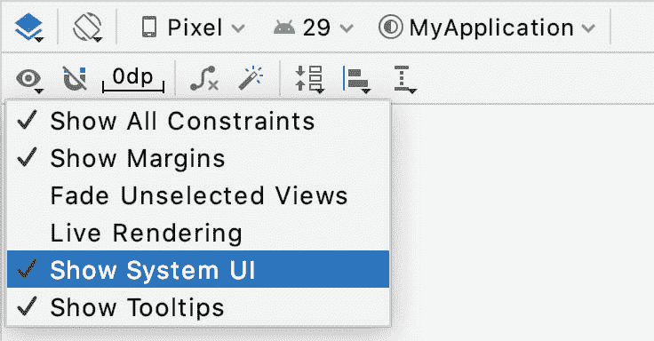

图 24-1

空活动模板创建一个布局文件，该文件由包含文本视图对象的约束布局管理器实例组成，如图 24-2 所示:


图 24-2

另一方面，基本活动由多个布局文件组成。顶层布局文件有一个作为根视图的 CoordinatorLayout、一个出现在设备屏幕顶部的可配置应用栏(也称为操作栏)(在[图 24-3](#_idTextAnchor475) 中标记为 A)和一个浮动操作按钮(标记为 B 的电子邮件按钮)。除了这些项目之外，activity_main.xml 布局文件还包含对名为 content_main.xml 的第二个文件的引用，该文件包含内容布局(标记为 C):

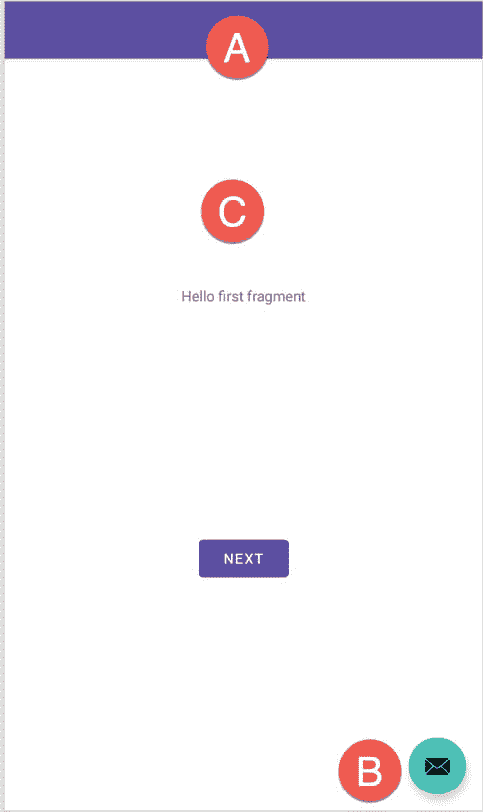

图 24-3

基本活动包含两个屏幕的布局，两个屏幕都包含一个按钮和一个文本视图。该模板的目的是演示如何在应用中的多个屏幕之间实现导航。如果要运行使用基本活动模板的未修改的应用，将出现这两个屏幕中的第一个(在[图 24-4](#_idTextAnchor476) 中标记为 A)。按下“下一步”按钮，将导航到第二个屏幕，该屏幕又包含一个返回第一个屏幕的按钮:

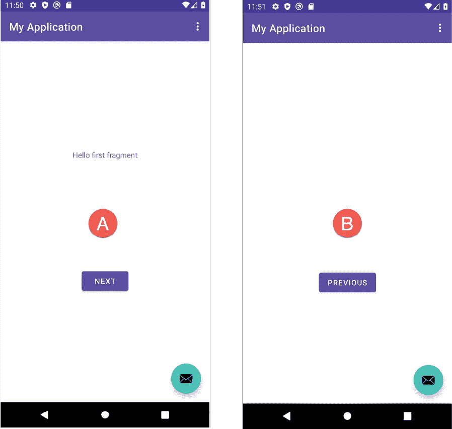

图 24-4

这种应用行为利用了两个安卓特性，即片段和导航，这两个特性将分别从标题为[“安卓片段简介”](37.html#_idTextAnchor800)和[“导航架构组件概述”](47.html#_idTextAnchor929)的章节开始介绍。

content_main.xml 文件包含一个称为导航主机片段的特殊片段，它允许根据 res -> layout -> nav_graph.xml 文件中配置的设置，在视图中切换不同的内容。在基本活动模板的情况下，nav_graph.xml 文件被配置为基于用户做出的“下一个”和“上一个”按钮选择，在 fragment_first.xml 和 fragment_second.xml 文件中定义的用户界面布局之间切换。

显然，如果您在活动中既不需要浮动操作按钮，也不需要菜单，并且不需要 CoordinatorLayout 提供的特殊应用栏行为，例如在某些滚动操作期间使应用栏和工具栏从视图中折叠的选项(标题为[“使用应用栏和折叠工具栏布局”](57.html#_idTextAnchor1123))一章中包含的主题)，则“空活动”模板非常有用。然而，基本活动是有用的，因为它默认提供这些元素。事实上，使用基本活动模板创建新活动并删除不需要的元素通常比使用空活动模板并手动实现诸如折叠工具栏、菜单或浮动操作按钮等行为更快。

由于本书中并非所有示例都需要基本活动模板的功能，因此本章中的大多数示例都将使用空活动模板，除非该示例需要基本活动模板提供的一个或多个功能。

为了将来参考，如果您需要一个菜单，但不需要浮动操作按钮，请使用基本活动并按照以下步骤删除浮动操作按钮:

1.双击 app -> res -> layout 下项目工具窗口中的主 activity_main.xml 布局文件，将其加载到布局编辑器中。将布局加载到布局编辑器工具中，选择浮动操作按钮，然后轻按键盘上的删除键，从布局中移除对象。

2.找到并编辑该活动的 Kotlin 代码(位于 app -> java -> <package name="">-> <activity class="" name="">下)，并从 onCreate 方法中删除浮动操作按钮代码，如下所示:</activity></package>

```kt
override fun onCreate(savedInstanceState: Bundle?) {
    super.onCreate(savedInstanceState)

    binding = ActivityMainBinding.inflate(layoutInflater)
    setContentView(binding.root)

    setSupportActionBar(binding.toolbar)

    val navController = findNavController(R.id.nav_host_fragment_content_main)
    appBarConfiguration = AppBarConfiguration(navController.graph)
    setupActionBarWithNavController(navController, appBarConfiguration)

    binding.fab.setOnClickListener { view ->
        Snackbar.make(view, "Replace with your own action", Snackbar.LENGTH_LONG)
            .setAction("Action", null).show()
    }
}
```

如果您需要一个浮动操作按钮但没有菜单，请使用基本活动模板并按照以下步骤操作:

1.编辑活动类文件，并删除 onCreateOptionsMenu 和 onOptionsItemSelected 方法。

2.在“项目”工具窗口中选择 res ->菜单项，并轻按键盘上的 Delete 键，从项目中移除文件夹和相应的菜单资源文件。

如果您需要使用基本活动模板，但既不需要导航功能，也不需要第二个内容片段，请执行以下步骤:

1.在项目工具窗口中，导航并双击 app-> RES-> navigation-> nav _ graph . XML 文件，将其加载到导航编辑器中。

2.在编辑器中，选择图形面板中的第二个片段条目，并点击键盘上的删除键将其从图形中删除。

3.定位并删除 second fragment . kt(app-> Java-><package name="">-> second fragment)和 fragment _ second . XML(app-> RES-> layout-> fragment _ second . XML)文件。</package>

4.最后一个任务是从 FirstFragment 类中移除一些代码，这样当单击按钮时，按钮视图就不再导航到现在不存在的第二个片段。找到 FirstFragment.kt 文件，双击它将其加载到编辑器中，并从 onViewCreated()方法中移除代码，使其如下所示:

```kt
override fun onViewCreated(view: View, savedInstanceState: Bundle?) {
    super.onViewCreated(view, savedInstanceState)

    binding.buttonFirst.setOnClickListener {
        findNavController().navigate(R.id.action_FirstFragment_to_SecondFragment)
    }
}
```

24.2 AndroidStudio布局编辑器

如前几章所述，布局编辑器工具提供了一个“所见即所得”(WYSIWYG)的环境，在该环境中，可以从调色板中选择视图，然后将其放置在代表安卓设备显示的画布上。一旦视图被放置在画布上，它就可以被移动、删除和调整大小(受父视图的约束)。此外，可以使用属性工具窗口修改与所选视图相关的各种属性。

在表面之下，布局编辑器工具实际上构建了一个包含用户界面定义的 XML 资源文件。因此，布局编辑器工具以三种不同的模式运行，称为设计、代码和拆分模式。

24.3 设计模式

在设计模式下，可以通过直接使用视图选项板和布局的图形表示来直观地操作用户界面。[图 24-5](#_idTextAnchor480) 突出显示了设计模式下AndroidStudio布局编辑器工具的关键区域:

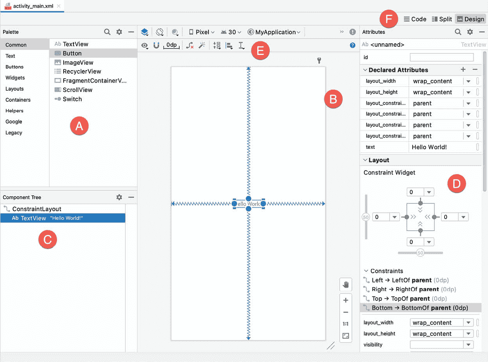

图 24-5

a–调色板–调色板提供了对安卓软件开发工具包提供的视图组件范围的访问。为了便于导航，这些内容被分为不同的类别。通过从调色板中拖动视图组件并将其放置在布局上的所需位置，可以将项目添加到布局中。

b–设备屏幕–设备屏幕在设计时提供了用户界面布局的视觉“所见即所得”表示。这种布局允许直接操作设计，允许选择、删除、移动和调整视图大小。可以使用工具栏中的菜单随时更改布局所代表的设备型号。

c–组件树–如前一章所述([“了解安卓视图、视图组和布局”](23.html#_idTextAnchor454))用户界面是使用分层结构构建的。组件树提供了用户界面设计层次结构的可视化概述。从组件树中选择一个元素将导致布局中相应的视图被选择。同样，从设备屏幕布局中选择一个视图将在组件树层次结构中选择该视图。

d–属性–调色板中列出的所有组件视图都与一组属性相关联，这些属性可用于调整该视图的行为和外观。布局编辑器的属性面板提供对布局中当前选定视图的属性的访问，允许进行更改。

e–工具栏–布局编辑器工具栏提供了对各种选项的快速访问，其中包括放大和缩小设备屏幕布局、更改当前显示的设备型号、在纵向和横向之间旋转布局以及切换到不同的安卓软件开发工具包应用编程接口级别的能力。工具栏还有一组上下文相关的按钮，当在设备屏幕布局中选择相关的视图类型时，这些按钮就会出现。

f–模式切换控件–这三个按钮提供了一种在布局编辑器工具的设计、代码和拆分模式之间来回切换的方式。

G -缩放和平移控制-此控制面板允许您放大和缩小设计画布，并抓取画布和四处平移，以查找放大时被遮挡的区域。

24.4 调色板

布局编辑器选项板被组织成两个面板，这两个面板旨在方便定位和预览视图组件，以便添加到布局设计中。类别面板(在[图 24-6](#_idTextAnchor483) 中标记为 A)列出了 Android SDK 支持的视图组件的不同类别。当从列表中选择一个类别时，第二个面板(B)会更新以显示属于该类别的组件列表血淋淋的:


图 24-6

要将组件从调色板添加到布局画布上，只需从组件列表或预览面板中选择项目，将其拖动到画布上的所需位置，然后将其放置到位。

点击调色板工具栏中的搜索按钮(上面[图 24-6](#_idTextAnchor483) 中标记为 C)并输入组件名称，即可开始搜索当前所选类别中的特定组件。键入字符时，匹配结果将实时显示在组件列表面板中。如果您不确定组件所在的类别，只需在搜索操作之前或期间选择“全部”类别。

24.5 设计模式和布局视图

默认情况下，布局编辑器将出现在设计模式下，如上面的[图 24-5](#_idTextAnchor480) 所示。这种模式提供了用户界面的可视化表示。通过点击最右边的模式切换控件可以随时选择设计模式，如图[图 24-7](#_idTextAnchor486) :

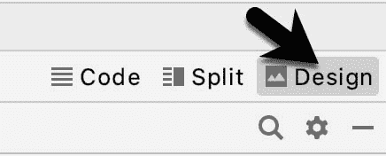

图 24-7

当布局编辑器工具处于设计模式时，可以通过两种不同的方式查看布局。上面[图 24-5](#_idTextAnchor480) 所示的视图是设计视图，显示了布局和小部件，它们将出现在运行的应用中。第二种模式称为蓝图视图，可以代替设计视图显示，也可以与设计视图同时显示。[图 24-8](#_idTextAnchor488) 所示的工具栏菜单提供了显示设计、蓝图或两个视图的选项。第四个选项“强制刷新布局”会导致布局重建和重绘。当布局进入意外状态或未准确反映当前设计设置时，这可能很有用 gs:


图 24-8

是显示布局视图、设计视图还是两者都显示，这取决于个人喜好。一个好的方法是从如图 24-9 所示的两个显示开始:

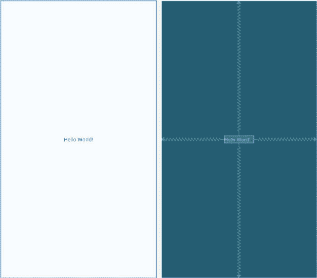

图 24-9

24.6 夜间模式

要在设计工作期间以夜间模式查看布局，请选择下面[图 24-10](#_idTextAnchor491) 所示的菜单，并将设置更改为夜间:


图 24-10

24.7 编码模式

在使用AndroidStudio布局编辑器工具时，一定要记住，它真正做的是提供一种用户友好的方法来创建 XML 布局资源文件。在设计过程中的任何时候，只需点击布局编辑器工具面板右上角的代码按钮，就可以查看和直接编辑底层的 XML，如图[图 24-11](#_idTextAnchor493) :

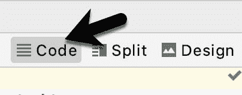

图 24-11

[图 24-12](#_idTextAnchor496) 显示了代码 mod e 中的 Android Studio 布局编辑器工具，允许通过更改 XML 对用户界面声明进行更改:

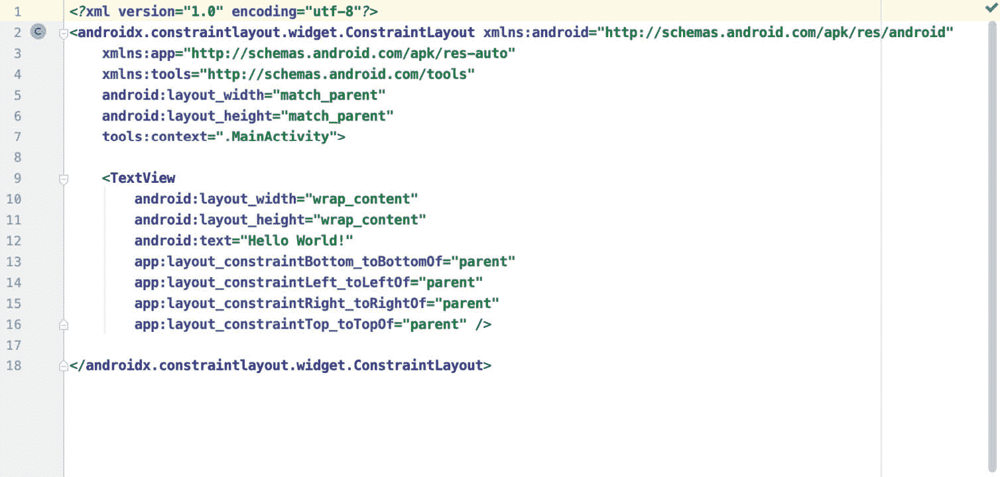

图 24-12

24.8 分割模式

在拆分模式下，编辑器并排显示设计视图和代码视图，允许使用设计画布和直接对 XML 声明进行更改来修改用户界面。要进入分割模式，点击下方[图 24-13](#_idTextAnchor498) 所示的中间按钮:


图 24-13

对 XML 的任何更改都会自动反映在设计画布中，反之亦然。[图 24-14](#_idTextAnchor499) 显示了拆分模式下的编辑器:

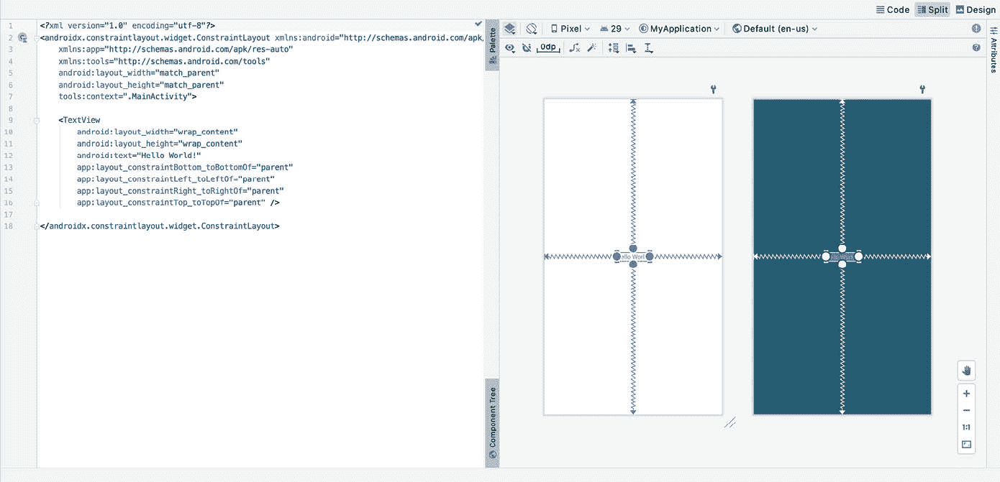

图 24-14

24.9 设置属性

“属性”面板提供了对当前选定组件的所有可用设置的访问。例如，图 24-15 显示了文本视图窗口的属性:


图 24-15

“属性”工具窗口分为以下不同的部分。

id -包含 id 属性，该属性定义应用源代码中引用当前选定对象的名称。

声明的属性-包含所有已经赋值的属性。

布局-定义当前选定视图对象相对于屏幕和布局中其他对象的位置和大小的设置。

变换-包含允许旋转、缩放和偏移当前选定对象的控件。

公共属性-当前选择的视图对象类别通常需要更改的属性列表。

所有属性-当前选定对象的所有可用属性的完整列表。

也可以通过选择属性工具窗口工具栏中的搜索按钮并键入属性名称来搜索特定属性。

有些属性在值字段的右侧包含一个窄按钮。这表明“资源”对话框可用于帮助选择合适的属性值。要显示对话框，只需点击按钮。此按钮的外观会发生变化，以反映相应的属性值是存储在资源文件中还是硬编码。如果该值存储在资源文件中，文本属性字段右侧的按钮将被填充，以指示该值没有被硬编码，如下图[图 24-16](#_idTextAnchor503) 所示:

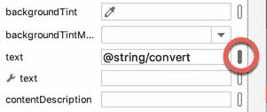

图 24-16

有限数量有效选项可用的属性将显示一个下拉菜单([图 24-17](#_idTextAnchor505) )，从中可以进行选择。

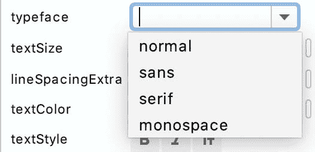

图 24-17

点击滴管图标(如上图 24-16 中[背景色调字段所示)显示颜色选择调色板。同样，当标志图标出现在此位置时，可以单击它来显示属性的可用选项列表，而图像图标会打开资源管理器面板，允许为属性选择图像和其他资源类型。](#_idTextAnchor503)

24.10 变换

“属性”工具窗口中的“变换”面板(图 24-18 )提供了一组控件和属性，这些控件和属性控制当前选定对象在旋转、alpha(用于淡入淡出视图)、缩放(大小)和平移(从当前位置偏移)方面的视觉效果:

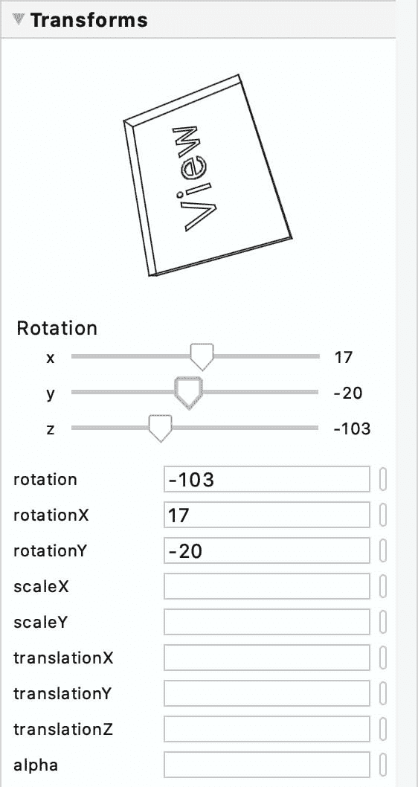

图 24-18

该面板包含视图的可视化表示，该视图会随着属性的更改而更新。这些变化也反映在布局画布中的视图上。

24.11 工具可见性切换

在代码模式下查看AndroidStudio XML 布局文件的内容时，您会注意到定义视图如何显示和表现的许多属性都以安卓:前缀开始。这表明属性是在 android 命名空间内设置的，将在应用运行时生效。例如，布局文件的以下摘录设置了按钮视图的各种属性:

```kt
<Button
    android:id="@+id/button"
    android:layout_width="wrap_content"
    android:layout_height="wrap_content"
    android:text="Button"
.
.
```

除了安卓命名空间，AndroidStudio还提供了工具命名空间。当在此命名空间中设置属性时，它们仅在布局编辑器预览中生效。例如，在设计布局时，您可能会发现编辑文本视图显示一些文本很有帮助，但要求该视图在应用运行时为空白。为此，您可以使用工具命名空间设置视图的 text 属性，如下所示:

```kt
<EditText
    android:id="@+id/editTextTextPersonName"
    android:layout_width="wrap_content"
    android:layout_height="wrap_content"
    android:ems="10"
    android:inputType="textPersonName"
    tools:text="Sample Text"
.
.
```

通过在扳手图标标记的属性字段中输入值，在属性工具窗口中设置这种类型的工具属性，如图 24-19 所示:


图 24-19

工具属性对于在设计过程中更改视图的可见性特别有用。布局可能包含一个视图，当应用根据用户操作运行时，该视图以编程方式显示和隐藏。为了模拟视图的隐藏，可以将以下工具属性添加到视图 XML 声明中:

```kt
tools:visibility="invisible"
```

使用不可见设置时，尽管视图将不再可见，但它仍会出现在布局中，并占据与可见时相同的空间。要使布局表现得像视图不再存在一样，可见性属性应设置为“消失”，如下所示:

```kt
tools:visibility="gone"
```

在上述两个示例中，可见性设置仅适用于布局编辑器，对正在运行的应用没有影响。为了控制布局编辑器和正在运行的应用中的可见性，将使用 android 命名空间设置相同的属性:

安卓:可见性=“消失”

虽然这些可见性工具属性很有用，但手动编辑 XML 布局文件是一个麻烦的过程。为了更容易地更改这些设置，AndroidStudio在布局编辑器组件树面板中提供了一组切换。要访问这些控件，请在面板中相应视图右侧的空白处单击。[例如，图 24-20](#_idTextAnchor510) 显示了名为“我的按钮”的按钮视图的工具可见性切换控件:


图 24-20

这些开关控制 android 和 tools 名称空间的相应视图的可见性，并提供未设置、可见、不可见和消失的选项。当设置了冲突属性时(例如，android 命名空间切换设置为可见，而 tools 值设置为不可见)，tools 命名空间在布局预览中优先。当进行切换选择时，AndroidStudio会自动将适当的属性添加到布局文件中的 XML 视图元素中。

除了组件树面板中的可见性切换，布局编辑器还包括工具可见性和位置切换按钮，如下图[图 24-21](#_idTextAnchor511) 所示:

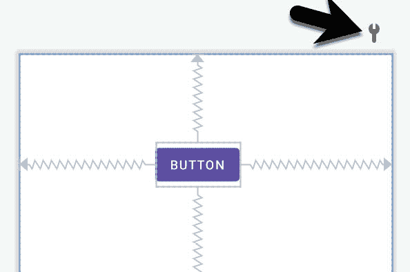

图 24-21

此按钮切换当前工具可见性设置。例如，如果上面显示的按钮视图当前将工具可见性属性设置为“消失”，切换此按钮将使其可见。这使得在向布局添加视图和从布局中移除视图时快速检查布局行为变得容易。此切换对于检查布局中的视图是否被正确约束也很有用，这一主题将在标题为[“在AndroidStudio中使用约束布局的指南”](26.html#_idTextAnchor566)的章节中介绍。

24.12 转换视图

只需在屏幕布局或组件树窗口中右键单击视图并选择转换视图，就可以在 Android Studio 布局编辑器中轻松地将布局中的视图从一种类型更改为另一种类型(例如将文本视图转换为编辑文本)...菜单选项([图 24-22](#_idTextAnchor514) ):

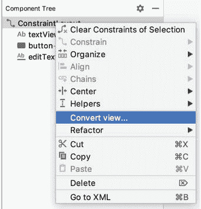

图 24-22

选择后，将出现一个对话框，其中包含所选对象可转换为的兼容视图类型列表。[例如，图 24-23](#_idTextAnchor515) 显示了现有文本视图可以转换成的类型:


图 24-23

这种技术对于将布局从一种类型转换为另一种类型也很有用(例如，将约束布局转换为线性布局)。

24.13 显示 样本数据

在AndroidStudio中设计布局时，会出现这样的情况，即在应用完成并运行之前，用户界面中显示的内容将不可用。这有时会使从布局编辑器中评估布局在应用运行时将如何显示变得困难。为了解决这个问题，布局编辑器允许指定样本数据，这些样本数据将用样本图像和数据填充布局编辑器中的视图。此示例数据仅出现在布局编辑器中，在应用运行时不显示。可以通过直接编辑布局的 XML 来配置样本数据，也可以通过在设计区域的小部件上单击鼠标右键并选择“设置样本数据”菜单选项来可视化地使用设计时帮助器。设计时帮助器面板将显示一系列预配置选项，用于在选定视图项目上显示示例数据，包括各种配置中的文本和图像组合。[例如，图 24-24](#_idTextAnchor517) 显示了选择样本数据出现在回收视图列表中时显示的样本数据选项:

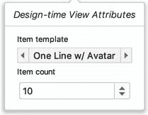

图 24-24

或者，可以在布局设计过程中提供定制文本和图像用于显示。在布局编辑器中使用样本数据的示例包含在后面一章[“布局编辑器样本数据教程”](56.html#_idTextAnchor1113)中。由于样本数据是作为工具属性实现的，因此可以使用上面[图 24-21](#_idTextAnchor511) 中高亮显示的切换按钮来控制预览中数据的可见性。

24.14 创建自定义设备定义

布局编辑器工具栏中的设备菜单([图 24-25](#_idTextAnchor520) )提供了一个预配置设备类型的列表，当选择该列表时，它将显示为设备屏幕画布。除了预先配置的设备类型之外，任何先前在AndroidStudio环境中配置的自动增值设备实例也将在菜单中列出。要添加其他设备配置，请显示设备菜单，选择添加设备定义…选项，并按照标题为[“在 Android Studio 中创建 Android 虚拟设备(AVD)”](04.html#_idTextAnchor068)一章中概述的步骤进行操作。

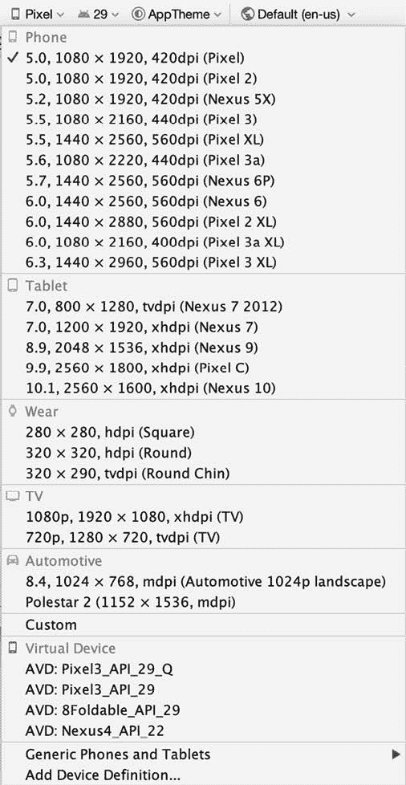

图 24-25

24.15 改变电流装置

作为设备选择菜单的替代，可以通过从设备菜单中选择自定义选项，单击位于设备屏幕右下角旁边的调整大小手柄([图 24-26](#_idTextAnchor523) )并拖动选择替代设备显示格式来更改当前设备格式。当屏幕调整大小时，将出现标记，指示可供选择的各种尺寸选项和方向:

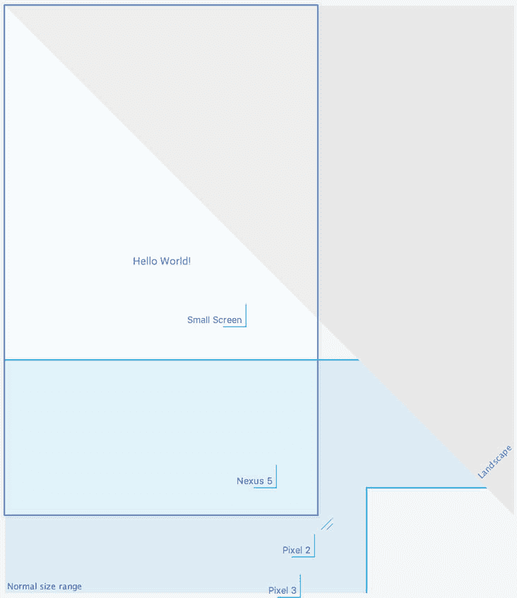

图 24-26

24.16 布局验证(多预览)

布局验证(也称为多重预览)选项允许在一系列像素大小的屏幕上同时预览用户界面布局。要访问多重预览，请点击AndroidStudio主窗口右上角附近的标签，如图 24-27 所示:

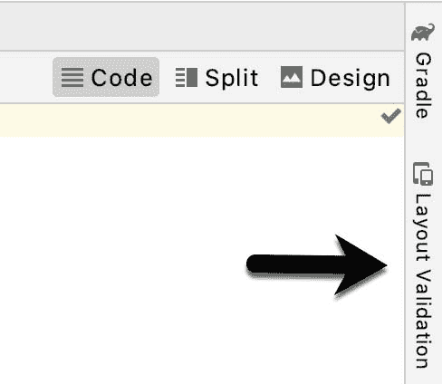

图 24-27

加载后，面板将如图 24-28 所示出现，布局呈现在多个像素设备屏幕配置上:


图 24-28

24.17 总结

开发安卓应用的一个关键部分涉及用户界面的创建。在AndroidStudio环境中，这是使用布局编辑器工具执行的，该工具以三种模式运行。在设计模式下，视图组件从调色板中选择，并放置在代表安卓设备屏幕的布局上，并使用属性列表进行配置。在代码模式下，可以直接编辑表示用户界面布局的底层 XML。另一方面，拆分模式允许通过可视化和直接的 XML 编辑来创建和修改布局。这些模式结合起来提供了一个广泛和直观的用户界面设计环境。

布局验证面板允许在一系列不同的设备屏幕尺寸上快速预览用户界面布局。