28\. AndroidStudio布局编辑器约束布局教程

迄今为止，为安卓应用设计用户界面最简单、最有效的方法是使用AndroidStudio布局编辑器工具。本章的目标是概述如何使用这种方法创建基于约束布局的用户界面。本章中包含的练习也将作为一个机会来概述从“基本”AndroidStudio项目开始的活动的创建。

介绍了AndroidStudio布局编辑器的使用后，本章还将介绍布局检查器工具。

28.1 AndroidStudio布局编辑器工具示例

这个例子的第一步是创建一个新的AndroidStudio项目。因此，首先启动AndroidStudio，并通过选择文件->关闭项目菜单选项来关闭任何以前打开的项目。

从欢迎屏幕中选择创建新项目快速启动选项。在前面的例子中，我们已经请求AndroidStudio为项目创建一个模板活动。但是，我们将使用本教程来学习如何手动创建一个全新的活动和相应的布局资源文件，因此请确保在单击“下一步”按钮之前选择了“无活动”选项

在“名称”字段中输入 LayoutSample，并将 com . ebookwidge . layout sample 指定为包名。在单击完成按钮之前，将最低API级别设置更改为API 26:安卓 8.0(奥利奥)，并将语言菜单更改为Kotlin。

28.2 创建新活动

一旦项目创建过程完成，AndroidStudio主窗口应该会出现。项目的第一步是创建一个新的活动。这将是一个有价值的学习练习，因为在开发安卓应用的过程中，有许多实例需要从头开始创建新的活动。

如果使用 Alt-1/Cmd-1 键盘快捷键还不可见，首先显示项目工具窗口。显示安卓层次结构后，单击项目窗口中条目旁边的向右箭头将其展开。这里的目标是访问项目层次结构中的 app-> Java-> com . ebookwidue . layout sample 文件夹。一旦包名可见，右键点击它，选择新建->活动->清空活动菜单选项，如图[图 28-1](#_idTextAnchor656) 。或者，选择新建- >活动- >画廊...选项来浏览可用的模板，并使用新的安卓活动对话框进行选择。

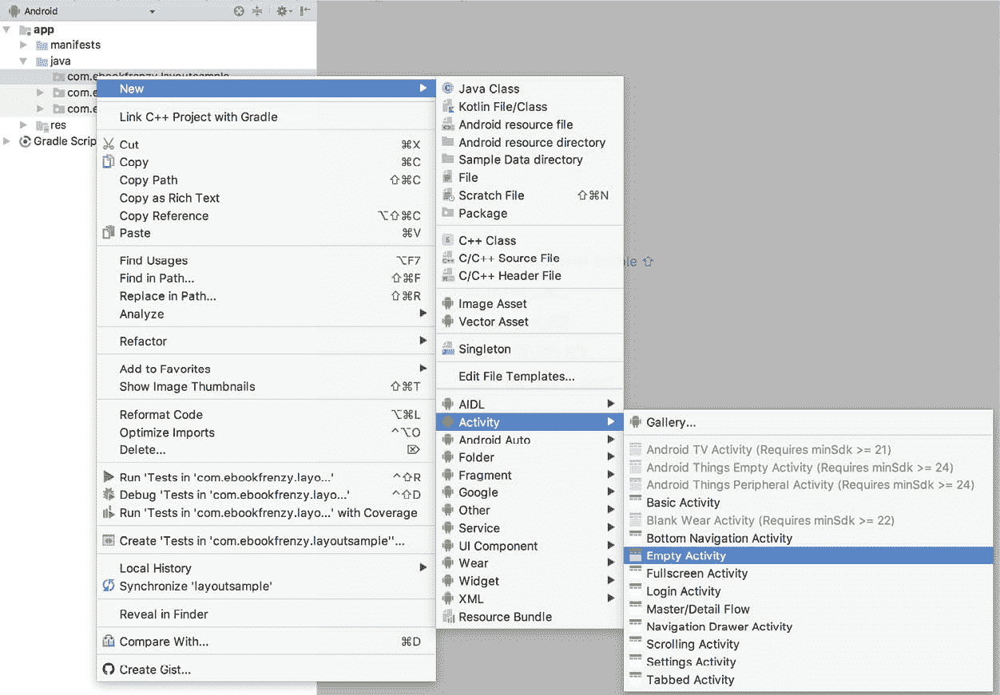

图 28-1

在生成的新安卓活动对话框中，命名新活动主活动和布局活动主。当然，该活动需要一个布局资源文件，因此请确保启用了“生成布局文件”选项。

为了使应用能够在设备上运行，它需要有一个被指定为启动器活动的活动。如果没有启动器活动，当应用第一次启动时，操作系统将不知道启动哪个活动，应用将无法启动。由于此示例只有一个活动，因此需要将其指定为应用的启动器活动，因此请确保在单击“完成”按钮之前启用了启动器活动选项。

此时，AndroidStudio应该已经向项目中添加了两个文件。活动的 Kotlin 源代码文件应该位于 app-> Java-> com . ebookwidue . layout sample 文件夹中。

此外，用户界面的 XML 布局文件应该是在 app -> res -> layout 文件夹中创建的。请注意，此活动选择了空活动模板，因此布局完全包含在 activity_main.xml 文件中，没有单独的内容布局文件。此外，由于我们不会编写任何代码来访问用户界面布局中的视图，因此没有必要转换项目来支持视图绑定。

最后，新的活动应该已经被添加到 AndroidManifest.xml 文件中，并被指定为启动器活动。清单文件可以在 app - >清单文件夹下的项目窗口中找到，并且应该包含以下 XML:

```kt
<?xml version="1.0" encoding="utf-8"?>
<manifest xmlns:android="http://schemas.android.com/apk/res/android"
    package="com.ebookfrenzy.layoutsample">

    <application
        android:allowBackup="true"
        android:icon="@mipmap/ic_launcher"
        android:label="@string/app_name"
        android:roundIcon="@mipmap/ic_launcher_round"
        android:supportsRtl="true"
        android:theme="@style/AppTheme">
        <activity android:name=".MainActivity">
            <intent-filter>
                <action android:name="android.intent.action.MAIN" />

                <category 
     android:name="android.intent.category.LAUNCHER" />
            </intent-filter>
        </activity>
    </application>

</manifest> 
```

28.3 准备布局编辑器环境

找到并双击位于 app -> res -> layout 文件夹中的 activity_main.xml 布局文件，将其加载到布局编辑器工具中。由于本教程的目的是获得使用约束的经验，因此请使用布局编辑器工具栏中的按钮关闭自动连接功能。一旦禁用，按钮将出现一条穿过它的线，如图 28-2 中的情况:

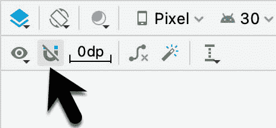

图 28-2

如果“自动连接”按钮右侧的默认边距值未设置为 8dp，请单击它并从结果面板中选择 8dp。

用户界面设计还将使用 ImageView 对象来显示图像。在继续之前，应该将此图像添加到项目中，以便在本章后面使用。该文件名为 galaxys6.png，可在示例代码下载的 project_icons 文件夹中找到，可从以下网址获得:

[https://www.ebookfrenzy.com/retail/as42kotlin/index.php](https://www.ebookfrenzy.com/retail/as42kotlin/index.php)

在AndroidStudio中，显示资源管理器工具窗口(视图->工具窗口->资源管理器)。在操作系统的文件系统导航器中找到 galaxy6s.png 映像，并将该映像拖放到资源管理器工具窗口中。在生成的对话框中，单击“下一步”，然后单击“导入”按钮，将图像添加到项目中。图像现在应该出现在资源管理器中，如下图[28-3](#_idTextAnchor659)所示:

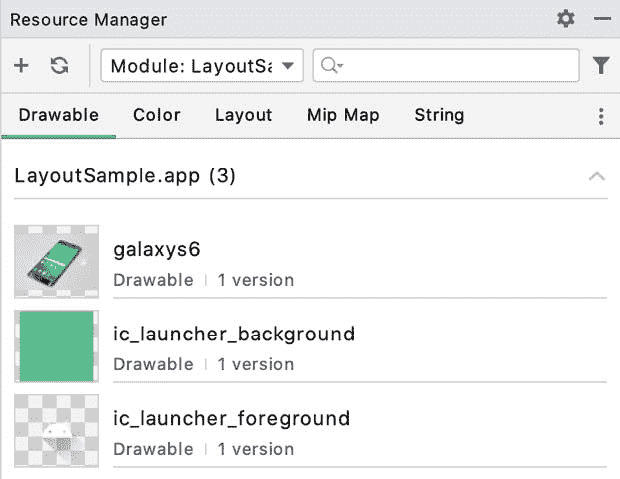

图 28-3

该图像也将出现在“项目”工具窗口的“资源->可绘制”部分:


图 28-4

28.4 将部件添加到用户界面

从通用调色板类别中，将图像视图对象拖到显示视图的中心。请注意，水平和垂直虚线表示显示器的中心轴。居中时，释放鼠标按钮将视图放置到位。一旦放置在布局中，“资源”对话框将出现，寻找要在视图中显示的图像。在位于对话框顶部的搜索栏中，输入“galaxy”定位 galaxys6.png 资源，如图 28-5 所示。

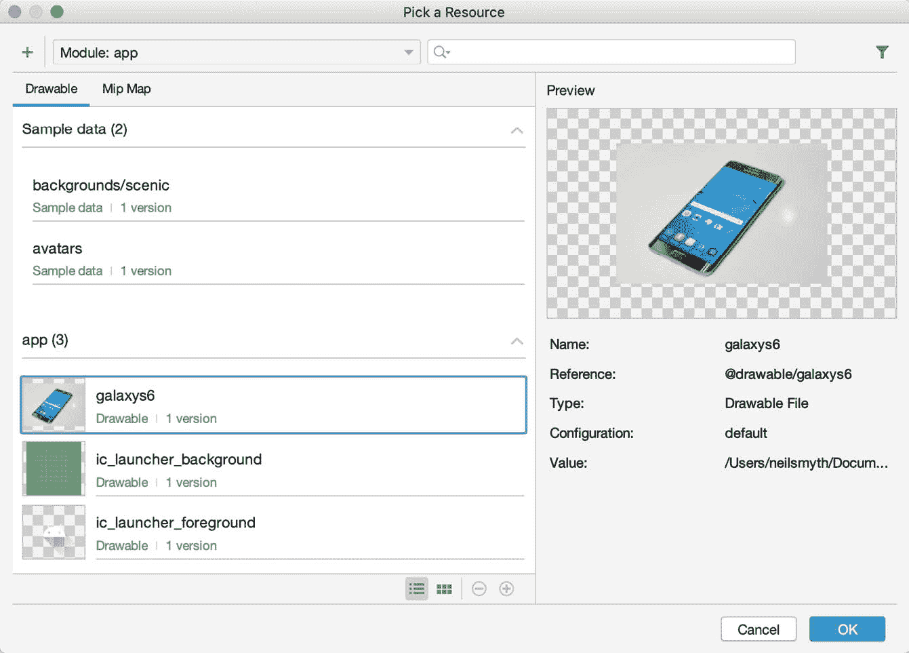

图 28-5

选择图像，然后单击确定将其分配给图像视图对象。如有必要，使用调整大小手柄调整图像视图的大小，并将其重新定位在布局的中心。此时布局应符合[图 28-6](#_idTextAnchor662) :

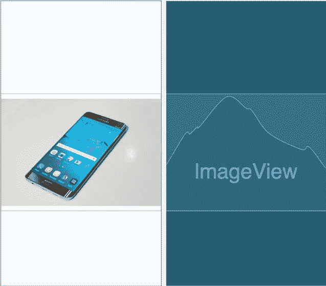

图 28-6

单击并从调色板的“常用”部分拖动一个文本视图对象，并将其放置在图像视图上方，如图 28-7 所示。

使用“属性”面板，在“通用属性”部分展开“文本外观”属性条目，将“文本大小”属性更改为 24sp，将“文本对齐”设置更改为居中，并将文本更改为“三星 Galaxy S6”。

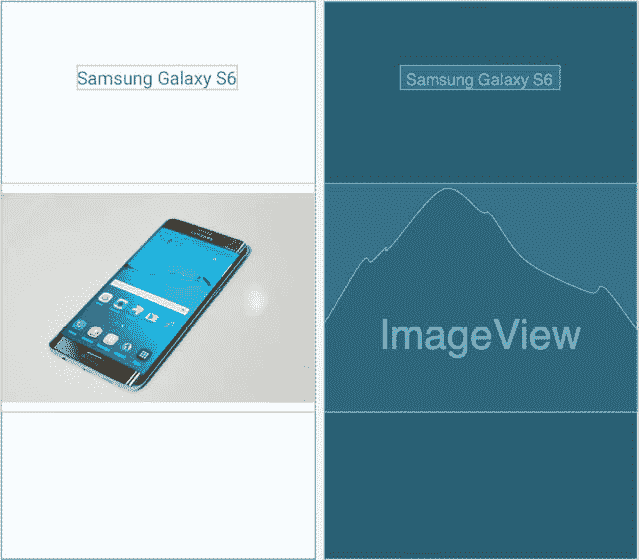

图 28-7

接下来，沿着布局的底部添加三个按钮小部件，并将这些视图的文本属性设置为“立即购买”、“定价”和“详细信息”。现在完成的布局应该符合[图 28-8](#_idTextAnchor665) :

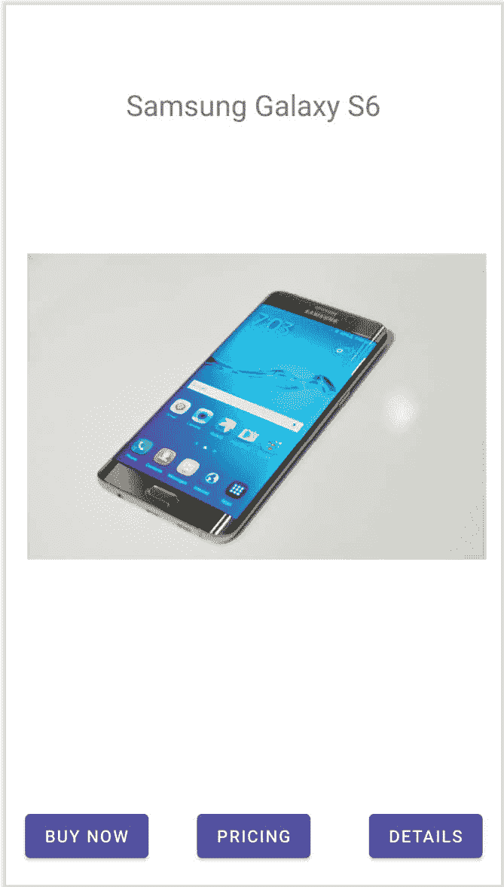

图 28-8

此时，小部件没有受到足够的约束，布局引擎无法在运行时定位和调整小部件的大小。如果应用现在运行，所有的小部件都将位于显示屏的左上角。

将小部件添加到布局后，使用布局编辑器工具栏中的设备旋转按钮(由图 28-9 中的箭头指示)以横向方式查看用户界面:

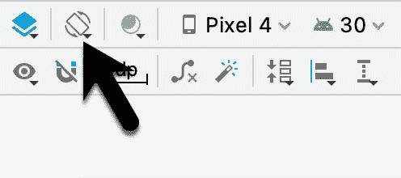

图 28-9

缺少约束会导致布局无法适应设备方向的变化，从而使内容偏离中心，部分图像和所有三个按钮都位于屏幕可视区域之外。显然，要使它成为一个响应迅速的用户界面，还需要做一些工作。

28.5 添加约束

约束是创建能够适应设备方向变化和不同屏幕尺寸的布局的关键。首先，将布局旋转回纵向，并选择位于图像视图上方的文本视图小部件。选择小部件后，从文本视图的左侧、右侧和顶部到父约束布局的相应侧建立约束，如图 28-10 所示:


图 28-10

在约束文本视图小部件的情况下，选择图像视图实例，并在左侧和右侧建立相反的约束，每个约束都连接到父布局的相应侧。接下来，建立从图像视图顶部到文本视图底部以及从图像视图底部到中间按钮小部件顶部的约束连接。如有必要，单击并拖动图像视图，使其仍位于布局的垂直中心。

在仍然选择图像视图的情况下，使用属性面板中的检查器将图像视图的顶部和底部边距分别更改为 24 和 8，并将小部件的高度和宽度尺寸属性更改为 match_constraint，以便小部件将调整大小以匹配约束。这些设置将允许布局引擎在必要时放大和缩小 ImageView 的大小，以适应布局更改:

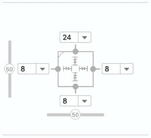

图 28-11

[图 28-12](#_idTextAnchor670) 显示了与布局中其他元素相关的 ImageView 当前实现的约束:


图 28-12

最后一项任务是向三个按钮小部件添加约束。对于本例，按钮将被放置在一个链中。首先通过点击[图 28-2](#_idTextAnchor658) 中高亮显示的工具栏按钮，在布局编辑器中打开自动连接。

接下来，点击“立即购买”按钮，然后按住 shift 键点按另外两个按钮，这样三个按钮都被选中。右键单击立即购买按钮，并从结果菜单中选择链->创建水平链菜单选项。默认情况下，链将使用扩散样式显示，这是本示例的正确行为。

最后，在“立即购买”按钮底部和布局底部之间建立约束。对其余按钮重复此步骤。

完成这些步骤后，按钮应受到约束，如图 28-13 所示:


图 28-13

28.6 测试布局

将约束添加到布局后，将屏幕旋转到横向，并验证布局是否适应新的屏幕尺寸。

虽然布局编辑器工具提供了一个有用的可视化环境来设计用户界面布局，但是当涉及到测试时，没有什么可以替代测试正在运行的应用。在物理安卓设备或模拟器会话上启动应用，并验证用户界面是否反映了布局编辑器中创建的布局。[如图 28-14](#_idTextAnchor673) 所示，横向运行的 app:

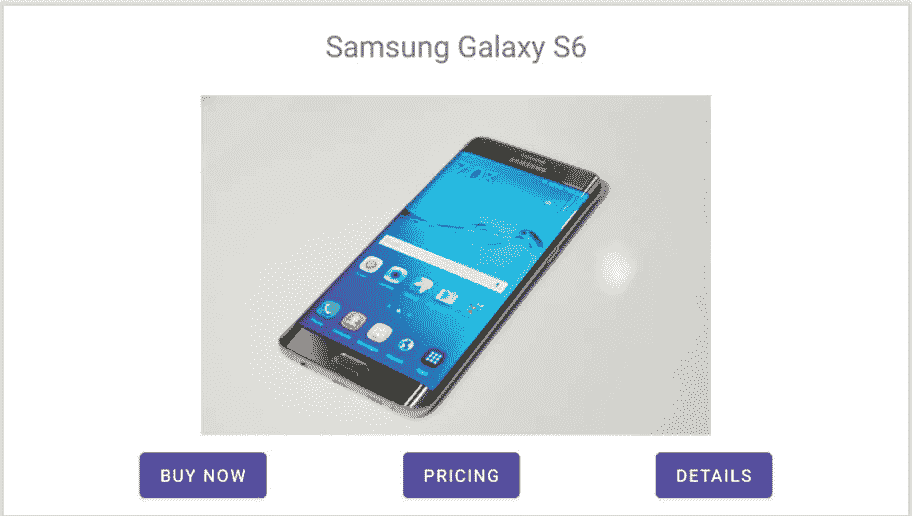

图 28-14

用户界面设计现已完成。设计更复杂的用户界面布局是上述步骤的延续。只需将视图拖放到显示器上，根据需要定位、约束和设置属性。

28.7 使用布局检查器

可以随时使用布局检查器工具查看组成用户界面布局的组件层次结构。为了访问这些信息，应用必须运行在运行 Android API 29 或更高版本的设备或仿真器上。应用运行后，选择工具->布局检查器菜单选项，然后使用[图 28-15](#_idTextAnchor675) 中标记为 A 的菜单进行检查。

检查器加载后，最左侧的面板(B)显示组成用户界面布局的组件层次结构。中央面板(C)显示了布局设计的视觉表示。单击视觉布局中的小部件将导致该项在层次列表中突出显示，从而可以轻松找到视觉组件相对于整个布局层次的位置。

最后，最右边的面板(在[图 28-15](#_idTextAnchor675) 中标记为 D)包含当前所选组件的所有属性设置，允许深入分析组件的内部配置。在适当的情况下，值单元格将包含指向项目源代码中属性设置位置的链接。

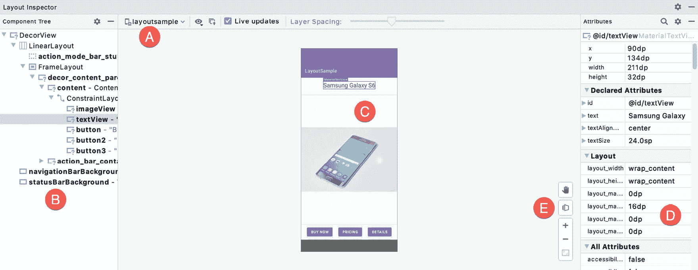

图 28-15

要以三维方式查看布局，请在布局预览区域的任意位置单击并拖动。这将显示层次的“分解”表示，以便可以旋转和检查。这对于识别模糊视图等任务非常有用:

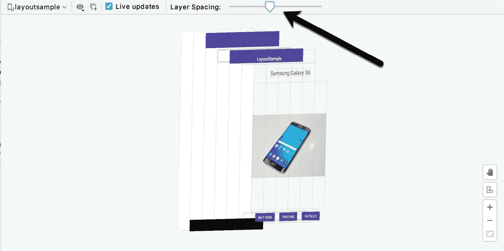

图 28-16

单击并拖动渲染以三维旋转它，使用上图中箭头指示的滑块来增加层之间的间距。点击[图 28-15](#_idTextAnchor675) 中标记为 E 的按钮，将渲染重置到原始位置。

28.8 总结

AndroidStudio中的布局编辑器工具已经与约束布局类紧密集成。本章已经创建了一个示例用户界面，旨在概述使用布局编辑器工具在添加小部件和设置约束方面实现基于约束布局的用户界面的方式。本章还介绍了实时布局检查器工具，该工具有助于分析用户界面布局的结构组成。