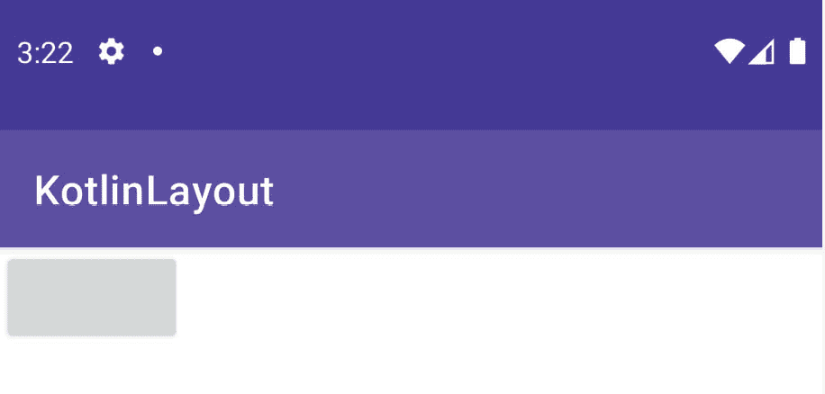
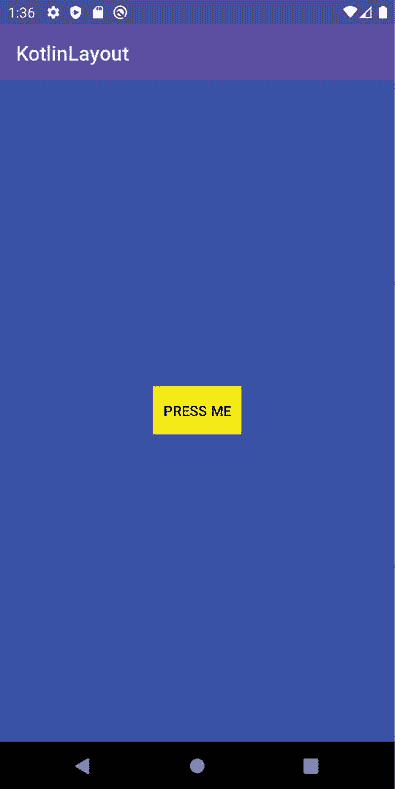
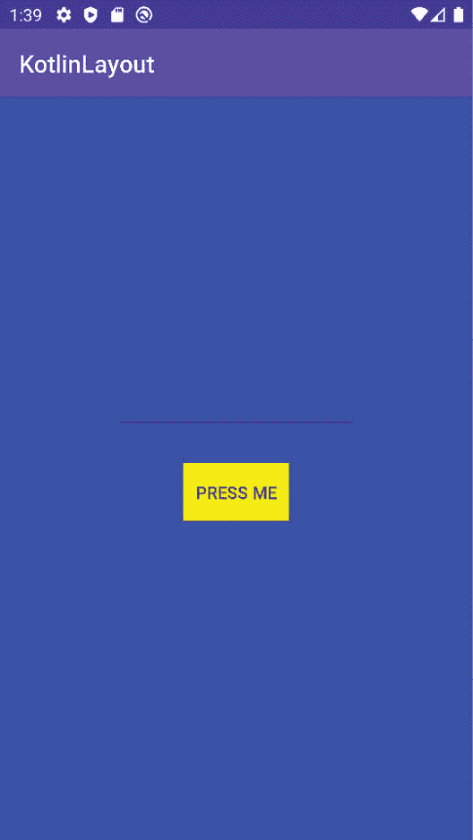

31.一个安卓约束集教程

前一章介绍了使用 ConstraintLayout 和 ConstraintSet 类在 Kotlin 代码中创建和修改用户界面布局的基本概念。本章将采用这些概念，并通过创建一个完全用科特林代码创建的示例布局，而不使用AndroidStudio布局编辑器工具，将它们付诸实践。

31.1 在AndroidStudio创建示例项目

启动AndroidStudio，从欢迎屏幕的快速开始菜单中选择创建新项目选项，并在生成的新项目对话框中选择空活动模板，然后单击下一步按钮。

在“名称”字段中输入 KotlinLayout，并将 com . ebookwidue . KotlinLayout 指定为包名。在单击完成按钮之前，将最低应用编程接口级别设置更改为应用编程接口 26:安卓 8.0(奥利奥)，并将语言菜单更改为科特林。

一旦创建了项目，MainActivity.kt 文件应该会自动加载到编辑面板中。正如我们所料，AndroidStudio创建了一个模板活动，并覆盖了 onCreate()方法，为添加 Kotlin 代码以创建用户界面提供了一个理想的位置。

31.2 向活动添加视图

onCreate()方法目前被设计为使用用户界面的资源布局文件。因此，从方法中删除这一行开始:

```kt
override fun onCreate(savedInstanceState: Bundle?) {
    super.onCreate(savedInstanceState)
    setContentView(R.layout.activity_main)
}
```

下一个修改是向活动添加一个带有单个按钮视图子对象的约束布局对象。这包括创建约束布局和按钮类的新实例。然后，需要将按钮视图作为子视图添加到约束布局视图中，然后通过调用活动实例的 setContentView()方法来显示该视图:

```kt
package com.ebookfrenzy.kotlinlayout

import androidx.appcompat.app.AppCompatActivity
import android.os.Bundle
import androidx.constraintlayout.widget.ConstraintLayout
import android.widget.Button
import android.widget.EditText

class MainActivity : AppCompatActivity() {

    override fun onCreate(savedInstanceState: Bundle?) {
        super.onCreate(savedInstanceState)

        configureLayout()
    }

    private fun configureLayout() {
        val myButton = Button(this)
        val myLayout = ConstraintLayout(this)
        myLayout.addView(myButton)
        setContentView(myLayout)
    }
}
```

当以这种方式创建用户界面对象的新实例时，必须将构造函数方法传递给创建对象的上下文，在这种情况下，该上下文就是当前活动。由于上述代码位于 activity 类中，因此上下文仅由标准 this 关键字引用:

```kt
val myButton = Button(this)
```

完成上述添加后，编译并运行应用(在物理设备或仿真器上)。一旦启动，可见的结果将是一个不包含文本的按钮出现在约束布局视图的左上角，如图[图 31-1](#_idTextAnchor705) :



图 31-1

31.3 设置视图属性

出于本练习的目的，我们需要将“约束布局”视图的背景设置为蓝色，并将“按钮”视图设置为在黄色背景上显示“按下我”的文本。这两项任务都可以通过在 Kotlin 代码中的视图上设置属性来实现，如下面的代码片段所述。为了让按钮上的文本容易翻译成其他语言，它将作为字符串资源添加。在项目工具窗口中，找到应用->资源->值->字符串. xml 文件，并对其进行修改，为“按我”字符串添加资源值:

```kt
<resources>
    <string name="app_name">KotlinLayout</string>
    <string name="press_me">Press Me</string>
</resources> 
```

虽然这是处理代码中直接引用的字符串的推荐方法，但为了避免在本书的剩余部分重复这一步骤，许多后续代码示例将直接在代码中输入字符串。

一旦字符串存储为资源，就可以从代码中访问它，如下所示:

```kt
getString(R.string.press_me)
```

创建字符串资源后，向 configureLayout()方法添加代码以设置按钮文本和颜色属性:

```kt
.
.
import android.graphics.Color
.
.
    private fun configureLayout() {
        val myButton = Button(this)
        myButton.text = getString(R.string.press_me)
        myButton.setBackgroundColor(Color.YELLOW)

        val myLayout = ConstraintLayout(this)
        myLayout.setBackgroundColor(Color.BLUE)

        myLayout.addView(myButton)
        setContentView(myLayout)

    }
}
```

当应用现在编译并运行时，布局将反映属性设置，这样布局将以蓝色背景显示，按钮将以黄色背景显示分配的文本。

31.4 创建视图标识

布局完成后，它将由一个按钮和一个编辑文本视图组成。在约束集类的方法中引用这些视图之前，必须为它们分配唯一的视图标识。这个过程的第一步是创建一个包含这些标识值的新资源文件。

右键单击 app -> res -> values 文件夹，选择新建-> values 资源文件菜单选项并命名新的资源文件 id.xml。创建资源文件后，对其进行编辑，使其如下所示:

```kt
<?xml version="1.0" encoding="utf-8"?>
<resources>
    <item name="myButton" type="id" />
    <item name="myEditText" type="id" />
</resources>
```

在教程的这一点上，只创建了按钮，因此编辑 configureLayout()方法，为对象分配相应的 ID:

```kt
fun configureLayout() {
    val myButton = Button(this)
    myButton.text = getString(R.string.press_me)
    myButton.setBackgroundColor(Color.YELLOW)
    myButton.id = R.id.myButton
.
.
```

31.5 配置约束集

在没有任何约束的情况下，约束布局视图将按钮视图放置在显示屏的左上角。为了指示布局视图将按钮放置在不同的位置，在这种情况下是水平和垂直居中，需要创建一个 ConstraintSet 实例，用适当的设置初始化它，并将其应用于父布局。

对于本例，需要对按钮进行配置，以使其宽度和高度受限于它所显示的文本的大小以及在父布局中居中的视图。再次编辑 configureLayout()方法以进行这些更改:

```kt
.
.
import androidx.constraintlayout.widget.ConstraintSet
.
.
private fun configureLayout() {
    val myButton = Button(this)
    myButton.text = getString(R.string.press_me)
    myButton.setBackgroundColor(Color.YELLOW)
    myButton.id = R.id.myButton

    val myLayout = ConstraintLayout(this)
    myLayout.setBackgroundColor(Color.BLUE)

    myLayout.addView(myButton)
    setContentView(myLayout)

    val set = ConstraintSet()

    set.constrainHeight(myButton.id,
        ConstraintSet.WRAP_CONTENT)
    set.constrainWidth(myButton.id,
        ConstraintSet.WRAP_CONTENT)

    set.connect(myButton.id, ConstraintSet.START,
            ConstraintSet.PARENT_ID, ConstraintSet.START, 0)
    set.connect(myButton.id, ConstraintSet.END,
            ConstraintSet.PARENT_ID, ConstraintSet.END, 0)
    set.connect(myButton.id, ConstraintSet.TOP,
            ConstraintSet.PARENT_ID, ConstraintSet.TOP, 0)
    set.connect(myButton.id, ConstraintSet.BOTTOM,
            ConstraintSet.PARENT_ID, ConstraintSet.BOTTOM, 0)

    set.applyTo(myLayout)
}
```

配置好初始约束后，编译并运行应用，并验证按钮视图现在出现在布局的中心:



图 31-2

31.6 添加编辑文本视图

要添加到布局中的下一项是编辑文本视图。第一步是创建 EditText 对象，为其分配 id.xml 资源文件中声明的 ID，并将其添加到布局中。现在需要对 configureLayout()方法进行代码更改以实现这些步骤，如下所示:

```kt
private fun configureLayout() {
    val myButton = Button(this)
    myButton.text = getString(R.string.press_me)
    myButton.setBackgroundColor(Color.YELLOW)
    myButton.id = R.id.myButton

    val myEditText = EditText(this)
    myEditText.id = R.id.myEditText

    val myLayout = ConstraintLayout(this)
    myLayout.setBackgroundColor(Color.BLUE)

    myLayout.addView(myButton)
    myLayout.addView(myEditText)

    setContentView(myLayout)
.
.
}
```

编辑文本小部件的大小取决于它显示的内容，在布局中水平居中，并位于现有按钮视图上方 70dp 处。向 configureLayout()方法添加代码，使其如下所示:

```kt
.
.
set.constrainHeight(myEditText.id,
                 ConstraintSet.WRAP_CONTENT)
set.constrainWidth(myEditText.id,
                 ConstraintSet.WRAP_CONTENT)

set.connect(myEditText.id, ConstraintSet.LEFT,
      ConstraintSet.PARENT_ID, ConstraintSet.LEFT, 0)
set.connect(myEditText.id, ConstraintSet.RIGHT,
      ConstraintSet.PARENT_ID, ConstraintSet.RIGHT, 0)
set.connect(myEditText.id, ConstraintSet.BOTTOM,
      myButton.getId(), ConstraintSet.TOP, 70)

set.applyTo(myLayout)
```

应用的测试运行应该显示按钮上方居中的编辑文本字段，其边距为 70dp。

31.7 将密度无关像素 (dp)转换为像素(px)

本练习的下一个任务是将 EditText 视图的宽度设置为 200dp。如标题为[“AndroidStudio布局编辑器约束布局教程”](28.html#_idTextAnchor651)的章节所述，在用户界面布局中设置大小和位置时，最好使用密度无关像素(dp)而不是像素(px)。为了使用 dp 设置位置，有必要在运行时将 dp 值转换为 px 值，同时考虑设备显示的密度。因此，为了将 EditText 视图的宽度设置为 200dp，需要向类中添加以下代码:

```kt
package com.ebookfrenzy.kotlinlayout
.
.
import android.content.res.Resources
import android.util.TypedValue

class MainActivity : AppCompatActivity() {

    override fun onCreate(savedInstanceState: Bundle?) {
        super.onCreate(savedInstanceState)

        configureLayout()
    }

    private fun convertToPx(value: Int): Int {
        val r = resources
        val px = TypedValue.applyDimension(
                TypedValue.COMPLEX_UNIT_DIP, value.toFloat(),
                r.displayMetrics).toInt()
        return px
    }

    private fun configureLayout() {
        val myButton = Button(this)
        myButton.text = getString(R.string.press_me)
        myButton.setBackgroundColor(Color.YELLOW)
        myButton.id = R.id.myButton

        val myEditText = EditText(this)
        myEditText.id = R.id.myEditText

        myEditText.width = convertToPx(200)
.
.
```

再次编译并运行应用，注意 EditText 视图的宽度已经改变，如图 31-3 : 所示



图 31-3

31.8 总结

当然，本章中创建的示例活动创建了一个类似于早期[“AndroidStudio中的手动 XML 布局设计”](29.html#_idTextAnchor677)一章中创建的用户界面(尽管背景颜色和视图类型发生了变化)。如果没有别的，这一章应该对AndroidStudio布局编辑器工具和 XML 资源在多大程度上保护开发人员免受创建安卓用户界面布局的许多复杂性的影响有所了解。

但是，在某些情况下，在 Kotlin 中创建用户界面是有意义的。例如，这种方法在创建动态用户界面布局时非常有用。