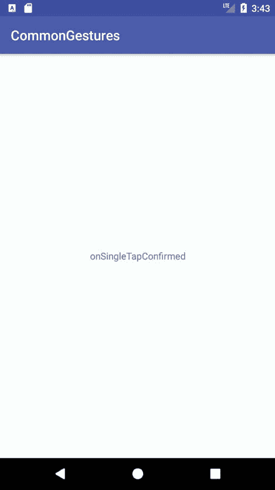

35\. 使用安卓手势检测器类检测常见手势

术语“手势”用于定义触摸屏和用户之间的连续交互序列。典型的手势从屏幕第一次被触摸的点开始，到最后一个手指或定点设备离开显示表面时结束。如果使用得当，手势可以实现为用户和应用程序之间的一种通信形式。滑动动作来翻动电子书的页面，或者包含两次触摸来放大或缩小图像的挤压动作，都是可以使用手势与应用程序交互的主要示例。

安卓软件开发工具包提供了检测应用程序中常见和自定义手势的机制。常见的手势包括点击、双击、长按或水平或垂直方向的滑动等交互(在安卓术语中称为投掷)。

本章的目标是探索使用安卓手势检测器类来检测安卓设备显示器上执行的常见手势。下一章名为[“在安卓系统上实现自定义手势和捏手识别”](36.html#_idTextAnchor774)，将涵盖更复杂的自定义手势的检测，如圆周运动和捏手。

35.1 实现常用手势检测

当用户与安卓设备的显示器交互时，系统调用当前活动应用程序的 onTouchEvent() 方法，并传递包含用户与屏幕接触数据的 MotionEvent 对象。该数据可以被解释为识别屏幕上的运动是否匹配常见的手势，例如轻敲或轻扫。这可以通过使用安卓手势检测器类用很少的编程工作来实现。此类专门设计用于从应用程序接收运动事件信息，并根据检测到的常见手势类型(如果有)触发方法调用。

检测常见手势的基本步骤如下:

1.实现姿态检测器的类的声明。OnGestureListener 接口包括所需的 onFling( )、onDown ()、oncroll()、onshoupress()、onsingletapu()和 onLongPress() 回调方法。请注意，这可以是一个全新的类，也可以是封闭的活动类。如果需要双击手势检测，该类还必须实现手势检测器。OnDoubleTapListener 界面并包含相应的 onDoubleTap()方法。

2.创建 Android GestureDetectorCompat 类的实例，将步骤 1 中创建的类的实例作为参数传递。

3.对 GestureDetectorCompat 实例的 setOnDoubleTapListener()方法的可选调用，以便在需要时启用双击检测。

4.在封闭活动上实现 onTouchEvent()回调方法，该方法必须调用 GestureDetectorCompat 实例的 onTouchEvent()方法，将当前运动事件对象作为参数传递给该方法。

一旦实现，结果就是应用程序代码中的一组方法，当检测到特定类型的手势时将调用这些方法。然后，这些方法中的代码可以被实现来执行响应于相应的手势而需要执行的任何任务。

在本章的剩余部分，我们将通过创建一个示例项目来将上述步骤付诸实践。

35.2 创建示例手势检测项目

这个项目的目标是检测当前由手势检测器或 Compat 类支持的所有常见手势，并向用户显示指示已检测到的手势类型的状态信息。

从欢迎屏幕中选择创建新项目快速启动选项，并在生成的新项目对话框中选择空活动模板，然后单击下一步按钮。

在名称字段中输入 CommonGestures，并指定 com . ebookwidue . common pipes 作为包名。在单击完成按钮之前，将最低应用编程接口级别设置更改为应用编程接口 26:安卓 8.0(奥利奥)，并将语言菜单更改为科特林。

调整项目以使用视图绑定，如第 [18.8 节将项目迁移到视图绑定](18.html#_idTextAnchor393)中所述。

创建新项目后，在“项目”工具窗口中导航到 app-> RES-> Layout-> activity _ main . XML 文件，然后双击该文件将其加载到 Layout Editor 工具中。

在布局编辑器工具中，选择“你好，世界！”文本视图组件，并在属性工具窗口中输入姿态状态文本作为标识。

35.3 实现监听器类

如前所述，有必要创建一个实现姿态检测器的类。OnGestureListener 接口，如果需要双击检测，则使用手势检测器。OnDoubleTapListener 界面。虽然这可能是一个全新的类，但是在当前的活动类中实现它也是完全有效的。因此，在本例中，我们将修改 MainActivity 类来实现这些侦听器接口。编辑 MainActivity.kt 文件，使其如下所示:

```kt
package com.ebookfrenzy.commongestures

import androidx.appcompat.app.AppCompatActivity
import android.os.Bundle
import android.view.GestureDetector
import android.view.MotionEvent

class MainActivity : AppCompatActivity(), 
   GestureDetector.OnGestureListener, GestureDetector.OnDoubleTapListener
{
.
.
```

声明类实现侦听器接口要求相应的方法也在类中实现:

```kt
class MainActivity : AppCompatActivity(), 
   GestureDetector.OnGestureListener, GestureDetector.OnDoubleTapListener
{
.
.
    override fun onDown(event: MotionEvent): Boolean {
        binding.gestureStatusText.text = "onDown"
        return true
    }

    override fun onFling(event1: MotionEvent, event2: MotionEvent,
                         velocityX: Float, velocityY: Float): Boolean {
        binding.gestureStatusText.text = "onFling"
        return true
    }

    override fun onLongPress(event: MotionEvent) {
        binding.gestureStatusText.text = "onLongPress"
    }

    override fun onScroll(e1: MotionEvent, e2: MotionEvent,
                          distanceX: Float, distanceY: Float): Boolean {
        binding.gestureStatusText.text = "onScroll"
        return true
    }

    override fun onShowPress(event: MotionEvent) {
        binding.gestureStatusText.text = "onShowPress"
    }

    override fun onSingleTapUp(event: MotionEvent): Boolean {
        binding.gestureStatusText.text = "onSingleTapUp"
        return true
    }

    override fun onDoubleTap(event: MotionEvent): Boolean {
        binding.gestureStatusText.text = "onDoubleTap"
        return true
    }

    override fun onDoubleTapEvent(event: MotionEvent): Boolean {
        binding.gestureStatusText.text = "onDoubleTapEvent"
        return true
    }

    override fun onSingleTapConfirmed(event: MotionEvent): Boolean {
        binding.gestureStatusText.text = "onSingleTapConfirmed"
        return true
    }
}
```

请注意，其中许多方法返回真。这向安卓框架表明该事件已经被该方法使用，不需要传递给堆栈中的下一个事件处理程序。

35.4 创建姿态检测器或摄像机实例

随着活动类现在被更新以实现侦听器接口，下一步是创建 GestureDetectorCompat 类的实例。由于只需要在创建活动时执行一次，因此这段代码的最佳位置是 onCreate()方法。由于我们还想检测双击，代码还需要调用 GestureDetectorCompa t 实例的 setOnDoubleTapListener() 方法:

```kt
.
.
import androidx.core.view.GestureDetectorCompat

class MainActivity : AppCompatActivity(), GestureDetector.OnGestureListener, GestureDetector.OnDoubleTapListener
{
    private lateinit var binding: ActivityMainBinding
    var gDetector: GestureDetectorCompat? = null

    override fun onCreate(savedInstanceState: Bundle?) {
        super.onCreate(savedInstanceState)
        binding = ActivityMainBinding.inflate(layoutInflater)
        setContentView(binding.root)

        this.gDetector = GestureDetectorCompat(this, this)
        gDetector?.setOnDoubleTapListener(this)
    }
.
.
```

35.5 实现 onTouchEvent()方法

如果此时编译并运行应用程序，那么如果在设备显示器上执行手势，将不会发生任何事情。这是因为没有添加任何代码来拦截触摸事件，并将它们传递给手势检测器或手势比较器实例。为了实现这一点，有必要在活动类中重写 onTouchEvent()方法，并实现它，以便它调用 GestureDetectorCompat 实例的 onTouchEvent()方法。因此，在 MainActivity.kt 文件中，实现此方法，使其如下所示:

```kt
override fun onTouchEvent(event: MotionEvent): Boolean {
    this.gDetector?.onTouchEvent(event)
    // Be sure to call the superclass implementation
    return super.onTouchEvent(event)
}
```

35.6 测试应用

编译并在物理安卓设备或 AVD 模拟器上运行应用程序。一旦启动，尝试一下滑动、按压、滚动动作以及双击和单击。请注意，文本视图会更新以反映事件，如图 35-1 中的插图所示:



图 35-1

35.7 总结

用户和设备的触摸屏显示器之间的任何物理接触都可以被认为是“手势”。由于缺少传统计算机系统的物理键盘和鼠标指针，手势被广泛用作用户和应用程序之间的交互方法。虽然手势可以由几乎任何序列的动作组成，但是触摸屏设备的用户已经熟悉了一组广泛使用的手势。通过使用安卓手势检测器类，许多所谓的“常见手势”可以在应用程序中轻松检测到。在本章中，已经从理论上和通过一个示例项目的实现概述了这种技术的使用。

本章已经介绍了常见的手势，下一章将探讨检测更广泛的手势类型，包括设计和检测您自己的手势的能力。