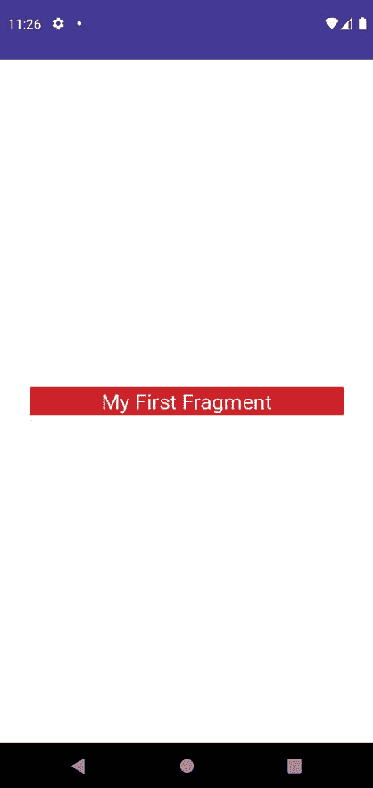

37\. 安卓碎片介绍

随着本书章节的深入，越来越明显的是，安卓系统背后的许多设计概念都是以促进组成应用程序的不同元素的重用和交互为目标的。本章将探讨的一个领域是片段的使用。

本章将从什么是片段以及如何在应用程序中创建和使用片段的角度来概述片段的基础知识。下一章将介绍一个教程，该教程旨在展示在安卓工作室中开发应用程序时的片段，包括片段之间通信的实现。

37.1 什么是碎片？

片段是应用程序用户界面和相应行为的一个独立的模块化部分，可以嵌入到活动中。可以在应用程序设计阶段组装片段来创建活动，并在应用程序运行时向活动添加片段或从活动中移除片段来创建动态变化的用户界面。

片段只能作为活动的一部分使用，不能作为独立的应用程序元素实例化。尽管如此，一个片段可以被认为是一个功能性的“子活动”，它有自己的生命周期，类似于一个完整的活动。

片段以 XML 布局文件的形式存储，可以通过在活动的布局文件中放置适当的<片段>元素，或者直接通过活动的类实现中的代码添加到活动中。

37.2 创建片段

组成片段的两个组件是一个 XML 布局文件和一个相应的 Kotlin 类。片段的 XML 布局文件采用与任何其他活动布局相同的格式，并且可以包含布局管理器和视图的任何组合和复杂性。例如，下面的 XML 布局是由一个红色背景的约束布局和一个白色前景的文本视图组成的片段:

```kt
<?xml version="1.0" encoding="utf-8"?>
<androidx.constraintlayout.widget.ConstraintLayout xmlns:android="http://schemas.android.com/apk/res/android"
    xmlns:app="http://schemas.android.com/apk/res-auto"
    xmlns:tools="http://schemas.android.com/tools"
    android:id="@+id/constraintLayout"
    android:layout_width="match_parent"
    android:layout_height="match_parent"
    android:background="@android:color/holo_red_dark"
    tools:context=".FragmentOne">

    <TextView
        android:id="@+id/textView1"
        android:layout_width="wrap_content"
        android:layout_height="wrap_content"
        android:text="My First Fragment"
        android:textAppearance="@style/TextAppearance.AppCompat.Large"
        android:textColor="@color/white"
        app:layout_constraintBottom_toBottomOf="parent"
        app:layout_constraintEnd_toEndOf="parent"
        app:layout_constraintStart_toStartOf="parent"
        app:layout_constraintTop_toTopOf="parent" />
</androidx.constraintlayout.widget.ConstraintLayout>
```

布局对应的类必须是安卓碎片类的子类。这个类至少应该重写负责加载片段布局的 onCreateView()方法。例如:

```kt
package com.example.myfragmentdemo

import android.os.Bundle
import android.view.LayoutInflater
import android.view.View
import android.view.ViewGroup
import androidx.fragment.app.Fragment

class FragmentOne : Fragment() {

    private var _binding: FragmentTextBinding? = null
    private val binding get() = _binding!!

    override fun onCreateView(
        inflater: LayoutInflater, container: ViewGroup?,
        savedInstanceState: Bundle?
    ): View? {
        _binding = FragmentTextBinding.inflate(inflater, container, false)
        return binding.root
    }
}
```

除了 onCreateView()方法，该类还可以重写标准生命周期方法。

一旦创建了片段布局和类，片段就可以在应用程序活动中使用了。

37.3 使用布局 XML 文件向活动添加片段

片段可以通过编写 Kotlin 代码或通过将片段嵌入活动的 XML 布局文件来合并到活动中。无论使用哪种方法，需要注意的一个关键点是，当支持库用于与旧的安卓版本兼容时，任何使用片段的活动都必须实现为 FragmentActivity 的子类，而不是 AppCompatActivity 类:

```kt
package com.example.myFragmentDemo
import androidx.fragment.app.FragmentActivity
import android.os.Bundle

class MainActivity : FragmentActivity() {
.
.
```

片段使用片段容器视图类嵌入到活动布局文件中。以下示例布局将本章上一节中创建的片段嵌入到活动布局中:

```kt
<?xml version="1.0" encoding="utf-8"?>
<androidx.constraintlayout.widget.ConstraintLayout xmlns:android="http://schemas.android.com/apk/res/android"
    xmlns:app="http://schemas.android.com/apk/res-auto"
    xmlns:tools="http://schemas.android.com/tools"
    android:layout_width="match_parent"
    android:layout_height="match_parent"
    tools:context=".MainActivity">

    <androidx.fragment.app.FragmentContainerView
        android:id="@+id/fragment2"
        android:name="com.ebookfrenzy.myfragmentdemo.FragmentOne"
        android:layout_width="0dp"
        android:layout_height="wrap_content"
        android:layout_marginStart="32dp"
        android:layout_marginEnd="32dp"
        app:layout_constraintBottom_toBottomOf="parent"
        app:layout_constraintEnd_toEndOf="parent"
        app:layout_constraintStart_toStartOf="parent"
        app:layout_constraintTop_toTopOf="parent"
        tools:layout="@layout/fragment_one" />
</androidx.constraintlayout.widget.ConstraintLayout>
```

<fragment>元素中的关键属性是 android:name，它必须引用与片段关联的类，以及 tools:layout ，它必须引用包含片段布局的 XML 资源文件。</fragment>

一旦添加到活动的布局中，就可以在安卓工作室布局编辑器工具中查看和操作片段。[如图 37-1](#_idTextAnchor806) 所示，在安卓工作室布局编辑器中嵌入片段的上述布局:



图 37-1

37.4 在代码中添加和管理片段

通过活动的 XML 布局文件向活动添加片段的简单性是以活动不能在运行时移除片段为代价的。为了在运行时实现对片段的完全动态控制，这些活动必须通过代码来添加。这样做的好处是，可以在应用程序运行时动态添加、删除甚至替换碎片。

当使用代码管理片段时，片段本身仍然由一个 XML 布局文件和一个相应的类组成。当在宿主活动中处理片段时，区别就来了。使用代码向活动添加片段时，有一个标准的步骤序列:

1.创建片段类的实例。

2.将任何附加的意图参数传递给类实例。

3.获取对片段管理器实例的引用。

4.在片段管理器实例上调用 beginTransaction()方法。这将返回一个片段事务实例。

5.调用片段事务实例的 add()方法，将包含片段和片段类实例的视图的资源标识作为参数传递。

6.调用片段事务的 commit()方法。

例如，下面的代码添加了一个由 FragmentOne 类定义的片段，以便它出现在容器视图中，其 ID 为 LinearLayout1:

```kt
val firstFragment = FragmentOne()
firstFragment.arguments = intent.extras
val transaction = fragmentManager.beginTransaction()
transaction.add(R.id.LinearLayout1, firstFragment)
transaction.commit()  
```

为了清楚起见，上面的代码将每一步都分解成一个单独的语句。但是，最后四行可以缩写为一行代码，如下所示:

```kt
supportFragmentManager.beginTransaction().add(
      R.id.LinearLayout1, firstFragment).commit()
```

一旦添加到容器中，随后可以通过调用片段事务实例的 remove()方法移除片段，传递对要移除的片段实例的引用:

```kt
transaction.remove(firstFragment)
```

类似地，通过调用片段事务实例的 replace()方法，一个片段可以被另一个片段替换。这将包含片段的视图的标识和新片段的实例作为参数。被替换的片段也可以放置在所谓的后栈上，以便在用户导航回它的情况下可以快速恢复。这是通过在调用 commit()方法之前调用片段事务对象的 addToBackStack()方法来实现的:

```kt
val secondFragment = FragmentTwo()
transaction.replace(R.id.LinearLayout1, secondFragment)
transaction.addToBackStack(null)
transaction.commit()
```

37.5 处理碎片事件

如前所述，片段非常像一个子活动，有自己的布局、类和生命周期。片段中的视图组件(如按钮和文本视图)能够像常规活动中的事件一样生成事件。这就提出了一个问题，即哪个类从片段中的视图接收事件；片段本身，或者片段嵌入的活动。这个问题的答案取决于事件处理程序是如何声明的。

在标题为[“安卓事件处理概述和示例”](33.html#_idTextAnchor734)的一章中，讨论了两种事件处理方法。第一种方法涉及在活动代码中配置事件侦听器和回调方法。例如:

```kt
binding.button.setOnClickListener { // Code to be performed on button click }
```

在拦截点击事件的情况下，第二种方法涉及在 XML 布局文件中设置 android:onClick 属性:

```kt
<Button
    android:id="@+id/button1"
    android:layout_width="wrap_content"
    android:layout_height="wrap_content"
    android:onClick="onClick"
    android:text="Click me" />
```

由片段中的视图生成的事件的一般规则是，如果事件侦听器是使用事件侦听器和回调方法在片段类中声明的，那么事件将首先由片段处理。但是，如果使用 android:onClick 资源，事件将直接传递给包含该片段的活动。

37.6 实现分片通信

一旦一个或多个片段嵌入到一个活动中，就很有可能需要在片段和活动之间以及一个片段和另一个片段之间进行某种形式的通信。事实上，良好的实践要求片段之间不能直接通信。所有通信都应该通过封装活动进行。

为了让活动与片段通信，活动必须通过分配给它的标识来标识片段对象。一旦获得这个引用，活动就可以简单地调用片段对象的公共方法。

在另一个方向(从片段到活动)的交流稍微复杂一些。在第一种情况下，片段必须定义一个侦听器接口，然后在活动类中实现。例如，下面的代码在一个名为 ToolbarFragment 的片段类上声明了一个名为 ToolbarListener 的接口。该代码还声明了一个变量，稍后将在其中存储对活动的引用:

```kt
class ToolbarFragment : Fragment() {

    var activityCallback: ToolbarFragment.ToolbarListener? = null

    interface ToolbarListener {
        fun onButtonClick(fontsize: Int, text: String)
    }
.
.
}
```

上面的代码规定，任何实现 ToolbarListener 接口的类都必须实现一个名为 onButtonClick 的回调方法，该方法又接受一个整数和一个字符串作为参数。

接下来需要重写并实现片段类的 onAttach()方法。当片段已经初始化并与活动相关联时，安卓系统会自动调用该方法。向方法传递对包含该片段的活动的引用。该方法必须存储对此活动的本地引用，并验证它实现了 ToolbarListener 接口:

```kt
override fun onAttach(context: Context?) {
    super.onAttach(context)
    try {
        activityCallback = context as ToolbarListener
    } catch (e: ClassCastException) {
        throw ClassCastException(context?.toString() 
           + " must implement ToolbarListener")
    }
}
```

在执行此示例时，对活动的引用将存储在本地 activityCallback 变量中，如果该活动没有实现 ToolbarListener 接口，将引发异常。

下一步是从片段中调用活动的回调方法。何时以及如何发生完全取决于片段需要联系活动的环境。例如，下面的代码在单击按钮时调用活动的回调方法:

```kt
override fun onButtonClick(arg1: Int, arg2: String) {
   activityCallback.onButtonClick(arg1, arg2)
}
```

剩下的就是修改活动类，以便它实现 ToolbarListener 接口。例如:

```kt
class MainActivity : FragmentActivity(), 
      ToolbarFragment.ToolbarListener {

    override fun onButtonClick(arg1: Int, arg2: String) {
          // Implement code for callback method
    }
.
.
}
```

从上面的代码中我们可以看到，该活动声明它实现了 ToolbarFragment 类的 ToolbarListener 接口，然后按照接口的要求继续实现 onButtonClick()方法。

37.7 总结

片段为创建用户界面布局和应用程序行为的可重用模块提供了强大的机制，一旦创建，就可以嵌入到活动中。片段由一个用户界面布局文件和一个类组成。片段可以在活动中使用，方法是将片段添加到活动的布局文件中，或者编写代码在运行时管理片段。代码中添加到活动的片段可以在运行时动态移除和替换。片段之间的所有通信都应该通过嵌入片段的活动来执行。

本章已经介绍了片段的基础知识，下一章将通过一个旨在加强本章中概述的技术的教程来学习。