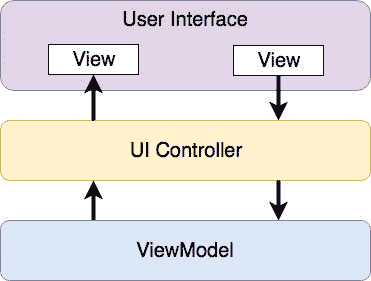
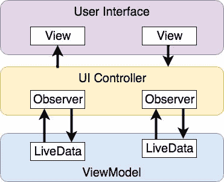
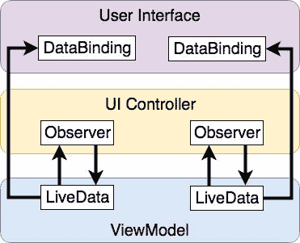

39\. 现代安卓应用架构搭配 Jetpack

直到最近，谷歌才推荐了一种特定的方法来构建安卓应用，除了提供工具和开发工具包，同时让开发人员决定什么最适合特定的项目或个人编程风格。这种情况在 2017 年随着安卓架构组件的引入而改变，而这些组件在 2018 年发布时又成为了安卓 Jetpack 的一部分。

本章旨在概述 Jetpack 的概念、安卓应用架构建议以及一些关键架构组件。一旦基本知识被涵盖，这些主题将被更详细地涵盖，并在后面的章节中通过实际的例子进行演示。

39.1 什么是安卓 Jetpack？

安卓喷气包由AndroidStudio、安卓架构组件和安卓支持库以及一套推荐安卓应用结构的指南组成。安卓架构组件旨在使开发安卓应用时更快、更容易地执行常见任务，同时也符合架构指南的关键原则。

虽然本书将涵盖所有安卓架构组件，但本章的目标是介绍关键的架构指南以及视图模型、实时数据、生命周期组件，同时还介绍数据绑定和存储库的使用。

在继续之前，重要的是要理解 Jetpack 的应用开发方法不是强制性的。谷歌强调了多年来流行的其他技术的一些缺点，但没有完全谴责这些应用开发方法。谷歌似乎采取的立场是，虽然没有正确或错误的方法来开发应用，但有一个推荐的方法。

39.2 古老的建筑

在标题为[“在 Android Studio 中创建示例 Android 应用”](03.html#_idTextAnchor033)的章节中，创建了一个 Android 项目，该项目由一个活动组成，该活动包含所有用于呈现和管理用户界面的代码以及应用的后端逻辑。在 Jetpack 推出之前，最常见的架构遵循这一范式，应用由多个活动组成(应用中的每个屏幕一个)，每个活动类在某种程度上混合了用户界面和后端代码。

这种方法导致了一系列与应用生命周期相关的问题(例如，每次用户旋转设备时，活动都会被销毁并重新创建，导致任何未保存到某种形式的持久存储中的应用数据丢失)，以及低效导航等问题，包括为用户访问的每个应用屏幕启动新活动。

39.3 现代安卓架构

在最基本的层面上，谷歌现在提倡单一活动应用，即在同一活动中将不同的屏幕作为内容加载。

现代架构指南还建议将应用中不同的责任领域分成完全独立的模块(谷歌称之为“关注点分离”)。这种方法的关键之一是视图模型组件。

39.4视图模型组件

视图模型的目的是将应用的用户界面相关数据模型和逻辑与负责实际显示和管理用户界面以及与操作系统交互的代码分开。当以这种方式设计时，应用将由一个或多个用户界面控制器组成，例如一个活动，以及负责处理这些控制器所需数据的视图模型实例。

实际上，视图模型只知道数据模型和相应的逻辑。它对用户界面一无所知，也不尝试直接访问或响应与用户界面中的视图相关的事件。当用户界面控制器需要显示数据时，它只需要让视图模型提供数据。类似地，当用户在用户界面的视图中输入数据时，用户界面控制器将其传递给视图模型进行处理。

这种职责分离解决了与用户界面控制器生命周期相关的问题。无论用户界面控制器在应用的生命周期中被重新创建多少次，视图模型实例都会保留在内存中，从而保持数据的一致性。例如，活动使用的视图模型将保留在内存中，直到活动完全结束，而在单个活动应用中，直到应用退出才结束。

图 39-1

39.5实时数据组件

考虑一个显示实时数据的应用，比如金融股票的当前价格。该应用可能会使用某种形式的股票价格网络服务，用最新的信息不断更新视图模型中的数据模型。显然，除非及时向用户显示，否则这些实时数据用处不大。UI 控制器只有两种方法可以确保在用户界面中显示最新的数据。一种选择是控制器持续检查视图模型，以发现自上次显示以来数据是否发生了变化。然而，这种方法的问题在于效率低下。为了保持数据馈送的实时性，用户界面控制器必须循环运行，不断检查数据是否有变化。

更好的解决方案是用户界面控制器在视图模型中的特定数据项发生变化时接收通知。这可以通过使用实时数据组件来实现。LiveData 是一个数据持有者，它允许一个值变得可观察。基本而言，当数据发生变化时，可观察对象能够通知其他对象，从而解决了确保用户界面始终与视图模型中的数据相匹配的问题

例如，这意味着对视图模型值感兴趣的用户界面控制器可以设置一个观察器，当该值发生变化时，该观察器会得到通知。例如，在我们假设的应用中，股票价格将被包装在视图模型中的一个实时数据对象中，用户界面控制器将为该值分配一个观察器，声明一个在值改变时调用的方法。当数据更改触发时，该方法将从视图模型中读取更新的值，并使用它来更新用户界面。

图 39-2

LiveData实例也可以声明为可变的，允许观察实体更新LiveData对象中的基础值。例如，用户可以在用户界面中输入一个值，该值需要覆盖存储在视图模型中的值。

使用 LiveData 的另一个关键优势是它知道观察者的生命周期状态。例如，如果一个活动包含一个实时数据观察器，相应的实时数据对象将知道该活动的生命周期状态何时改变并做出相应的响应。如果活动暂停(可能是应用被放入后台)，LiveData 对象将停止向观察者发送事件。如果活动刚刚开始或暂停后恢复，LiveData 对象将向观察者发送 LiveData 事件，以便活动具有最新值。同样，LiveData 实例将知道活动何时被销毁，并移除观察器以释放资源。

到目前为止，我们只讨论了使用观察器的 UI 控制器。然而，在实践中，观察者可以用在任何符合生命周期管理 Jetpack 方法的对象中。

39.6 视图模型保存状态

安卓允许用户将一个活动的应用放在后台，稍后在设备上执行其他任务(包括运行其他应用)后返回。当设备资源不足时，操作系统会通过终止后台应用进程来纠正这种情况，从最近使用最少的应用开始。然而，当用户返回到终止的后台应用时，它应该以与它被放置在后台时相同的状态出现，而不管它是否被终止。就与视图模型相关的数据而言，这可以通过使用视图模型保存状态模块来实现。该模块允许将值存储在应用的保存状态中，并在系统启动的进程终止时恢复，这一主题将在后面题为[“安卓视图模型保存状态教程”](44.html#_idTextAnchor903)的章节中介绍。

39.7 LiveData和 数据绑定

安卓喷气包包括数据绑定库，允许视图模型中的数据直接映射到 XML 用户界面布局文件中的特定视图。在前面创建的 AndroidSample 项目中，必须编写代码来获取对编辑文本和文本视图的引用，并设置和获取文本属性以反映数据更改。数据绑定允许在 XML 布局文件中直接引用存储在视图模型中的实时数据值，避免了编写代码来保持布局视图更新的需要。

图 39-3

数据绑定将从标题为[“安卓 Jetpack 数据绑定概述”](42.html#_idTextAnchor875)的章节开始进行更详细的介绍。

39.8 安卓 生命周期

从安卓组件被创建到被销毁的这段时间被称为生命周期。在这个生命周期中，组件将在不同的生命周期状态之间变化，通常是在操作系统的控制下并响应用户的动作。例如，在转换到创建状态之前，活动将从初始化状态开始。一旦活动开始运行，它将切换到开始状态，并在各种状态之间循环，包括创建、开始、恢复和销毁。

许多安卓框架类和组件允许其他对象访问它们的当前状态。也可以使用生命周期观察器，以便当另一个对象的生命周期状态发生变化时，该对象会收到通知。这是视图模型组件在幕后使用的技术，用于识别观察者何时重启或被破坏。该功能不限于安卓框架和架构组件，也可以使用架构组件中包含的一组生命周期组件构建到任何其他类中。

能够检测到其他对象的生命周期状态变化并做出反应的对象被称为生命周期感知对象，而提供对其生命周期状态的访问的对象被称为生命周期所有者。生命周期将在标题为[“使用安卓生命周期感知组件”](45.html#_idTextAnchor910)的章节中详细介绍。

39.9 存储库模块

如果视图模型从一个或多个外部源(如数据库或网络服务)获得数据，那么将处理这些数据源所涉及的代码与视图模型类分开是很重要的。不这样做，毕竟会违反关注点分离准则。为了避免将该功能与视图模型混合，谷歌的架构指南建议将该代码放在单独的存储模块中。

存储库不是安卓架构组件，而是由负责与各种数据源接口的应用开发人员创建的 Java 类。该类然后提供一个到视图模型的接口，允许数据存储在模型中。

图 39-4

39.10 总结

直到去年，谷歌倾向于不推荐任何构建安卓应用的特定方法。随着 Android Jetpack 的推出，这种情况已经发生了变化，它由一套工具、组件、库和架构指南组成。谷歌现在建议将一个应用项目分成独立的模块，每个模块负责一个特定的功能领域，也称为“关注点分离”。

特别是，指南建议将应用的视图数据模型与负责处理用户界面的代码分开。此外，负责从 web 服务或数据库等数据源收集数据的代码应该构建到一个单独的存储库模块中，而不是与视图模型捆绑在一起。

安卓Jetpack包括安卓架构组件，这些组件是专门为更容易开发符合推荐指南的应用而设计的。本章介绍了视图模型、实时数据和生命周期组件。这些将从下一章开始更详细地讨论。本章中没有提到的其他体系结构组件将在本书后面介绍。