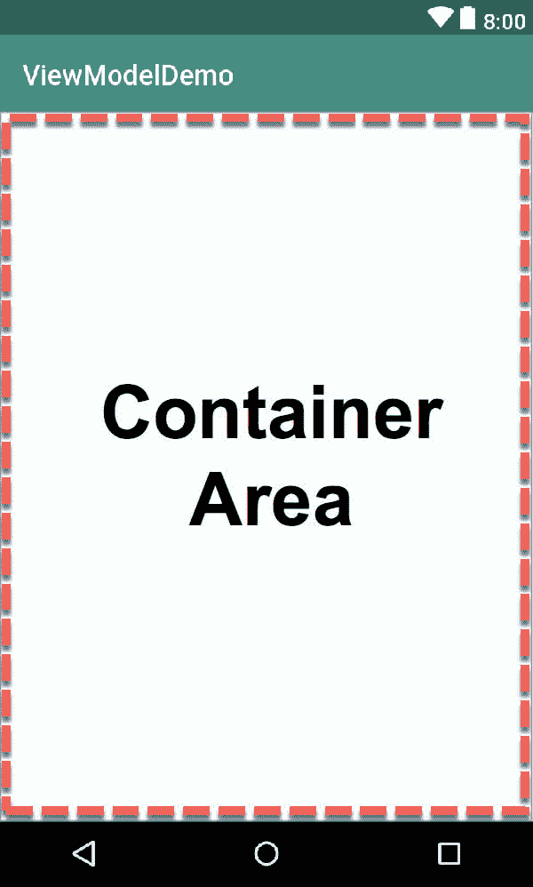
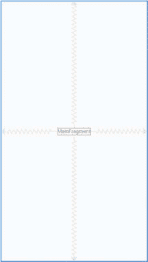
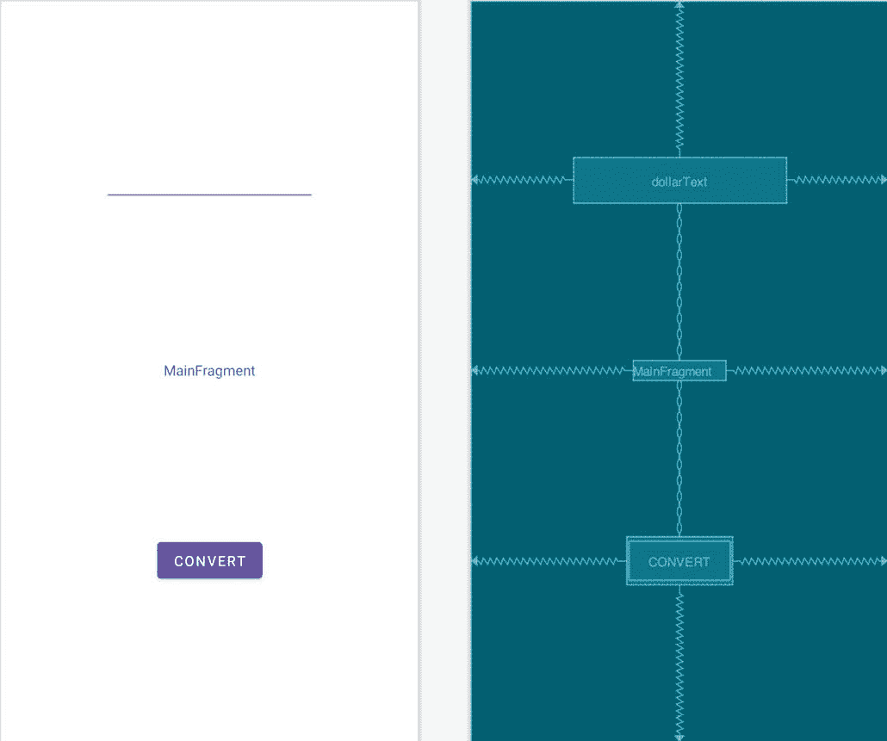

40\. 安 Android Jetpack 视图模型教程

前一章介绍了安卓 Jetpack 的关键概念，概述了现代安卓应用架构的基础。Jetpack 本质上定义了一组建议，描述了安卓应用项目应该如何结构化，同时提供了一组库和组件，使其更容易符合这些准则，目标是开发编码更少、错误更少的可靠应用。

为了帮助加强和澄清上一章中提供的信息，本章将逐步创建一个使用视图模型组件的示例应用项目。随着 LiveData 和数据绑定支持的加入，这个例子将在下一章得到进一步的增强。

40.1 关于项目

在名为[“在 Android Studio 中创建示例 Android 应用”](03.html#_idTextAnchor033)的章节中，创建了一个名为 AndroidSample 的项目，其中该应用的所有代码都捆绑到主 Activity 类文件中。在接下来的章节中，创建了一个 AVD 模拟器，并用于运行该应用。当应用运行时，我们亲身经历了以这种方式开发应用时出现的那种问题，即在设备旋转期间显示在文本视图小部件上的数据丢失。

本章将实现相同的货币转换器应用，这次使用视图模型组件，并遵循谷歌应用架构指南，以避免活动生命周期的复杂性。

40.2 创建视图模型示例项目

本练习的第一步是创建新项目。首先启动AndroidStudio，如有必要，使用文件->关闭项目菜单选项关闭任何当前打开的项目，以便出现欢迎屏幕。

创建 AndroidSample 项目时，选择了空活动模板作为项目的基础。然而，对于这个项目，将使用片段+视图模型模板。这将生成一个符合架构指南的AndroidStudio项目。

从欢迎屏幕中选择创建新项目快速启动选项，并在生成的新项目对话框中选择片段+视图模型模板，然后单击下一步按钮。

在名称字段中输入视图模型演示，并将 com . ebookwidge . ViewModelDemo 指定为包名。在单击完成按钮之前，将最低API级别设置更改为API 26:安卓 8.0(奥利奥)，并将语言菜单更改为Kotlin。编辑 build.gradle(模块:视图模型演示)文件，启用视图绑定，然后单击编辑器面板顶部的立即同步链接:

```kt
android {

    buildFeatures {
        viewBinding true
    }
```

40.3 项目评审

当使用片段+视图模型模板创建项目时，项目的结构在许多方面不同于创建 AndroidSample 项目时使用的空活动。该项目的主要组成部分如下:

40.3.1 主要活动

需要注意的第一点是，主活动的用户界面已经被结构化，以允许单个活动充当完成的应用最终需要的所有屏幕的容器。活动的主用户界面布局包含在 app-> RES-> layout-> main _ activity . XML 文件中，并以框架布局的形式提供了一个空的容器空间(在[图 40-1](#_idTextAnchor856) 中突出显示)，屏幕内容将出现在该空间中:



图 40-1

40.3.2 内容片段

框架布局容器只是一个占位符，运行时将被应用启动时出现的第一个屏幕的内容替换。这些内容通常采用片段的形式，由一个 XML 布局资源文件和相应的类文件组成。事实上，当项目创建时，AndroidStudio正是为此目的创建了一个初始片段。这个片段的布局资源文件可以在 app-> RES-> layout-> main _ fragment . XML 中找到，加载到布局编辑器中会出现如图[图 40-2](#_idTextAnchor858) 所示:



图 40-2

默认情况下，该片段只包含一个显示文本的文本视图，文本显示为“MainFragment”，但在其他情况下，它可以被修改为包含第一个应用屏幕的布局。在这一点上，值得花一些时间来看看AndroidStudio已经生成的代码，以在活动容器区域中显示这个片段。

用片段替换框架布局占位符的过程开始于 MainActivity 类文件(app -> java -> <package name="">-> MainActivity)。代码的关键行出现在此类的 onCreate()方法中，并用 MainFragment 类替换容器 id 为(已分配给 FrameLayout 占位符视图)的对象:</package>

```kt
override fun onCreate(savedInstanceState: Bundle?) {
    super.onCreate(savedInstanceState)
    setContentView(R.layout.main_activity)
    if (savedInstanceState == null) {
        supportFragmentManager.beginTransaction()
                .replace(R.id.container, MainFragment.newInstance())
                .commitNow()
    }
}
```

片段附带的代码可以在 MainFragment.kt 文件中找到(app-><package name="">-> ui . main-> main fragment)。在这个类文件中有一个 onCreateView()方法，它在创建片段时被调用。此方法扩展 main_fragment.xml 布局文件，使其显示在主活动布局的容器区域中:</package>

```kt
override fun onCreateView(inflater: LayoutInflater, container: ViewGroup?,
                          savedInstanceState: Bundle?): View {
    return inflater.inflate(R.layout.main_fragment, container, false)
}
```

40.3.3 视图模型

活动的视图模型包含在位于 app-> Java-> ui . main-> MainViewModel 的 MainViewModel.kt 类文件中。这被声明为视图模型安卓架构组件类的子类，并准备好进行修改以存储应用的数据模型:

```kt
package com.ebookfrenzy.viewmodeldemo.ui.main

import androidx.lifecycle.ViewModel

class MainViewModel : ViewModel() {
    // TODO: Implement the ViewModel
}
```

40.4 设计片段布局

下一步是设计片段的布局。在项目工具窗口中找到 main_fragment.xml 文件，并双击它将其加载到布局编辑器中。加载布局后，选择现有的文本视图小部件，并使用属性工具窗口将 id 属性更改为结果文本。

从调色板中拖动数字(十进制)视图，并将其放置在现有文本视图的上方。在布局中选择视图后，请参考属性工具窗口，并将 id 更改为 dollarText。

将按钮小部件拖到布局上，使其位于文本视图下方，并将文本属性更改为“转换”。在按钮仍处于选中状态的情况下，将 id 属性更改为 convertButton。此时，布局应类似于图 40-3 中所示的布局(注意，三个视图已使用垂直链进行了约束):



图 40-3

最后，点击布局编辑器右上角的警告图标，将硬编码字符串转换为资源。

40.5 实现视图模型

用户界面布局完成后，应用的数据模型需要在视图模型中创建。在项目工具窗口中，找到 MainViewModel.kt 文件，双击该文件将其加载到代码编辑器中，并修改该类，使其如下所示:

```kt
package com.ebookfrenzy.viewmodeldemo.ui.main

import androidx.lifecycle.ViewModel

class MainViewModel : ViewModel() {

    private val rate = 0.74f
    private var dollarText = ""
    private var result: Float = 0f

    fun setAmount(value: String) {
        this.dollarText = value
        result = value.toFloat() * rate
    }

    fun getResult(): Float {
        return result
    }
}
```

该类声明变量来存储当前的美元字符串值和转换后的金额，以及 getter 和 setter 方法来提供对这些数据值的访问。调用时，setAmount()方法将当前美元金额作为参数，并将其存储在本地美元文本变量中。美元字符串值被转换为一个浮点数，乘以一个虚构的汇率和存储在结果变量中的欧元值。另一方面，getResult()方法只返回分配给结果变量的当前值。

40.6 将片段与视图模型相关联

显然，片段需要某种方式来获得对视图模型的引用，以便能够访问模型并观察数据变化。片段或活动使用视图模型提供程序类的一个实例来维护它所依赖的视图模型的引用。

使用片段中的视图模型提供程序类创建一个视图模型提供程序实例。调用时，类初始值设定项被传递一个对当前片段或活动的引用，并返回一个 ViewModelProvider 实例，如下所示:

```kt
val viewModelProvider = ViewModelProvider(this)
```

一旦创建了视图模型提供程序实例，就可以通过所需的特定视图模型类在该实例上调用 get()方法。然后，提供者将创建该视图模型类的新实例，或者返回一个现有实例:

```kt
val viewModel = ViewModelProvider(this).get(MyViewModel::class.java)
```

编辑 MainFragment.kt 文件，并验证 Android Studio 是否已经在 onActivityCreated()方法中包含了此步骤(尽管为了简洁起见，只需在一行代码中执行操作):

```kt
viewModel = ViewModelProvider(this).get(MainViewModel::class.java)
```

通过访问模型视图，现在可以将代码添加到片段中，开始使用数据模型。

40.7 修改片段

片段类现在需要更新，以对按钮点击做出反应，并与存储在视图模型中的数据值进行交互。该类还需要对用户界面布局中三个视图的引用，以对按钮点击做出反应，提取当前美元值并显示转换后的货币金额。

在标题为[“在 Android Studio 中创建示例 Android 应用”](03.html#_idTextAnchor033)的章节中，Button 小部件的 onClick 属性用于指定用户单击按钮时要调用的方法。不幸的是，该属性只能调用活动上的方法，不能用于调用片段中的方法。为了避免这种限制，我们需要向 Fragment 类添加一些代码，以便在按钮上设置 onClick 侦听器。这样做的代码可以添加到 MainFragment.kt 文件的 onActivityCreated()方法中，如下所述。在进行这些更改的同时，我们还将转换片段，以便它使用视图绑定:

```kt
.
.
import com.ebookfrenzy.viewmodeldemo.databinding.MainFragmentBinding
.
.
private var _binding: MainFragmentBinding? = null
private val binding get() = _binding!!

override fun onCreateView(
    inflater: LayoutInflater, container: ViewGroup?,
    savedInstanceState: Bundle?
): View {
    return inflater.inflate(R.layout.main_fragment, container, false)
    _binding = MainFragmentBinding.inflate(inflater, container, false)
    return binding.root
}
override fun onDestroyView() {
    super.onDestroyView()
    _binding = null
}

override fun onActivityCreated(savedInstanceState: Bundle?) {
    super.onActivityCreated(savedInstanceState)
    viewModel = ViewModelProvider(this).get(MainViewModel::class.java)

    binding.convertButton.setOnClickListener {

    }
}
```

添加侦听器后，每当用户单击按钮时，都会调用 onClick()方法中的任何代码。

40.8 访问视图模型数据

单击按钮时，onClick()方法需要从 EditText 视图中读取当前值，确认字段不为空，然后调用 ViewModel 实例的 setAmount()方法。然后，该方法需要调用视图模型的 getResult()方法，并在文本视图小部件上显示转换后的值。

由于项目中尚未使用实时数据，因此每次创建片段时，还需要从视图模型中获取最新的结果值。

保留在 MainFragment.kt 文件中，在 onActivityCreated()方法中实现这些要求如下:

```kt
.
.
override fun onActivityCreated(savedInstanceState: Bundle?) {
    super.onActivityCreated(savedInstanceState)
    viewModel = ViewModelProvider(this).get(MainViewModel::class.java)

    binding.resultText.text = viewModel.getResult().toString()

    binding.convertButton.setOnClickListener {

        if (binding.dollarText.text.isNotEmpty()) {
            viewModel.setAmount(binding.dollarText.text.toString())
            binding.resultText.text = viewModel.getResult().toString()
        } else {
            binding.resultText.text = "No Value"
        }
    }
}
```

40.9 测试项目

项目开发的这一阶段完成后，在模拟器或物理设备上构建和运行应用，输入美元值并单击转换按钮。转换后的金额应出现在文本视图上，表明用户界面控制器和视图模型的重新构建似乎如预期的那样工作。

当原始的 AndroidSample 应用运行时，旋转设备会导致结果文本文本视图小部件上显示的值丢失。现在使用 ViewModelDemo 应用重复该测试，并注意当前欧元值在轮换后会保留。这是因为当片段被销毁和重新创建时，视图模型保留在内存中，并且代码被添加到 onActivityCreated()方法中，以在每次片段重新启动时用视图模型的结果数据值更新文本视图。

虽然这是对原始 AndroidSample 应用的改进，但通过使用 LiveData 和数据绑定(这两者都是下一章的主题)来简化项目还可以实现更多。

40.10 总结

在这一章中，我们回顾了本书前面创建的 AndroidSample 项目，并创建了一个新版本的项目，其结构符合 Android Jetpack 架构指南。本章概述了片段+视图模型项目模板的结构，并解释了将应用基于单个活动的概念，使用片段在单个活动布局中呈现不同的屏幕。该示例项目还演示了如何使用视图模型将数据处理与用户界面相关代码分开。最后，本章展示了视图模型方法如何避免处理片段和活动生命周期的一些问题。