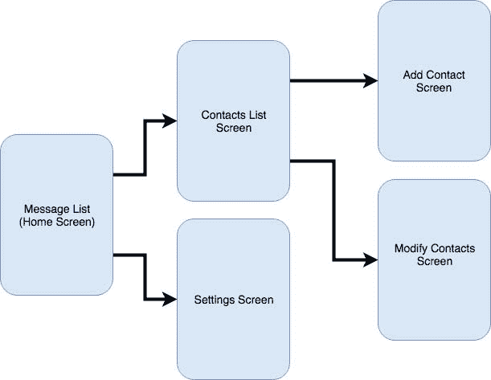
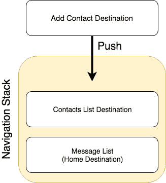
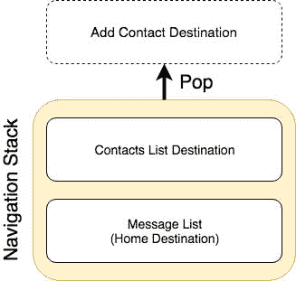
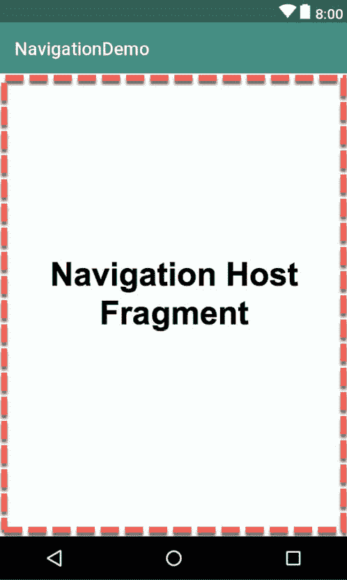

# 四十七、导航架构组件概述

如今，很少有安卓应用仅由一个屏幕组成。实际上，大多数应用都包含多个屏幕，用户可以通过屏幕手势、按钮点击和菜单选择进行导航。在引入 Android Jetpack 之前，在应用中实现导航主要是一个手动编码过程，没有简单的方法来查看和组织潜在的复杂导航路径。然而，随着安卓导航架构组件的引入以及 AndroidStudio 对导航图的支持，这种情况已经有了很大的改善。

47.1 理解导航

每个应用都有一个主屏幕，在应用启动后和任何闪屏出现后都会出现(闪屏是应用加载时临时出现的应用品牌屏幕)。在这个主屏幕上，用户通常会执行导致其他屏幕出现的任务。这些屏幕通常会采取应用中其他活动和片段的形式。例如，消息应用可能有一个主屏幕，列出当前消息，用户可以从中导航到另一个屏幕以访问联系人列表或设置屏幕。反过来，联系人列表屏幕可能允许用户导航到可以添加新用户或更新现有联系人的其他屏幕。图形上，应用的导航图可能如图 47-1 所示:



图 47-1

组成应用的每个屏幕，包括主屏幕，都被称为目的地，通常是一个片段或活动。安卓导航架构使用导航栈来跟踪用户在应用中通过目的地的路径。当应用第一次启动时，主屏幕是放置在堆栈上的第一个目的地，并成为当前目的地。当用户导航到另一个目的地时，该屏幕将成为当前目的地，并被推送到主目的地上方的堆栈上。当用户导航到其他屏幕时，它们也被推送到堆栈上。[例如，图 47-2](#_idTextAnchor933) 显示了用户启动应用并导航到“添加联系人”屏幕后，假设的消息应用的导航堆栈的当前状态:



图 47-2

当用户使用系统返回按钮在屏幕中导航时，每个目的地从堆栈中弹出，直到主屏幕再次成为堆栈中的唯一目的地。在[图 47-3](#_idTextAnchor934) 中，用户已经从添加联系人屏幕导航回来，将其弹出堆栈，并使联系人列表屏幕成为当前目的地:



图 47-3

在目的地之间导航和管理导航栈所涉及的所有工作都由导航控制器处理，导航控制器由导航控制器类表示。

使用导航架构组件向安卓项目添加导航是一个简单的过程，包括导航主机、导航图、导航动作和最少的代码编写，以获得对导航控制器实例的引用并与之交互。

47.2 声明导航主机

导航主机只是一个嵌入到活动的用户界面布局中的特殊片段(NavHostFragment)，并充当用户将导航通过的目的地的占位符。[例如，图 47-4](#_idTextAnchor937) 显示了一个典型的活动屏幕，并突出显示了导航主机片段所代表的区域:



图 47-4

通过从组件面板的容器部分拖放一个实例，或者手动编辑 XML，可以将一个 NavHostFragment 放入 Android Studio 布局编辑器的活动布局中，如下所示:

```kt
<?xml version="1.0" encoding="utf-8"?>
<FrameLayout xmlns:android="http://schemas.android.com/apk/res/android"
    xmlns:app="http://schemas.android.com/apk/res-auto"
    xmlns:tools="http://schemas.android.com/tools"
    android:id="@+id/container"
    android:layout_width="match_parent"
    android:layout_height="match_parent"
    tools:context=".MainActivity" >

    <androidx.fragment.app.FragmentContainerView
        android:id="@+id/demo_nav_host_fragment"
        android:name="androidx.navigation.fragment.NavHostFragment"
        android:layout_width="match_parent"
        android:layout_height="match_parent"
        app:defaultNavHost="true"
        app:navGraph="@navigation/navigation_graph" />
</FrameLayout>
```

上述导航主机片段元素中需要注意的点是在 name 属性中对 NavHostFragment 的引用、将 defaultNavHost 设置为 true 以及将包含导航图的文件分配给 navGraph 属性。

当活动启动时，该导航主机片段被导航图中指定的主目的地替换。当用户浏览应用屏幕时，主机片段将被目的地的适当片段替换。

47.3 导航图

导航图是一个 XML 文件，其中包含将包含在应用导航中的目的地。除了这些目标之外，该文件还包含定义目标之间导航的导航操作，以及用于将数据从一个目标传递到另一个目标的可选参数。AndroidStudio 包括一个导航图形编辑器，可以用来设计图形，并通过可视化或手动编辑 XML 来实现操作。

[图 47-5](#_idTextAnchor939) ，显示设计模式下的 AndroidStudio 导航图编辑器:


图 47-5

目的地列表(A)提供了图表中当前包含的所有目的地的列表。从列表中选择一个目的地将在图形中定位并选择相应的目的地(对于在大型图形中定位特定目的地特别有用)。导航图形面板(B)包含每个目的地的对话框，显示用户界面布局的表示。在本例中，该图包含两个名为 mainFragment 和 secondFragment 的目的地。目的地之间的箭头(C)表示导航动作连接。将鼠标指针悬停在原点的边缘上，直到出现一个圆，然后单击并从圆拖动到目的地，即可添加动作。属性面板(D)允许查看和修改当前选定目标或操作连接的属性。在上图中，显示了该操作的属性。通过点击标有“E”的按钮并从菜单中选择选项来添加新目的地。可以选择添加现有片段或活动作为目的地，或者创建新的空白片段目的地。组件树面板(F)提供了导航图的分层概述。

通过将编辑器切换到代码模式，可以查看和修改导航图的底层 XML。下面的 XML 列表代表了上面图 47-5 所示的目的地和动作连接的导航图:

```kt
<?xml version="1.0" encoding="utf-8"?>
<navigation xmlns:android="http://schemas.android.com/apk/res/android"
    xmlns:app="http://schemas.android.com/apk/res-auto"
    xmlns:tools="http://schemas.android.com/tools"
    android:id="@+id/navigation_graph"
    app:startDestination="@id/mainFragment">

    <fragment
        android:id="@+id/mainFragment"
        android:name="com.ebookfrenzy.navigationdemo.ui.main.MainFragment"
        android:label="main_fragment"
        tools:layout="@layout/main_fragment" >
        <action
            android:id="@+id/mainToSecond"
            app:destination="@id/secondFragment" />
    </fragment>
    <fragment
        android:id="@+id/secondFragment"
        android:name="com.ebookfrenzy.navigationdemo.SecondFragment"
        android:label="fragment_second"
        tools:layout="@layout/fragment_second" >
    </fragment>
</navigation>
```

如有必要，还可以将导航图拆分到多个文件中，以改进组织并促进重用。当以这种方式构造时，嵌套图被嵌入到根图中。要创建嵌套图形，只需按住 shift 键点按要嵌套的目标，右键点按第一个目标，然后选择“移动到嵌套图形->新建图形”菜单选项。嵌套图将作为图中的新节点出现。要访问嵌套图形，只需双击嵌套图形节点，将图形文件加载到编辑器中。

47.4 访问导航控制器

从一个目的地导航到另一个目的地通常是为了响应应用中的某种事件，如按钮点击或菜单选择。在触发导航操作之前，代码必须首先获取对导航控制器实例的引用。这需要调用导航或导航片段类的 findNavController()方法。例如，以下代码可用于访问活动的导航控制器。请注意，要使代码工作，活动必须包含一个导航主机片段:

```kt
val controller: NavController = 
         Navigation.findNavController(activity, R.id.demo_nav_host_fragment)
```

在这种情况下，方法调用被传递给活动的引用和嵌入在活动布局中的 NavHostFragment 的 id。

或者，与任何视图相关联的导航控制器可以简单地通过将该视图传递给方法来识别:

```kt
val controller: NavController = Navigation.findNavController(button)
```

最后一个选项通过调用 NavHostFragment 类的 findNavController()方法，传递对片段的引用，来查找片段的导航控制器:

```kt
val controller: NavController = NavHostFragment.findNavController(fragment)
```

47.5 触发导航动作

找到导航控制器后，通过调用控制器的 navigate()方法并传递要执行的操作的资源 id 来触发导航操作。例如:

```kt
controller.navigate(R.id.goToContactsList)
```

当选择操作连接时，操作的标识在导航图编辑器的属性面板中定义。

47.6 传递参数

通过使用导航图文件中声明的参数，数据可以在导航操作期间从一个目的地传递到另一个目的地。参数由名称、类型和可选默认值组成，可以在 XML 中手动添加，也可以在图形中选择操作箭头或目标时使用属性面板添加。例如在[图 47-6](#_idTextAnchor943) 中，已经声明了一个名为 contactsCount 的整数参数，默认值为 0:


图 47-6

添加后，参数将放在接收目标的 XML 元素中，例如:

```kt
<fragment
    android:id="@+id/secondFragment"
    android:name="com.ebookfrenzy.navigationdemo.SecondFragment"
    android:label="fragment_second"
    tools:layout="@layout/fragment_second" >
    <argument
        android:name="contactsCount"
        android:defaultValue=0
        app:type="integer" />
</fragment>
```

导航架构组件提供了两种在目的地之间传递数据的技术。一种方法是将数据放入一个 Bundle 对象中，该对象在一个动作过程中被传递到目的地，然后在该动作过程中数据被解包并提取参数。

这种特殊方法的主要缺点是它不是“类型安全的”。换句话说，如果接收目的地将一个参数视为与声明的类型不同的类型(例如，将一个字符串视为一个整数)，编译器将不会捕捉到此错误，并且可能会在运行时导致问题。

更好的选择，本书使用的是利用 safargs。Safeargs 是 Android Studio Gradle 构建系统的一个插件，它自动生成特殊的类，允许以类型安全的方式传递参数。参数传递的 safeargs 方法将在下一章中描述和演示([“安卓 Jetpack 导航组件教程”](48.html#_idTextAnchor945))。

47.7 总结

安卓应用用户界面上下文中的导航一词指的是用户在不同屏幕之间来回移动的能力。AndroidStudio 和导航架构组件曾经实施起来很耗时，也很难组织，但现在它们让在安卓应用项目中实施和管理导航变得更加容易。

应用中的不同屏幕被称为目的地，通常由片段或活动表示。所有应用都有一个主目的地，其中包括应用首次加载时显示的屏幕。此布局的内容区域被导航主机片段替换，当用户导航应用时，导航主机片段将被替换为其他目的地片段。导航路径由导航图文件定义，该文件由目的地和将它们连接在一起的操作以及要在目的地之间传递的任何参数组成。导航由导航控制器处理，除了管理导航堆栈之外，导航控制器还提供从应用代码中启动导航操作的方法。