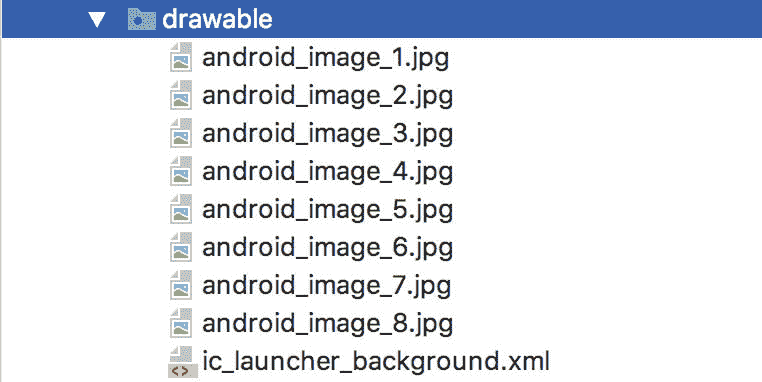
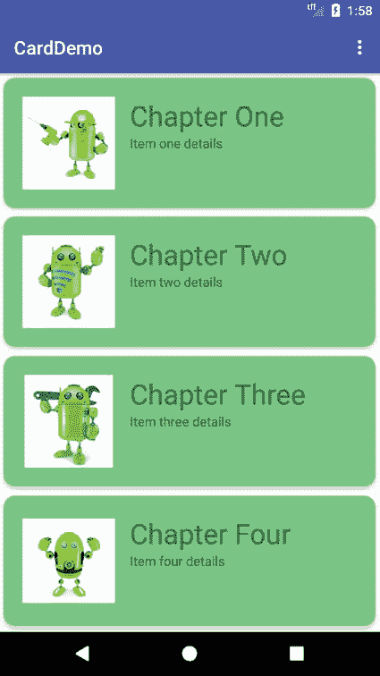

# 五十五、安卓回收视图和卡片视图教程

在本章中，将创建一个示例项目，利用卡片视图和回收视图组件创建一个可滚动的卡片列表。完成的应用将显示包含图像和文本的卡片列表。除了显示卡片列表之外，该项目还将被实施，使得选择一张卡片导致向用户显示指示哪张卡片被点击的消息。

55.1 创建卡片演示项目

从欢迎屏幕中选择创建新项目快速启动选项，并在生成的新项目对话框中选择基本活动模板，然后单击下一步按钮。

在“名称”字段中输入 CardDemo，并将 com . ebookwidue . card demo 指定为包名称。在单击完成按钮之前，将最低API级别设置更改为API 26:安卓 8.0(奥利奥)，并将语言菜单更改为Kotlin。

55.2 修改基本活动项目

由于选择了“基本活动”，布局包括一个浮动操作按钮，该项目不需要该按钮。将 activity_main.xml 布局文件加载到布局编辑器工具中，选择浮动操作按钮并轻按键盘删除键，从布局中移除对象。编辑 MainActivity.kt 文件，并从 onCreate 方法中删除浮动操作按钮和导航控制器代码，如下所示:

```kt
override fun onCreate(savedInstanceState: Bundle?) {
    super.onCreate(savedInstanceState)

    binding = ActivityMainBinding.inflate(layoutInflater)
    setContentView(binding.root)

    setSupportActionBar(binding.toolbar)

    val navController = findNavController(R.id.nav_host_fragment_content_main)
    appBarConfiguration = AppBarConfiguration(navController.graph)
    setupActionBarWithNavController(navController, appBarConfiguration)

    binding.fab.setOnClickListener { view ->
        Snackbar.make(view, "Replace with your own action", Snackbar.LENGTH_LONG)
            .setAction("Action", null).show()
    }
}
```

此外，删除 onSupportNavigateUp()方法，然后打开 content_main.xml 文件，并从布局中删除 nav_host_fragment_content_main 对象，以便只保留 ConstraintLayout 父对象。

55.3 设计卡片视图布局

卡片中包含的视图布局将在单独的 XML 布局文件中定义。在项目工具窗口中，右键单击应用->资源->布局条目，并选择新建->布局资源文件菜单选项。在“新建资源”对话框中，在文件名:字段中输入 card_layout，在根元素字段中输入 androidx . card view . widget . card view，然后单击“确定”按钮。

将 card_layout.xml 文件加载到布局编辑器工具中，切换到代码模式并修改布局，使其如下所示:

```kt
<?xml version="1.0" encoding="utf-8"?>
<androidx.cardview.widget.CardView
    xmlns:android="http://schemas.android.com/apk/res/android"
    xmlns:app="http://schemas.android.com/apk/res-auto"
    android:layout_width="match_parent"
    android:layout_height="wrap_content"
    android:id="@+id/card_view"
    android:layout_margin="5dp"
    app:cardBackgroundColor="#81C784"
    app:cardCornerRadius="12dp"
    app:cardElevation="3dp"
    app:contentPadding="4dp" >

    <androidx.constraintlayout.widget.ConstraintLayout
        android:id="@+id/relativeLayout"
        android:layout_width="match_parent"
        android:layout_height="wrap_content"
        android:padding="16dp">

        <ImageView
            android:id="@+id/itemImage"
            android:layout_width="100dp"
            android:layout_height="100dp"
            app:layout_constraintLeft_toLeftOf="parent"
            app:layout_constraintStart_toStartOf="parent"
            app:layout_constraintTop_toTopOf="parent" />

        <TextView
            android:id="@+id/itemTitle"
            android:layout_width="236dp"
            android:layout_height="39dp"
            android:layout_marginStart="16dp"
            android:textSize="30sp"
            app:layout_constraintLeft_toRightOf="@+id/itemImage"
            app:layout_constraintStart_toEndOf="@+id/itemImage"
            app:layout_constraintTop_toTopOf="parent" />

        <TextView
            android:id="@+id/itemDetail"
            android:layout_width="236dp"
            android:layout_height="16dp"
            android:layout_marginStart="16dp"
            android:layout_marginTop="8dp"
            app:layout_constraintLeft_toRightOf="@+id/itemImage"
            app:layout_constraintStart_toEndOf="@+id/itemImage"
            app:layout_constraintTop_toBottomOf="@+id/itemTitle" />
    </androidx.constraintlayout.widget.ConstraintLayout>
</androidx.cardview.widget.CardView>
```

55.4 添加回收视图

选择 content_main.xml 布局文件，并将 RecyclerView 对象从组件面板的“容器”部分拖放到布局中，使其位于屏幕中心，在该位置它将自动调整大小以填充整个屏幕。使用“推断约束”工具栏按钮将任何缺少的布局约束添加到视图中。使用属性工具窗口，将回收视图实例的标识更改为回收视图，并将布局宽度和布局高度属性更改为匹配约束。

55.5 添加图像文件

除了两个文本视图之外，卡布局还包含一个图像视图，回收器适配器已配置为在该视图上显示图像。在项目可以测试之前，必须添加这些图像。将用于该项目的图像名为 android_image_ <n>。jpg 和可在示例代码下载的 project_icons 文件夹中找到，可从以下网址获得:</n>

[https://www.ebookfrenzy.com/retail/as42kotlin/index.php](http://www.ebookfrenzy.com/retail/as42kotlin/index.php)

在操作系统的文件系统导航器中找到这些映像，然后选择并复制八个映像。右键单击项目工具窗口中的应用->资源->可绘制条目，并选择粘贴将文件添加到文件夹:



图 55-1

55.6 创建回收视图适配器

如前一章所述，回收视图需要一个适配器来处理列表项的创建。通过右键单击项目工具窗口中的 app-> Java-> com . ebookwidue . card demo 条目，并选择新建-> Kotlin 文件/类菜单选项，将此新类添加到项目中。在“新建类”对话框中，在“名称”字段中输入 RecyclerAdapter 并从列表中选择“类”，然后轻按“返回”键盘键以创建新的 Kotlin 类文件。

编辑新的 RecyclerAdapter.kt 文件以添加一些导入指令，并声明该类现在扩展了 RecyclerView。适配器。一些基本数组也将添加到适配器中，作为应用的数据，而不是创建一个单独的类来提供要显示的数据:

```kt
package com.ebookfrenzy.carddemo

import android.view.LayoutInflater
import android.widget.ImageView
import android.widget.TextView
import android.view.View
import android.view.ViewGroup

import androidx.recyclerview.widget.RecyclerView

import com.ebookfrenzy.carddemo.R

class RecyclerAdapter : RecyclerView.Adapter<RecyclerAdapter.ViewHolder>() {

    private val titles = arrayOf("Chapter One",
            "Chapter Two", "Chapter Three", "Chapter Four",
            "Chapter Five", "Chapter Six", "Chapter Seven",
            "Chapter Eight")

    private val details = arrayOf("Item one details", "Item two details",
            "Item three details", "Item four details",
            "Item five details", "Item six details",
            "Item seven details", "Item eight details")

    private val images = intArrayOf(R.drawable.android_image_1, 
                  R.drawable.android_image_2, R.drawable.android_image_3, 
                  R.drawable.android_image_4, R.drawable.android_image_5,
                  R.drawable.android_image_6, R.drawable.android_image_7, 
                  R.drawable.android_image_8)
}
```

在 RecyclerAdapter 类中，我们现在需要我们自己的 ViewHolder 类的实现，该类被配置为引用 card_layout.xml 文件中的视图元素。保留在 RecyclerAdapter.kt 文件中的类实现如下:

```kt
.
.
class RecyclerAdapter : RecyclerView.Adapter<RecyclerAdapter.ViewHolder>() {
.
.
    inner class ViewHolder(itemView: View) : RecyclerView.ViewHolder(itemView) {

        var itemImage: ImageView
        var itemTitle: TextView
        var itemDetail: TextView

        init {
            itemImage = itemView.findViewById(R.id.itemImage)
            itemTitle = itemView.findViewById(R.id.itemTitle)
            itemDetail = itemView.findViewById(R.id.itemDetail)
        }
    }
.
.
}
.
.
```

ViewHolder 类包含一个 ImageView 和两个 TextView 变量，以及一个构造函数方法，该方法使用对 card_layout.xml 文件中三个视图项的引用来初始化这些变量。

要添加到 RecyclerAdapter.kt 文件中的下一项是 onCreateViewHolder()方法的实现:

```kt
override fun onCreateViewHolder(viewGroup: ViewGroup, i: Int): ViewHolder {
    val v = LayoutInflater.from(viewGroup.context)
            .inflate(R.layout.card_layout, viewGroup, false)
    return ViewHolder(v)
}
```

回收视图将调用此方法来获取视图持有者对象。它扩展了视图层次结构 card_layout.xml 文件，并在将视图层次结构返回到 RecyclerView 之前，创建了一个用视图层次结构初始化的 ViewHolder 类的实例。

onBindViewHolder()方法的目的是用要显示的数据填充 ViewHolder 对象中的视图层次结构。它被传递给 ViewHolder 对象和一个指示要显示的列表项的整数值。现在应该添加这个方法，使用项目编号作为数据数组的索引。然后，使用在 ViewHolder 类的构造函数方法中创建的引用，将这些数据显示在布局视图上:

```kt
override fun onBindViewHolder(viewHolder: ViewHolder, i: Int) {
    viewHolder.itemTitle.text = titles[i]
    viewHolder.itemDetail.text = details[i]
    viewHolder.itemImage.setImageResource(images[i])
}
```

适配器类的最后一个要求是实现 getItem()方法，在这种情况下，它只返回 titles 数组中的项数:

```kt
override fun getItemCount(): Int {
    return titles.size
}
```

55.7 初始化回收视图组件

此时，项目由一个回收视图实例、一个用于 CardView 实例的 XML 布局文件和一个用于回收视图的适配器组成。到目前为止，测试进度之前的最后一步是使用布局管理器初始化回收视图，创建适配器的实例，并将该实例分配给回收视图对象。在本例中，回收视图将被配置为使用线性布局管理器布局选项。

这里有点复杂，因为我们需要能够使用视图绑定从 MainActivity 类中访问 recyclerView 组件。问题是 recyclerView 包含在 content_main.xml 布局文件中，而 content _ main . XML 布局文件又包含在 activity_main.xml 文件中。为了能够深入到 content_main.xml 文件，我们需要在包含它的地方为它分配一个 id。为此，编辑 activity_main.xml 文件并修改 include 元素，使其如下所示:

```kt
.
.
   <include
        android:id="@+id/contentMain"
        layout="@layout/content_main" />
.
.
```

通过为包含的文件分配一个 id，可以使用以下绑定访问 recyclerView 组件:

```kt
binding.contentMain.recyclerView
```

现在编辑 MainActivity.kt 文件并修改 onCreate()方法来实现初始化代码:

```kt
package com.ebookfrenzy.carddemo
.
.
import androidx.recyclerview.widget.LinearLayoutManager
import androidx.recyclerview.widget.RecyclerView

class MainActivity : AppCompatActivity() {

    private var layoutManager: RecyclerView.LayoutManager? = null
    private var adapter: RecyclerView.Adapter<RecyclerAdapter.ViewHolder>? = null

    override fun onCreate(savedInstanceState: Bundle?) {
.
. 
        layoutManager = LinearLayoutManager(this)
        binding.contentMain.recyclerView.layoutManager = layoutManager
        adapter = RecyclerAdapter()
        binding.contentMain.recyclerView.adapter = adapter 
    }
.
.
}
```

55.8 测试应用

在物理设备或模拟器会话上编译和运行应用，并滚动列表中的不同卡项目:



图 55-2

55.9 响应选卡

这个项目的最后一个阶段是让列表中的卡片可以选择，这样点击一张卡片就可以在应用中触发一个事件。对于该示例，卡将被配置为当用户轻击时在显示器上呈现消息。为了响应点击，需要修改 ViewHolder 类，为每个项目视图分配一个 onClickListener。编辑 RecyclerAdapter.kt 文件并修改 ViewHolder 类声明，使其如下所示:

```kt
.
.
    inner class ViewHolder(itemView: View) : RecyclerView.ViewHolder(itemView) {

        var itemImage: ImageView
        var itemTitle: TextView
        var itemDetail: TextView

        init {
            itemImage = itemView.findViewById(R.id.item_image)
            itemTitle = itemView.findViewById(R.id.item_title)
            itemDetail = itemView.findViewById(R.id.item_detail)

            itemView.setOnClickListener { v: View  ->

            }
        }
    }
.
.
}
```

在 onClick 处理程序的主体中，现在可以添加代码来显示一条消息，指示该卡已被单击。鉴于点击后执行的操作可能取决于点击的是哪张牌，因此识别所选牌也很重要。可以通过调用 RecyclerView 的 getAdapterPosition()方法来获取此信息。ViewHolder 类。保留在 RecyclerAdapter.kt 文件中，向 onClick 处理程序添加代码，使其如下所示:

```kt
.
.
import com.google.android.material.snackbar.Snackbar
.
.
itemView.setOnClickListener { v: View  ->
    var position: Int = getAdapterPosition()

    Snackbar.make(v, "Click detected on item $position",
            Snackbar.LENGTH_LONG).setAction("Action", null).show()
}
```

最后一个任务是启用当在安卓应用中点击项目时出现的材料设计涟漪效应。这只是在 card_layout.xml 文件中的 CardView 实例声明中添加了一些属性，如下所示:

```kt
<?xml version="1.0" encoding="utf-8"?>
<androidx.cardview.widget.CardView
    xmlns:android="http://schemas.android.com/apk/res/android"
    xmlns:card_view="http://schemas.android.com/apk/res-auto"
    android:layout_width="match_parent"
    android:layout_height="match_parent"
    android:id="@+id/card_view"
    android:layout_margin="5dp"
    app:cardBackgroundColor="#81C784"
    app:cardCornerRadius="12dp"
    app:cardElevation="3dp"
    app:contentPadding="4dp"
    android:foreground="?selectableItemBackground"
    android:clickable="true" >
```

再次运行该应用，并验证轻按列表中的某张卡片会在接触点触发标准涟漪效应，并出现一个报告所选项目的 Snackbar。

55.10 总结

本章介绍了组合 CardView 和 RecyclerView 组件以显示基于卡片的项目的可滚动列表所涉及的步骤。该示例还涵盖了列表项目上的点击检测，包括选定项目的识别以及在点击的 CardView 实例上启用涟漪效应视觉反馈。