# 五十六、布局编辑器示例数据教程

在前一章中创建的 CardDemo 项目提供了一个很好的例子，说明在测试完成的应用之前，很难从布局编辑器中准确评估用户界面将如何显示。当仅在用户安装并运行应用后才生成或获取要在用户界面中显示的内容时，这是一个经常发生的问题。

一段时间以来，AndroidStudio 布局编辑器提供了指定简单属性的能力，这些属性仅在设计布局时有效。例如，仅设计时的字符串资源可以分配给布局编辑器中的文本视图，该视图在应用运行时不会出现。随着 AndroidStudio 布局编辑器中示例数据支持的引入，该功能得到了显著扩展，并将在本章中用于改善 CardDemo 项目中的布局编辑器体验。

56.1 向项目添加样本数据

在用户界面布局的设计阶段，RecyclerView 实例([图 56-1](#_idTextAnchor1116) )与上一章末尾测试的运行中的应用几乎没有相似之处:

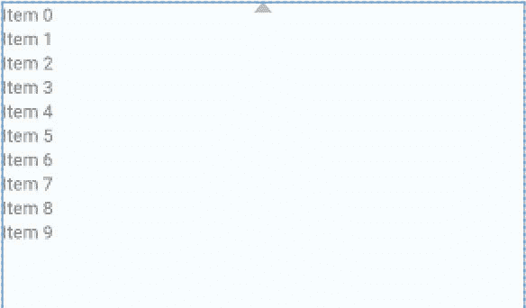

图 56-1

在本书前面的[“使用 Jetpack 的现代安卓应用架构”](39.html#_idTextAnchor835)一章中，引入了样本数据的概念。为了演示正在使用的示例数据，现在将修改项目，以便完全填充的卡片从布局编辑器中出现在 RecyclerView 中。但是，在此之前，值得注意的是，布局编辑器有一组预配置的示例数据模板，可以在设计用户界面时使用。要查看其中一些操作，请将 content_main.xml 布局文件加载到布局编辑器中，并选择 RecyclerView 实例。右键单击回收视图，并选择设置样本数据菜单选项以显示设计时视图属性面板:

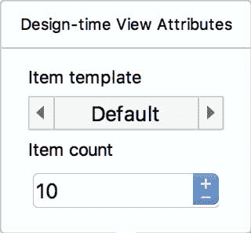

图 56-2

将模板更改为“电子邮件客户端”选项，并将项目计数更改为 12，并注意“回收”视图将更改为显示模板中的数据:

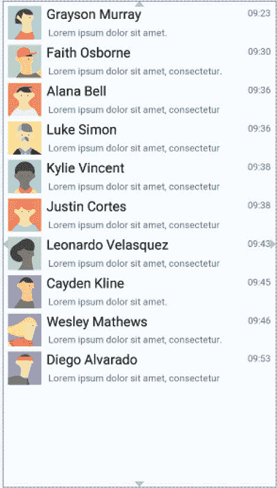

图 56-3

这些模板可用于显示样本数据，而无需任何额外的工作，并且通常可以提供足够的信息来完成布局设计。但是，在本例中，示例数据将用于显示 RecyclerView 中的卡片，因为它们将出现在运行的应用中。在布局编辑器中仍然加载 content_main.xml 文件的情况下，切换到代码模式并找到 RecyclerView 元素，其内容如下:

```kt
<androidx.recyclerview.widget.RecyclerView
    android:id="@+id/recyclerView"
    android:layout_width="0dp"
    android:layout_height="0dp"
    app:layout_constraintBottom_toBottomOf="parent"
    app:layout_constraintEnd_toEndOf="parent"
    app:layout_constraintStart_toStartOf="parent"
    app:layout_constraintTop_toTopOf="parent"
    tools:itemCount="12"
    tools:listitem="@layout/recycler_view_item" />
```

请注意，当前配置的两个特殊工具属性显示列表中的 12 个项目，每个项目使用一个包含在名为 recycler_view_item.xml 的文件中的布局。布局编辑器提供了一系列可以在布局文件中配置的工具选项。虽然所有这些设置的覆盖范围超出了本书的范围，但是每个设置的完整描述可以在以下网址找到:

https://developer.android.com/studio/write/tool-attributes#toolssample_resources

上面引用的 recycler_view_item.xml 文件是在选择示例数据模板时由布局编辑器自动生成的，可以在项目工具窗口中找到。

切换回设计模式，并在选择回收视图的情况下，使用设计时视图属性面板将模板切换回默认设置。recycler_view_item.xml 文件将与 content_main.xml 文件中的两个工具属性行一起从项目中删除(如果 Android Studio 未能删除这些行，它们可能会在“代码”视图中被手动删除)。

要切换到使用卡片布局来显示示例数据，请添加一个 listitem 属性来引用 card_layout.xml 文件。在布局中选择 RecyclerView，在属性工具窗口中搜索 listitem 属性，并在属性字段中输入@layout/card_layout，如图[图 56-4](#_idTextAnchor1117) :

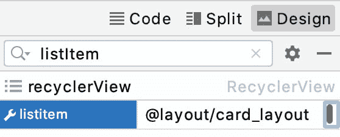

图 56-4

切换回设计模式，注意现在每个列表项都显示了卡片布局，但没有任何图像，并且使用了示例文本数据:

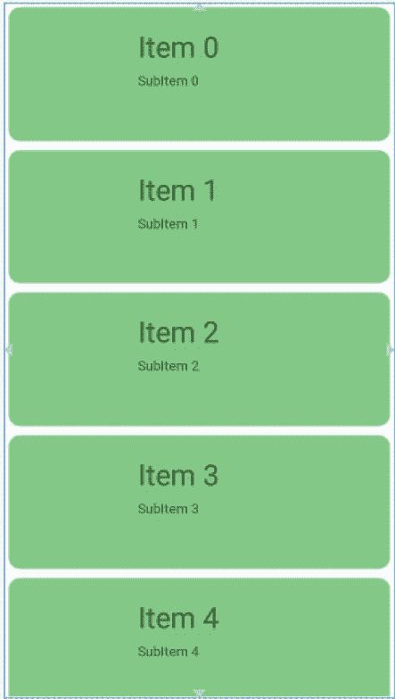

图 56-5

下一步是在卡片布局中的视图上显示一些图像和不同的文本。这可以采用布局编辑器提供的模板样本数据的形式，也可以采用专门为此项目添加的自定义样本数据的形式。将 card_layout.xml 文件加载到布局编辑器中，选择 ImageView 并显示设计时视图属性面板，如本章前面所述。从菜单中选择内置背景/风景图片集，如下图[56-6](#_idTextAnchor1118)所示:

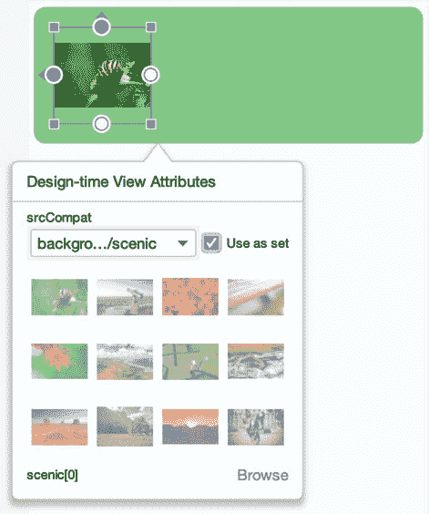

图 56-6

接下来，右键单击项目标题文本视图对象，选择设置样本数据菜单选项，并在设计时属性面板中选择城市文本选项。对 itemDetail 视图重复此步骤，这次选择 full _ names 选项，如图[图 56-7](#_idTextAnchor1119) 所示:

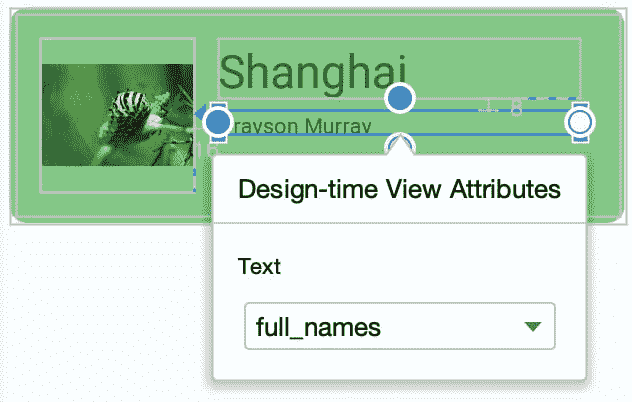

图 56-7

在设计模式下打开 content_main.xml 文件，注意回收视图现在使用内置图像和示例文本数据:

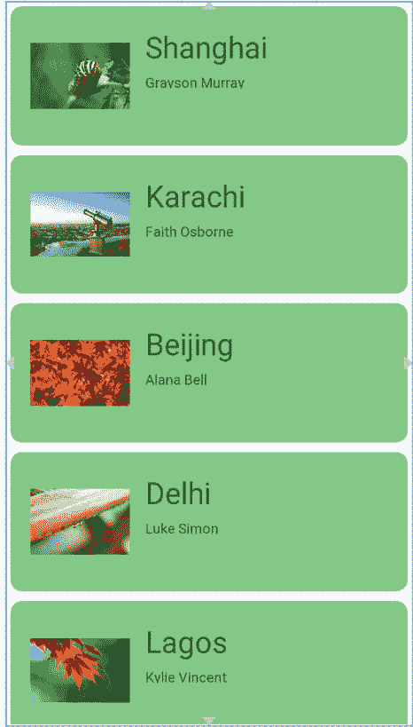

图 56-8

56.2 使用自定义样本数据

本章的最后一步是演示如何在布局编辑器中使用自定义示例数据和图像。这需要创建一个示例数据目录，并添加一些文本和图像文件。在项目工具窗口中，右键单击应用条目并选择新建->样本数据目录菜单选项，此时名为样本数据的新目录将出现在项目工具窗口中。如果看不到新文件夹，将项目工具窗口从安卓切换到项目模式，在卡片演示->应用下找到查找文件夹，如图[图 56-9](#_idTextAnchor1121) :

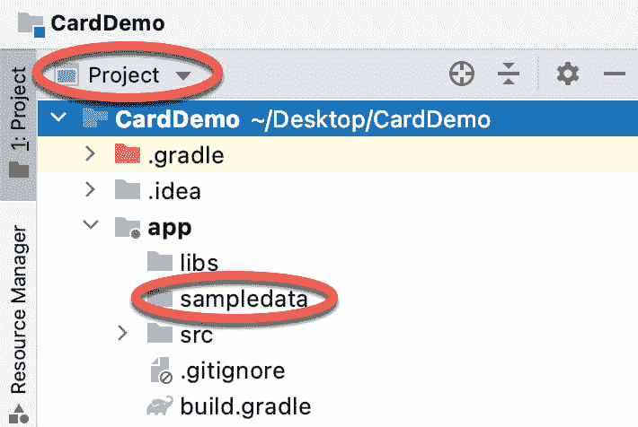

图 56-9

右键单击 sampledata 目录，创建一个名为 images 的子目录，并使用上一章中概述的相同步骤将 Android 映像复制并粘贴到新文件夹中。再次显示 ImageView 的“设计时视图属性”面板，这次单击“浏览”链接，并在“资源”对话框中选择新添加的 Android 图像(如果图像文件夹没有出现，请尝试重建项目):

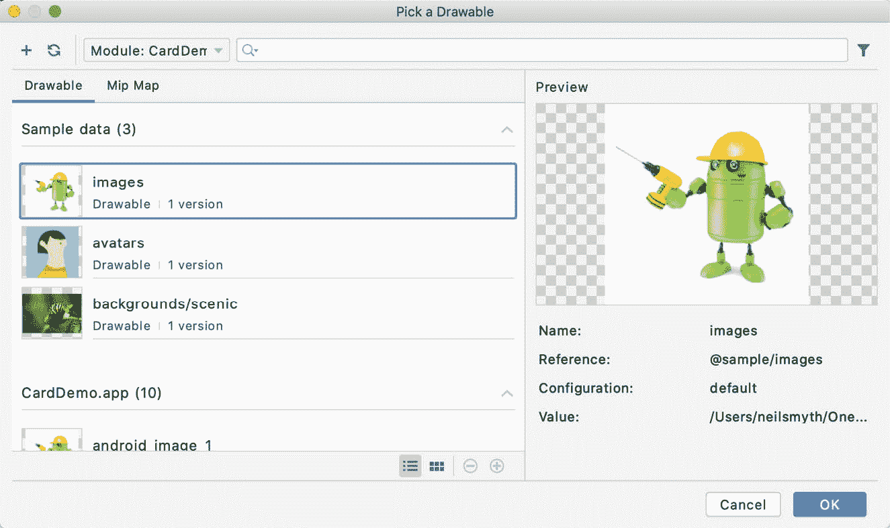

图 56-10

再次右键单击样本数据目录，选择新建->文件选项，命名文件章节，在注册新文件类型关联对话框中选择文本，并输入以下内容:

```kt
Chapter One
Chapter Two
Chapter Three
Chapter Four
Chapter Five
Chapter Six
Chapter Seven
Chapter Eight
```

接下来，创建第二个名为 items 的文本文件，内容如下:

```kt
Item one details
Item two details
Item three details
Item four details
Item five details
Item six details
Item seven details
Item eight details
```

创建示例数据文本文件后，剩下的就是在 card_layout.xml 文件的视图元素中引用它们，如下所示:

```kt
<TextView
    android:id="@+id/itemTitle"
    android:layout_width="236dp"
    android:layout_height="39dp"
    android:layout_marginStart="16dp"
    android:textSize="30sp"
    app:layout_constraintLeft_toRightOf="@+id/itemImage"
    app:layout_constraintStart_toEndOf="@+id/itemImage"
    app:layout_constraintTop_toTopOf="parent"
    tools:text="@sample/chapters" />

<TextView
    android:id="@+id/itemDetail"
    android:layout_width="236dp"
    android:layout_height="16dp"
    android:layout_marginStart="16dp"
    android:layout_marginTop="8dp"
    app:layout_constraintLeft_toRightOf="@+id/itemImage"
    app:layout_constraintStart_toEndOf="@+id/itemImage"
    app:layout_constraintTop_toBottomOf="@+id/itemTitle"
    tools:text="@sample/items" />
```

返回到 content_main.xml 文件中的布局设计，此时自定义示例数据和图像应该显示在 RecyclerView 列表中:

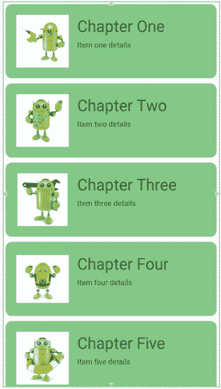

图 56-11

另一个选择是在 JSON 文件中声明示例数据，而不是有两个单独的文本文件和对图像集的引用。例如:

```kt
{
  "mydata": [
    {
      "chapter" : "Chapter One",
      "details": "Item one details",
      "image": "@sample/images"
    },
    {
      "chapter" : "Chapter Two",
      "details": "Item two details",
      "image": "@sample/images"
    },
.
.
}
```

假设上述内容包含在名为 chapterdata.json 的文件中，那么示例数据将在视图 XML 元素中被引用，如下所示:

```kt
.
.
<ImageView
.
.    
    tools:src="@sample/chapterdata.json/mydata/image" />
<TextView
.
.
    tools:text="@sample/chapterdata.json/mydata/chapter" />

<TextView
.
.
    tools:text="@sample/chapterdata.json/mydata/details" />
.
.
```

56.3 总结

本章已经演示了如何在布局编辑器中使用示例数据来更真实地表示用户界面在运行时的外观。本教程中涵盖的步骤包括使用预先存在的示例数据模板和集成自定义示例数据。