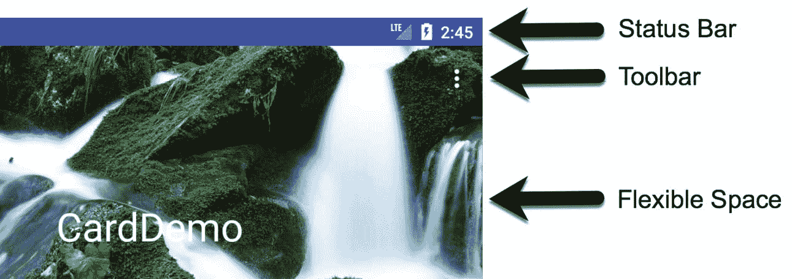
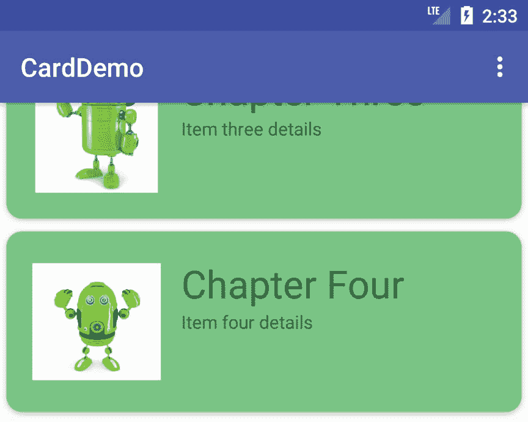
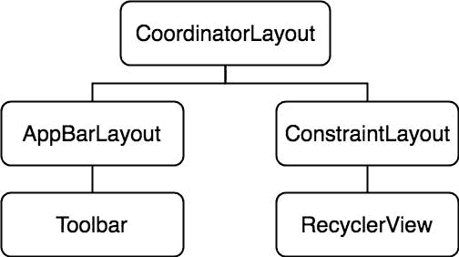
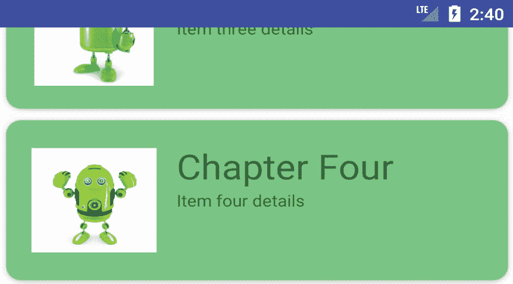
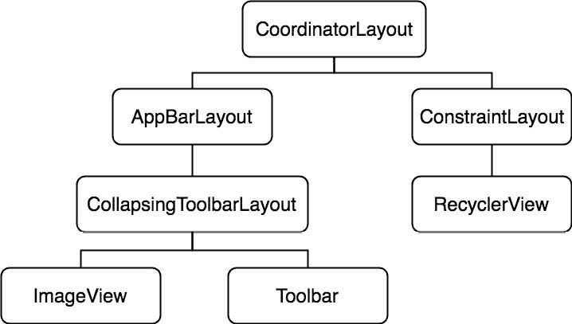
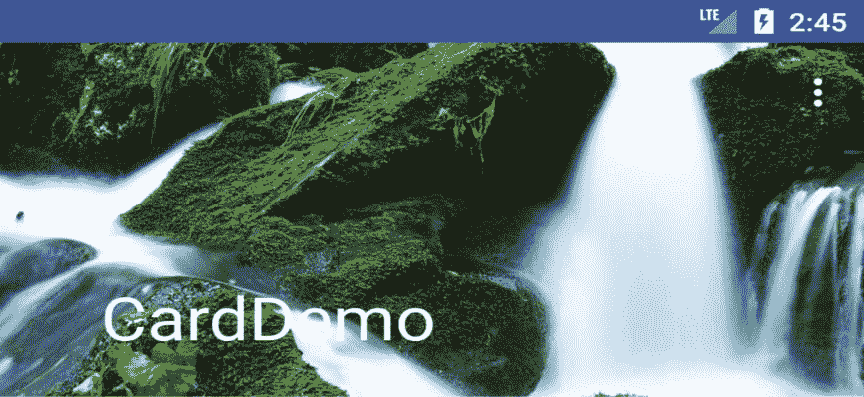
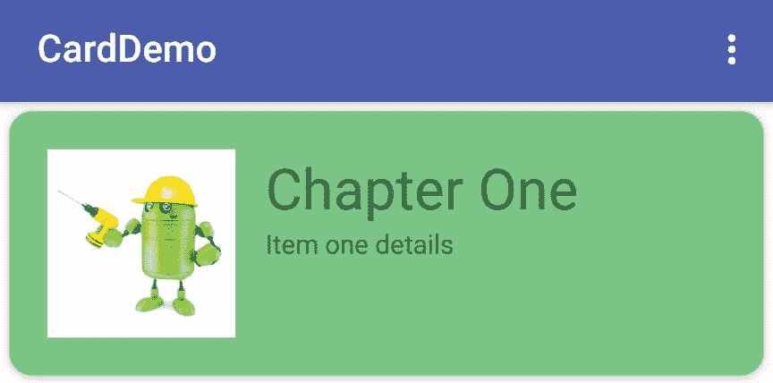
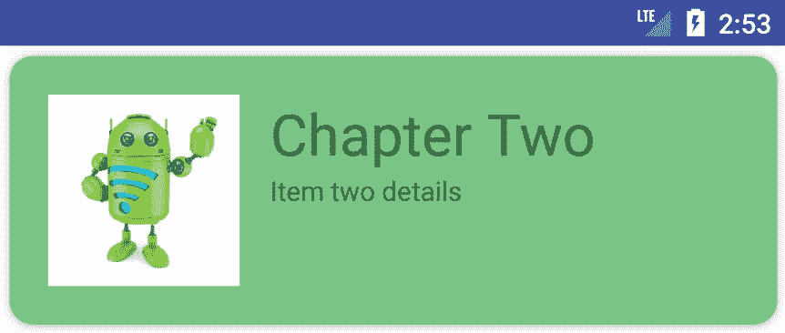

# 五十七、使用应用栏和折叠工具栏布局

在本章中，我们将探索如何定制活动布局中的应用栏，并使其对屏幕上其他视图中发生的滚动事件做出反应。通过将坐标布局与应用栏布局和折叠工具栏布局容器结合使用，应用栏可以被配置为显示图像和在视图内外制作动画。例如，可以配置列表上的向上滚动运动，使得当执行向下滚动运动时，应用栏从视图中后退，然后重新出现。

本章首先概述了组成应用栏的元素，然后将介绍应用栏配置的各种示例。

57.1 应用栏的解剖结构

应用栏是应用运行时出现在显示屏顶部的区域，可以配置为包含各种不同的项目，包括状态栏、工具栏、标签栏和灵活的空间区域。[例如，图 57-1](#_idTextAnchor1127) 显示了一个包含状态栏、工具栏和选项卡栏 r 的应用栏:


图 57-1

柔性空间区域可以用空白背景色填充，或者如图[图 57-2](#_idTextAnchor1129) 所示，在 ImageView 对象上显示的图像:



图 57-2

正如将在本章剩余部分中演示的，如果活动用户界面布局的主要内容区域包含可滚动内容，则应用栏的元素可以配置为随着屏幕上内容的滚动而扩展和收缩。

57.2 示例项目

在本例中，我们将对前一章[“安卓回收视图和卡片视图教程”](55.html#_idTextAnchor1097)中创建的卡片演示项目进行更改。首先启动 AndroidStudio 并加载这个项目。

项目加载后，运行应用，并注意当向上滚动列表时，工具栏保持可见，如图[图 57-3](#_idTextAnchor1132) :



图 57-3

第一步是进行一些配置更改，以便工具栏在向上滚动时收缩，然后在向下滚动时扩展。

57.3 协调回收视图和工具栏

将 activity_main.xml 文件加载到 Layout Editor 工具中，切换到 Code 模式，查看 xml 布局设计，其层次由[图 57-4](#_idTextAnchor1135) 中的图表示:



图 57-4

层次结构的顶层是 CoordinatorLayout，顾名思义，它协调它包含的各种子视图元素之间的交互。如[“使用浮动动作按钮和滚动条”](52.html#_idTextAnchor1040)中突出显示的，例如，坐标或布局自动向上滑动浮动动作按钮，以适应滚动条出现时的外观，然后在滚动条消失后向下移动按钮。

基于视图层次结构中某些视图的滚动动作，坐标布局可以类似地用于使应用栏的元素滑入和滑出视图。图 57-4 所示的布局层次结构中的一个这样的元素是约束布局。为了实现这种协调的行为，有必要对发生滚动的元素和要协调滚动的元素设置属性。

在滚动元素(在本例中是 RecyclerView)上，android:layout_behavior 属性必须设置为 app bar _ scrolling _ view _ behavior。在 content_main.xml 文件中，找到顶层的 ConstraintLayout 元素，注意默认情况下已经设置了该属性:

```kt
<androidx.constraintlayout.widget.ConstraintLayout 
    xmlns:android="http://schemas.android.com/apk/res/android"
    xmlns:app="http://schemas.android.com/apk/res-auto"
    xmlns:tools="http://schemas.android.com/tools"
    android:layout_width="match_parent"
    android:layout_height="match_parent"
    app:layout_behavior="@string/appbar_scrolling_view_behavior">
```

接下来，在布局编辑器中打开 activity_main.xml 文件，切换到代码模式并找到 AppBarLayout 元素。请注意，视图层次结构中 AppBarLayout 的唯一子级是工具栏。要使工具栏对 RecyclerView 中发生的滚动事件做出反应，必须在此元素上设置 app:layout _ scrolflags 属性。分配给该属性的值将取决于所需交互的性质，并且必须由以下一项或多项组成:

滚动–指示视图将滚动出屏幕。如果未设置此选项，视图将在滚动事件期间保持固定在屏幕顶部。

输入始终–当与滚动选项结合使用时，向上滚动将导致视图缩回。在这种模式下，任何向下滚动的动作都会导致视图重新出现。

输入始终折叠–在视图上设置时，该视图不会从折叠状态展开，直到向下滚动运动达到列表的限制。如果设置了“最小八边形”属性，视图将在初始滚动过程中出现，但仅在达到最小高度时出现。然后，它将保持在该高度，并且在到达列表顶部之前不会完全展开。请注意，此选项仅在与“输入始终”和“滚动”选项结合使用时有效。例如:

```kt
app:layout_scrollFlags="scroll|enterAlways|enterAlwaysCollapsed"
android:minHeight="20dp"
```

退出折叠–设置后，视图将在向上滚动过程中折叠，直到达到最小八分阈值，此时视图将保持在该高度，直到滚动方向改变。

在本例中，滚动和输入始终选项将在工具栏上设置如下:

```kt
<androidx.appcompat.widget.Toolbar
    android:id="@+id/toolbar"
    android:layout_width="match_parent"
    android:layout_height="?attr/actionBarSize"
    android:background="?attr/colorPrimary"
    app:popupTheme="@style/Theme.CardDemo.PopupOverlay"
    app:layout_scrollFlags="scroll|enterAlways" />
```

设置好适当的属性后，再次运行应用，并在 RecyclerView 列表中向上滚动。这会导致工具栏折叠到视图之外([图 57-5](#_idTextAnchor1137) )。向下滚动应该会使工具栏重新显示梨。



图 57-5

57.4 介绍折叠工具栏布局

CollapsingToolbarLayout 容器通过提供更大范围的选项和对应用栏及其子级的折叠的控制来增强标准工具栏，以响应协调的滚动动作。CollapsingToolbarLayout 类旨在作为 AppBarLayout 的子类添加，并提供一些功能，例如在工具栏折叠和展开时自动调整工具栏标题的字体大小。视差模式允许应用栏中的指定内容在折叠时从视图中淡出，而大头针模式允许应用栏的元素在收缩期间保持在固定位置。

稀松布选项也可用于指定工具栏在折叠序列中应该过渡到的颜色。

为了看到这些功能的作用，activity_main.xml 文件中包含的应用栏将被修改，以使用 CollapsingToolbarLayout 类，并添加一个 ImageView 来更好地演示视差模式的效果。使用协作工具栏布局的新视图层次结构由[图 57-6](#_idTextAnchor1139) 中的图表表示:



图 57-6

以代码模式将 activity_main.xml 文件加载到布局编辑器工具中，并修改布局，使其如下所示:

```kt
<?xml version="1.0" encoding="utf-8"?>
<androidx.coordinatorlayout.widget.CoordinatorLayout
    xmlns:android="http://schemas.android.com/apk/res/android"
    xmlns:app="http://schemas.android.com/apk/res-auto"
    xmlns:tools="http://schemas.android.com/tools"
    android:layout_width="match_parent"
    android:layout_height="match_parent"
    tools:context=".MainActivity">

    <com.google.android.material.appbar.AppBarLayout
        android:layout_width="match_parent"
        android:layout_height="wrap_content"
        android:theme="@style/Theme.CardDemo.AppBarOverlay">

        <com.google.android.material.appbar.CollapsingToolbarLayout
            android:id="@+id/collapsing_toolbar"
            android:layout_width="match_parent"
            android:layout_height="match_parent"
            app:layout_scrollFlags="scroll|enterAlways"
            android:fitsSystemWindows="true"
            app:contentScrim="?attr/colorPrimary"
            app:expandedTitleMarginStart="48dp"
            app:expandedTitleMarginEnd="64dp">

        <ImageView
            android:id="@+id/backdrop"
            android:layout_width="match_parent"
            android:layout_height="200dp"
            android:scaleType="centerCrop"
            android:fitsSystemWindows="true"
            app:layout_collapseMode="parallax"
            android:src="@drawable/appbar_image" />

        <androidx.appcompat.widget.Toolbar
            android:id="@+id/toolbar"
            android:layout_width="match_parent"
            android:layout_height="?attr/actionBarSize"
            android:background="?attr/colorPrimary"
            app:popupTheme="@style/AppTheme.PopupOverlay"
            app:layout_scrollFlags="scroll|enterAlways"
            app:layout_collapseMode="pin" />
        </com.google.android.material.appbar.CollapsingToolbarLayout>

    </com.google.android.material.appbar.AppBarLayout>

    <include layout="@layout/content_main" />
</androidx.coordinatorlayout.widget.CoordinatorLayout>
```

除了向上面的布局添加新元素之外，背景颜色属性设置也已被删除。这一变化的优点是提供了一个透明的工具栏，允许更多的图像在应用栏中可见。

使用适用于您的操作系统的文件系统导航器，在该书的代码示例下载的 project_icons 文件夹中找到 appbar_image.jpg 图像文件并复制它。右键单击项目工具窗口中的应用->资源->可绘制条目，并从结果菜单中选择粘贴。

运行时，app 栏应出现如图[图 57-7](#_idTextAnchor1140) 所示:



图 57-7

向上滚动列表会导致应用栏逐渐折叠。在收缩过程中，图像将淡化为稀松布属性定义的颜色，同时标题文本字体大小以相应的速度减小，直到只有工具栏可见:



图 57-8

由于 activity_main.xml 文件中的工具栏元素被配置为使用 pin 模式，当灵活区域折叠时，工具栏在滚动运动的初始阶段保持可见(如果向上滚动运动继续，工具栏也将从视图中消失):

```kt
app:layout_collapseMode="pin"
```

如果折叠模式设置为视差，工具栏会随着图像视图一起收缩。

继续向上滚动将导致工具栏也折叠，只留下状态栏可见:



图 57-9

由于 CollapsingToolbarLayout 元素的滚动标志属性包括输入始终选项，向下滚动将导致应用栏再次展开。

要将工具栏固定在适当的位置，使其在向上滚动时不再从视图中消失，请在 activity_main.xml 文件的 CollapsingToolbarLayout 元素的 layout_scrollFlags 属性中，用 exitUntilCollapsed 替换 enterAlways，如下所示:

```kt
<com.google.android.material.appbar.CollapsingToolbarLayout
    android:id="@+id/collapsing_toolbar"
    android:layout_width="match_parent"
    android:layout_height="match_parent"
    app:layout_scrollFlags="scroll|exitUntilCollapsed"
    android:fitsSystemWindows="true"
    app:contentScrim="?attr/colorPrimary"
    app:expandedTitleMarginStart="48dp"
    app:expandedTitleMarginEnd="64dp">
```

57.5 更改标题和稀松布颜色

作为最终任务，编辑 MainActivity.kt 文件，并向 onCreate()方法添加一些代码，以更改折叠布局管理器实例上的标题文本，并设置不同的稀松布颜色(请注意，稀松布颜色也可以在布局资源文件中设置):

```kt
package com.ebookfrenzy.carddemo
.
.
import android.graphics.Color
.
.
class MainActivity : AppCompatActivity() {
.
.
    override fun onCreate(savedInstanceState: Bundle?) {
        super.onCreate(savedInstanceState)

        binding = ActivityMainBinding.inflate(layoutInflater)
        setContentView(binding.root)

        setSupportActionBar(binding.toolbar)

        binding.collapsingToolbar.title = "My Toolbar Title"
        binding.collapsingToolbar.setContentScrimColor(Color.GREEN)

        layoutManager = LinearLayoutManager(this)
        binding.contentMain.recyclerView.layoutManager = layoutManager
        adapter = RecyclerAdapter()
        binding.contentMain.recyclerView.adapter = adapter
    }
.
.
}
```

最后运行一次应用，注意新标题出现在应用栏中，现在滚动会导致工具栏从视图中缩回时转变为绿色。

57.6 总结

出现在大多数安卓应用顶部的应用栏可以由许多不同的元素组成，包括工具栏、选项卡布局甚至图像视图。当嵌入到 CoordinatorLayout 父项中时，有许多不同的选项可用于控制应用栏响应活动主要内容中滚动事件的方式。为了更好地控制这种行为，CollapsingToolbarLayout 管理器提供了一系列额外的控制级别，用于控制应用栏内容相对于滚动活动的扩展和收缩方式。