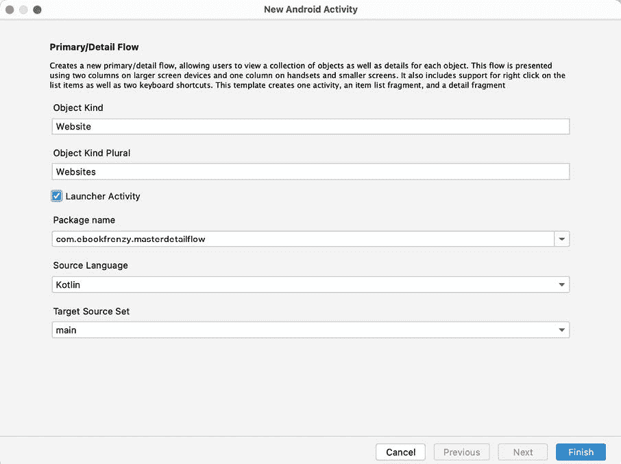
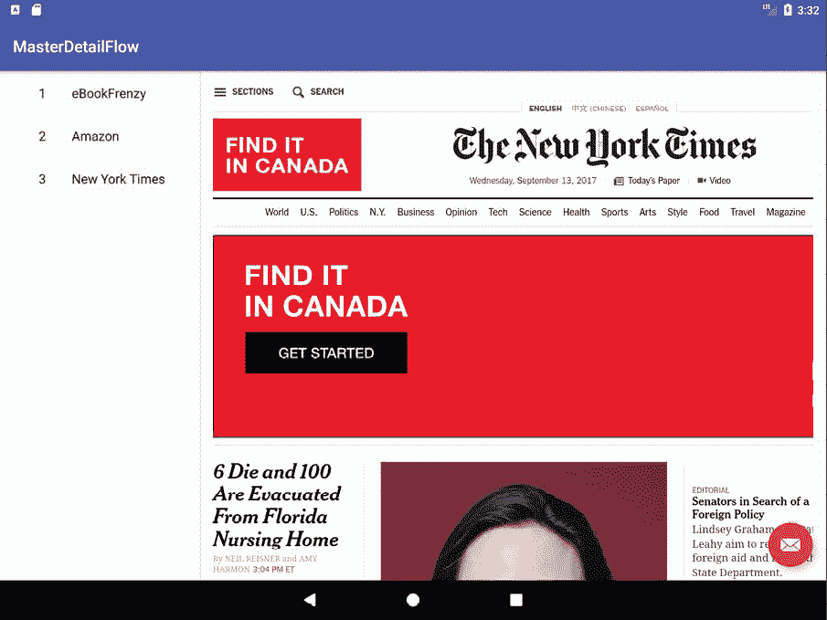

58.一个安卓工作室主/细节流程教程

本章将解释主/细节用户界面设计的概念，然后详细探讨安卓工作室中包含的主/细节流程模板的组成元素。然后将创建一个示例应用程序，演示修改模板以满足应用程序开发人员的特定需求所涉及的步骤。

58.1 主要/详细流程

主要/详细流程是一种界面设计概念，通过它向用户显示项目列表(称为主要列表)。当从列表中选择一个项目时，与该项目相关的附加信息随后在细节窗格中呈现给用户。例如，电子邮件应用程序可能包含一个由发件人地址和邮件主题组成的已接收邮件的主要列表。从主列表中选择邮件后，电子邮件的正文将出现在详细信息窗格中。

在平板电脑大小的安卓设备显示屏上，主列表显示在屏幕左侧的一个狭窄的垂直面板中。显示器的其余部分以称为双窗格模式的方式用于细节窗格。[例如，图 58-1](#_idTextAnchor1145) 显示了主要/详细的双窗格排列，其中列出了主要项目，第一个项目的内容显示在详细窗格中:


图 58-1

在较小的手机大小的安卓设备上，主列表占据了整个屏幕，细节窗格出现在从主列表中进行选择时出现的单独屏幕上。在这种模式下，详细信息屏幕包括一个操作栏条目以返回主列表。[图 58-2](#_idTextAnchor1146) 举例说明了 4 英寸电话屏幕上同一项目列表的主屏幕和详细屏幕:


图 58-2

58.2 创建主要/详细流程活动

在本章的下一节中，将详细介绍构成主要/详细流程模板的不同元素。这最好通过使用主要/详细流程模板创建项目来实现，以便在处理信息时使用。该项目随后将被用作本章末尾教程的基础。

尽管项目创建向导包括选择主要/详细流程模板的选项，但在创建项目后，通过添加活动，可以更灵活地配置模板。

从欢迎屏幕中选择“创建新项目”快速启动选项，并在生成的新项目对话框中选择“无活动”模板，然后单击“下一步”按钮。

在“名称”字段中输入 PrimaryDetailFlow，并将 com . ebookwidge . PrimaryDailFlow 指定为包名。在单击完成按钮之前，将最低应用编程接口级别设置更改为应用编程接口 26:安卓 8.0(奥利奥)，并将语言菜单更改为科特林。

创建项目后，右键单击项目工具窗口中的应用程序-> Java-> com . ebookwidge . primarydytaillflow 条目，并选择新建->活动->主要/详细流菜单选项。

新的安卓活动屏幕([图 58-3](#_idTextAnchor1148) )提供了配置将在主要/详细活动中显示的对象的机会。在本章后面的教程中，主列表将包含许多网站名称，当选择这些名称时，会将所选网站加载到详细信息窗格中的 web 视图中。考虑到这些要求，将对象种类字段设置为“网站”，对象种类复数设置为“网站”。



图 58-3

在单击“完成”按钮之前，请确保启用“启动器活动”选项，并将“源语言”菜单设置为“科特林”。

58.3 修改主/明细流程模板

虽然“主要/详细流程”模板的结构起初可能看起来很混乱，但很明显，对于许多主要/详细的实现需求，该模板提供的许多功能可以保持不变。

在本章的剩余部分，PrimaryDetailFlow 项目将被修改，以便主列表显示网站名称的列表，并且细节窗格被修改为包含一个 WebView 对象，而不是当前的 TextView。当用户选择一个网站时，相应的网页将随后加载并显示在详细信息窗格中。

58.4 更改内容模型

当前示例的内容由 PlaceholderContent 类文件定义。因此，首先选择 PlaceholderContent.kt 文件(位于 app-> Java-> com . ebookwidge . primaryedtaillow->占位符文件夹中的项目工具窗口中)并查看代码。文件的底部是一个名为 PlaceholderItem 的类的声明，该类目前能够存储三个 String 对象，表示内容和详细信息字符串以及一个 ID。另一方面，更新后的项目需要每个项目对象包含一个标识字符串、一个网站名称字符串和一个网站对应网址字符串。要添加这些功能，请修改 PlaceholderItem 类，使其如下所示:

```kt
data class PlaceholderItem(val id: String, val website_name: String, 
            val website_url: String) {
    override fun toString(): String = website_name
}
```

请注意，封装 PlaceholderContent 类当前包含一个 for 循环，该循环通过多次调用名为 createPlaceholderItem()和 makeDetails()的方法来添加 25 个项。大部分代码将不再需要，应该从类中删除，如下所示:

```kt
object PlaceholderContent {

    /**
     * An array of sample (placeholder) items.
     */
    val ITEMS: MutableList<PlaceholderItem> = ArrayList()

    /**
     * A map of sample (placeholder) items, by ID.
     */
    val ITEM_MAP: MutableMap<String, PlaceholderItem> = HashMap()
    private val COUNT = 25

    init {
        // Add some sample items.
        for (i in 1..COUNT) {
            addItem(createPlaceholderItem(i))
        }
    }

    private fun addItem(item: PlaceholderItem) {
        ITEMS.add(item)
        ITEM_MAP.put(item.id, item)
    }

    /**
     * A placeholder item representing a piece of content.
     */
    data class PlaceholderItem(val id: String, val website_name: String,
                               val website_url: String) {
        override fun toString(): String = website_name
    }
}
This code needs to be modified to initialize the data model with the required web site data:
val ITEM_MAP: MutableMap<String, PlaceholderItem> = HashMap()

init {
    // Add 3 sample items.
    addItem(PlaceholderItem("1", "eBookFrenzy",
            "https://www.ebookfrenzy.com"))
    addItem(PlaceholderItem("2", "Amazon",
            "https://www.amazon.com"))
    addItem(PlaceholderItem("3", "New York Times",
            "https://www.nytimes.com"))
}
```

代码现在利用修改后的 PlaceholderItem 类来存储每个项目的标识、网站名称和网址。

58.5 更改详细信息窗格

详细信息窗格的布局(当用户从主列表中选择一个项目时显示的屏幕)包含在 activity _ 网站 _detail.xml 文件中，该文件又包含一个 FrameContainerView 实例，用于显示实际的详细信息窗格内容。如果应用程序以单窗格模式显示，框架容器将显示片段 _ 网站 _ 细节. xml 文件中包含的布局，而多窗格模式将显示片段 _ 网站 _ 细节. xml (sw600dp)布局。

安卓工作室为 fragment _ 网站 _detail.xml 提供的模板布局包括一个包含应用程序栏、工具栏、浮动操作按钮和文本视图的协调器布局。对于这个例子，我们只需要显示一个网络视图，所以打开这个文件，从布局中删除除了网站 _ 细节 _ 容器视图之外的所有视图。最简单的方法是在点击键盘删除键之前，选择组件树中所有不需要的视图，如下所示:


图 58-4

将一个网络视图对象从调色板的小部件部分拖放到布局画布的中心，并将 id 更改为网站详细信息。

接下来，在将 WebView 拖放到布局之前，编辑 fragment _ 网站 _detail.xml (sw600dp)文件并删除默认的 TextView 实例，再次将 id 更改为网站 _detail。两个文件的布局现在应该类似于[图 58-5](#_idTextAnchor1156) :


图 58-5

58.6 修改网站详细信息片段类

此时，用户界面细节窗格已经被修改，但是相应的 Kotlin 类仍然被设计为使用文本视图对象而不是网络视图。通过双击项目工具窗口中的网站详细信息片段. kt 文件来加载该类的源代码。

为了加载对应于当前选定项目的网页网址，只需要更改几行代码。一旦进行了此更改，代码应如下所示:

```kt
package com.ebookfrenzy.PrimaryDetailflow
.
.
import android.webkit.WebResourceRequest
import android.webkit.WebView
import android.webkit.WebViewClient
.
.
class WebsiteDetailFragment : Fragment() {
.
.
    override fun onCreateView(
        inflater: LayoutInflater, container: ViewGroup?,
        savedInstanceState: Bundle?
    ): View? {

        _binding = FragmentWebsiteDetailBinding.inflate(inflater, container, false)
        val rootView = binding.root

        binding.toolbarLayout?.title = item?.content
        itemDetailTextView = binding.websiteDetail

        item?.let {
            binding.websiteDetail.webViewClient = object : WebViewClient() {
                override fun shouldOverrideUrlLoading(
                    view: WebView, request: WebResourceRequest): Boolean {
                    return super.shouldOverrideUrlLoading(
                        view, request)
                }
            }
            binding.websiteDetail.loadUrl(it.website_url)
        }

        return rootView
    }
.
.
}
```

在上面的代码中，onCreateView()方法被修改为访问网站 _ 详细视图(这以前是文本视图，但现在是网络视图)，并从所选项目中提取网站的网址。创建了 WebViewClient 类的一个实例，并为其分配了 shouldOverrideUrlLoading()回调方法。实现这个方法是为了强制系统使用 WebView 实例来加载页面，而不是 Chrome 浏览器。

58.7 修改网站列表片段类

还需要对 WebsiteListFragment.kt 文件进行小的更改，以确保网站名称出现在主列表中。编辑此文件，找到 onBindViewHolder()方法，并修改 setText()方法调用以引用网站名称，如下所示:

```kt
override fun onBindViewHolder(holder: ViewHolder, position: Int) {
    val item = mValues[position]
    holder.mIdView.text = item.id
    holder.mContentView.text = item.website_name
.
.
}
```

58.8 添加清单权限

最后一步是通过清单文件向应用程序添加 internet 权限。这将使 WebView 对象能够访问互联网并下载网页。导航到项目工具窗口(app-> manifest)中的 AndroidManifest.xml 文件，并将其加载到编辑器中。加载后，向文件添加适当的权限行:

```kt
<?xml version="1.0" encoding="utf-8"?>
<manifest xmlns:android="http://schemas.android.com/apk/res/android"
    package="com.ebookfrenzy.PrimaryDetailflow" >

    <uses-permission android:name="android.permission.INTERNET" />

    <application
        android:allowBackup="true"
        android:icon="@mipmap/ic_launcher"
        android:label="@string/app_name"
        android:theme="@style/AppTheme" >
.
.
```

58.9 运行应用程序

在适当配置的模拟器或附加的安卓设备上编译和运行应用程序。根据显示屏的大小，应用程序会以小屏幕或双窗格模式出现。无论如何，主列表应该以内容模型中定义的三个网站的名称作为开头。选择一个项目会使相应的网站出现在详细窗格中，如图 58-6 中的双窗格模式所示:



图 58-6

58.10 总结

主/详细用户界面由项目的主列表组成，当选择该列表时，将在详细信息窗格中显示关于该选择的附加信息。主/细节流是安卓工作室提供的一个模板，允许快速且相对容易地创建主/细节安排。正如本章中所展示的，通过对默认模板文件的微小修改，可以用最少的编码和设计工作实现广泛的基于主要/细节的功能。