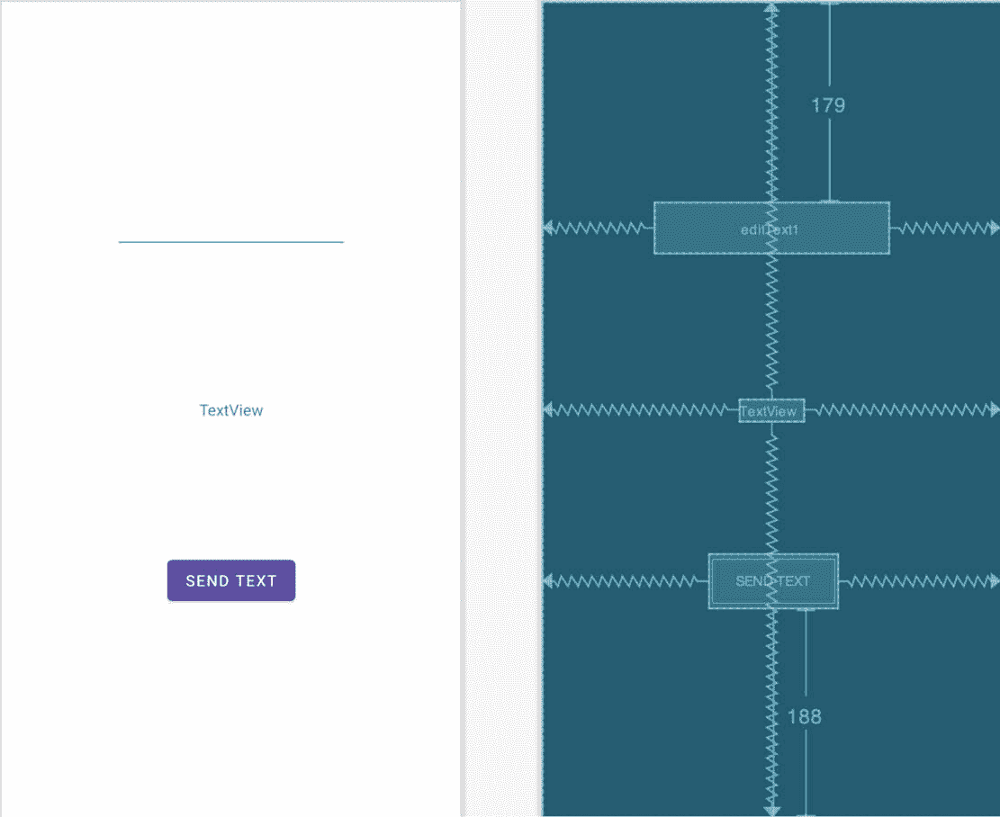
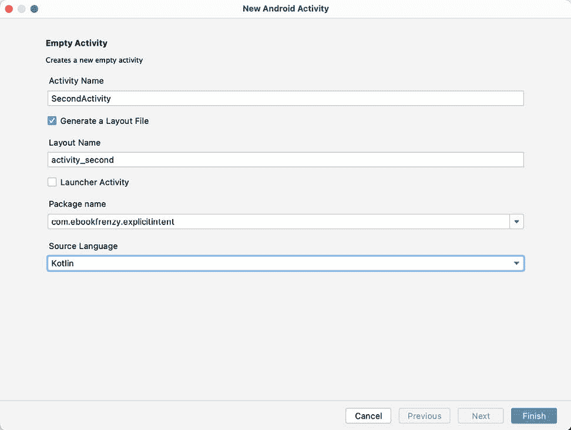
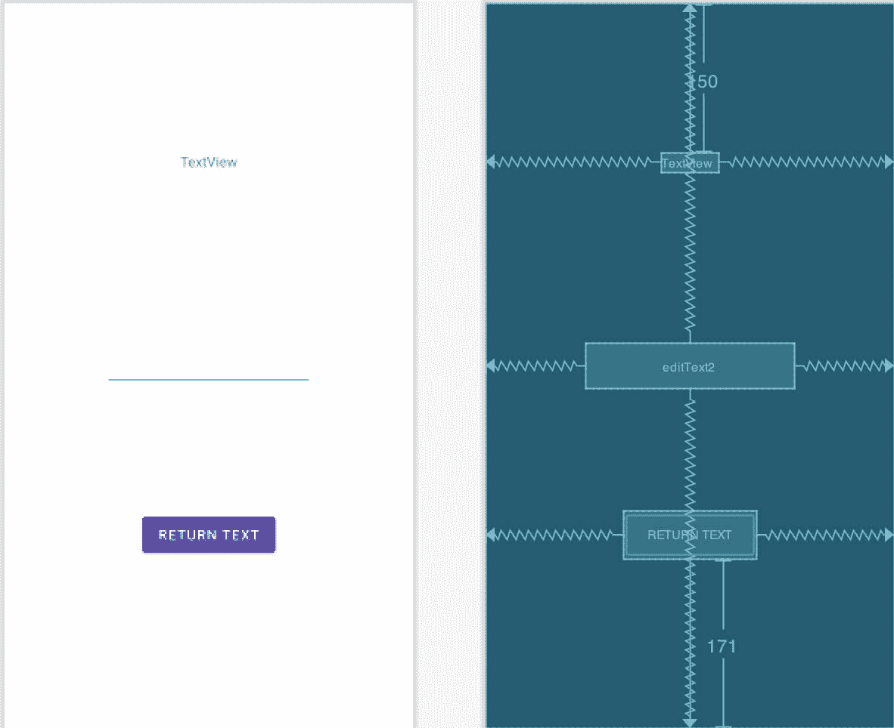

# 六十、安卓显式意图——一个成功的例子

标题为[“安卓意图概述”](59.html#_idTextAnchor1164)的章节涵盖了使用意图发起活动的理论。本章将通过创建一个示例应用来将该理论付诸实践。

本章中创建的示例AndroidStudio应用项目将演示如何使用明确的意图来启动活动，包括发送和接收活动之间的数据传输。下一章([“安卓隐式意图——一个成功的例子”](61.html#_idTextAnchor1190))将演示隐式意图的使用。

60.1 创建显式意图示例应用

从欢迎屏幕中选择创建新项目快速启动选项，并在生成的新项目对话框中选择空活动模板，然后单击下一步按钮。

在“名称”字段中输入 ExplicitIntent，并将 com . ebookwidge . ExplicitIntent 指定为包名。在单击完成按钮之前，将最低API级别设置更改为API 26:安卓 8.0(奥利奥)，并将语言菜单更改为Kotlin。使用第 [18.8 节“将项目迁移到视图绑定”](18.html#_idTextAnchor393)中概述的步骤，将项目转换为使用视图绑定。

60.2 设计主活动的用户界面布局

主活动的用户界面将由一个包含编辑文本(纯文本)、文本视图和按钮视图的约束布局视图组成，分别命名为编辑文本 1、文本视图 1 和按钮 1。使用项目工具窗口，找到 MainActivity 的 activity_main.xml 资源文件(位于 app -> res -> layout 下)，双击该文件将其加载到 Android Studio Layout Editor 工具中。选择并删除默认的“你好世界！”文本视图。

从调色板中拖放一个文本视图小部件，使其在布局中居中，并使用属性工具窗口为文本视图 1 分配一个标识。

从调色板中拖动一个按钮对象，并将其定位，使其水平居中，并位于文本视图的下边缘下方。更改文本属性，使其为“发送文本”，并配置 onClick 属性来调用名为 Send Text 的方法。

接下来，添加一个纯文本对象，使其水平居中并位于文本视图的上边缘上方。使用属性工具窗口，删除分配给文本属性的“名称”字符串，并将标识设置为编辑文本 1。布局完成后，单击工具栏上的推断约束按钮添加适当的约束:


图 60-1

最后，单击布局编辑器窗口右上角的红色警告按钮，并使用生成的面板将“发送文本”字符串提取到名为 send_text 的资源中。布局完成后，用户界面应类似于[图 60-2](#_idTextAnchor1178) 所示:



图 60-2

60.3 创建第二个活动类

当用户触摸“发送文本”按钮时，将发出一个意图，请求启动第二个活动，用户可以在其中输入响应。因此，下一步是创建第二个活动。在项目工具窗口中，右键单击 app -> java 中的 com . ebookwidge . explicititintent 包名，选择新建->活动->清空活动菜单选项，显示新建安卓活动对话框，如图[图 60-3](#_idTextAnchor1180) :



图 60-3

在“活动名称”和“标题”字段中输入 SecondActivity，并将布局文件 activity_second 命名，并将“语言”菜单更改为 Kotlin。由于此活动不会在应用启动时启动(而是在按钮被按下时通过 MainActivity 的意图启动)，因此在单击“完成”按钮之前，务必确保“启动器活动”选项被禁用。

60.4 设计第二活动的用户界面布局

第二个活动的用户界面所需的元素是纯文本编辑文本、文本视图和按钮视图。考虑到这些需求，将 activity_second.xml 布局加载到布局编辑器工具中，并添加视图。

在设计过程中，请注意按钮视图上的 onClick 属性已被配置为调用名为 returnText 的方法，并且 TextView 和 EditText 视图已分别被分配了 IDs textView2 和 editText2。一旦完成，布局应类似于[图 60-4](#_idTextAnchor1182) 所示。请注意，按钮上的文本(上面写着“返回文本”)已被提取到名为 return_text 的字符串资源中。

布局完成后，单击推断约束工具栏按钮，向布局添加必要的约束:



图 60-4

60.5 查看应用清单文件

为了让 MainActivity 能够使用意图启动 SecondActivity，必须在 AndroidManifest.xml 文件中存在 SecondActivity 的条目。在项目工具窗口(应用->清单)中找到该文件，双击该文件将其加载到编辑器中，并验证 Android Studio 是否已自动为该活动添加条目:

```kt
<?xml version="1.0" encoding="utf-8"?>
<manifest xmlns:android="http://schemas.android.com/apk/res/android"
    package="com.ebookfrenzy.explicitintent">
    <application
        android:allowBackup="true"
        android:icon="@mipmap/ic_launcher"
        android:label="@string/app_name"
        android:roundIcon="@mipmap/ic_launcher_round"
        android:supportsRtl="true"
        android:theme="@style/AppTheme">
        <activity android:name=".SecondActivity"></activity>
        <activity android:name=".MainActivity">
            <intent-filter>
                <action android:name="android.intent.action.MAIN" />
                <category android:name="android.intent.category.LAUNCHER" />
            </intent-filter>
        </activity>
    </application>
</manifest>
```

清单文件中创建并列出了第二个活动，现在是时候在 MainActivity 类中编写一些代码来发布意图了。

60.6 创建意图

主活动的目标是在用户触摸“发送文本”按钮时创建并启动一个意图。作为意图创建过程的一部分，用户在编辑文本视图中输入的问题字符串将作为键值对添加到意图对象中。为 MainActivity 创建用户界面布局时，按钮对象被配置为在用户“单击”时调用名为 sendText()的方法。现在需要将此方法添加到 MainActivity 类 MainActivity.kt 源文件中，如下所示:

```kt
package com.ebookfrenzy.explicitintent
.
.
import android.view.View
import android.content.Intent

class MainActivity : AppCompatActivity() {
.
. 
    fun sendText(view: View) {

        val i = Intent(this, SecondActivity::class.java)

        val myString = binding.editText1.text.toString()
        i.putExtra("qString", myString)
        startActivity(i)
    }
} 
```

sendText()方法的代码遵循[“安卓意图概述”](59.html#_idTextAnchor1164)中概述的技术。首先，创建一个新的意图实例，将当前活动和 SecondActivity 的类名作为参数传递。接下来，输入到编辑文本对象中的文本作为键值对被添加到意图对象中，并且意图通过调用 startActivity()开始，通过意图对象作为参数传递。

编译并运行应用，点击“发送文本”按钮启动第二个活动，点击后退按钮(位于显示屏底部的工具栏中)返回主活动。

60.7 提取意图数据

现在，第二个活动正在从主活动启动，下一步是提取意图中包含的字符串数据值，并将其分配给第二个活动用户界面中的文本视图对象。这包括向 SecondActivity.kt 源文件中的 SecondActivity 的 onCreate()方法添加一些代码，以及调整活动以使用视图绑定:

```kt
package com.ebookfrenzy.explicitintent

import androidx.appcompat.app.AppCompatActivity
import android.os.Bundle
import android.view.View
import android.content.Intent

import com.ebookfrenzy.explicitintent.databinding.ActivitySecondBinding

class SecondActivity : AppCompatActivity() {

    private lateinit var binding: ActivitySecondBinding

    override fun onCreate(savedInstanceState: Bundle?) {
        super.onCreate(savedInstanceState)
        setContentView(R.layout.second_activity)

        binding = ActivitySecondBinding.inflate(layoutInflater)
        setContentView(binding.root)

        val extras = intent.extras ?: return

        val qString = extras.getString("qString")
        binding.textView2.text = qString
    }
}
```

编译并运行应用，无论是在模拟器内还是在物理安卓设备上。在触摸“发送文本”按钮之前，在“主要活动”的文本框中输入一些文本。该消息现在应该出现在第二个活动用户界面的文本视图组件上。

60.8 作为子活动启动第二个活动

为了使第二个活动能够向主活动返回数据，第二个活动必须作为主活动的子活动启动。这意味着对 MainActivity returnText()方法中的 startActivity()的调用需要替换为对 startActivityForResult()的调用。与 startActivity()方法只将意图对象作为参数不同，startActivityForResult()要求请求代码也要经过。请求代码可以是任何数值，用于识别哪个子活动与哪个返回数据集相关联。出于本例的目的，将使用请求代码 5，为我们提供一个修改后的 MainActivity 类，内容如下:

```kt
.
.
class MainActivity : AppCompatActivity() {

    private val request_code = 5
.
.
    fun sendText(view: View) {

        val i = Intent(this, SecondActivity::class.java)

        val myString = binding.editText1.text.toString()
        i.putExtra("qString", myString)
        startActivityForResult(i, request_code)
    }
}
```

当子活动退出时，父活动的 onActivityResult()方法被调用并作为参数传递与意图相关联的请求代码、指示子活动成功与否的结果代码以及包含子活动返回的任何数据的意图对象。保留在 MainActivity 类源文件中，按如下方式实现此方法:

```kt
override fun onActivityResult(requestCode: Int, resultCode: Int, data: Intent?) {
    super.onActivityResult(requestCode, resultCode, data)
    if ((requestCode == request_code) &&
            (resultCode == RESULT_OK)) {

        data?.let {
            if (it.hasExtra("returnData")) {
                val returnString = it.extras?.getString("returnData")
                binding.textView1.text = returnString
            }
        }
    }
}
```

上述方法中的代码首先检查请求代码是否与发出意图时使用的代码匹配，并确保活动成功。然后从意图中提取返回数据，并显示在文本视图对象上。

60.9 从子活动返回数据

现在，SecondActivity 作为 MainActivity 的一个子活动启动，而 main activity 又被修改为处理从 SecondActivity 返回的数据。剩下的就是修改 SecondActivity.kt 来实现 finish()方法，并为 returnText()方法添加代码，该方法在触摸“Return Text”按钮时被调用。当活动退出时(例如，当用户选择设备上的后退按钮时)，finish()方法被触发:

```kt
fun returnText(view: View) {
    finish()
}

override fun finish() {
    val data = Intent()

    val returnString = binding.editText2.text.toString()
    data.putExtra("returnData", returnString)

    setResult(RESULT_OK, data)
    super.finish()
}
```

finish()方法需要做的就是创建一个新的意图，将返回数据作为键值对添加，然后调用 setResult()方法，传递一个结果代码和意图对象。returnText()方法只是调用 finish()方法。

60.10 测试应用

编译并运行应用，在主活动的文本字段中输入一个问题，然后触摸“发送文本”按钮。当第二个活动出现时，在编辑文本视图中输入文本，并使用后退按钮或“返回文本”按钮返回到主活动，响应将出现在文本视图对象中。

60.11 总结

在前一章中已经介绍了意图的基础，本章的目标是通过在 Android Studio 中创建一个应用项目来演示显式意图的使用以及父活动和子活动之间的数据传输概念。

下一章将通过一个例子来展示行动中隐含的意图。