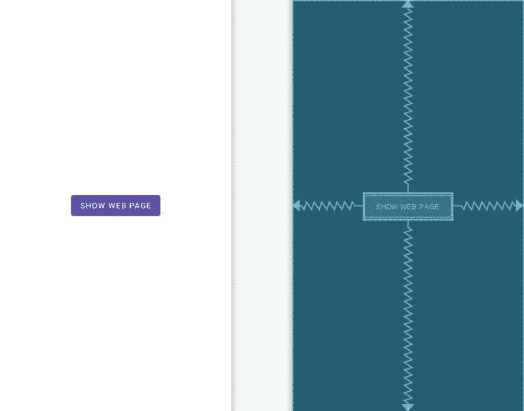
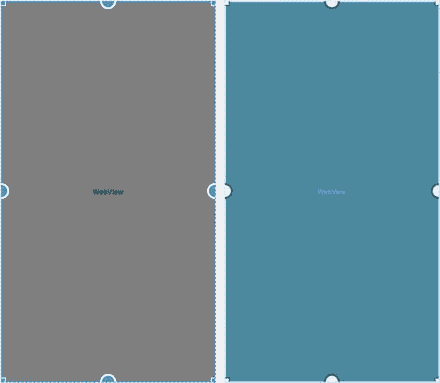
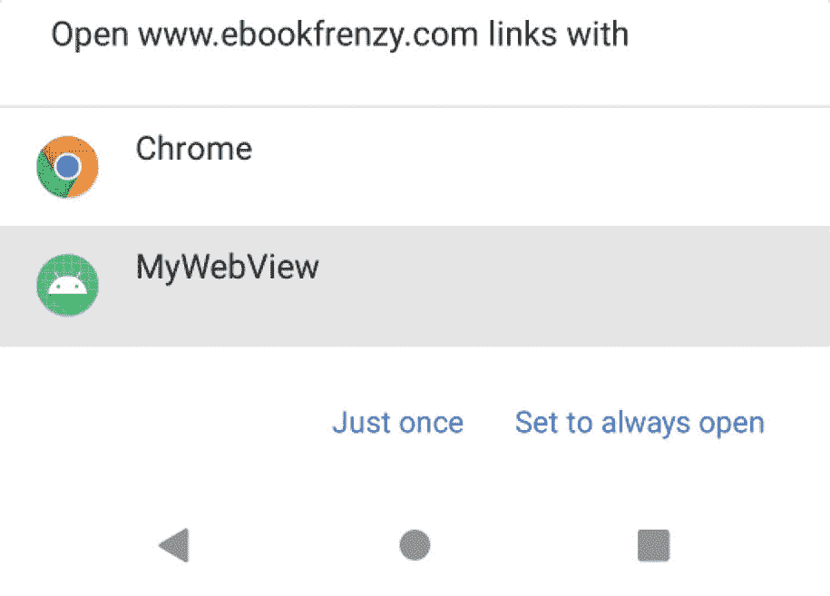

# 六十一、安卓隐式意图——一个成功的例子

在本章中，将在 Android Studio 中创建一个示例应用，旨在演示隐式意图的实际实现。目标是创建并发送一个意图，请求加载特定网页的内容并显示给用户。由于示例应用本身将不包含能够执行该任务的活动，因此将发布隐式意图，以便可以使用安卓意图解析算法来识别并从另一个应用启动合适的活动。这很可能是与安卓操作系统捆绑在一起的 Chrome 网络浏览器的一项活动。

成功启动内置浏览器后，将创建一个新项目，该项目还包含一个能够显示网页的活动。这将被安装到设备或仿真器上，并用于演示当两个活动符合隐式意图的标准时会发生什么。

61.1 创建AndroidStudio隐式意图示例项目

从欢迎屏幕中选择创建新项目快速启动选项，并在生成的新项目对话框中选择空活动模板，然后单击下一步按钮。

在“名称”字段中输入 ImplicitIntent，并将 com . ebookwidge . Implicitintent 指定为包名。在单击完成按钮之前，将最低API级别设置更改为API 26:安卓 8.0(奥利奥)，并将语言菜单更改为Kotlin。

61.2 设计用户界面

MainActivity 类的用户界面非常简单，仅由一个 ConstraintLayout 和一个 Button 对象组成。在项目工具窗口中，找到 app-> RES-> Layout-> activity _ main . XML 文件，双击该文件将其加载到 Layout Editor 工具中。

删除默认的文本视图，并在启用自动连接模式的情况下，放置一个按钮小部件，使其在布局中居中。请注意，按钮(“显示网页”)上的文本已被提取到名为 show_web_page 的字符串资源中。



图 61-1

选择按钮后，使用属性工具窗口配置 onClick 属性以调用名为 show 网页的方法。

61.3 创建隐式意图

如上所述，隐式意图将从一个名为 show 网页()的方法中创建和发出，该方法需要在 MainActivity 类中实现，该类的代码驻留在 MainActivity.kt 源文件中。在“项目”工具窗口中找到该文件，双击该文件将其加载到编辑窗格中。加载后，修改代码以添加 show 网页()方法以及一些必要的导入:

```kt
package com.ebookfrenzy.implicitintent

import androidx.appcompat.app.AppCompatActivity
import android.os.Bundle
import android.content.Intent
import android.view.View
import android.net.Uri

class MainActivity : AppCompatActivity() {

    override fun onCreate(savedInstanceState: Bundle?) {
        super.onCreate(savedInstanceState)
        setContentView(R.layout.activity_implicit_intent)
    }

    fun showWebPage(view: View) {
        val intent = Intent(Intent.ACTION_VIEW,
                Uri.parse("https://www.ebookfrenzy.com"))

        startActivity(intent)
    }
}
```

这个方法执行的任务实际上非常简单。首先，创建一个新的意图对象。但是，代码没有指定意图的类名，而是使用 ACTION_VIEW 选项简单地指示意图的性质(向用户显示一些内容)。意图对象还包括一个包含要显示的网址的 URI。这向安卓意图解析系统指示该活动正在请求显示网页。然后通过调用 startActivity()方法发出意图。

在模拟器或物理安卓设备上编译并运行应用，运行后，点击“显示网页”按钮。当触摸时，应该出现一个网络浏览器视图，并加载由网址指定的网页。一个成功的隐式意图现在已经被执行。

61.4 添加第二个匹配活动

本章的其余部分将用于演示设备上安装的多个活动与隐式意图的要求相匹配的效果。为此，将创建第二个应用并将其安装在设备或仿真器上。因此，首先在AndroidStudio中创建一个新项目，将应用名称设置为我的网络视图，使用本章前面创建隐含内容项目时使用的相同的软件开发工具包配置选项，并再次选择一个空活动。将项目转换为使用视图绑定，如第 [18.8 节将项目迁移到视图绑定](18.html#_idTextAnchor393)中所述。

61.5 将网页视图添加到用户界面

新的 MyWebView 项目中包含的唯一活动的用户界面将由 Android WebView 小部件的一个实例组成。在“项目”工具窗口中，找到 activity_main.xml 文件，该文件包含活动的用户界面描述，双击该文件将其加载到布局编辑器工具中。

在设计模式下使用布局编辑器工具，选择默认的文本视图小部件，并使用键盘删除键将其从布局中删除。

将一个网络视图对象从组件面板的小部件部分拖放到现有的约束布局视图中，如图 61-2 所示:



图 61-2

在继续之前，将网络视图实例的标识更改为网络视图 1，并使用推断约束按钮添加任何缺失的约束。

61.6 获取意向网址

当创建隐式意图对象来显示网页浏览器窗口时，要显示的网页的网址将被捆绑到 Uri 对象中的意图对象中。MainActivity 类中 onCreate()方法的任务是从意图对象中提取这个 Uri，将其转换为一个 URL 字符串，并将其分配给 WebView 对象。要实现此功能，请修改 MainActivity.kt 文件，使其如下所示:

```kt
package com.ebookfrenzy.mywebview
.
.
import java.net.URL

class MainActivity : AppCompatActivity() {

    private lateinit var binding: ActivityMainBinding

    override fun onCreate(savedInstanceState: Bundle?) {
.
.
        handleIntent()
    }

    private fun handleIntent() {

        val intent = this.intent
        val data = intent.data
        var url: URL? = null

        try {
            url = URL(data?.scheme,
                    data?.host,
                    data?.path)
        } catch (e: Exception) {
            e.printStackTrace()
        }

        binding.webView1.loadUrl(url.toString())
    }
}
```

添加到 onCreate()方法的新代码执行以下任务:

获取导致启动此活动的意图的参考

从意图对象中提取 Uri 数据

将 Uri 数据转换为 URL 对象

将网址加载到网页视图中，在此过程中将网址转换为字符串

MyWebView 项目的编码部分现在已经完成。剩下的就是修改清单文件。

61.7 修改我的网络视图项目清单文件

在测试 MyWebView 清单文件之前，必须对其进行一些更改。首先，该活动需要获得访问互联网的许可(因为需要加载网页)。这是通过向清单文件添加适当的权限行来实现的:

```kt
<uses-permission android:name="android.permission.INTERNET" />
```

此外，查看 MyWebView 项目的 AndroidManifest.xml 文件的意图过滤器部分的内容将会发现以下设置:

```kt
<intent-filter>
        <action android:name="android.intent.action.MAIN" />
        <category android:name="android.intent.category.LAUNCHER" />
</intent-filter>
```

在上面的 XML 中，android.intent.action.MAIN 条目表示这个活动是应用在没有任何数据输入的情况下启动时的入口点。另一方面，Android . intent . category . LACTOR指令指示该活动应该在设备的应用启动器屏幕中列出。

由于该活动不需要作为应用的入口点启动，在没有数据输入的情况下无法运行(在本例中是一个 URL)，并且不需要出现在启动器中，因此在该活动的清单文件中既不需要 MAIN 指令，也不需要 launcher 指令。

然而，MainActivity 活动的意图过滤器确实需要修改，以表明它能够处理 http 数据方案的 ACTION_VIEW 意图动作。

Android 还要求任何能够处理不包含 MAIN 和 LACTOR 条目的隐式意图的活动，在意图过滤器中也包含所谓的可浏览和默认类别。因此，修改后的意图过滤器部分应如下所示:

```kt
<intent-filter>
      <action android:name="android.intent.action.VIEW" />
      <category android:name="android.intent.category.BROWSABLE" />
      <category android:name="android.intent.category.DEFAULT" />
      <data android:scheme="http" android:host="www.ebookfrenzy.com" />
</intent-filter>
```

请注意，上面的 android:host 条目引用了一个特定的 URL。也可以使用通配符，例如支持所有网址:

<data android:scheme="http" android:host="*"></data>

将这些需求放在一起，会产生以下完整的 AndroidManifest.xml 文件:

```kt
<?xml version="1.0" encoding="utf-8"?>
<manifest xmlns:android="http://schemas.android.com/apk/res/android"
    package="com.ebookfrenzy.mywebview" >

    <uses-permission android:name="android.permission.INTERNET" />

    <application
        android:allowBackup="true"
        android:icon="@mipmap/ic_launcher"
        android:label="@string/app_name"
        android:theme="@style/Theme.MyWebView" >
        <activity
            android:name=".MainActivity"
            android:label="@string/app_name" >
            <intent-filter>
                <action android:name="android.intent.action.VIEW" />
                <category    
                      android:name="android.intent.category.BROWSABLE" />
                <category android:name="android.intent.category.DEFAULT" />
                <data android:scheme="https" android:host="www.ebookfrenzy.com"/>
            </intent-filter>

        </activity>
    </application>
</manifest>
```

双击项目工具窗口中的文件名，将 AndroidManifest.xml 文件加载到清单编辑器中。加载后，修改 XML 以匹配上述更改。

对清单文件进行适当的修改后，新活动就可以安装到设备上了。

61.8 在设备上安装我的网络视图包

在 MyWebView 主活动可以用作隐式意图的接收者之前，必须先将其安装到设备上。这是通过以正常方式运行应用来实现的。因为清单文件既不包含 android.intent.action.MAIN，也不包含 Android . intent . category . LACTOR 设置，所以需要指示 Android Studio 安装而不是启动该应用。要配置此行为，从工具栏中选择应用->编辑配置…菜单，如图[图 61-3](#_idTextAnchor1203) 所示:


图 61-3

在“运行/调试配置”对话框中，将面板“启动选项”部分中的“启动”选项更改为“无”，然后单击“应用”，然后单击“确定”:


图 61-4

配置此设置后，照常运行应用。请注意，该应用安装在设备上，但未启动。

61.9 测试应用

为了测试我的网页视图，只需重新启动本章前面创建的 ImplicitIntent 应用，并触摸“显示网页”按钮。然而，这一次，意图解析过程将找到两个带有匹配隐式意图的意图过滤器的活动。这样，系统将显示一个对话框([图 61-5](#_idTextAnchor1206) )，为用户提供要启动的活动的选择。



图 61-5

选择“我的网络视图”选项，然后选择“只浏览一次”按钮，这将使我们的新“我的网络视图”主活动处理该意图，该活动随后将出现并显示指定的网页。

如果网页加载到 Chrome 浏览器中而没有出现上述选择对话框，则可能是 Chrome 已被配置为设备上的默认浏览器。这可以通过转到设备上的设置->应用和通知，然后转到应用信息来更改。向下滚动应用列表并选择 Chrome。在 Chrome 应用信息屏幕上，点击位于高级设置部分的默认打开选项，然后点击清除默认值按钮。

61.10 总结

隐式意图提供了一种机制，通过这种机制，一个活动可以请求另一个活动的服务，只需指定一个操作类型，并可选地指定要对其执行该操作的数据。然而，为了有资格作为隐式意图的目标候选者，必须将活动配置为从入站意图对象中提取适当的数据，并将其包含在正确配置的清单文件中，包括适当的权限和意图过滤器。当在意图解析搜索期间找到一个以上的隐式意图的匹配活动时，提示用户选择使用哪个。

在本章中，创建了一个示例来演示隐式意图的发布，以及能够处理这种意图的示例活动的创建。