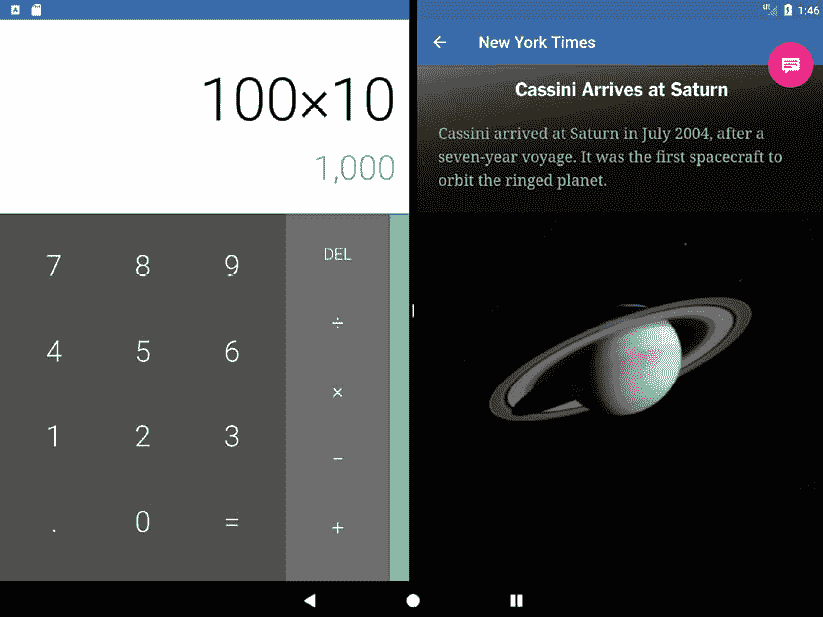
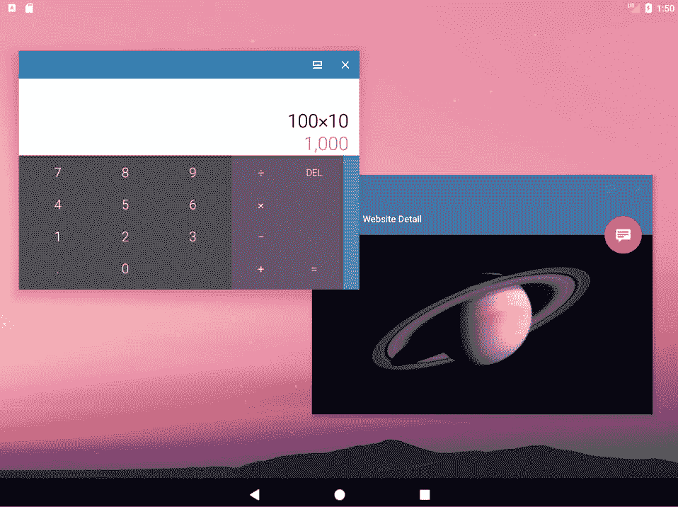
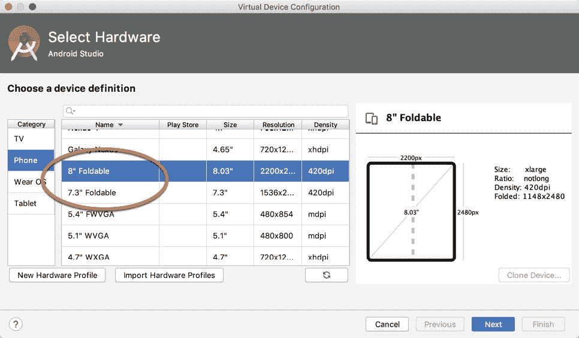
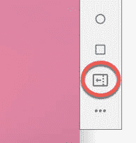
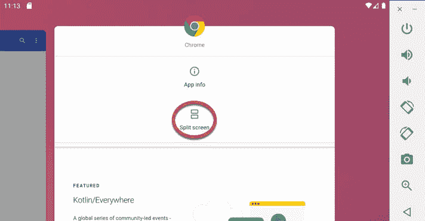
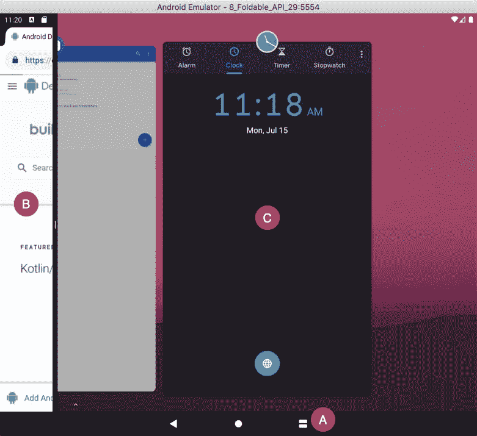
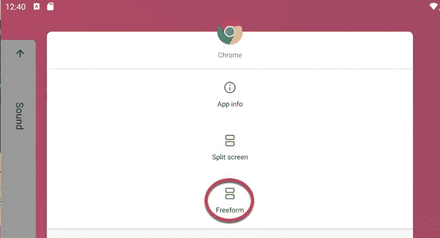

# 七十一、可折叠装置和多窗口支持

无论我们是否准备好了，可折叠设备都在到来(或者，就第一款三星 Galaxy Fold 而言，甚至可能在设备本身准备好之前)。在准备这一新类别的设备时，需要注意一些额外的步骤，以确保您的应用在可折叠设备上运行时能够正确运行。

幸运的是，支持可折叠设备的许多行为已经以多窗口支持的形式存在于安卓系统上。

71.1 可折叠和多窗口支持

当应用在可折叠设备上运行时，它可能会与其他应用共享屏幕，并遇到重大配置更改(例如屏幕大小会随着用户折叠或展开显示器而变化)。如果你的应用已经被设计来处理设备方向的变化，它很可能也能够处理由屏幕折叠引起的变化，尽管建议进行彻底的测试。

多窗口支持最初是在 Android 7 中引入的。与以前版本的安卓不同，安卓 7 中的多窗口支持允许一次在设备屏幕上显示多个活动。

Android 中的多窗口支持提供了三种不同形式的窗口支持。分屏模式适用于大多数手机、可折叠设备和平板设备，它提供了一个分屏环境，两个活动可以并排出现，也可以一个在另一个上面出现。提供了可移动的分隔器，当用户拖动该分隔器时，该分隔器调整分配给每个相邻活动的屏幕的百分比:



图 71-1

自由模式在屏幕较大的设备上提供窗口环境，目前由设备制造商自行决定启用。自由形式与分屏模式的不同之处在于，它允许每个活动出现在单独的、可调整大小的窗口中，并且不限于同时显示两个活动。[例如，图 71-2](#_idTextAnchor1343) 显示了自由模式下的设备，计算器和第二个应用显示在不同的窗口中:



图 71-2

顾名思义，画中画支持允许用户在执行其他任务时，在较小的窗口中继续播放视频，这一主题将从名为[“安卓画中画模式”](79.html#_idTextAnchor1483)的章节开始介绍。

71.2 使用可折叠仿真器

尽管在撰写本文时，市场上还没有可折叠设备来执行应用测试，但安卓软件开发工具包中包含了可折叠仿真器。要创建可折叠模拟器，请选择 AndroidStudio 工具-> AVD 管理器菜单选项，单击创建虚拟设备按钮，并从硬件选择屏幕中选择一个可折叠选项，如下图[图 71-3](#_idTextAnchor1345) 所示:



图 71-3

进行可折叠选择后，继续创建过程，选择 Android 10 API 29 或更新版本作为系统映像。

一旦模拟器启动并运行，工具栏中将出现一个附加按钮，允许模拟器在折叠和展开配置之间切换:



图 71-4

71.3 进入多窗口模式

显示概览屏幕，按住所列应用工具栏中的应用图标，选择[图 71-5](#_idTextAnchor1347) 所示的分屏菜单选项，即可进入分屏模式:



图 71-5

一旦进入分屏模式，概览按钮将变为显示两个矩形(在[图 71-6](#_idTextAnchor1349) 中标记为 A)，当前活动将填充屏幕的一部分(B)，概览屏幕将出现在屏幕的相邻部分，允许选择第二个活动进行显示(C):



图 71-6

一旦选择了第二个应用，屏幕将被均匀分割，如上图[图 71-1](#_idTextAnchor1341) 所示。

要退出分屏模式，只需将分隔两个活动的分隔线拖到远边，以便只有一个活动填满屏幕，或者按住“概述”按钮，直到它恢复为单个正方形。

71.4 启用和使用自由形式支持

虽然并非所有设备都正式支持，但可以在大屏幕设备和仿真器上启用自由形式的多窗口模式。要启用此模式，请在仿真器运行或设备连接时运行以下 adb 命令:

```kt
adb shell settings put global enable_freeform_support 1
```

进行此更改后，在设置生效之前，可能需要重新启动设备。

启用后，当长按应用图标时，概览屏幕中将出现一个附加选项，如图[图 71-7](#_idTextAnchor1352) :



图 71-7

71.5 检查自由形式支持

正如本章前面所述，谷歌将是否启用自由形式多窗口模式的选择权留给了各个安卓设备制造商。因为只有在较大的设备上使用自由形式才有意义，所以不能保证自由形式在应用可能运行的每台设备上都可用。幸运的是，如果自由模式在设备上不可用，系统会忽略所有自由模式特定的方法和属性，因此使用这些方法不会导致应用在非自由模式设备上崩溃。然而，可能会出现这样的情况，即能够检测设备是否支持自由形式的多窗口模式可能是有用的。幸运的是，这可以通过检查包管理器中的自由窗口管理功能来实现。下面的代码示例检查自由形式多窗口支持，并根据测试结果返回一个布尔值:

```kt
fun checkFreeform(): Boolean {
    return packageManager.hasSystemFeature(
            PackageManager.FEATURE_FREEFORM_WINDOW_MANAGEMENT)
}
```

71.6 在应用中启用多窗口支持

android:resizableActivity 清单文件设置控制应用是否支持多窗口行为。此设置可以在应用或个人活动级别进行。例如，下面的片段将名为 MainActivity 的活动配置为支持分屏和自由形式的多窗口模式:

```kt
<activity
    android:name=".MainActivity"
    android:resizeableActivity="true"
    android:label="@string/app_name"
    android:theme="@style/AppTheme.NoActionBar">
    <intent-filter>
        <action android:name="android.intent.action.MAIN" />

        <category android:name="android.intent.category.LAUNCHER" />
    </intent-filter>
</activity>
```

将属性设置为 false 将阻止活动出现在分屏或自由模式中，相应的按钮也不会出现在应用的“概述”菜单中。选择禁用多窗口支持的活动作为分屏配置中的第二个活动将导致出现一条消息，指示应用可能不支持多窗口模式。

71.7 指定多窗口属性

当活动启动到多窗口模式时，许多属性可作为<layout>元素的一部分，用于指定活动的大小和位置。在自由模式下启动时，活动的初始高度、宽度和位置可以使用以下属性指定:</layout>

安卓:默认宽度–指定活动的默认宽度。

安卓:默认高度–指定活动的默认高度。

安卓:重力–指定活动的初始位置(开始、结束、左侧、右侧、顶部等)。).

请注意，上述属性仅适用于以自由模式显示的活动。以下示例将活动配置为以特定的高度和宽度出现在屏幕起始边缘的顶部:

```kt
<activity android:name=".MainActivity ">
    <layout android:defaultHeight="350dp"
          android:defaultWidth="450dp"
          android:gravity="start|end" />
</activity>
```

以下<layout>属性可用于指定分割视图或自由形式模式下活动可以减少到的最小宽度和高度:</layout>

Android:minimal h8–指定在分屏或自由模式下活动可以减少到的最小高度。

安卓:最小宽度-指定在分屏或自由模式下活动可以减少的最小宽度。

当用户滑动分屏分割线超过最小高度或宽度边界时，系统将停止调整收缩活动的布局大小，并简单地裁剪用户界面，为相邻活动腾出空间。

以下清单文件片段实现了活动的最小宽度和高度属性:

```kt
<activity android:name=".MainActivity ">
    <layout android:minimalHeight="400dp"
          android:minimalWidth="290dp" />
</activity>
```

71.8 检测活动中的多窗口模式

可能会出现活动需要检测当前是否以多窗口模式显示给用户的情况。当前状态可以通过调用 Activity 类的 isInMultiWindowMode()方法获得。调用时，此方法根据活动当前是否全屏返回真值或假值:

```kt
if (this.isInMultiWindowMode()) {
    // Activity is running in Multi-Window mode
} else {
    // Activity is not in Multi-Window mode
}
```

71.9 接收多窗口通知

如果一个活动重写了 onMultiWindowModeChanged()回调方法，它将收到进入或退出多窗口模式的通知。传递给此方法的第一个参数在进入多窗口模式时为真，在活动退出模式时为假。新的配置设置包含在作为第二个参数传递的配置对象中:

```kt
override fun onMultiWindowModeChanged(isInMultiWindowMode: Boolean, 
                                newConfig: Configuration?) {
    super.onMultiWindowModeChanged(isInMultiWindowMode, newConfig)

    if (isInMultiWindowMode) {
        // Activity has entered multi-window mode
    } else {
        // Activity has exited multi-window mode
    }
}
```

如标题为[“处理安卓活动状态变化”](20.html#_idTextAnchor414)一章所述，安卓 10 及更高版本允许多个活动同时处于恢复状态(也称为多恢复)。用户最近与之交互的活动被称为最顶层的恢复活动。为了在活动获得和失去最顶端的恢复状态时跟踪活动，可以在活动中实现 onTopResumedActivityChanged()回调方法，例如:

```kt
override fun onTopResumedActivityChanged(isTopResumedActivity: Boolean) {
    super.onTopResumedActivityChanged(isTopResumedActivity)

    if (isTopResumedActivity) {
        // Activity is now topmost resumed activity
    } else {
        // Activity is no longer topmost resumed activity
    }
}
```

通过在应用清单文件中启用以下属性，还可以在运行安卓 9 的某些设备上利用应用中的多简历功能:

```kt
<meta-data
android:name="android.allow_multiple_resumed_activities" android:value="true" />
```

71.10 在多窗口模式下发起活动

在本书的[“安卓显式意图——一个成功的例子”](60.html#_idTextAnchor1173)一章中，创建了一个示例应用，其中一个活动使用意图来启动第二个活动。默认情况下，通过意图启动的活动被认为与原始活动位于同一任务堆栈中。但是，可以通过传递带有意图的适当标志，将活动启动到新的任务堆栈中。

当多窗口模式下的活动启动同一任务堆栈中的另一个活动时，新活动将替换分屏或自由形式窗口中的原始活动(用户通过后退按钮返回到原始活动)。

但是，当以分屏模式启动到新的任务堆栈中时，第二个活动将出现在与原始活动相邻的窗口中，允许同时查看两个活动。在自由模式下，启动的活动将出现在与原始活动不同的窗口中。

为了将一个活动启动到一个新的任务堆栈中，在开始之前，必须在意图上设置以下标志:

意图。标志 _ 活动 _ 发射 _ 相邻

意图。FLAG_ACTIVITY_MULTIPLE_TASK

意图。标志 _ 活动 _ 新 _ 任务

例如，下面的代码配置并启动了第二个活动，该活动设计为出现在单独的窗口中:

```kt
val i = Intent(this, SecondActivity::class.java)

i.addFlags(Intent.FLAG_ACTIVITY_LAUNCH_ADJACENT or
        Intent.FLAG_ACTIVITY_MULTIPLE_TASK or
        Intent.FLAG_ACTIVITY_NEW_TASK)

startActivity(i)
```

71.11 配置自由形式活动的大小和位置

默认情况下，在自由模式下启动到不同任务堆栈中的活动将位于屏幕中心，大小由系统决定。通过 ActivityOptions 类将启动边界设置传递给意图，可以控制该窗口的位置和尺寸。这个过程的第一步是创建一个 Rect 对象，用表示活动窗口的矩形的左(X)、上(Y)、右(X)和下(Y)坐标进行配置。例如，下面的代码创建了一个 Rect 对象，其中左上角位于坐标(0，0)处，右下角位于坐标(100，100)处:

```kt
val rect = Rect(0, 0, 100, 100)
```

下一步是创建 ActivityOptions 类的一个基本实例，并通过 setLaunchBounds()方法用 Rect 设置初始化它:

```kt
val options = ActivityOptions.makeBasic()
val bounds = options.setLaunchBounds(rect)
```

最后，ActivityOptions 实例被转换为 Bundle 对象，并与 Intent 对象一起传递给 startActivity()方法:

```kt
startActivity(i, bounds.toBundle())
```

将这些步骤组合在一起会产生一个如下所示的代码序列:

```kt
val i = Intent(this, SecondActivity::class.java)
i.addFlags(Intent.FLAG_ACTIVITY_LAUNCH_ADJACENT or
        Intent.FLAG_ACTIVITY_MULTIPLE_TASK or
        Intent.FLAG_ACTIVITY_NEW_TASK)

val rect = Rect(0, 0, 100, 100)

val options = ActivityOptions.makeBasic()
val bounds = options.setLaunchBounds(rect)

startActivity(i, bounds.toBundle())
```

当第二个活动由意图启动，而原始活动处于自由模式时，将出现新的活动窗口，其位置和维度在 Rect 对象中定义。

71.12 总结

安卓 7 引入了多窗口支持，这是一个可以同时在屏幕上显示多个活动的系统。该特性现在构成了为可折叠设备提供支持的基础。多窗口支持提供的三种模式是分屏、自由形式和画中画。在分屏模式下，屏幕被水平或垂直分成两个窗格，每个窗格中显示一个活动。自由模式仅在某些安卓设备上受支持，允许每个活动出现在单独的、可移动和可调整大小的窗口中。如本章所述，安卓软件开发工具包中有许多方法和属性设置可用于检测、响应和控制应用中的多窗口行为。