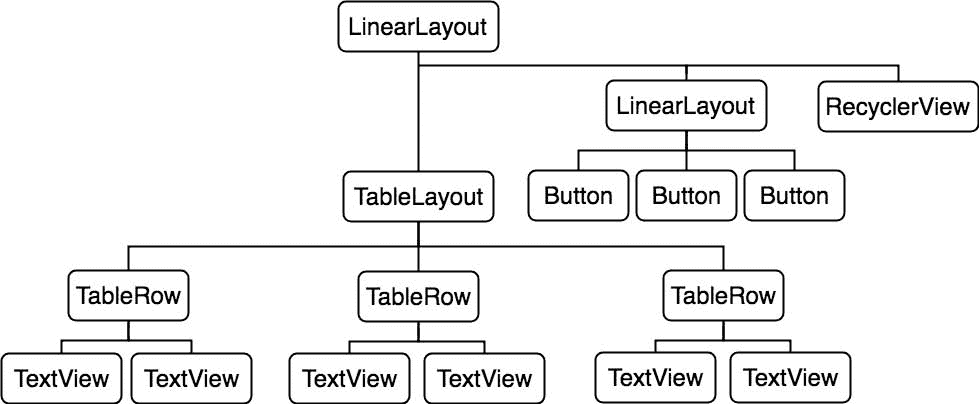
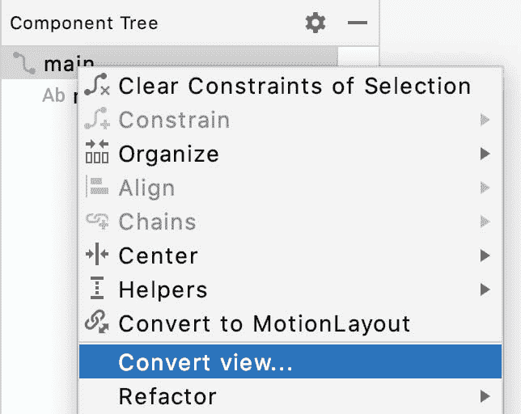
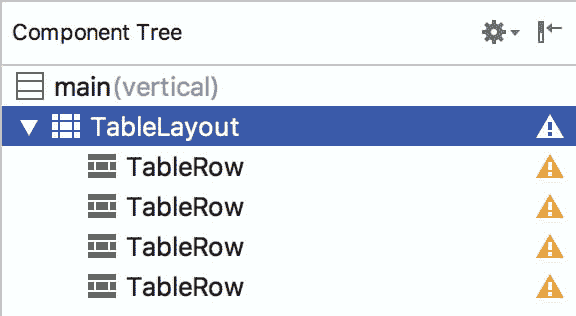
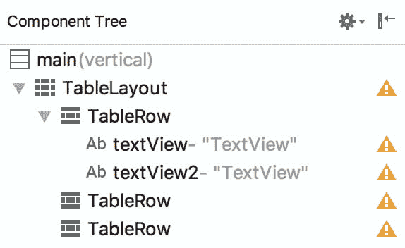
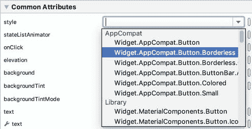
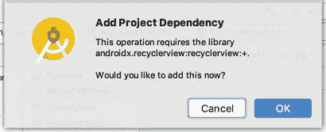
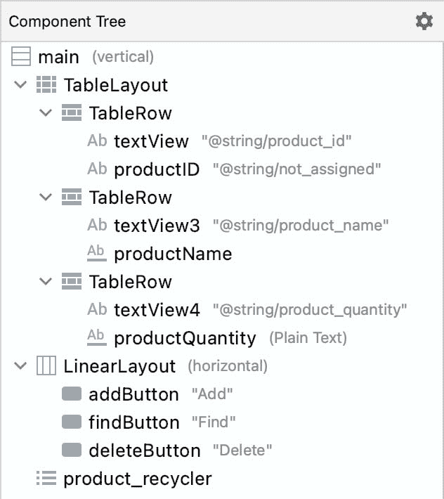
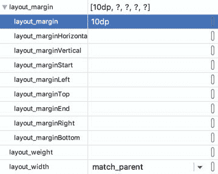

# 七十四、安卓表格布局和表格行教程

当这本书的下一章([“安卓房间数据库和存储库教程”](75.html#_idTextAnchor1415))的工作开始时，最初打算包括为房间数据库示例应用设计用户界面布局的步骤。然而，很快就变得很明显，实现用户界面的最好方法是利用安卓的 TableLayout 和 TableRow 视图，并且这个主题区域应该有一个独立的章节。因此，本章将只关注将在下一章中完成的数据库应用的用户界面设计，在此过程中，请花一些时间介绍AndroidStudio中表格布局的基本概念。

74.1 表格布局和表格行布局视图

TableLayout 容器视图的目的是允许用户界面元素以由行和列组成的表格格式组织在屏幕上。TableLayout 中的每一行都被 TableRow 实例占据，TableRow 实例又被划分为多个单元格，每个单元格包含一个子视图(它本身可能是一个包含多个视图子视图的容器)。

表中的列数由列数最多的行决定，默认情况下，每列的宽度由该列中最宽的单元格定义。列可以被配置为可收缩的或可拉伸的(或两者都有)，以便它们相对于父表布局改变大小。此外，单个单元可以被配置为跨越多列。

考虑[图 74-1](#_idTextAnchor1396) 所示的用户界面布局:

图 74-1

从布局的视觉外观来看，很难识别用于设计界面的 TableLayout 结构。[图 74-2](#_idTextAnchor1397) 所示的层次树，却使结构更容易理解:

图 74-2

很明显，布局由带有表格布局、线性布局和回收子视图的父线性布局视图组成。TableLayout 包含三个 TableRow 子级，代表表中的三行。TableRows 包含两个子视图，每个子视图代表一个表列单元格的内容。线性布局子视图包含三个按钮子视图。

[图 74-2](#_idTextAnchor1397) 所示的布局正是下一章将要完成的数据库示例所需的布局。因此，本章的剩余部分将用于使用AndroidStudio布局编辑器工具逐步设计该用户界面。

74.2 创建房间数据库项目

从欢迎屏幕中选择创建新项目快速启动选项，并在生成的新项目对话框中选择片段+视图模型模板，然后单击下一步按钮。

在“名称”字段中输入 roomdemo，并将 com .ebook 狂潮. RoomDemo 指定为包名。在单击完成按钮之前，将最低API级别设置更改为API 26:安卓 8.0(奥利奥)，并将语言菜单更改为Kotlin。

74.3 转换为线性布局

在项目工具窗口(app -> res -> layout)中找到 main_fragment.xml 文件，然后双击它将其加载到 Layout Editor 工具中。默认情况下，AndroidStudio在用户界面中使用了一个约束布局作为根布局元素。这需要转换为垂直方向的线性布局。在设计模式下使用布局编辑器工具，在组件树中找到主约束布局组件，右键单击它，显示如图 74-3 所示的菜单，并选择转换视图...选项:

图 74-3

在生成的对话框中([图 74-4](#_idTextAnchor1401) )选择转换为线性布局的选项，然后单击应用按钮:

图 74-4

默认情况下，布局编辑器将约束布局转换为水平线性布局，因此请在组件树窗口中选择布局组件，参考属性工具窗口并将方向属性更改为垂直:

图 74-5

转换完成后，从布局中选择并删除默认的文本视图小部件。

74.4 将表格布局添加到用户界面

保留在 main_fragment.xml 文件中，并参考调色板的布局类别，拖放一个 TableLayout 视图，使其位于 LinearLayout 画布区域的顶部。

一旦这些初始步骤完成，布局的组件树应该类似于图 74-6 中所示。

图 74-6

显然，AndroidStudio已经自动向 TableLayout 添加了四个 TableRow 实例。由于此示例只需要三行，因此选择并删除第四个 TableRow 实例。通过从调色板中拖动 TableRow 对象并将其放到组件树工具窗口中的 TableLayout 条目上，可以随时向 TableLayout 添加其他行。

选择“表格布局”后，使用“属性”工具窗口将“布局高度”属性更改为“内容环绕”，将“布局宽度”更改为“匹配父项”。

74.5 配置表格行

从选项板的文本部分，将两个文本视图对象拖放到组件树中最上面的表格行条目上([图 74-7](#_idTextAnchor1405) ):

图 74-7

选择屏幕布局中最左侧的文本视图，并在属性工具窗口中将文本属性更改为“产品标识”。对最右侧的文本视图重复此步骤，这次将文本更改为“未分配”，并指定产品标识的标识值。

将另一个文本视图小部件拖放到组件树中的第二个表行条目上，并将视图上的文本更改为“产品名称”。在调板中定位纯文本对象，并将其拖放到组件树中产品名称文本视图的下方，如图 74-8 所示。选择编辑文本对象，将输入类型属性从文本人员名称更改为无，从文本属性中删除“名称”字符串，并将标识设置为产品名称。

图 74-8

将另一个文本视图和一个数字(十进制)文本字段拖放到第三个表格行，以便文本视图位于层次结构中编辑文本的上方。将文本视图上的文本更改为产品数量，将编辑文本对象的标识更改为产品数量。

按住 Shift 键点按以选择布局中的所有小部件，如下图[74-9](#_idTextAnchor1407)所示，并使用属性工具窗口将所有对象的文本大小属性设置为 18sp:

图 74-9

在继续之前，请确保将上述步骤中添加的所有文本属性提取到字符串资源中。

74.6 将按钮栏添加到布局

下一步是将线形布局(水平)视图添加到父线形布局视图中，该视图位于表格布局视图的正下方。首先，单击组件树中表格布局条目左侧的小显示箭头，以便表格行从视图中折叠出来。从“布局编辑器”选项板的“布局”部分拖动线性布局(水平)实例，将其直接放在“组件树”面板中的“表格布局”条目下，并将“布局高度”属性更改为“环绕内容”:

图 74-10

将三个按钮对象拖放到新的线性布局上，并为每个分别显示“添加”、“查找”和“删除”的按钮分配字符串资源。这种类型的按钮栏排列中的按钮通常应该以无边框样式显示。对于每个按钮，使用属性工具窗口将样式设置更改为小部件。将“无边框”和“文本颜色”属性设置为@color/black。将按钮的标识分别更改为添加按钮、查找按钮和删除按钮和。

图 74-11

在组件树中选择新的水平线性布局视图后，将重心属性更改为 center_horizontal，以便按钮在显示中水平居中。

74.7 添加回收视图

在组件树中，单击新添加的水平线性布局条目右侧的显示箭头，折叠视图中的所有子元素。

从组件面板的容器部分，拖动一个回收视图实例并将其放到组件树中，使其位于按钮栏线性布局的下方，如图 74-12 所示。请注意确保 RecyclerView 是作为父垂直线性布局视图的直接子视图添加的，而不是作为水平按钮栏线性布局的子视图添加的。

图 74-12

当 RecyclerView 被添加到布局中时，Android Studio 可能会提供将相应库添加到项目构建配置中的选项，如下图所示。在继续之前，单击“确定”按钮添加此库:

图 74-13

在布局中选择回收视图后，将视图的标识更改为产品回收器，并将布局高度属性设置为匹配父级。在继续之前，请检查“组件树”面板中布局的层次结构是否与下图所示的相匹配:

图 74-14

74.8 调整版面边距

剩下的就是调整一些布局设置。首先，单击“组件树”面板中的第一个表行条目，将其选中。按住键盘上的 Cmd/Ctrl 键，单击第二个和第三个表格行、水平线性布局和循环视图，以便选择所有五个项目。在属性面板中，找到 layout_margin 属性类别，一旦找到，将值更改为 10dp，如图[图 74-15](#_idTextAnchor1413) :

图 74-15

设置好边距后，用户界面应如图[图 74-1](#_idTextAnchor1396) 所示。

74.9 总结

Android TableLayout 容器视图提供了一种在行和列配置中排列视图组件的方法。虽然 TableLayout 视图提供了整个容器，但是每行和其中包含的单元格都是通过 TableRow 视图的实例实现的。在本章中，已经在AndroidStudio中使用 TableLayout 和 TableRow 容器设计了一个用户界面。下一章将添加该用户界面背后的功能，以使用存储库和 Room 持久化库实现 SQLite 数据库功能。