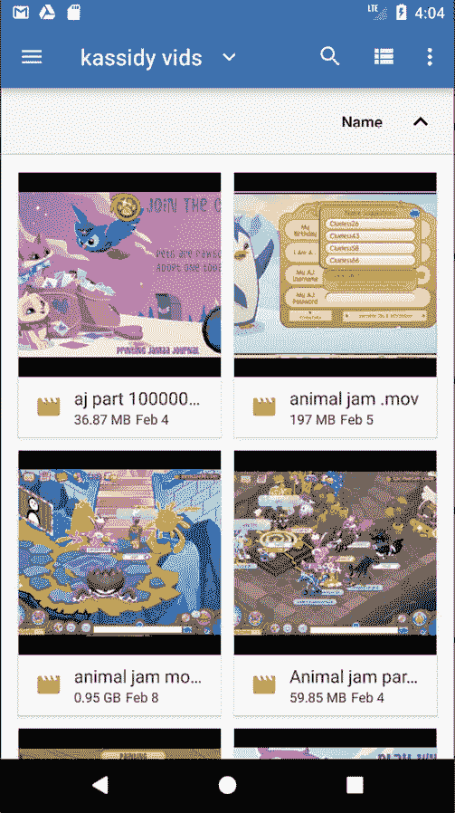

76.使用安卓存储访问框架访问云存储

近年来，远程存储服务(也称为“云存储”)被广泛采用来存储用户文件和数据。推动这一增长有两个关键因素。一是现在大多数移动设备都提供连续、高速的互联网连接，从而使数据传输变得快速且经济实惠。第二个因素是，相对于传统的计算机系统(如台式机和笔记本电脑)，这些移动设备在内部存储资源方面受到限制。例如，如今的高规格安卓平板电脑通常具有 128Gb 的存储容量。与配备 750Gb 磁盘驱动器的中端笔记本电脑系统相比，无缝远程存储文件的需求是当今许多移动应用的关键要求。

认识到这一事实，谷歌引入了存储访问框架作为安卓 4.4 软件开发工具包的一部分。本章将提供存储访问框架的高级概述，为下一章中包含的更详细的指南做准备，下一章题为[“安卓存储访问框架示例”](77.html#_idTextAnchor1451)。

76.1 存储访问框架

从用户的角度来看，存储访问框架提供了一个直观的用户界面，允许用户从安卓应用中浏览、选择、删除和创建由存储服务(也称为文档提供者)托管的文件。使用该浏览界面(也称为选择器，用户可以浏览由他们选择的文档提供商托管的文件(如文档、音频、图像和视频)。[例如，图 76-1](#_idTextAnchor1442) 显示了显示由文档提供商服务托管的文件集合的选择器用户界面:



图 76-1

文档提供者可以是基于云的服务，也可以是与客户端应用运行在同一台设备上的本地文档提供者。在撰写本文时，与存储访问框架兼容的最著名的文档提供商是 Box，不出所料，还有 Google Drive 。很有可能其他云存储提供商和应用开发者也将很快提供符合安卓存储访问框架的服务。

除了基于云的文档提供者，选择器还提供对设备内部存储的访问，为应用用户提供一系列文件存储选项。

通过一组意图，安卓应用开发人员可以用几行代码将这些存储功能整合到应用中。从开发人员的角度来看，存储访问框架的一个特别引人注目的方面是，用户选择的底层文档提供者对应用是完全透明的。一旦在应用中使用框架实现了存储功能，它将与所有文档提供者一起工作，而无需任何代码修改。

76.2 使用存储访问框架

安卓包括一组意图，旨在将存储访问框架的功能集成到安卓应用中。这些意图向用户显示存储访问框架选择器用户界面，并通过调用启动意图的活动的 onActivityResult()方法将交互结果返回给应用。当调用 onActivityResult()方法时，它会被传递所选文件的 Uri 以及一个指示操作成功与否的值。

存储访问框架的意图可以总结如下:

ACTION _ OPEN _ DOCUMENT–为用户提供对选取器用户界面的访问，以便可以从设备上配置的文档提供程序中选择文件。选定的文件以 Uri 对象的形式传递回应用。

ACTION _ CREATE _ DOCUMENT–允许用户选择文档提供者、该提供者的存储位置以及新文件的文件名。选择后，文件由存储访问框架创建，该文件的 Uri 返回给应用进行进一步处理。

76.3 过滤选取器文件列表

当意图开始时，可以使用各种选项来过滤在挑选器用户界面中列出的文件。例如，考虑下面的代码来启动一个 ACTION_OPEN_DOCUMENT 意图:

```kt
val OPEN_REQUEST_CODE = 41
val intent = Intent(Intent.ACTION_OPEN_DOCUMENT)
startActivityForResult(intent, OPEN_REQUEST_CODE)
```

执行上述代码时，将显示选择器用户界面，允许用户浏览和选择由可用文档提供者托管的任何文件。一旦用户选择了一个文件，对该文件的引用将以 Uri 对象的形式提供给应用。然后，应用可以使用 openFileDescriptor(Uri，String)方法打开文件。但是，也有一些风险，不是所有由文档提供者列出的文件都可以用这种方式打开。通过使用 CATEGORY _ OPERATION选项修改意图，可以在选择器中排除此类文件。例如:

```kt
val OPEN_REQUEST_CODE = 41
val intent = Intent(Intent.ACTION_OPEN_DOCUMENT)

intent.addCategory(Intent.CATEGORY_OPENABLE)
startActivityForResult(intent, OPEN_REQUEST_CODE)
```

当现在显示选取器时，不能使用 openFileDescriptor()方法打开的文件将被列出，但用户不能选择。

另一种有用的过滤方法是允许通过文件类型来限制可供选择的文件。这包括指定应用能够处理的文件类型。例如，图像编辑应用可能只想向用户提供从文档提供者中选择图像文件的选项。这是通过用用户可选择的文件的 MIME 类型配置意图对象来实现的。例如，下面的代码指定只有图像文件适合在选取器中选择:

```kt
val intent = Intent(Intent.ACTION_OPEN_DOCUMENT)
intent.addCategory(Intent.CATEGORY_OPENABLE)
intent.type = "img/*"
startActivityForResult(intent, OPEN_REQUEST_CODE)
This could be further refined to limit selection to JPEG images:
intent.type = "img/jpeg"
```

或者，音频播放器应用可能只能处理音频文件:

```kt
intent.type = "audio/*"
```

音频应用可能进一步受限于仅支持基于 MP4 的音频文件的回放:

```kt
intent.type = "audio/mp4"
```

在使用存储访问框架时，有多种 MIME 类型设置可供使用，其中更常见的设置可在以下网址找到:

https://en.wikipedia.org/wiki/Internet_media_type#List_of_common_media_types

76.4 处理意图结果

当意图将控制权返回给应用时，它通过调用启动意图的活动的 onActivityResult()方法来实现。该方法被传递到启动时传递给意图的请求代码、指示意图是否成功的结果代码以及包含所选文件的 Uri 的结果数据对象。例如，以下代码可以用作处理上一节中概述的 ACTION_OPEN_DOCUMEN T 意图的结果的基础:

```kt
public override fun onActivityResult(requestCode: Int, resultCode: Int,
                                     resultData: Intent?) {

    var currentUri: Uri? = null

    if (resultCode == Activity.RESULT_OK) {

        if (requestCode == OPEN_REQUEST_CODE) {

            resultData?.let {
                currentUri = it.data

                try {
                    val content = readFileContent(currentUri)
                    fileText.setText(content)
                } catch (e: IOException) {
                    // Handle error here
                }

            }
        }
    }
}
```

上述方法验证意图是否成功，检查请求代码是否与文件打开请求的代码匹配，然后从意图数据中提取 Uri。Uri 然后可以用来读取文件的内容。

76.5 读取文件内容

读取由文档提供商托管的文件内容所需的确切步骤在很大程度上取决于文件的类型。例如，从文本文件中读取行的步骤不同于图像或音频文件。

通过从 Uri 对象中提取文件描述符，然后将图像解码为位图工厂实例，可以将图像文件分配给位图对象。例如:

```kt
val pFileDescriptor = contentResolver.openFileDescriptor(uri, "r")
val fileDescriptor = pFileDescriptor.fileDescriptor

val image = BitmapFactory.decodeFileDescriptor(fileDescriptor)

pFileDescriptor.close()

val myImageView = ImageView(this)
myImageView.setImageBitmap(image)
```

请注意，文件描述符是以“r”模式打开的。这表示该文件将被打开进行读取。其他选项包括写访问的“w”和读写访问的“rwt”，其中文件中的现有内容被新内容截断。

读取文本文件的内容需要稍多的工作和使用 InputStream 对象。例如，下面的代码从文本文件中读取行:

```kt
val inputStream = contentResolver.openInputStream(uri)
val reader = BufferedReader(InputStreamReader(inputStream))

var currentline = reader.readLine()

while (currentline != null) {
    // Do something with each line in the file
}
inputStream.close()
```

76.6 将内容写入文件

写入由文档提供者托管的打开文件类似于读取，只是使用输出流而不是输入流。例如，下面的代码将文本写入指定 Uri 引用的基于存储的文件的输出流:

```kt
try {
    val pfd = contentResolver.openFileDescriptor(uri, "w")

    val fileOutputStream = FileOutputStream(
            pfd.fileDescriptor)

    val textContent = fileText.text.toString()

    fileOutputStream.write(textContent.toByteArray())

    fileOutputStream.close()
    pfd.close()
} catch (e: FileNotFoundException) {
    e.printStackTrace()
} catch (e: IOException) {
    e.printStackTrace()
}
```

首先，从 Uri 中提取文件描述符，这次请求对目标文件的写权限。文件描述符随后用于获取对文件输出流的引用。然后，在关闭文件描述符和输出流之前，将内容(在本例中是一些文本)写入输出流。

76.7 删除文件

文件是否可以从存储中删除取决于文件的文档提供者是否支持删除文件。假设允许删除，可以在指定的 Uri 上执行删除，如下所示:

```kt
if (DocumentsContract.deleteDocument(contentResolver, uri))
    // Deletion was successful
else
    // Deletion failed
```

76.8 获得对文件的持久访问权

当应用通过存储访问框架获得对文件的访问时，该访问将保持有效，直到运行该应用的安卓设备重新启动。通过为 Uri“获取”必要的权限，可以获得对特定文件的持久访问。例如，下面的代码将文件 Uri 实例引用的文件的读写权限保持不变:

```kt
val takeFlags = (intent.flags and (Intent.FLAG_GRANT_READ_URI_PERMISSION 
                                       or Intent.FLAG_GRANT_WRITE_URI_PERMISSION)

contentResolver.takePersistableUriPermission(fileUri, takeFlags)
```

一旦应用获取了文件的权限，并且假设应用已经保存了 Uri，则用户应该能够在设备重启后继续访问文件，而无需用户从选择器界面重新选择文件。

如果在任何时候不再需要持久权限，可以通过调用内容解析器的 releasespersistableuripermission()方法来释放它们:

```kt
val takeFlags = (intent.flags and (Intent.FLAG_GRANT_READ_URI_PERMISSION 
                                       or Intent.FLAG_GRANT_WRITE_URI_PERMISSION)

contentResolver.releasePersistableUriPermission(fileUri, takeFlags)
```

76.9 总结

考虑一下近年来人们对存储的看法是如何变化的，这很有趣。“存储”一词曾经是高容量内部硬盘驱动器的代名词，现在也很可能指远程托管在云中并通过互联网连接访问的存储空间。随着资源受限、“始终连接”且内部存储容量最小的移动设备的广泛采用，这种情况越来越多。

安卓存储访问框架为用户和应用开发人员提供了一个简单的机制来无缝地访问存储在云中的文件。通过使用一组意图和用于选择文档提供商和文件的内置用户界面，现在可以用最少的编码将全面的基于云的存储集成到安卓应用中。