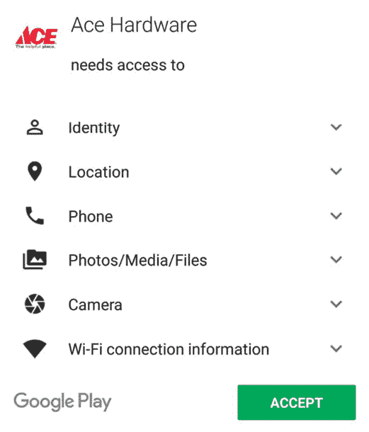
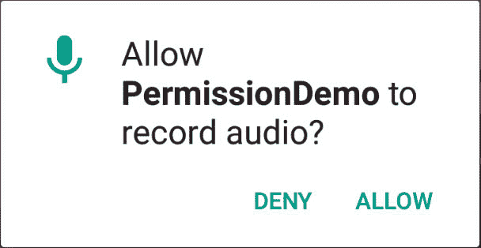
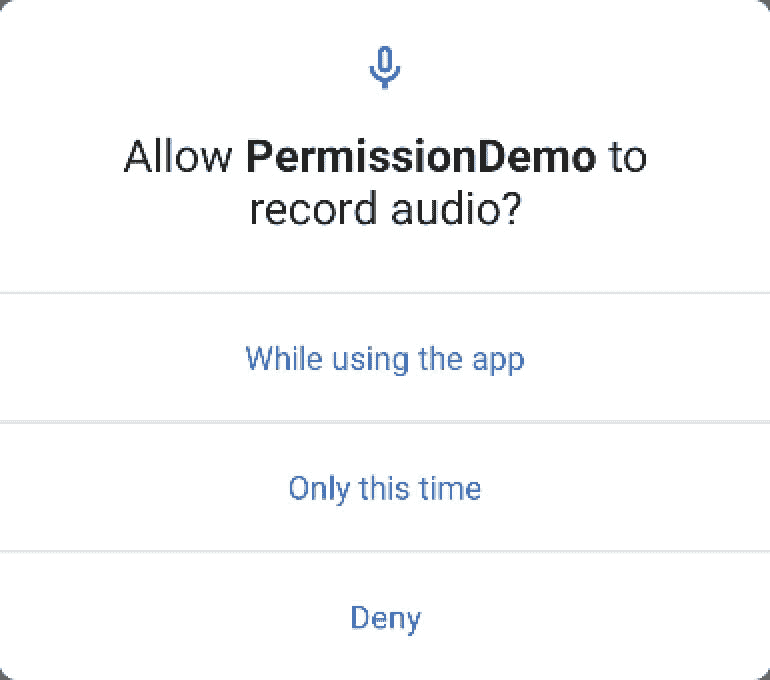
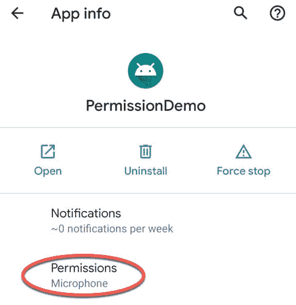

# 八十一、安卓系统中的运行时权限请求

在前面几章创建的许多示例项目中，对 AndroidManifest.xml 文件进行了更改，以请求应用执行特定任务的权限。例如，在一些情况下，为了允许应用下载和显示网页，已经请求了互联网访问许可。在这之前的每种情况下，将请求添加到清单中是应用从用户那里获得执行指定任务的许可所需要的全部内容。

但是，在安卓 6.0 或更高版本上运行应用时，需要执行一些额外的步骤才能正常运行。第一个所谓的“危险”权限 将在下一章中遇到。然而，在达到这一点之前，本章将概述在最新一代安卓系统上运行时请求此类权限所涉及的步骤。

81.1 理解正常和危险权限

安卓通过要求用户授予应用执行特定任务的权限来加强安全性。在安卓 6 推出之前，总是在设备上安装应用时寻求许可。[例如，图 81-1](#_idTextAnchor1510) 显示了一个典型的屏幕，该屏幕在通过 Google Play 安装应用的过程中寻求各种权限。



图 81-1

对于许多类型的权限，这种情况仍然适用于安卓 6.0 或更高版本的应用。这些权限被称为正常权限 ，在安装时仍然需要被用户接受。第二种类型的权限(称为危险权限)也必须以与普通权限相同的方式在清单文件中声明，但也必须在首次启动应用时向用户请求。当发出这样的请求时，它会以对话框的形式出现，如图[图 81-2](#_idTextAnchor1512) :



图 81-2

属于危险类别的全部权限列表包含在[表 81-1](#_idTextAnchor1514) 中:

<colgroup><col> <col></colgroup> 
| 权限组 | 许可 |
| 日历 | READ_CALENDARWRITE_CALENDAR |
| 相机 | 摄像机 |
| 联系人 | READ_CONTACTSWRITE_CONTACTS获取 _ 账户 |
| 位置 | 访问 _ 精细 _ 位置访问 _ 粗略 _ 位置 |
| 麦克风 | 录制 _ 音频 |
| 电话 | READ_PHONE_STATECALL_PHONE读取呼叫日志写调用日志添加 _ 语音邮件使用 _SIP处理呼出电话 |
| 传感器 | 车身传感器 |
| 简讯 | 发送 _ 短信接收 _ 短信READ_SMS接收 _ WAP _ 推送接收彩信 |
| 存储 | 读取 _ 外部 _ 存储写 _ 外部 _ 存储 |

表 81-1

81.2 创建权限示例项目

从欢迎屏幕中选择创建新项目快速启动选项，并在生成的新项目对话框中选择空活动模板，然后单击下一步按钮。

在“名称”字段中输入 PermissionDemo，并将 com . ebookwidue . PermissionDemo 指定为包名。在单击完成按钮之前，将最低API级别设置更改为API 26:安卓 8.0(奥利奥)，并将语言菜单更改为Kotlin。

81.3 检查许可

安卓支持库包含许多方法，可用于在安卓应用的代码中查找和管理危险的权限。这些 API 调用可以安全地进行，无论应用运行在哪个版本的 Android 上，但只有在 Android 6.0 或更高版本上执行时才会执行有意义的任务。

在应用试图使用需要危险权限批准的功能之前，无论之前是否授予了权限，代码都必须检查权限是否已授予。这可以通过调用 ContextCompat 类的 checkSelfPermission()方法来实现，将对当前活动和所请求权限的引用作为参数传递。该方法将检查该权限以前是否已被授予，并返回一个与 PackageManager 匹配的整数值。PERMISSION_GRANTED 或 PackageManager。PERMISSION_DENIED 。

在示例项目的 MainActivity.kt 文件中，修改代码以检查是否已授予应用录制音频的权限:

```kt
package com.ebookfrenzy.permissiondemo
.
.
import android.Manifest
import android.content.pm.PackageManager
import androidx.core.content.ContextCompat
import android.util.Log

class MainActivity : AppCompatActivity() {

    private val TAG = "PermissionDemo"

    override fun onCreate(savedInstanceState: Bundle?) {
        super.onCreate(savedInstanceState)
        setContentView(R.layout.activity_main)

        setupPermissions()
    }

    private fun setupPermissions() {
        val permission = ContextCompat.checkSelfPermission(this,
                Manifest.permission.RECORD_AUDIO)

        if (permission != PackageManager.PERMISSION_GRANTED) {
            Log.i(TAG, "Permission to record denied")
        }
    }
}
```

在运行早于安卓 6.0 的安卓版本的设备或模拟器上运行该应用，并在AndroidStudio内查看 Logcat 输出。应用启动后，日志文件输出应包含“拒绝录制许可”消息。

编辑 AndroidManifest.xml 文件(位于应用->清单下的项目工具窗口中)，并添加一行来请求录制权限，如下所示:

```kt
<?xml version="1.0" encoding="utf-8"?>
<manifest xmlns:android="http://schemas.android.com/apk/res/android"
    package="com.ebookfrenzy.permissiondemoactivity" >

    <uses-permission android:name="android.permission.RECORD_AUDIO" />

    <application
        android:allowBackup="true"
        android:icon="@mipmap/ic_launcher"
        android:label="@sxtring/app_name"
        android:supportsRtl="true"
        android:theme="@style/AppTheme" >
        <activity android:name=".MainActivity" >
            <intent-filter>
                <action android:name="android.intent.action.MAIN" />

                <category 
                  android:name="android.intent.category.LAUNCHER" />
            </intent-filter>
        </activity>
    </application>
</manifest>
```

再次编译并运行该应用，注意这次不会出现拒绝权限消息。显然，在旧版本的安卓系统上，所有需要做的事情都已经完成了。然而，在运行安卓 6.0 或更高版本的设备或模拟器上运行该应用，请注意，即使权限已被添加到清单文件中，检查仍会报告权限已被拒绝。这是因为安卓版本 6 及更高版本要求应用在运行时也请求危险的权限。

81.4 运行时请求许可

权限请求是通过调用 ActivityCompat 类的 requestPermissions()方法发出的。调用此方法时，权限请求被异步处理，任务完成时调用名为 onRequestPermissionsResult()的方法。

requestPermissions()方法将对当前活动的引用以及被请求权限的标识符和请求代码作为参数。请求代码可以是任何整数值，并将用于识别哪个请求触发了对 onRequestPermissionsResult()方法的调用。修改 MainActivity.kt 文件以声明请求代码，并在权限检查失败时请求录制权限:

```kt
.
.
import androidx.core.app.ActivityCompat

class MainActivity : AppCompatActivity() {

    private val TAG = "PermissionDemo"
    private val RECORD_REQUEST_CODE = 101
.
.
    private fun setupPermissions() {
        val permission = ContextCompat.checkSelfPermission(this,
                Manifest.permission.RECORD_AUDIO)

        if (permission != PackageManager.PERMISSION_GRANTED) {
            Log.i(TAG, "Permission to record denied")
            makeRequest()
        }
    }

    private fun makeRequest() {
        ActivityCompat.requestPermissions(this,
                arrayOf(Manifest.permission.RECORD_AUDIO),
                RECORD_REQUEST_CODE)
    }
}
```

接下来，实现 onRequestPermissionsResult()方法，使其如下所示:

```kt
override fun onRequestPermissionsResult(requestCode: Int,
              permissions: Array<String>, grantResults: IntArray) {
    when (requestCode) {
        RECORD_REQUEST_CODE -> {

            if (grantResults.isEmpty() || grantResults[0] != 
                              PackageManager.PERMISSION_GRANTED) {

                Log.i(TAG, "Permission has been denied by user")
            } else {
                Log.i(TAG, "Permission has been granted by user")
            }
        }
    }
}
```

在 Android 6 或更高版本的模拟器或设备上编译并运行该应用，注意会出现一个对话框，寻求录制音频的许可，如图[图 81-3](#_idTextAnchor1518) :



图 81-3

轻按“使用应用时”按钮，并检查“用户已授予权限”消息是否出现在日志面板中。

一旦用户授予了请求的权限，checkSelfPermission()方法调用将在以后的应用调用中返回一个 PERMISSION_GRANTED 结果，直到用户卸载并重新安装应用或在设置中更改应用的权限。

81.5 提供许可请求的理由

从[图 81-3](#_idTextAnchor1518) 可以明显看出，用户可以选择拒绝请求的权限。在这种情况下，除非用户在单击“拒绝”按钮之前选择了“不再询问”选项，否则应用将在用户每次启动时继续请求权限。用户的重复拒绝可能表明用户不理解为什么应用需要该权限。因此，如果在发出请求时解释了要求的原因，用户可能更有可能授予许可。不幸的是，不可能改变请求对话框的内容来包括这样的解释。

解释最好包含在单独的对话框中，该对话框可以在请求对话框呈现给用户之前显示。这就提出了何时显示该解释对话框的问题。安卓文档建议仅在用户之前拒绝许可的情况下显示解释对话框，并提供了一种方法来识别这种情况。

如果用户先前拒绝了对指定权限的请求，对 ActivityCompat 类的 shadowshowrequestpermissionthelimited()方法的调用将返回真结果，如果先前没有发出请求，则返回假结果。在真实结果的情况下，应用应该显示一个对话框，其中包含需要该权限的基本原理，并且一旦对话框被用户读取并拒绝，就应该重复该权限请求。

要将此功能添加到示例应用中，请修改 onCreate()方法，使其如下所示:

```kt
.
.
import android.app.AlertDialog
.
.
private fun setupPermissions() {
    val permission = ContextCompat.checkSelfPermission(this,
            Manifest.permission.RECORD_AUDIO)

    if (permission != PackageManager.PERMISSION_GRANTED) {
        Log.i(TAG, "Permission to record denied")
        if (ActivityCompat.shouldShowRequestPermissionRationale(this,
                Manifest.permission.RECORD_AUDIO)) {
            val builder = AlertDialog.Builder(this)
            builder.setMessage("Permission to access the microphone is required 
for this app to record audio.")
                    .setTitle("Permission required")

            builder.setPositiveButton("OK"
            ) { dialog, id ->
                Log.i(TAG, "Clicked")
                makeRequest()
            }

            val dialog = builder.create()
            dialog.show()
        } else {
            makeRequest()
        }
    }
}
```

该方法仍会检查权限是否已被授予，但现在还会识别是否需要显示理由。如果用户先前拒绝了该请求，则会显示一个对话框，其中包含解释和一个“确定”按钮，监听器配置为在点击该按钮时调用 makeRequest()方法。如果之前没有发出权限请求，代码将直接转到寻求权限。

81.6 测试权限应用

在正在执行测试的安卓 6 或更高版本的设备或模拟器会话上，启动设置应用，选择应用和通知选项，并滚动到并选择权限演示应用。在应用设置屏幕上，点击卸载按钮，从设备中删除应用。

再次运行应用，当权限请求对话框出现时，单击拒绝按钮。停止并重新启动应用，并验证基本原理对话框是否出现。点击确定按钮，当权限请求对话框出现时，点击允许按钮。

返回“设置”应用，选择“应用”选项，然后从列表中再次选择“许可演示”应用。列出应用的设置后，请确认“权限”部分列出了麦克风权限:



图 81-4

81.7 总结

在引入安卓 6.0 之前，应用请求访问某些功能的唯一必要步骤是在应用的清单文件中添加适当的一行。然后，在安装应用时，系统会提示用户批准权限。这仍然是大多数权限的情况，只有一组被认为是危险的权限除外。被视为危险的权限通常有可能允许应用侵犯用户隐私，例如允许访问麦克风、联系人列表或外部存储。

如本章所述，基于安卓 6 或更高版本的应用现在必须在应用启动时请求用户危险的许可批准，此外还要将许可请求包含在清单文件中。