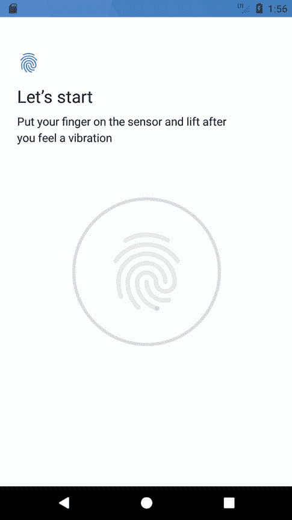
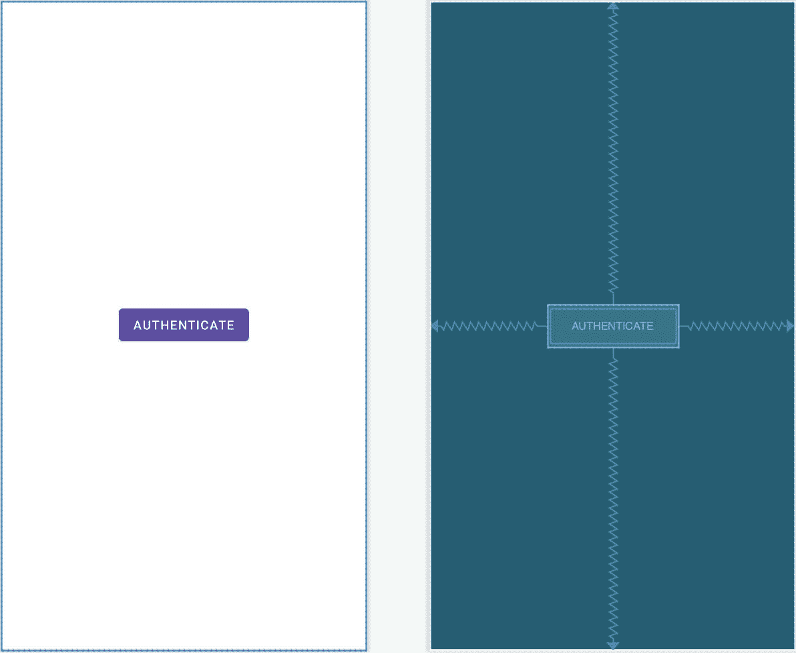
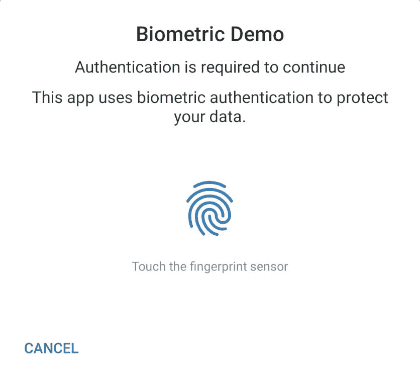

# 八十九、安卓生物认证教程

触摸传感器现在被内置在许多安卓设备中，以识别用户，并提供对设备和应用功能的访问，例如使用指纹识别的应用内支付选项。当然，指纹识别只是众多不同身份验证方法中的一种，包括密码、个人识别码以及最近出现的面部识别。

虽然目前市场上只有少数安卓设备提供面部识别，但在不久的将来，这很可能会变得更加普遍。认识到这一点，谷歌已经开始从以前以指纹为中心的向应用添加身份验证的方法过渡到一种不太具体的方法，即生物识别身份验证。在 Android 8 的初始版本中，这些生物特征仅涵盖指纹认证，但在 Android 操作系统和 SDK 的未来版本和更新中，这将发生变化。

本章既提供了生物认证的概述，也提供了详细的分步教程，演示了在安卓应用项目中实现生物认证的实用方法。

89.1 生物认证概述

关键的生物认证组件是生物计量提示类。这个类执行许多以前必须通过在早期安卓版本中编写代码来执行的工作，包括显示一个标准对话框来指导用户完成身份验证过程，执行身份验证并将结果报告给应用。该类还处理过多失败的身份验证尝试，并在用户可以重试之前强制执行超时。

生物计量提示类包括一个配套的生成器类，可用于配置和创建生物计量提示实例，包括定义将出现在生物认证对话框中的文本，以及自定义出现在对话框中的取消按钮(也称为否定按钮)。

生物计量提示实例还被分配了一组身份验证回调，将调用这些回调向应用提供身份验证操作的结果。CancellationSignal 实例还用于允许应用在认证过程中取消认证。

涵盖了这些基础知识后，本章的剩余部分将在一个示例项目中实现基于指纹的生物认证。

89.2 创建生物认证项目

从欢迎屏幕中选择创建新项目快速启动选项，并在生成的新项目对话框中选择空活动模板，然后单击下一步按钮。

在“名称”字段中输入 BiometricDemo，并将 com . ebookwidue . BiometricDemo 指定为包名。在单击完成按钮之前，将最低API级别设置更改为API 29:安卓 9.0(饼图)，并将语言菜单更改为Kotlin。

89.3 配置设备指纹认证

指纹认证仅在包含触摸传感器的设备上可用，并且在这些设备上已采取适当的配置步骤来保护设备并注册至少一个指纹。有关配置模拟器会话以测试指纹身份验证的步骤，请参考标题为[“使用和配置 Android Studio AVD 模拟器”](05.html#_idTextAnchor102)的章节。

要在物理设备上配置指纹身份验证，首先打开设置应用并选择安全选项。在安全设置屏幕中，选择指纹选项。在生成的信息屏幕上，单击下一步按钮进入指纹设置屏幕。在启用指纹安全之前，必须配置备用屏幕解锁方法(如个人识别码)。如果锁定屏幕尚未受到保护，请按照步骤配置个人识别码、模式或密码安全性。

锁定屏幕后，进入指纹检测屏幕，并在出现提示时触摸传感器([图 89-1](#_idTextAnchor1665) )，如果需要，重复该过程添加额外的指纹。



图 89-1

89.4 将生物识别许可添加到清单文件

生物认证要求应用在项目清单文件中请求 USE_BIOMETRIC 权限。在AndroidStudio项目工具窗口中，找到并编辑应用- >清单- >安卓清单. xml 文件，添加权限请求，如下所示:

```kt
<?xml version="1.0" encoding="utf-8"?>
<manifest xmlns:android="http://schemas.android.com/apk/res/android"
    package="com.ebookfrenzy.biometricdemo">

    <uses-permission
        android:name="android.permission.USE_BIOMETRIC" />
.
.
```

89.5 设计用户界面

为了保持示例尽可能简单，用户界面中唯一的可视元素是按钮视图。找到并选择 activity_main.xml 布局资源文件，将其加载到布局编辑器工具中。

删除示例文本视图对象，从调色板的“常用”类别中拖放一个按钮对象，并将其放置在布局画布的中心。使用属性工具窗口，将按钮上的文本属性更改为“认证”，并将字符串提取到资源。最后，配置 onClick 属性以调用名为 authenticateUser 的方法。

完成上述步骤后，布局应与[图 89-2](#_idTextAnchor1668) 所示相匹配:



图 89-2

89.6 添加吐司方便法

在这个例子中，在整个代码的不同点，应用将被设计成通过 Toast 消息向用户显示信息。主活动中将添加一个名为 notifyUser()的便捷方法，而不是多次重复相同的 Toast 代码。该方法将接受单个字符串值，并以 Toast 消息的形式向用户显示。现在编辑 MainActivity.kt 文件，并按如下方式添加此方法:

```kt
.
.
import android.widget.Toast
.
.
private fun notifyUser(message: String) {
    Toast.makeText(this,
            message,
            Toast.LENGTH_LONG).show()
}
```

89.7 检查安全设置

在本章的前面，我们已经采取了一些步骤来配置锁定屏幕，并在将要测试应用的设备或仿真器上注册指纹。然而，重要的是在应用中包含防御代码，以确保在尝试寻求指纹认证之前满足这些要求。这些步骤将在 MainActivity.kt 文件中的 onCreate 方法中执行，利用 Keyguard 和 PackageManager 管理器服务。请注意，还添加了代码来验证是否已为应用配置了 USE_BIOMETRIC 权限:

```kt
.
.
import androidx.core.app.ActivityCompat
import android.Manifest
import android.app.KeyguardManager
import android.content.Context
import android.content.pm.PackageManager
.
.
class MainActivity : AppCompatActivity() {

    override fun onCreate(savedInstanceState: Bundle?) {
        super.onCreate(savedInstanceState)
        setContentView(R.layout.activity_biometric_demo)

        checkBiometricSupport()
    }

    private fun checkBiometricSupport(): Boolean {

        val keyguardManager = getSystemService(Context.KEYGUARD_SERVICE) 
                                          as KeyguardManager

        if (!keyguardManager.isKeyguardSecure) {

            notifyUser("Lock screen security not enabled in Settings")
            return false
        }

        if (ActivityCompat.checkSelfPermission(this,
                        Manifest.permission.USE_BIOMETRIC) != 
                                PackageManager.PERMISSION_GRANTED) {

            notifyUser("Fingerprint authentication permission not enabled")
            return false
        }
        return if (packageManager.hasSystemFeature(
                    PackageManager.FEATURE_FINGERPRINT)) {
            true
        } else true
    }
.
.
}
```

上述代码更改从使用 Keyguard 管理器验证已配置备份屏幕解锁方法开始(换句话说，可以使用个人识别码或其他身份验证方法作为指纹身份验证的替代方法来解锁屏幕)。如果锁屏不安全，代码会向用户报告问题，并从方法返回。

然后，该方法在使用包管理器验证指纹认证在设备上可用之前，检查用户是否对应用启用了生物认证许可。

89.8 配置认证回调

配置生物识别提示对话框后，需要为其分配一组身份验证回调方法，可以调用这些方法来通知应用身份验证过程的成功或失败。这些方法需要包装在一个生物计量提示中。AuthenticationCallback 类实例。在 MainActivity.kt 文件中，添加一个方法来创建和返回这个类的实例，并实现适当的方法:

```kt
.
.
import android.hardware.biometrics.BiometricPrompt
.
.
private val authenticationCallback: BiometricPrompt.AuthenticationCallback
    get() = object : BiometricPrompt.AuthenticationCallback() {
        override fun onAuthenticationError(errorCode: Int, 
                                           errString: CharSequence) {
            notifyUser("Authentication error: $errString")
            super.onAuthenticationError(errorCode, errString)
        }

        override fun onAuthenticationHelp(helpCode: Int, 
                                 helpString: CharSequence) {
            super.onAuthenticationHelp(helpCode, helpString)
        }

        override fun onAuthenticationFailed() {
            super.onAuthenticationFailed()
        }

        override fun onAuthenticationSucceeded(result: 
                     BiometricPrompt.AuthenticationResult) {
            notifyUser("Authentication Succeeded")
            super.onAuthenticationSucceeded(result)

        }
    }
.
.
```

89.9 添加取消信号

一旦启动，生物认证过程将独立于应用执行。为了给应用提供取消操作的方法，创建了一个 CancellationSignal 类的实例，并将其传递给生物认证过程。如果需要，这个取消信号实例可以用来取消该过程。取消信号实例可以配置有监听器，当取消完成时将调用该监听器。向活动类中添加一个新方法来配置并返回一个 CancellationSignal 对象，如下所示:

```kt
.
.
import android.os.CancellationSignal
.
.
private var cancellationSignal: CancellationSignal? = null
.
.
private fun getCancellationSignal(): CancellationSignal {

    cancellationSignal = CancellationSignal()
    cancellationSignal?.setOnCancelListener {
        notifyUser("Cancelled via signal")
    }
    return cancellationSignal as CancellationSignal
}
.
.
```

89.10 启动生物识别提示

剩下的就是向 authenticateUser()方法添加代码，以创建和配置一个生物计量提示实例并启动身份验证。按如下方式添加 authenticateUser()方法:

```kt
.
.
import android.view.View
import android.content.DialogInterface
.
.
fun authenticateUser(view: View) {
    val biometricPrompt = BiometricPrompt.Builder(this)
            .setTitle("Biometric Demo")
            .setSubtitle("Authentication is required to continue")
            .setDescription("This app uses biometric authentication to protect your data.")
            .setNegativeButton("Cancel", this.mainExecutor, 
                 DialogInterface.OnClickListener { dialogInterface, i -> 
                    notifyUser("Authentication cancelled") }).build()

    biometricPrompt.authenticate(getCancellationSignal(), mainExecutor, 
                         authenticationCallback)
}
```

生物计量提示。Builder 类用于创建一个新的 BiometricPrompt 实例，该实例配置有标题、副标题和描述文本，以显示在提示对话框中。否定按钮被配置为显示文本“取消”，监听器被配置为当点击该按钮时显示消息。最后，调用 BiometricPrompt 实例的 authenticate()方法，并将其传递给 AuthenticationCallback 和 CancellationSignal 实例。生物识别提示还需要知道在哪个线程上执行身份验证。这是通过传递为所需线程配置的执行器对象来定义的。在这种情况下，getMainExecutor()方法用于将主 Executor 对象传递给 BiometricPrompt 实例，以便身份验证过程在应用的主线程上进行。

89.11 测试项目

项目完成后，在物理安卓设备或模拟器会话上运行该应用，并点击认证按钮，显示生物计量提示对话框，如图[图 89-3](#_idTextAnchor1676) :



图 89-3

运行后，触摸指纹传感器或使用模拟器中的扩展控制面板来模拟指纹触摸，如标题为[“使用和配置 Android Studio AVD 模拟器”](05.html#_idTextAnchor102)一章所述。假设检测到注册的指纹，提示对话框将返回到主活动，其中将出现来自成功的身份验证回调方法的 toast 消息。

再次单击“身份验证”按钮，这次使用未注册的指纹尝试身份验证。这一次生物识别提示对话框将指示指纹未被识别:


图 89-4

通过单击生物识别提示对话框外的活动，验证错误处理回调是否有效。提示对话框将消失，并且将出现带有以下消息的吐司消息:

```kt
Authentication error: Fingerprint operation cancelled by user.
```

检查使用“取消”按钮取消提示对话框是否会触发“身份验证已取消”的提示信息。最后，尝试使用未注册的指纹进行多次身份验证，并注意在多次尝试后，提示对话框会指示发生了太多的失败，并且以后的尝试要到稍后才能进行。

89.12 总结

本章概述了如何将生物认证集成到安卓应用项目中。这涉及到生物计量提示类的使用，一旦配置了适当的消息文本和回调，它将自动处理大多数身份验证过程。