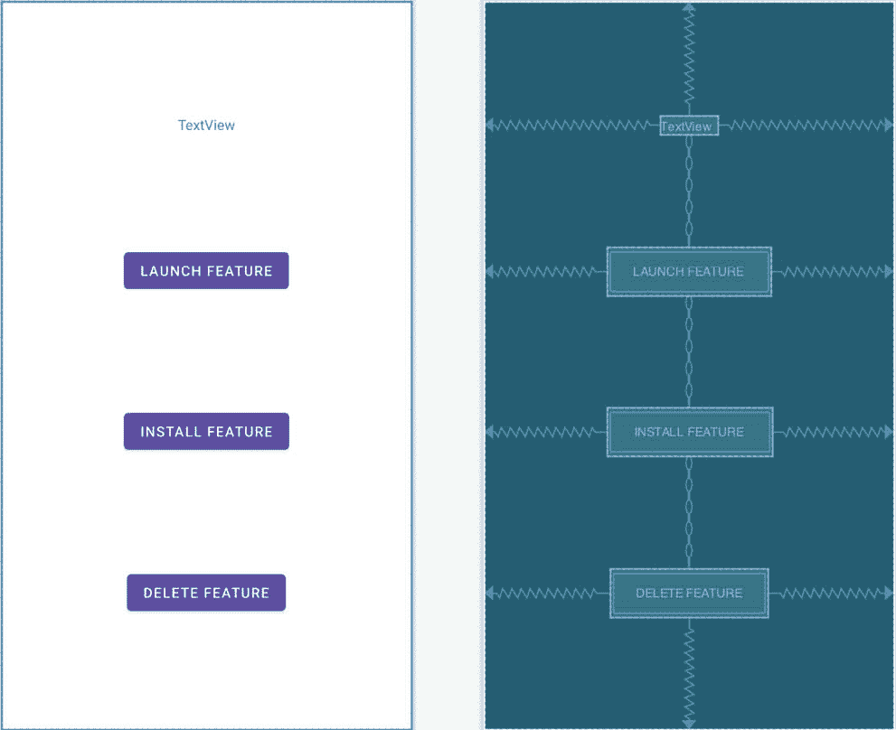
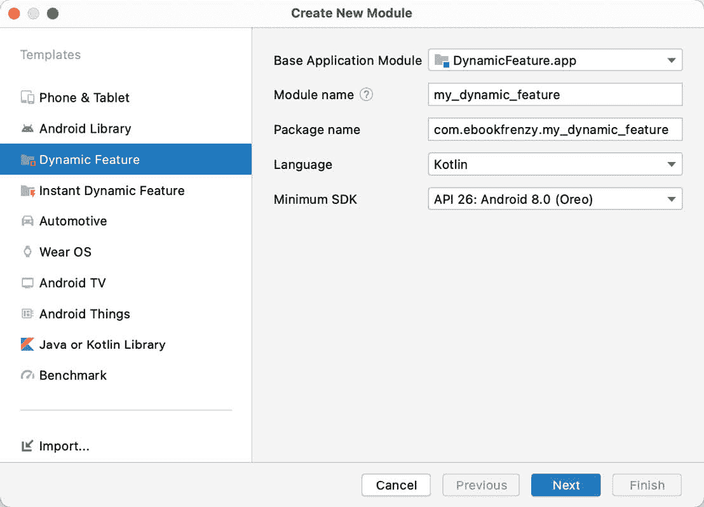
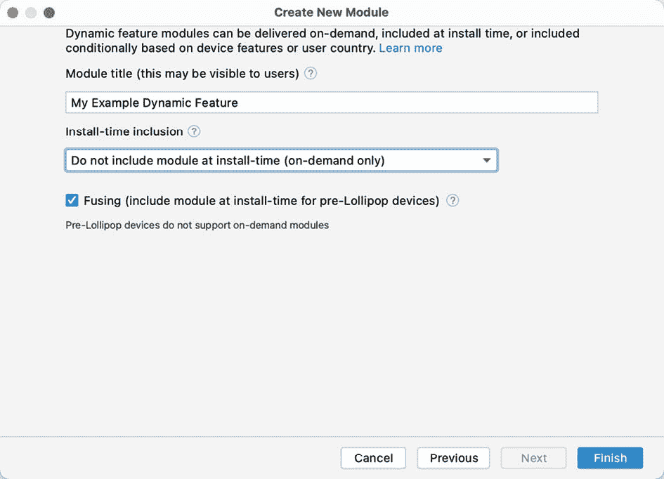
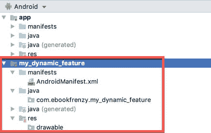
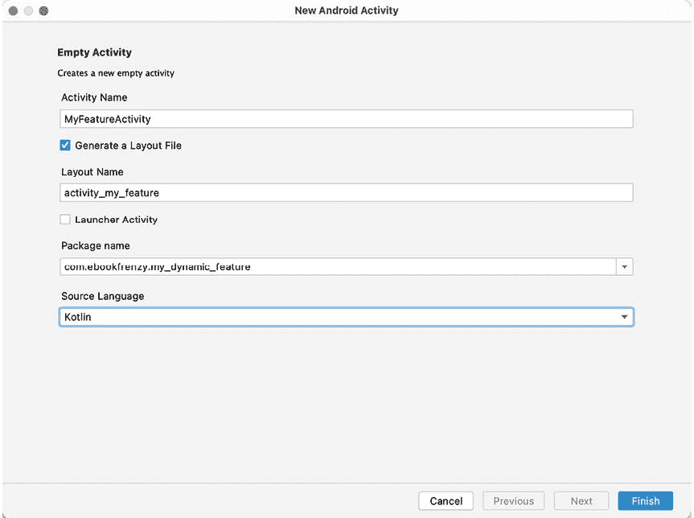
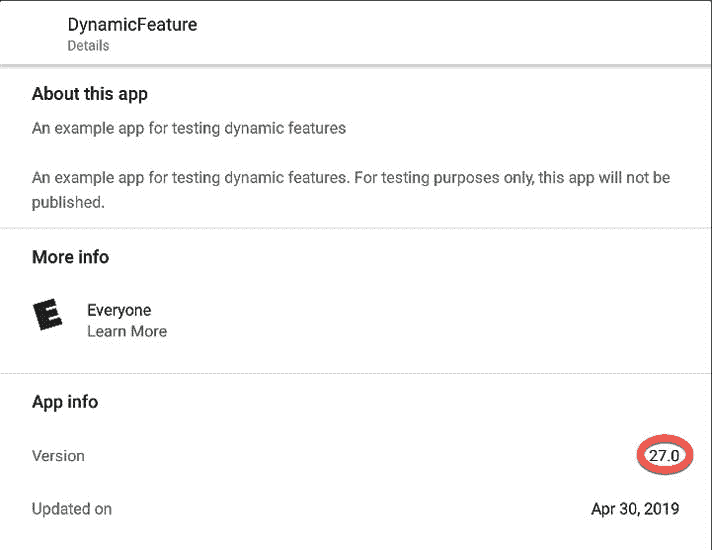
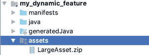
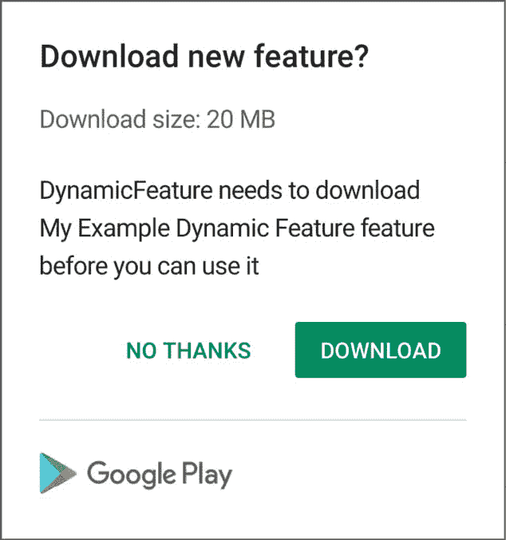

92.AndroidStudio动态功能教程

有了前一章所述的安卓动态交付和动态特性的基本概念，本章将以示例项目的形式将这一理论付诸实践。本章中创建的应用将由两个活动组成，第一个活动将作为应用的基础模块，而第二个活动将被指定为动态功能，可在运行的应用中按需下载。本教程将包括从AndroidStudio创建动态模块、将应用包上传到谷歌 Play 商店进行测试以及使用 Play Core Library 下载和管理动态功能的步骤。本章还将探讨延迟动态功能安装的使用。

92.1 创建动态功能项目

从欢迎屏幕中选择创建新项目快速启动选项，并在生成的新项目对话框中选择空活动模板，然后单击下一步按钮。

在“名称”字段中输入 DynamicFeature，并指定一个程序包名称，该名称将在 Google Play 生态系统中唯一标识您的应用。<your company="">。dynamicfeature)作为包名。在单击完成按钮之前，将最低应用编程接口级别设置更改为应用编程接口 26:安卓 8.0(奥利奥)，并将语言菜单更改为科特林。</your>

92.2 向项目添加动态特征支持

在开始实施该应用之前，需要对项目进行两项更改，以增加对动态功能的支持。由于该项目将广泛使用 Play 核心库，因此需要在构建配置中添加一个指令来包含该库。在 Android Studio 中，打开应用级别的 build.gradle 文件(Gradle Scripts-> build . Gradle(Module:dynamic feature . app))，找到依赖项部分并添加 Play Core 库，如下所示(请始终记住，现在可能会有该库的更新版本):

```kt
plugins {
    id 'com.android.application'
    id 'kotlin-android'
}
.
.
dependencies {
.
.
    implementation 'com.google.android.play:core:1.10.0'
.
.
}
```

一旦下载了动态特性模块，用户很可能需要立即访问包含该特性的代码和资源资产。但是，默认情况下，新安装的功能模块在应用重新启动之前对应用的其余部分不可用。幸运的是，这个缺点可以通过在项目中启用 SplitCompat 库来避免。到目前为止，实现这一点最简单的方法是在主 AndroidManifest.xml 文件(也称为基本模块清单)中将应用声明为 SplitCompatApplication 的子类，如下所示:

```kt
<?xml version="1.0" encoding="utf-8"?>
<manifest xmlns:android="http://schemas.android.com/apk/res/android"
    package="com.ebookfrenzy.dynamicfeature">

<application
       android:name=
           "com.google.android.play.core.splitcompat.SplitCompatApplication"
       android:allowBackup="true"
       android:icon="@mipmap/ic_launcher"
       android:label="@string/app_name"
       android:roundIcon="@mipmap/ic_launcher_round"
.
.
```

92.3 设计基本活动用户界面

此时，项目由一个活动组成，该活动将作为应用基本模块的入口点。该基本模块将负责请求、安装和管理动态功能模块。

为了演示动态功能的使用，基本活动将由一系列按钮组成，这些按钮将允许安装、启动和移除动态功能模块。用户界面还将包括一个文本视图对象，以显示与动态特征模块相关的状态信息。考虑到这些需求，将 activity_main.xml 布局文件加载到布局编辑器中，删除默认的 TextView 对象，实现设计使其类似于下面的[图 92-1](#_idTextAnchor1725) 。



图 92-1

定位对象后，选择文本视图小部件，并使用属性工具窗口将 id 属性设置为 status_text。开始应用布局约束，方法是选择布局中的所有对象，右键单击文本视图对象，然后从菜单中选择中心->水平选项，从而将所有四个对象约束到屏幕的水平中心。

在所有对象仍然被选中的情况下，再次右键单击文本视图，这次选择链->垂直链菜单选项。在继续之前，将所有按钮文本字符串提取到资源中，并将三个按钮配置为分别调用名为 launchFeature、installFeature 和 deleteFeature 的方法。

92.4 添加动态特征模块

要向项目添加动态特征模块，请选择文件->新建->新建模块...菜单选项，并在生成的对话框中，从左侧面板中选择动态特征。在主面板中，命名模块 my_dynamic_feature，并将最小 API 设置更改为 API 26: Android 8.0 (Oreo)，使其与为基本模块选择的 API 级别相匹配，如图[图 92-2](#_idTextAnchor1728) :



图 92-2

再次单击“下一步”按钮配置按需选项，确保启用了融合选项。在模块标题字段中，输入文本“我的示例动态功能”:



图 92-3

在此示例中，在单击“完成”按钮提交更改并将动态功能模块添加到项目之前，将“安装时包含”菜单设置为“安装时不包含模块”(仅按需)。

92.5 查看动态特征模块

在继续下一步之前，值得花一些时间来回顾一下AndroidStudio对项目所做的更改。了解这些变化对于解决问题和将现有应用功能转换为动态功能都很有用。

首先参考“项目”工具窗口，其中将出现一个新条目，表示包含新动态功能模块的文件夹:



图 92-4

请注意，该特性有自己的子结构，包括清单文件、可以添加代码和资源的包以及 res 文件夹。打开并查看 AndroidManifest.xml 文件，该文件应包含在要素创建过程中选择的属性设置，包括按需、融合和要素标题值:

```kt
<manifest xmlns:android="http://schemas.android.com/apk/res/android"
    xmlns:dist="http://schemas.android.com/apk/distribution"
    package="com.ebookfrenzy.my_dynamic_feature">

    <dist:module
        dist:instant="false"
        dist:title="@string/title_my_dynamic_feature">
        <dist:delivery>
            <dist:on-demand />
        </dist:delivery>
        <dist:fusing dist:include="true" />
    </dist:module>
</manifest>
```

特别有趣的一点是，模块标题字符串已作为字符串资源存储，而不是直接输入清单文件。这是标题字符串的先决条件，如果需要，可以在基本模块的 strings.xml 文件(app -> res -> values -> strings.xml)中找到并修改资源。

动态功能模块的构建配置可以在 Gradle Scripts -> build.gradle(模块:dynamic feature . my _ dynamic _ feature)文件中找到，应该如下所示:

```kt
plugins {
    id 'com.android.dynamic-feature'
.
.
}

android {
    compileSdkVersion 30
    buildToolsVersion "30.0.3"
.
.
dependencies {
    implementation project(":app")
.
.    
}
```

该文件中的关键条目是 com.android.dynamic-feature 插件的应用，该插件确保该模块被视为一个动态特性，以及表示该特性依赖于基础(app)模块的实现行。

基本模块的 build.gradle 文件(Gradle Scripts-> build . Gradle(Module:dynamic feature . app))也包含一个列出动态功能模块的新条目。查看文件时，添加指令以启用视图绑定支持:

```kt
plugins {
    id 'com.android.application'
.
.
android {

    buildFeatures {
        viewBinding true
    }

    compileSdkVersion 30
    buildToolsVersion "30.0.3"
.
.
    dynamicFeatures = [':my_dynamic_feature']
}
.
.
```

添加到项目中的任何其他动态要素也需要在此处引用，例如:

```kt
dynamicFeatures = [":my_dynamic_feature", ":my_second_feature", ...]
```

92.6 添加动态特征活动

从上面的[图 92-4](#_idTextAnchor1730) 所示的项目工具窗口中，可以清楚地看到，此时动态特征模块只包含一个清单文件。下一步是向模块中添加一个活动，这样当从基本模块中启动时，该特性实际上会有所作为。在项目工具窗口中，右键单击位于 my_dynamic_feature - > java 下的包名称，并选择新建- >活动- >空活动菜单选项。命名活动“我的功能活动”，并启用“生成布局文件”选项，但在单击“完成”按钮之前，保持“启动器活动”选项处于禁用状态。



图 92-5

将活动添加到模块后，编辑 AndroidManifest.xml 文件并修改它，以添加一个意图过滤器，该过滤器将允许基本模块启动活动(其中<com.yourcompany>被您选择的包名替换，以便使您的应用在 Google Play 上唯一):</com.yourcompany>

```kt
<?xml version="1.0" encoding="utf-8"?>
<manifest xmlns:android="http://schemas.android.com/apk/res/android"
    xmlns:dist="http://schemas.android.com/apk/distribution"
    package="com.ebookfrenzy.my_dynamic_feature">

    <dist:module
        dist:instant="false"
        dist:title="@string/title_my_dynamic_feature">
        <dist:delivery>
            <dist:on-demand />
        </dist:delivery>
        <dist:fusing dist:include="true" />
    </dist:module>

    <application>
        <activity android:name=".MyFeatureActivity">
            <intent-filter>
                <action android:name="android.intent.action.VIEW" />
                <action android:name=
                  "<com.yourcompany>.my_dynamic_feature.MyFeatureActivity" />
                <category android:name="android.intent.category.DEFAULT" />
            </intent-filter>
        </activity>
    </application>
</manifest>
```

接下来，编辑 build . gradle(Module:dynamic feature . my _ dynamic _ feature)文件的依赖项部分，以包含 Google Play 库:

```kt
dependencies {
.
.
implementation 'com.google.android.play:core:1.10.0'
.
.
```

为了能够从动态模块中访问资源，需要从 MyFeatureActivity 中调用 SplitCompat.install()方法。编辑 MainActivity.kt 文件并修改 onCreate()方法，如下所示，包括添加视图绑定支持的更改:

```kt
.
.
import com.google.android.play.core.splitcompat.SplitCompat

import <com.yourcompany>.dynamicfeature.databinding.ActivityMainBinding

class MainActivity : AppCompatActivity() {
    private lateinit var binding: ActivityMainBinding
    override fun onCreate(savedInstanceState: Bundle?) {
        super.onCreate(savedInstanceState)
        setContentView(R.layout.activity_my_feature)
        SplitCompat.install(this)
        binding = ActivityMainBinding.inflate(layoutInflater)
        setContentView(binding.root)
    }
} 
```

未能执行此步骤通常会导致应用在动态功能启动时崩溃，并出现类似以下的错误:

```kt
AndroidRuntime: java.lang.RuntimeException: Unable to start activity ComponentInfo{com.ebookfrenzy.dynamicfeature/com.ebookfrenzy.my_dynamic_feature.MyFeatureActivity}: android.content.res.Resources$NotFoundException: Resource ID #0x80020000
```

通过将 activity_my_feature.xml 文件加载到布局编辑器工具中，并添加显示文本的 TextView 对象来完成该功能，该文本显示“我的动态功能模块”:


图 92-6

92.7 实现启动意图()方法

随着项目结构和用户界面设计的完成，是时候使用 Play Core Library 开始使用动态功能模块了。第一步是实现 launchFeature()方法，其目的是使用一个意图来启动动态功能活动。然而，试图在尚未安装的动态功能模块中启动活动将导致应用崩溃。因此，launchFeature()方法需要包含一些防御代码，以确保已经安装了动态功能。为此，我们需要创建一个 SplitInstallManager 类的实例，并调用该对象的 getInstalledModules()方法来检查 my_dynamic_feature 模块是否已经安装。如果安装了它，模块中包含的活动可以安全启动，否则需要在状态文本视图上向用户显示一条消息。在 MainActivity.kt 文件中，对类进行以下更改:

```kt
.
.
import android.view.View
import android.content.Intent
.
.
import com.google.android.play.core.splitinstall.SplitInstallManager
import com.google.android.play.core.splitinstall.SplitInstallManagerFactory
.
.
class MainActivity : AppCompatActivity() {

    private lateinit var binding: ActivityMainBinding 
    private lateinit var manager: SplitInstallManager

    override fun onCreate(savedInstanceState: Bundle?) {
        super.onCreate(savedInstanceState)
        binding = ActivityMainBinding.inflate(layoutInflater)
        setContentView(binding.root)

        manager = SplitInstallManagerFactory.create(this)
    }

    fun launchFeature(view: View) {

        if (manager.installedModules.contains("my_dynamic_feature")) {
                startActivity(Intent(
                    "<com.yourcompany>.my_dynamic_feature.MyFeatureActivity"))
        } else {
            binding.statusText.text = "Feature not yet installed"
        }
    }
.
.
}
```

92.8 上传应用包进行测试

该项目现已准备好进行第一阶段的测试。这包括生成一个发布应用包，并将其上传到谷歌游戏控制台。实现这一目标的步骤在标题为[“创建、测试和上传安卓应用捆绑包”](90.html#_idTextAnchor1678)的章节中进行了概述，但可以总结如下:

1.登录谷歌游戏控制台，创建一个新的应用。

2.按照标题、描述、分类和图像资源(示例图像资源可以在本书附带的示例代码下载的 image_assets 文件夹中找到)配置应用的步骤，并保存草稿设置。此外，请务必启用捆绑包的谷歌游戏应用签名。

3.使用AndroidStudio构建->生成签名应用包/ APK...菜单来生成已签名的发行版应用包。

4.在谷歌游戏控制台中，从左侧导航面板中选择测试->内部测试选项。

5.在内部测试屏幕上，单击创建发布按钮，然后单击继续接受让谷歌管理密钥签名任务的选项。将上面生成的应用捆绑文件拖放到上传框中，然后单击保存。

6.切换到内部测试屏幕中的测试者选项卡，并添加将用于在一个或多个物理设备上测试应用的帐户的电子邮件地址。

7.返回“发布”选项卡，单击“编辑”按钮。滚动到结果页面的底部，然后单击查看发布按钮。

8.在确认屏幕上，单击“内部测试”按钮的“开始”卷展栏。该应用将被列为待发布。

一旦该版本推出进行测试，将向内部测试轨道上的所有用户发送通知，要求他们选择加入该应用的测试轨道。或者，复制测试者屏幕上列出的网址，并将其发送给测试用户。一旦用户选择加入，将提供一个链接，当在设备上打开该链接时，将启动 Play Store 应用并打开 DynamicFeature 应用的下载页面，如图 92-7 所示:


图 92-7

单击按钮安装应用，然后打开它并点击启动功能按钮。动态功能尚未安装的事实应该反映在状态文本中。

92.9 实现安装功能()方法

installFeature()方法将为 my_dynamic_feature 模块创建一个 SplitInstallRequest 对象，然后使用 SplitInstallManager 实例启动安装过程。还将实现监听器来显示指示安装请求状态的 Toast 消息。在 MainActivity.kt 文件中，添加 installFeature()方法，如下所示:

```kt
.
.
import android.widget.Toast
import com.google.android.play.core.splitinstall.SplitInstallRequest
.
.
   fun installFeature(view: View) {

        val request = SplitInstallRequest.newBuilder()
            .addModule("my_dynamic_feature")
            .build()

        manager.startInstall(request)
            .addOnSuccessListener { sessionId ->
                   Toast.makeText(this@MainActivity,
                      "Module installation started",
                      Toast.LENGTH_SHORT).show()
            }
            .addOnFailureListener { exception ->
                    Toast.makeText(this@MainActivity,
                        "Module installation failed: $exception",
                        Toast.LENGTH_SHORT).show()
            }
    }
.
.
```

编辑 gradale Scripts-> build . gradale(Module:dynamic feature . app)文件，并增加 versionCode 和 versionName 值，以便可以上传新版本的应用捆绑包进行测试:

```kt
android {
.
.
        versionCode 2
        versionName "2.0"
```

重复此步骤，在 Gradle Scripts-> build . Gradle(Module:dynamic feature . my _ dynamic _ feature)文件中声明一个匹配的版本号。

生成包含更改的新应用包，然后返回到 Google Play 控制台中该应用的测试->内部测试页面，并创建新的发布按钮，如下图[图 92-8](#_idTextAnchor1736) 所示:


图 92-8

按照步骤上传新的应用捆绑包，并将其推出进行内部测试。在测试设备上，打开谷歌 Play 商店应用，确保“安装”按钮已更改为“更新”按钮(如果没有更改，请关闭应用商店应用，并在等待几分钟后重试)并更新到新版本。更新完成后，运行该应用，点击“安装功能”按钮并检查吐司消息，以确保安装成功开始。下载该功能时，下载图标会短暂出现在屏幕顶部的状态栏中。下载完成后，点击启动功能按钮显示第二个活动。

如果安装失败或应用崩溃，通常可以从 LogCat 输出中确定原因。要查看此输出，请将设备连接到开发计算机，打开终端或命令提示符窗口并执行以下命令:

```kt
adb logcat
```

该 adb 命令将实时显示 LogCat 输出，包括应用遇到问题或崩溃时产生的任何异常或诊断错误。

92.10 添加更新监听器

要更详细地跟踪动态功能模块的安装进度，可以将 splitinstallstatedupdatedlister 的实例添加到应用中。由于可以同时安装多个功能模块，因此需要添加一些代码来跟踪分配给安装过程的会话标识。首先添加一些导入，在 MainActivity.kt 文件中声明一个变量以包含当前会话 ID，并修改 installFeature()方法以在每次安装成功启动时存储会话 ID 并注册侦听器:

```kt
.
.
import com.google.android.play.core.splitinstall.SplitInstallStateUpdatedListener
import com.google.android.play.core.splitinstall.model.SplitInstallSessionStatus
.
.
import java.util.*
.
.
class MainActivity : AppCompatActivity() {

    private var mySessionId = 0
.
.
   fun installFeature(view: View) {

        manager.registerListener(listener)

        val request = SplitInstallRequest.newBuilder()
            .addModule("my_dynamic_feature")
            .build()

        manager.startInstall(request)
            .addOnSuccessListener { sessionId ->
                mySessionId = sessionId
                Toast.makeText(this@MainActivity,
                    "Module installation started",
                    Toast.LENGTH_SHORT).show()
            }
            .addOnFailureListener { exception ->
                    Toast.makeText(this@MainActivity,
                        "Module installation failed: $exception",
                        Toast.LENGTH_SHORT).show()
            }
    }
.
.
Next, implement the listener code so that it reads as follows:
private var listener: SplitInstallStateUpdatedListener =
    SplitInstallStateUpdatedListener { state ->
        if (state.sessionId() == mySessionId) {
            when (state.status()) {

                SplitInstallSessionStatus.DOWNLOADING -> {
                    val size = state.totalBytesToDownload()
                    val downloaded = state.bytesDownloaded()
                    binding.statusText.text =
                        String.format(Locale.getDefault(),
                         "%d of %d bytes downloaded.", downloaded, size)
                }

                SplitInstallSessionStatus.INSTALLING ->
                    binding.statusText.text = "Installing feature"

                SplitInstallSessionStatus.DOWNLOADED ->
                    binding.statusText.text = "Download Complete"

                SplitInstallSessionStatus.INSTALLED ->
                    binding.statusText.text = "Installed - Feature is ready"

                SplitInstallSessionStatus.CANCELED ->
                    binding.statusText.text = "Installation cancelled"

                SplitInstallSessionStatus.PENDING ->
                    binding.statusText.text = "Installation pending"
                SplitInstallSessionStatus.FAILED ->

                binding.statusText.text = 
                     String.format(Locale.getDefault(),
                      "Installation Failed. Error code: %s", state.errorCode())
            }
        }
    }
```

侦听器捕获许多常见的安装状态，并相应地更新状态文本，包括提供有关下载大小的信息和到目前为止下载的总字节数。在继续之前，添加 onPause()和 onResume()生命周期方法，以确保在应用不活动时未注册侦听器:

```kt
override fun onResume() {
    manager.registerListener(listener)
    super.onResume()
}

override fun onPause() {
    manager.unregisterListener(listener)
    super.onPause()
}
```

通过增加两个模块级 build.gradle 文件中的版本号信息，生成并上传一个新版本的 app bundle 并将其推出进行测试，来测试侦听器代码是否工作正常。如果设备上已经安装了动态功能模块，播放核心库类将忽略再次下载该模块的尝试。因此，为了全面测试侦听器，在安装更新版本之前，必须从 Play Store 应用中卸载该应用。当然，移除应用后，将不会有更新按钮让我们知道新版本已准备好安装。要了解 Play Store 应用将安装哪个版本，请向下滚动应用页面到“阅读更多”按钮，选择它并检查应用信息部分的版本字段，如下图[图 92-9](#_idTextAnchor1738) 所示:



图 92-9

如果之前的版本仍在列表中，请退出 Play 应用并等待几分钟，然后再次检查。列出新版本后，完成安装，打开应用，并检查下载动态功能模块时状态文本是否适当更新。

92.11 处理大量下载

该项目的下一个任务是通过在侦听器实现中向 switch 语句添加一个额外的 case 来集成对大型功能模块的支持，如下所示:

```kt
.
.
import android.app.Activity
import android.content.IntentSender
.
.
class MainActivity : AppCompatActivity() {
.
.
    private val REQUESTCODE = 101
.
.
   private var listener: SplitInstallStateUpdatedListener =
        SplitInstallStateUpdatedListener { state ->
            if (state.sessionId() == mySessionId) {
                when (state.status()) {

                    SplitInstallSessionStatus.REQUIRES_USER_CONFIRMATION -> {

                        binding.statusText.text = 
                           "Large Feature Module. Requesting Confirmation"

                        try {
                            manager.startConfirmationDialogForResult(
                                state,
                                this@MainActivity, REQUESTCODE
                            )
                        } catch (ex: IntentSender.SendIntentException) {
                            binding.statusText.text = "Confirmation Request Failed."
                        }
                    }
.
.
```

此外，添加一个 onActivityResult()方法，以便应用接收用户决定的通知:

```kt
public override fun onActivityResult(requestCode: Int, resultCode: Int, data: Intent?) {
    super.onActivityResult(requestCode, resultCode, data)

    if (requestCode == REQUESTCODE) {
        if (resultCode == Activity.RESULT_OK) {
            status_text.text = "Beginning Installation."
        } else {
            status_text.text = "User declined installation."
        }
    }
}
```

在测试这些代码更改之前，需要将动态功能模块的大小增加到 10MB 以上。为此，我们将向项目中添加一个大文件作为资产。首先右键单击项目工具窗口中的 my_dynamic_feature 条目，然后选择新建->文件夹->资产文件夹菜单选项。在配置对话框中，单击“完成”按钮之前，将“目标源集”菜单更改为主菜单。

接下来，将以下资产文件下载到开发系统的临时位置:

[https://www . ebookfrezy . com/code/largeeas . zip](https://www.ebookfrenzy.com/code/LargeAsset.zip)

下载后，在文件系统浏览器中找到该文件，将其复制，然后粘贴到AndroidStudio项目工具窗口的资产文件夹中，在确认对话框中单击确定:



图 92-10

重复通常的步骤来增加版本号，构建新的应用捆绑包，将其上传到谷歌游戏并推出进行测试。从设备中删除以前的版本，安装新版本，并尝试执行功能下载，以测试确认对话框是否出现，如下图[图 92-11](#_idTextAnchor1740) :



图 92-11

92.12 使用延期安装

延迟安装会导致动态功能模块在后台下载，并将由操作系统自行决定是否完成。当启动延迟安装时，将以挂起状态调用侦听器，但是除了检查模块是否已经安装之外，不可能跟踪安装进度。

要尝试延迟安装，请修改 installFeature()方法，使其如下所示:

```kt
fun installFeature(view: View) {
    manager.deferredInstall(Arrays.asList("my_dynamic_feature"))
}
Note that the deferredInstall() method is passed an array, allowing the installation of multiple modules to be deferred.
```

92.13 移除动态模块

这个项目的最后一个任务是在 MainActivity.kt 文件中实现如下的 deleteFeature()方法:

```kt
fun deleteFeature(view: View) {
    manager.deferredUninstall(Arrays.asList("my_dynamic_feature"))
}
```

当需要额外的存储空间时，操作系统将在后台执行该功能的删除。与 deferredInstall()方法一样，可以在一次调用中计划删除多个功能。

92.14 总结

本章通过创建一个示例应用来演示安卓应用中动态功能模块的使用。涵盖的主题包括动态功能模块的创建以及使用 Play Core 库的类和方法来安装和管理动态功能模块。